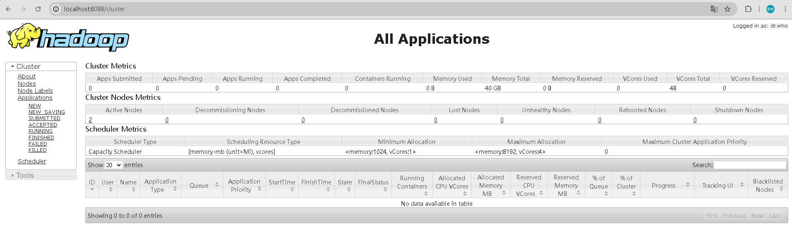

[TOC]
### 基于Docker搭建大数据集群
| 容器名称            | 对应镜像                                      | 进程                              |
|:-------------------|:--------------------------------------------|:---------------------------------|
| Hadoop101          | 15521147129/bigdata:hadoop-3.1.1-ha         |NameNode、DataNode、ResourceManager、NodeManager |
| Hadoop102          | 15521147129/bigdata:hadoop-3.1.1-ha         |DataNode、NodeManager|
| Hadoop103          | 15521147129/bigdata:hadoop-3.1.1-ha         |SecondaryNameNode、DataNode |


#### 基础镜像构建
Debian 11 (代号为 "Bullseye") 是 Debian 项目的最新稳定版本，发布于 2021 年。它继承了 Debian 一贯的稳定性和安全性，同时引入了一系列的新特性和软件包更新。Debian 11 提供了一个强大的平台，适合服务器、桌面和嵌入式系统等多种应用场景。
```shell
# https://hub.docker.com/r/amd64/debian/
docker build --platform=linux/amd64 -t 15521147129/bigdata:debian-base -f base/Dockerfile .
```

Docker有三种网络模式，bridge、host、none，在你创建容器的时候，不指定--network默认是bridge。
`bridge`：为每一个容器分配IP，并将容器连接到一个docker0虚拟网桥，通过docker0网桥与宿主机通信。即此模式下，不能用宿主机的IP+容器映射端口来进行Docker容器之间的通信。
`host`：容器不会虚拟自己的网卡，配置自己的IP，而是使用宿主机的IP和端口。这样一来，Docker容器之间的通信就可以用宿主机的IP+容器映射端口。
`none`：无网络。

```shell
docker network create hadoop-docker-bridge
docker network ls
docker inspect <network_id>
```

#### Hadoop构建和部署
Hadoop各节点说明

| 节点类型                | 服务                                        | 角色                              |
|:----------------------|:--------------------------------------------|:---------------------------------|
| **NameNode**          | HDFS NameNode                               | 管理 HDFS 元数据                   |
| **Secondary NameNode**| HDFS Secondary NameNode                     | 辅助 NameNode 合并元数据            |
| **DataNode**          | HDFS DataNode<br>YARN NodeManager           | 存储数据块并执行数据处理任务           |
| **ResourceManager**   | YARN ResourceManager                        | 管理集群资源和任务调度               |
| **NodeManager**       | YARN NodeManager                            | 管理节点资源并运行任务               |

+ 构建镜像
```shell
docker build --platform=linux/amd64 -t 15521147129/bigdata:hadoop-3.1.1-ha -f hadoop-3.1.1-ha/Dockerfile .
```

+ 启动服务
```shell
docker compose -f hadoop-3.1.1-ha/docker-compose.yml up
```

+ 查看进程
```shell
docker ps
docker exec -it <container_id> /bin/bash
$JAVA_HOME/bin/jps
```

+ web管理界面

`HDFS界面`：http://localhost:9870/<br>
<br>

`Yarn界面`：http://localhost:8088/<br>
<br>

### 遇到的问题
#### 1、Bind for 0.0.0.0:2181 failed: port is already allocated
<br>
每个容器之间环境是隔离的，所以容器内所用的端口一样。
因为在同一台宿主机，端口不能冲突，所以需要将端口映射成不同的端口号，比如2181/2182/2183。

#### 2、hadoop101: ssh: connect to host hadoop101 port 22: Connection refused
```shell
# 创建 .ssh 目录并生成 SSH 密钥（以 root 用户运行）
RUN mkdir -p /home/hadoop/.ssh \
    && ssh-keygen -q -t rsa -N '' -f /home/hadoop/.ssh/id_rsa \
    && cat /home/hadoop/.ssh/id_rsa.pub >> /home/hadoop/.ssh/authorized_keys \
    && chown -R hadoop:hadoop /home/hadoop/.ssh \
    && chmod 700 /home/hadoop/.ssh \
    && chmod 600 /home/hadoop/.ssh/authorized_keys
```
[Docker下安装zookeeper（单机 & 集群）](https://www.cnblogs.com/LUA123/p/11428113.html)