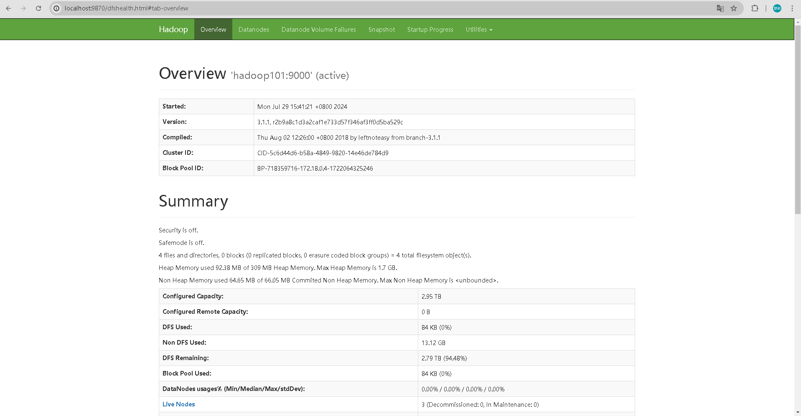
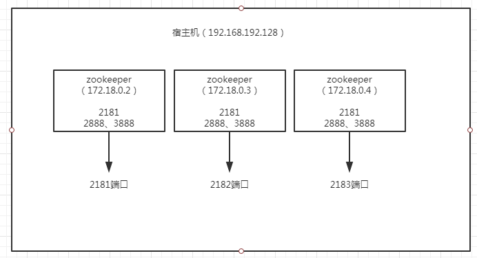

<nav>
<a href="#一基于docker搭建大数据集群">一、基于Docker搭建大数据集群</a><br/>
&nbsp;&nbsp;&nbsp;&nbsp;<a href="#11-基础镜像构建">1.1 基础镜像构建</a><br/>
&nbsp;&nbsp;&nbsp;&nbsp;<a href="#12-hadoop构建和部署">1.2 Hadoop构建和部署</a><br/>
&nbsp;&nbsp;&nbsp;&nbsp;<a href="#13-mysql构建与部署">1.3 MySQL构建与部署</a><br/>
&nbsp;&nbsp;&nbsp;&nbsp;<a href="#14-hive构建与部署远程模式">1.4 Hive构建与部署(远程模式)</a><br/>
&nbsp;&nbsp;&nbsp;&nbsp;&nbsp;&nbsp;&nbsp;&nbsp;<a href="#141-部署">1.4.1 部署</a><br/>
&nbsp;&nbsp;&nbsp;&nbsp;&nbsp;&nbsp;&nbsp;&nbsp;<a href="#142-第一代客户端-hive-shell">1.4.2 第一代客户端 hive shell</a><br/>
&nbsp;&nbsp;&nbsp;&nbsp;&nbsp;&nbsp;&nbsp;&nbsp;<a href="#143-hivesever2-和-beeline">1.4.3 HiveSever2 和 Beeline</a><br/>
<a href="#二遇到的问题">二、遇到的问题</a><br/>
&nbsp;&nbsp;&nbsp;&nbsp;<a href="#21-hadoop">2.1 Hadoop</a><br/>
&nbsp;&nbsp;&nbsp;&nbsp;&nbsp;&nbsp;&nbsp;&nbsp;<a href="#1ssh-connect-to-host-hadoop101-port-22-connection-refused">1）ssh: connect to host hadoop101 port 22: Connection refused</a><br/>
&nbsp;&nbsp;&nbsp;&nbsp;<a href="#22-mysql">2.2 MySQL</a><br/>
&nbsp;&nbsp;&nbsp;&nbsp;&nbsp;&nbsp;&nbsp;&nbsp;<a href="#1docker-access-denied-for-user-rootxxx">1）docker Access denied for user 'root'@'xxx'</a><br/>
&nbsp;&nbsp;&nbsp;&nbsp;<a href="#23hive">2.3、Hive</a><br/>
&nbsp;&nbsp;&nbsp;&nbsp;&nbsp;&nbsp;&nbsp;&nbsp;<a href="#1nosuchmethoderror-xxxpreconditionscheckargument">1）NoSuchMethodError: xxx.Preconditions.checkArgument</a><br/>
&nbsp;&nbsp;&nbsp;&nbsp;&nbsp;&nbsp;&nbsp;&nbsp;<a href="#2main-warn-jdbchiveconnection-failed-to-connect-to-hive10000">2）[main]: WARN jdbc.HiveConnection: Failed to connect to hive:10000</a><br/>
&nbsp;&nbsp;&nbsp;&nbsp;<a href="#2x-zookeeper">2.x Zookeeper</a><br/>
&nbsp;&nbsp;&nbsp;&nbsp;&nbsp;&nbsp;&nbsp;&nbsp;<a href="#1bind-for-00002181-failed-port-is-already-allocated">1）Bind for 0.0.0.0:2181 failed: port is already allocated</a><br/>
<a href="#三参考引用">三、参考引用</a><br/>
</nav>


### 一、基于Docker搭建大数据集群
查看系统内核版本（Debian 11）：cat /proc/version
```
Linux version 6.6.32-linuxkit (root@buildkitsandbox) 
(gcc (Alpine 13.2.1_git20240309) 13.2.1 20240309, GNU ld (GNU Binutils) 2.42) 
1 SMP Thu Jun 13 14:13:01 UTC 2024
```
Hadoop大数据平台安装包：各组件版本信息参考 [Cloudera CDP7.1.4](https://docs.cloudera.com/cdp-private-cloud-base/7.1.4/runtime-release-notes/topics/rt-pvc-runtime-component-versions.html)

| 名称     | 版本      | 软件包名及下载地址                                                                                                                                                                        | 安装目录                    |
|--------|---------|----------------------------------------------------------------------------------------------------------------------------------------------------------------------------------|-------------------------|
| Java   | 1.8u112 | [jdk-8u112-linux-x64.tar.gz](https://www.oracle.com/java/technologies/javase/javase8-archive-downloads.html)                                                                     | /usr/local/jdk1.8.0_112 |
| MySQL  | 5.6.37  | [mysql-5.6.37-linux-glibc2.12-x86_64.tar.gz](https://dev.mysql.com/downloads/mysql/5.6.html)<br>[mysql-connector-java-5.1.43-bin.jar](https://downloads.mysql.com/archives/c-j/) | /usr/local/mysql-5.6.37 |
| Hadoop | 3.1.4   | [hadoop-3.1.4.tar.gz](https://archive.apache.org/dist/hadoop/common/hadoop-3.1.4/hadoop-3.1.4.tar.gz)                                                                            | /usr/local/hadoop-3.1.4 |
| Hive   | 3.1.2   | [apache-hive-3.1.2-bin.tar.gz](https://archive.apache.org/dist/hive/)                                                                                                            | /usr/local/hive-3.1.2   |

`运行的服务列表`：

| 容器名称      | 对应镜像                                     | 进程                                            |
|:----------|:-----------------------------------------|:----------------------------------------------|
| Hadoop101 | 15521147129/bigdata:hadoop-3.1.4         | NameNode、DataNode、ResourceManager、NodeManager |
| Hadoop102 | 15521147129/bigdata:hadoop-3.1.4         | DataNode、NodeManager                          |
| Hadoop103 | 15521147129/bigdata:hadoop-3.1.4         | SecondaryNameNode、DataNode                    |
| mysql     | 15521147129/bigdata:mysql-5.6.37         | mysqld、mysqld_safe                            |
| hive      | 15521147129/bigdata:hive-3.1.2           | RunJar                                        |


`UI 列表`：
Namenode: http://localhost:9870/dfshealth.html#tab-overview
Datanode: http://localhost:9864/
ResourceManager: http://localhost:8088/cluster
NodeManager: http://localhost:8042/node
HistoryServer: http://localhost:8188/applicationhistory
HiveServer2: http://localhost:10002/
Spark Master: http://localhost:8080/
Spark Worker: http://localhost:8081/
Spark Job WebUI: http://localhost:4040/ (当 Spark 任务在 spark-master 运行时才可访问)
Presto WebUI: http://localhost:8090/
Spark History Server：http://localhost:18080/

#### 1.1 基础镜像构建
Debian 11 (代号为 "Bullseye") 是 Debian 项目的最新稳定版本，发布于 2021 年。它继承了 Debian 一贯的稳定性和安全性，同时引入了一系列的新特性和软件包更新。Debian 11 提供了一个强大的平台，适合服务器、桌面和嵌入式系统等多种应用场景。
```shell
# https://hub.docker.com/r/amd64/debian/
docker build --platform=linux/amd64 -t 15521147129/bigdata:debian-base -f base/Dockerfile .
```

Docker有三种网络模式，bridge、host、none，在你创建容器的时候，不指定--network默认是bridge。
`bridge`：为每一个容器分配IP，并将容器连接到一个docker0虚拟网桥，通过docker0网桥与宿主机通信。即此模式下，不能用宿主机的IP+容器映射端口来进行Docker容器之间的通信。
`host`：容器不会虚拟自己的网卡，配置自己的IP，而是使用宿主机的IP和端口。这样一来，Docker容器之间的通信就可以用宿主机的IP+容器映射端口。
`none`：无网络。

```shell
docker network create hadoop-docker-bridge
docker network ls
docker inspect <network_id>
```

#### 1.2 Hadoop构建和部署
Hadoop各节点说明：

| 节点类型                | 服务                                        | 角色                              |
|:----------------------|:--------------------------------------------|:---------------------------------|
| **NameNode**          | HDFS NameNode                               | 管理 HDFS 元数据                   |
| **Secondary NameNode**| HDFS Secondary NameNode                     | 辅助 NameNode 合并元数据            |
| **DataNode**          | HDFS DataNode<br>YARN NodeManager           | 存储数据块并执行数据处理任务           |
| **ResourceManager**   | YARN ResourceManager                        | 管理集群资源和任务调度               |
| **NodeManager**       | YARN NodeManager                            | 管理节点资源并运行任务               |

构建镜像：
```shell
docker build --platform=linux/amd64 -t 15521147129/bigdata:hadoop-3.1.4 -f hadoop-3.1.4/Dockerfile .
```

推送镜像：
```shell
#docker login -u "15521147129" -p "你的密码" docker.io
docker push 15521147129/bigdata:debian-base
```

启动服务：
```shell
docker compose -f hadoop-3.1.4/docker-compose.yml up
```

查看进程：
```shell
docker ps
docker exec -it <container_id> /bin/bash

# 查看各个节点所启动的进程
$JAVA_HOME/bin/jps

# 查看数据节点是否正常启动
$HADOOP_HOME/bin/hdfs dfsadmin -report
```

web管理界面：

`HDFS界面`：http://localhost:9870/<br>
<br>

`Yarn界面`：http://localhost:8088/<br>
<br>

#### 1.3 MySQL构建与部署
MySQL服务器启动后，会在内存中常驻`mysqld_safe`和`mysqld` 2个进程：
```
119 mysql     20   0  146684   7460   3512 S   0.0   0.1   0:00.05 mysqld_safe                                  
572 mysql     20   0 2979172 529412  15032 S   0.0   8.7   0:05.63 mysqld 
```
| 进程名称            | 说明                                                                                                                                                                                                                                                                      |
|:----------------|:------------------------------------------------------------------------------------------------------------------------------------------------------------------------------------------------------------------------------------------------------------------------|
| **mysqld**      | MySQL的核心程序，用于管理mysql的数据库文件以及用户的请求操作。                                                                                                                                                                                                                                    |
| **mysqld_safe** | mysqld_safe是mysqld的父进程，官方推荐使用 mysqld_safe 启动 mysqld 服务：<br>1. 检查系统和选项。<br>2. 检查MyISAM表。<br>3. 保持MySQL服务器窗口。<br>4. 启动并监视mysqld，如果因错误终止则重启。<br>5. 记录mysqld进程运行信息，保存在错误日志中（error.log，通常在my.cnf中指定）<br>6. mysqld_safe的启动和运行参数与mysqld通用，对mysqld_safe进程施加参数等同于在mysqld进程上施加参数。 |


构建镜像：
```shell
docker build --progress=plain --platform=linux/amd64 -t 15521147129/bigdata:mysql-5.6.37 -f mysql-5.6.37/Dockerfile .
```

启动服务：
```shell
docker compose -f mysql-5.6.37/docker-compose.yml up -d
```

查看进程：
```shell
ps -ef | grep mysqld
```

#### 1.4 Hive构建与部署(远程模式)
由于`Hive`依赖`Hadoop`，因此 需要继承`Hadoop`的镜像，这样做的目的有：
1. 正确找到并使用 Hadoop 提供的命令行工具；
2. 读取 Hadoop 的配置文件，连接到 HDFS 和 YARN；
3. 正确提交和管理在 Hadoop 集群上执行的作业；
4. 依赖 Hadoop 的库文件来处理文件系统和作业执行。

这使得 Hive 能够无缝地与 Hadoop 集群集成，并利用 Hadoop 的分布式存储和计算资源，此外还依赖`MySQL服务器`。<br>

##### 1.4.1 部署
构建镜像：
```shell
docker build --progress=plain --platform=linux/amd64 -t 15521147129/bigdata:hive-3.1.2 -f hive-3.1.2/Dockerfile .
```

启动服务：
```shell
docker compose -f hive-3.1.2/docker-compose.yml up -d
```

查看进程：
```shell
$JAVA_HOME/bin/jps
```
检查HiveSever2是否监听`10000`/`10002`端口
```
netstat -anop|grep 10000
# tcp6     0      0 :::10000    :::*    LISTEN      299/qemu-x86_64      off (0.00/0/0)
netstat -anop|grep 10002
# tcp6     0      0 :::10002    :::*    LISTEN      299/qemu-x86_64      off (0.00/0/0)
```

##### 1.4.2 第一代客户端 hive shell
**第一代客户端 hive shell（已废弃）**：
- 说明：通过hive shell来操作hive，但是至多只能存在一个hive shell，启动第二个会被阻塞，不支持并发操作。
- 功能：提供交互式模式的Hive查询运行环境、启动Metastore服务
- 路径：bin/hive =访问=> MetaStore Server =访问=>MySQL

在远程模式下，必须首先启动Hive metastore服务才可以使用hive。因为`metastore`服务和`hive server`是两个单独的进程了。
```
# 启动Metastore服务(进程为RunJar)
$HIVE_HOME/bin/hive --service metastore
# 客户端
$HIVE_HOME/bin/hive
```
启动后`metastore`服务只有1个`RunJar进程`：
+ `RunJar进程的作用`<br>
  RunJar进程是Hive启动过程中的一个关键组件。它负责加载Hive的所有依赖项，并启动Hive Server服务。<br>
  Hive Server是Hive的核心组件之一，用于接收和处理客户端的查询请求。
+ `RunJar进程的运行机制`
  在启动Hive时，RunJar进程首先会加载Hive的所有依赖项，包括Hadoop和其他必需的库。<br>
  然后，它会启动Hive Server服务，开始监听来自客户端的查询请求。 <br>
  在运行过程中，RunJar进程通过连接到Hive Metastore获取元数据信息。

##### 1.4.3 HiveSever2 和 Beeline
Hive经过发展，推出了第二代客户端`beeline`，但是beeline客户端不是直接访问metastore服务的，而是需要单独启动hiveserver2服务。
在hive运行的服务器上，首先启动metastore服务，然后启动`hiveserver2`服务：
- `Beeline`是JDBC的客户端，通过JDBC协议和Hiveserver2服务进行通信
- Hiveserver2协议的地址是：`jdbc:hive2://hive:10000`

```
# 启动hiveserver2服务(进程为RunJar)
$HIVE_HOME/bin/hive --service hiveserver2
# jdbc客户端，输入连接：!connect jdbc:hive2://hive:10000
$HIVE_HOME/bin/beeline
```
操作如下：
```
hive@hive:~$ $HIVE_HOME/bin/beeline
Beeline version 3.1.2 by Apache Hive
beeline> !connect jdbc:hive2://hive:10000
Connecting to jdbc:hive2://hive:10000
Enter username for jdbc:hive2://hive:10000: hive
Enter password for jdbc:hive2://hive:10000: ****
Connected to: Apache Hive (version 3.1.2)
Driver: Hive JDBC (version 3.1.2)
Transaction isolation: TRANSACTION_REPEATABLE_READ
0: jdbc:hive2://hive:10000> 
```
Web UI for HiveServer2：http://127.0.0.1:10002/<br>

<br>

### 二、遇到的问题

#### 2.1 Hadoop
##### 1）ssh: connect to host hadoop101 port 22: Connection refused
```shell
# 创建 .ssh 目录并生成 SSH 密钥（以 root 用户运行）
RUN mkdir -p /home/hadoop/.ssh \
    && ssh-keygen -q -t rsa -N '' -f /home/hadoop/.ssh/id_rsa \
    && cat /home/hadoop/.ssh/id_rsa.pub >> /home/hadoop/.ssh/authorized_keys \
    && chown -R hadoop:hadoop /home/hadoop/.ssh \
    && chmod 700 /home/hadoop/.ssh \
    && chmod 600 /home/hadoop/.ssh/authorized_keys
```

#### 2.2 MySQL
##### 1）docker Access denied for user 'root'@'xxx'
在容器内部可以正常访问，但在宿主主机访问MySQL容器时却不行。原因是生成配置时取消了root用户远程登录，重新配置后重启服务即可；或者使用其他用户也可以进行远程登录。
```
${MYSQL_HOME}/bin/mysql_secure_installation
```
`注意`：mysql_secure_installation 需要一个交互式终端，而不是通过标准输入传递的流，以下几种方式都失败了：
```
echo -e "123456\nY\n123456\n123456\nY\nn\nY\nY\n" | ${MYSQL_HOME}/bin/mysql_secure_installation
或
${MYSQL_HOME}/bin/mysql_secure_installation << EOF
123456
Y
123456
123456
Y
n
Y
Y
EOF
```

#### 2.3、Hive
##### 1）NoSuchMethodError: xxx.Preconditions.checkArgument
一开始启动hive时报错如下，但检查两者的guava.jar版本是一致的，很奇怪，后面重新build又正常了。
```
2024-08-17 15:55:57 Exception in thread "main" java.lang.NoSuchMethodError: com.google.common.base.Preconditions.checkArgument(ZLjava/lang/String;Ljava/lang/Object;)V
2024-08-17 15:55:57     at org.apache.hadoop.conf.Configuration.set(Configuration.java:1357)
2024-08-17 15:55:57     at org.apache.hadoop.conf.Configuration.set(Configuration.java:1338)
2024-08-17 15:55:57     at org.apache.hadoop.mapred.JobConf.setJar(JobConf.java:518)
2024-08-17 15:55:57     at org.apache.hadoop.mapred.JobConf.setJarByClass(JobConf.java:536)
2024-08-17 15:55:57     at org.apache.hadoop.mapred.JobConf.<init>(JobConf.java:430)
2024-08-17 15:55:57     at org.apache.hadoop.hive.conf.HiveConf.initialize(HiveConf.java:5141)
2024-08-17 15:55:57     at org.apache.hadoop.hive.conf.HiveConf.<init>(HiveConf.java:5104)
```
原因：Hive内依赖的guava.jar和hadoop内的版本不一致造成的。<br> 
解决方案：<br>
1）查看hadoop安装目录下share/hadoop/common/lib内guava.jar版本<br>
2）查看hive安装目录下lib内guava.jar的版本 如果两者不一致，删除版本低的，并拷贝高版本的

##### 2）[main]: WARN jdbc.HiveConnection: Failed to connect to hive:10000
使用beeline客户端访问时报错：
```
[main]: WARN jdbc.HiveConnection: Failed to connect to hive:10000
Could not open connection to the HS2 server. Please check the server URI and if the URI is correct, then ask the administrator to check the server status.
```
原因：客户端无法连接到HiveServer2<br>
解决方案：$HADOOP_HOME/etc/hadoop的`core-site.xml`缺少以下配置，加入以下配置后问题成功解决。<br>
```
<!-- hiveserver2配置 -->
<property>
  <name>hadoop.proxyuser.hive.hosts</name>
  <value>*</value>
</property>
<property>
  <name>hadoop.proxyuser.hive.groups</name>
  <value>*</value>
</property>
```
##### 3）[main]: java.net.SocketException: Connection refused
执行`$HIVE_HOME/bin/hive`后报错：
```
24/08/19 04:43:07 [main]: WARN jdbc.HiveConnection: Failed to connect to hive:10000
Error: Could not open client transport with JDBC Uri: jdbc:hive2://hive:10000: Failed to open new session: java.lang.RuntimeException: java.net.ConnectException: Call From hive/172.18.0.6 to hadoop101:9000 failed on connection exception: java.net.ConnectException: Connection refused; For more details see:  http://wiki.apache.org/hadoop/ConnectionRefused (state=08S01,code=0)
```
原因： NameNode主机名解析问题，即hadoop101主机名无法正确解析为IP地址。<br>
解决方案：在/etc/hosts文件中添加hadoop101的映射，确保容器能够正确解析主机名。
```
172.18.0.5      hadoop101
```

##### 4）[main]: java.net.SocketException: Connection reset/refused(待定)
通过Java程序JDBC连接Hive时报错：
```
java.sql.SQLException: Could not open client transport with JDBC Uri: jdbc:hive2://hive:10000/test: java.net.SocketException: Connection reset
  at org.apache.hive.jdbc.HiveConnection.<init>(HiveConnection.java:256)
  at org.apache.hive.jdbc.HiveDriver.connect(HiveDriver.java:107)
  at java.sql.DriverManager.getConnection(DriverManager.java:664)
  at java.sql.DriverManager.getConnection(DriverManager.java:247)
```
HiveServer2服务在启动时也经常报以下错误：
```
2024-08-19T14:39:56,201 DEBUG [main] ipc.Client: Failed to connect to server: hadoop101/172.18.0.2:9000: try once and fail.
java.net.ConnectException: Connection refused
        at sun.nio.ch.SocketChannelImpl.checkConnect(Native Method) ~[?:1.8.0_112]
        at sun.nio.ch.SocketChannelImpl.finishConnect(SocketChannelImpl.java:717) ~[?:1.8.0_112]
        at org.apache.hadoop.net.SocketIOWithTimeout.connect(SocketIOWithTimeout.java:206) ~[hadoop-common-3.1.4.jar:?]
```
HiveServer2服务一直在重启
```
024-08-19T18:00:09,632  INFO [main] handler.ContextHandler: Stopped o.e.j.w.WebAppContext@62f11ebb{/,null,UNAVAILABLE}{jar:file:/usr/local/hive-3.1.2/lib/hive-service-3.1.2.jar!/hive-webapps/hiveserver2}
2024-08-19T18:00:09,632 DEBUG [main] component.AbstractLifeCycle: STOPPED o.e.j.w.WebAppContext@62f11ebb{/,null,UNAVAILABLE}{jar:file:/usr/local/hive-3.1.2/lib/hive-service-3.1.2.jar!/hive-webapps/hiveserver2}
2024-08-19T18:00:09,632 DEBUG [main] component.AbstractLifeCycle: STOPPED org.eclipse.jetty.rewrite.handler.RewriteHandler@41fa769c
2024-08-19T18:00:09,632 DEBUG [main] component.AbstractLifeCycle: STOPPED org.eclipse.jetty.server.handler.ContextHandlerCollection@40113163[org.eclipse.jetty.rewrite.handler.RewriteHandler@41fa769c, o.e.j.s.ServletContextHandler@23ed382c{/static,jar:file:/usr/local/hive-3.1.2/lib/hive-service-3.1.2.jar!/hive-webapps/static,UNAVAILABLE}, o.e.j.s.ServletContextHandler@3850e90c{/logs,file:///var/log/hive/,UNAVAILABLE}]
2024-08-19T18:00:09,632 DEBUG [main] component.AbstractLifeCycle: stopping org.eclipse.jetty.server.LowResourceMonitor@7a3269f5
2024-08-19T18:00:09,632 DEBUG [main] component.AbstractLifeCycle: stopping org.eclipse.jetty.server.LowResourceMonitor$LRMScheduler@b27b210
2024-08-19T18:00:09,638 DEBUG [main] component.AbstractLifeCycle: STOPPED org.eclipse.jetty.server.LowResourceMonitor$LRMScheduler@b27b210
2024-08-19T18:00:09,638 DEBUG [main] component.AbstractLifeCycle: STOPPED org.eclipse.jetty.server.LowResourceMonitor@7a3269f5
2024-08-19T18:00:09,650 DEBUG [main] component.AbstractLifeCycle: stopping hiveserver2-web{STARTED,8<=8<=50,i=8,q=0}
2024-08-19T18:00:09,661 DEBUG [main] component.AbstractLifeCycle: STOPPED hiveserver2-web{STOPPED,8<=8<=50,i=0,q=0}
2024-08-19T18:00:09,662 DEBUG [main] component.AbstractLifeCycle: STOPPED org.eclipse.jetty.server.Server@21bd128b
```
而 Hadoop NameNode在hadoop101上监听172.18.0.4:9000端口是正常的。
```
netstat -anop|grep 9000
tcp   0    0 172.18.0.4:9000   0.0.0.0:*    LISTEN   365/qemu-x86_64   off (0.00/0/0)
```
TODO: 卡了好几天，实在搞不定...先放着


#### 2.x Zookeeper
##### 1）Bind for 0.0.0.0:2181 failed: port is already allocated
<br>
每个容器之间环境是隔离的，所以容器内所用的端口一样。
因为在同一台宿主机，端口不能冲突，所以需要将端口映射成不同的端口号，比如2181/2182/2183。

### 三、参考引用
[1] [Docker下安装zookeeper（单机 & 集群）](https://www.cnblogs.com/LUA123/p/11428113.html)<br>
[2] [林子雨-Hadoop集群安装配置教程_Hadoop3.1.3_Ubuntu](https://dblab.xmu.edu.cn/blog/2775/)<br>
[3] [hadoop.apache.org core-default.xml](https://hadoop.apache.org/docs/r3.1.1/hadoop-project-dist/hadoop-common/core-default.xml)<br>
[4] [hive启动后只有一个runjar进程](https://blog.51cto.com/u_16213437/7337003)<br>
[5] [知识分享 | mysql服务器启动后，为啥有mysqld_safe和mysqld 2个进程？](https://blog.csdn.net/db_murphy/article/details/120093120)<br>
[6] [HIVE学习之路(三):HIVESERVER2的启动与使用](https://www.freesion.com/article/5239885737/)<br>