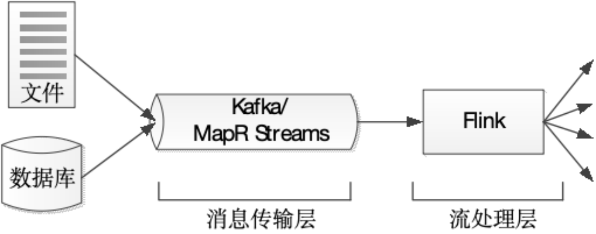
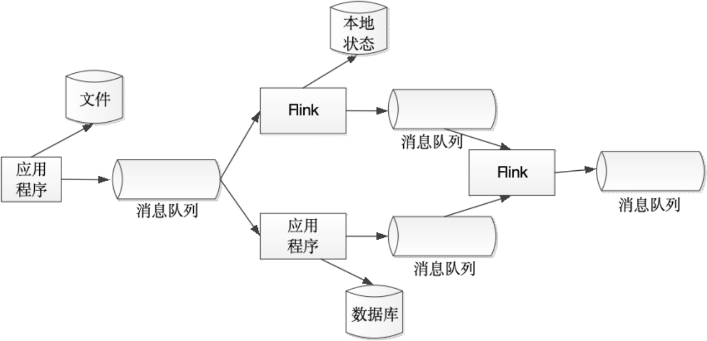

## 一、Flink概述
### 1.1 Flink简介
Flink是Apache的顶级开源流处理框架，支持`实时计算`和`批量计算`，源于2010-2014年间的Stratosphere项目。
+ Stratosphere项目是在2010年到2014年间由柏林工业大学、柏林洪堡大学和哈索普拉特纳研究所联合开展的。
+ 2014年4月，Stratosphere代码被贡献给Apache软件基金会，成为Apache软件基金会孵化器项目。
+ 2014年12月，Flink项目成为Apache软件基金会顶级项目，被优步、网飞、微软、亚马逊等国际企业和阿里巴巴、美团、滴滴等国内企业广泛应用。
+ 阿里巴巴的Flink平台自2016年上线，支持数万台服务器，处理数据量超万亿条，具备PB级状态数据。

Flink具有十分强大的功能，可以支持不同类型的应用程序。Flink的主要特性包括：
- **批流一体化**：Flink能够统一处理流计算和批量计算，简化数据处理架构。
- **精密的状态管理**：提供强大的状态管理功能，支持应用程序在处理过程中保持和管理状态。
- **事件时间支持**：可以处理基于事件时间的计算，使得流处理更符合实际场景需求。
- **精确一次的状态一致性保障**：确保数据处理的精确性和一致性，适用于对数据准确性要求高的场景。
- **高可用性**：支持在多种资源管理框架（如YARN、Mesos、Kubernetes）上运行，并在高可用配置下可以避免单点故障，具备扩展到数千核心的能力。
- **高吞吐、低延迟**：Flink在处理大规模数据时，能够保持高吞吐量和低延迟，满足实时应用对性能的严格要求。

### 1.2 为什么选择Flink
#### 1.2.1 处理架构
大数据`Lambda架构`主要包含两层，即批处理层和实时处理层。 
在`批处理层`中，采用MapReduce、Spark等技术进行批量数据处理，而在`实时处理层`中，则采用Storm、Spark Streaming等技术进行数据的实时处理。 

 

为了高效地实现`流处理架构`，一般需要设置消息传输层和流处理层（如图所示）。 
`消息传输层`从各种数据源采集连续事件产生的数据，并传输给订阅了这些数据的应用程序； `流处理层`会持续地将数据在应用程序和系统间移动，聚合并处理事件，并在本地维持应用程序的状态。 

 

流处理架构的核心是使各种应用程序互连在一起的`消息队列`。 
消息队列连接应用程序，并作为新的共享数据源，这些消息队列取代了从前的大型集中式数据库。 
流处理器订阅并处理消息队列中的数据，处理后的数据可以流向另一个消息队列或存储在本地数据库中，从而实现数据共享。

 

流处理架构正在逐步取代传统数据处理架构和Lambda架构，成为大数据处理架构的一种新趋势。 
一方面，避免了传统数据处理架构中存在的“数据库不堪重负”的问题，另一方面，它将批处理视为流处理的一个子集，使得可以通过同一流处理框架同时处理流计算和批量计算，从而解决了Lambda架构中多个框架难以管理的难题。 

#### 1.2.2 Flink是理想的流计算框架
Flink实现了Google Dataflow流计算模型，是一种兼具`高吞吐、低延迟和高性能的实时流计算框架`，并且同时支持批处理和流处理。
此外，Flink支持高度容错的状态管理，防止状态在计算过程中因为系统异常而出现丢失。因此，Flink就成为了能够满足流处理架构要求的理想的流计算框架。

| 产品              | 消息保证机制 | 容错机制      | 状态管理      | 延时  | 吞吐量 |
|-----------------|--------|-----------|-----------|-----|-----|
| Storm           | 至少一次   | Acker机制   | 无         | 低   | 低   |
| Spark Streaming | 精确一次   | 基于RDD的检查点 | 基于DStream | 中   | 高   |
| Flink           | 精确一次   | 检查点       | 基于操作      | 低   | 高   |

#### 1.2.3 Flink的优势
总体而言，Flink具有以下优势： 
（1）同时支持高吞吐、低延迟、高性能 
（2）同时支持流处理和批处理 
（3）高度灵活的流式窗口 
（4）支持有状态计算 
（5）具有良好的容错性 
（6）具有独立的内存管理 
（7）支持迭代和增量迭代 

### 1.3 Flink应用场景

## 参考引用
[1] [林子雨编著《Flink编程基础（Scala版）》教材官网](https://dblab.xmu.edu.cn/post/flink/) 
[2] [剑指大数据——Flink学习精要Scala版](https://weread.qq.com/web/reader/c3f32e90813ab8449g01292dke4d32d5015e4da3b7fbb1fa)  
[3] [【尚硅谷】Flink1.13教程（Scala版）-B站](https://www.bilibili.com/video/BV1zr4y157XV/?spm_id_from=333.999.0.0&vd_source=71e4d156399aae8c8b7f7b0a30d24516)  
[4] [Github-Flink学习精要.md](https://github.com/blueskeys/document_classfication/blob/master/%E5%A4%A7%E6%95%B0%E6%8D%AE%E6%8A%80%E6%9C%AF%E6%A0%88/%E6%95%B0%E6%8D%AE%E8%AE%A1%E7%AE%97/flink/Flink%E5%AD%A6%E4%B9%A0%E7%B2%BE%E8%A6%81.md) 
