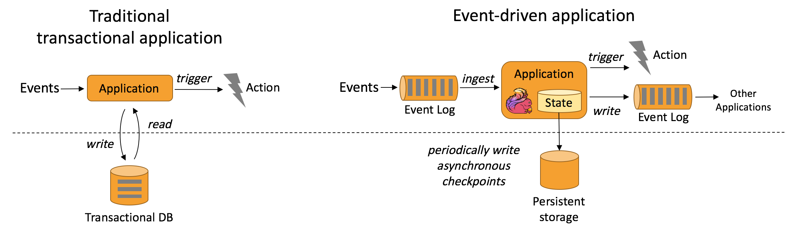
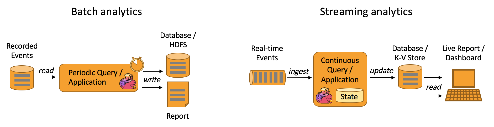
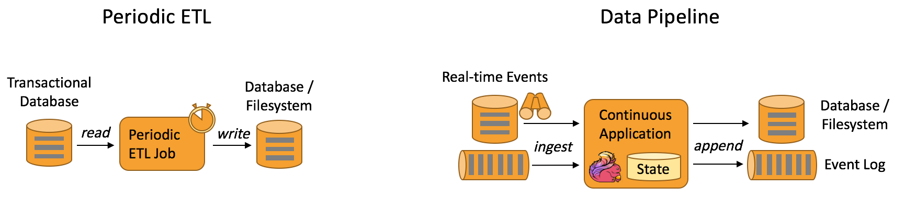
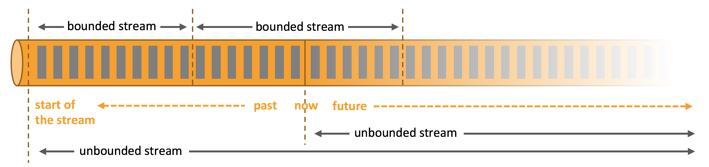
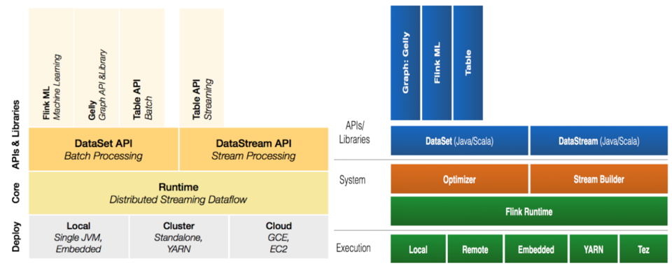
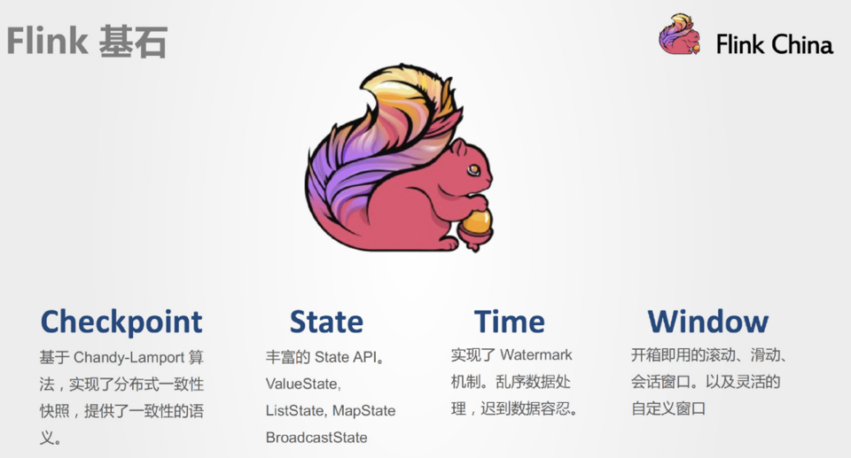
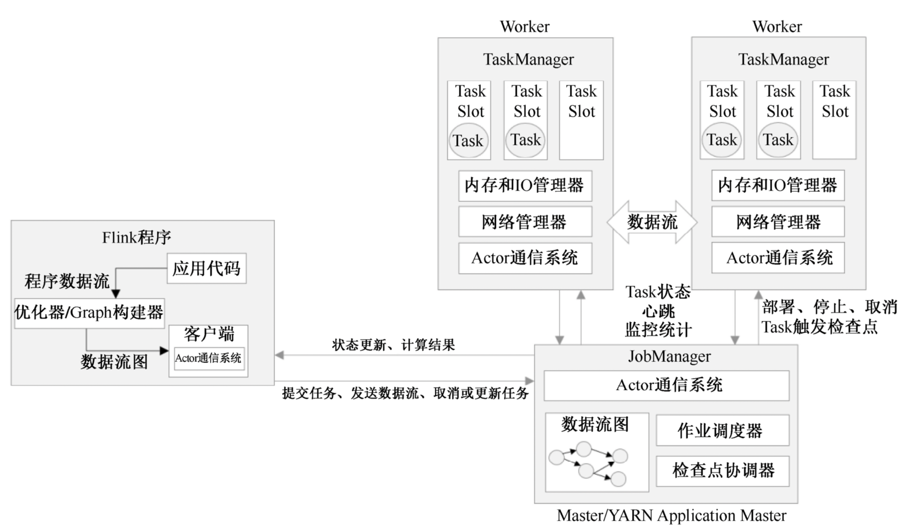

## 一、Flink概述
### 1.1 Flink简介

Apache Flink是一个框架和分布式处理引擎，支持`实时计算`和`批量计算`。Flink 能在所有常见集群环境中运行，并能以内存速度和任意规模进行计算。
+ Flink源于Stratosphere项目。
+ 2010年-2014年间，柏林工业大学、柏林洪堡大学和哈索普拉特纳研究所联合开展Stratosphere项目。
+ 2014年4月，Stratosphere代码被贡献给Apache软件基金会，成为Apache软件基金会孵化器项目。
+ 2014年12月，Flink项目成为Apache软件基金会顶级项目。
+ 在国外，优步、网飞、微软和亚马逊等已经开始使用Flink。
+ 在国内，包括阿里巴巴、美团、滴滴等在内的知名互联网企业，都已经开始大规模使用Flink。
+ 阿里巴巴的Flink平台自2016年上线，支持数万台服务器，处理数据量超万亿条，具备PB级状态数据。

Flink具有十分强大的功能，可以支持不同类型的应用程序。Flink的主要特性包括：
- **批流一体化**：Flink能够统一处理流计算和批量计算，简化数据处理架构。
- **精密的状态管理**：提供强大的状态管理功能，支持应用程序在处理过程中保持和管理状态。
- **事件时间支持**：可以处理基于事件时间的计算，使得流处理更符合实际场景需求。
- **精确一次的状态一致性保障**：确保数据处理的精确性和一致性，适用于对数据准确性要求高的场景。
- **高可用性**：支持在多种资源管理框架（如YARN、Mesos、Kubernetes）上运行，并在高可用配置下可以避免单点故障。
- **高吞吐、低延迟**：Flink在处理大规模数据时，能够保持高吞吐量和低延迟，满足实时应用对性能的严格要求。

### 1.2 为什么选择Flink
#### 1.2.1 处理架构
大数据`Lambda架构`主要包括： 
`批处理层`：采用MapReduce、Spark等技术进行批量数据处理； 
`实时处理层`：采用Storm、Spark Streaming等技术进行数据的实时处理。 

 

为了高效地实现`流处理架构`，一般需要设置消息传输层和流处理层： 
`消息传输层`：从各种数据源采集连续事件产生的数据，并传输给订阅了这些数据的应用程序；  
`流处理层`：持续地将数据在应用程序和系统间移动，聚合并处理事件，并在本地维持应用程序的状态。 

 

流处理架构的核心是使各种应用程序互连在一起的`消息队列`。消息队列连接应用程序，并作为新的共享数据源，这些消息队列取代了从前的大型集中式数据库。
流处理器订阅并处理消息队列中的数据，处理后的数据可以流向另一个消息队列或存储在本地数据库中，从而实现数据共享。

 

流处理架构正在逐步取代传统数据处理架构和Lambda架构，成为大数据处理架构的一种新趋势。
一方面，避免了传统数据处理架构中存在的“数据库不堪重负”的问题，另一方面，它将批处理视为流处理的一个子集，使得可以通过同一流处理框架同时处理流计算和批量计算，从而解决了Lambda架构中多个框架难以管理的难题。 

#### 1.2.2 Flink是理想的流计算框架
Flink实现了Google Dataflow流计算模型，是一种兼具`高吞吐、低延迟和高性能的实时流计算框架`，并且同时支持批处理和流处理。
此外，Flink支持高度容错的状态管理，防止状态在计算过程中因为系统异常而出现丢失。因此，Flink就成为了能够满足流处理架构要求的理想的流计算框架。

| 产品              | 消息保证机制 | 容错机制      | 状态管理      | 延时  | 吞吐量 |
|-----------------|--------|-----------|-----------|-----|-----|
| Storm           | 至少一次   | Acker机制   | 无         | 低   | 低   |
| Spark Streaming | 精确一次   | 基于RDD的检查点 | 基于DStream | 中   | 高   |
| Flink           | 精确一次   | 检查点       | 基于操作      | 低   | 高   |

#### 1.2.3 Flink的优势
总体而言，Flink具有以下优势： 
（1）同时支持高吞吐、低延迟、高性能 
（2）同时支持流处理和批处理 
（3）高度灵活的流式窗口 
（4）支持有状态计算 
（5）具有良好的容错性 
（6）具有独立的内存管理 
（7）支持迭代和增量迭代 

### 1.3 Flink应用场景
#### 1.3.1 事件驱动型应用
事件驱动型应用是一类具有状态的应用，它从一个或多个事件流提取数据，并根据到来的事件触发计算、状态更新或其他外部动作。 
事件驱动型应用是在计算存储分离的传统应用基础上进化而来，在传统架构中，应用需要读写远程事务型数据库。
相反，事件驱动型应用是基于状态化流处理来完成，在该设计中，数据和计算不会分离，应用只需访问本地（内存或磁盘）即可获取数据。 
系统容错性的实现依赖于定期向远程持久化存储写入 checkpoint。下图描述了传统应用和事件驱动型应用架构的区别。

 

典型的事件驱动型应用包括：反欺诈、异常检测、基于规则的报警、业务流程监控、Web 应用（社交网络）等。

**事件驱动型应用的优势？** 
（1）事件驱动型应用无须查询远程数据库，本地数据访问使得它具有更高的吞吐和更低的延迟。 
（2）由于定期向远程持久化存储的 checkpoint 工作可以异步、增量式完成，因此对于正常事件处理的影响甚微。 
（3）传统分层架构下，通常多个应用会共享同一个数据库，因而任何对数据库自身的更改都需要谨慎协调；而事件驱动型应用，只需考虑自身数据，因此在更改数据表示或服务扩容时所需的协调工作将大大减少。

**Flink是如何支持事件驱动型应用的？** 
（1）Flink提供了丰富的状态操作原语，它可以管理大量的数据（可以达到TB级别），并且可以确保“精确一次”的一致性。 
（2）Flink还支持事件时间、高度可定制的窗口逻辑和细粒度的时间控制，这些都可以帮助实现高级的商业逻辑。 
（3）Flink还拥有一个复杂事件处理（CEP）类库，可以用来检测数据流中的模式。
（4）Flink中针对事件驱动应用的突出特性当属“保存点”（`savepoint`）。 保存点是一个一致性的状态镜像，它可以作为许多相互兼容的应用的一个初始化点。 给定一个保存点以后，就可放心对应用进行升级或扩容，还可以启动多个版本的应用来完成 A/B 测试。

#### 1.3.2 数据分析应用

数据分析任务需要从原始数据中提取有价值的信息和指标。
传统的分析方式通常是利用批查询，或将事件记录下来并基于此有限数据集构建应用来完成。
为了得到最新数据的分析结果，必须先将它们加入分析数据集并重新执行查询或运行应用，随后将结果写入存储系统或生成报告。 

借助一些先进的流处理引擎，还可以实时地进行数据分析。
和传统模式下读取有限数据集不同，`流式查询或应用会接入实时事件流，并随着事件消费持续产生和更新结果`。
这些结果数据可能会写入外部数据库系统或以内部状态的形式维护。
仪表展示应用可以相应地从外部数据库读取数据或直接查询应用的内部状态。 

如下图所示，Apache Flink 同时`支持流式及批量分析应用`。 

 

典型的数据分析应用包括：电信网络质量监控、移动应用中的产品更新及实验评估分析、消费者技术中的实时数据即席分析、大规模图分析等。 

**数据分析应用的优势？** 
（1）由于流式分析省掉了周期性的数据导入和查询过程，因此从事件中获取指标的延迟更低。 
（2）批量查询必须处理那些由定期导入和输入有界性导致的人工数据边界，而流式查询则无须考虑该问题。 
（3）流式分析会简化应用抽象。批量查询流水线由多个独立部件组成，需定期调度提取数据，若某个组件出错，会影响后续步骤；而流式分析应用运行在高端流处理系统上，如Flink，涵盖数据接入到结果计算的所有步骤，可以依赖底层引擎提供的故障恢复机制。 

**Flink是如何支持数据分析应用的？** 
（1）Flink 内置了一个符合 ANSI 标准的 SQL 接口，将批、流查询的语义统一起来；无论是在记录事件的静态数据集上还是实时事件流上，相同 SQL 查询都会得到一致的结果。 
（2）Flink 还支持丰富的用户自定义函数，允许在 SQL 中执行定制化代码。如果还需进一步定制逻辑，可以利用 Flink DataStream API 和 DataSet API 进行更低层次的控制。

#### 1.3.3 数据管道应用（数据流水线应用）
提取-转换-加载（ETL）是一种在存储系统之间进行数据转换和迁移的常用方法。
ETL 作业通常会周期性地触发，将数据从事务型数据库拷贝到分析型数据库或数据仓库。 

数据管道和 ETL 作业的用途相似，都可以转换、丰富数据，并将其从某个存储系统移动到另一个。但数据管道是以持续流模式运行，而非周期性触发。因此它支持从一个不断生成数据的源头读取记录，并将它们以低延迟移动到终点。
例如：数据管道可以用来监控文件系统目录中的新文件，并将其数据写入事件日志；另一个应用可能会将事件流物化到数据库或增量构建和优化查询索引。 

下图描述了周期性 ETL 作业和持续数据管道的差异。 

 

典型的数据流水线应用包括：电子商务中的实时查询索引构建、电子商务中的持续ETL等。

**数据管道应用的优势？** 
（1）和周期性 ETL 作业相比，持续数据管道可以明显降低将数据移动到目的端的延迟。 
（2）由于数据管道能够持续消费和发送数据，因此用途更广，支持用例更多。 

**Flink是如何支持数据管道应用的？** 
（1）很多常见的数据转换和增强操作可以利用 Flink 的 SQL 接口（或 Table API）及用户自定义函数解决。 
（2）可以利用 Flink DataStream API 完成更高级的数据管道需求。 
（3）Flink 为多种数据存储系统（如：Kafka、Kinesis、Elasticsearch、JDBC数据库系统等）内置了连接器。 
（4）Flink提供了文件系统的连续型数据源及数据汇，可用来监控目录变化和以时间分区的方式写入文件。 

### 1.4 Flink中的统一数据处理（无界和有界）

任何类型的数据都可以形成一种事件流，根据数据的产生方式，可以把数据集分为两种类型：有界数据集（`有界流`）和无界数据集（`无界流`）。

 

+ `无界流`：有定义流的开始，但没有定义流的结束，它们会无休止地产生数据。 
  无界流的数据必须持续处理，即数据被摄取后需要立刻处理，不能等到所有数据都到达再处理，因为输入是无限的。 
  处理无界数据通常要求以特定顺序摄取事件，例如事件发生的顺序，以便能够推断结果的完整性。 
  无界流处理通常被称为流处理。
+ `有界流`：有定义流的开始，也有定义流的结束，有界流可以在摄取所有数据后再进行计算。 
  有界流所有数据可以被排序，所以并不需要有序摄取，有界流处理通常被称为批处理。 

Flink 擅长处理无界和有界数据集，精确的时间控制和状态化使得 Flink 的运行时(runtime)能够运行任何处理无界流的应用。
对于Flink而言，它把有界数据集看成无界数据集的一个子集，因此，将批处理与流处理混合到同一套引擎当中，用户使用Flink引擎能够同时实现批处理与流处理任务。
对于Spark而言，它会使用一系列连续的微小批处理来模拟流处理，也就是说，它会在特定的时间间隔内发起一次计算，而不是每条数据都触发计算。

### 1.5 Flink技术栈

 

各层详细介绍：
+ **物理部署层**：Flink支持多种部署模式：本地、集群(Standalone、YARN)、云(GCE/EC2)、Kubenetes。
+ **Runtime核心层**：提供了支持Flink计算的全部核心实现。 
  主要负责对上层不同接口提供基础服务，也是Flink分布式计算框架的核心实现层； 
  支持分布式Stream作业的执行、JobGraph到ExecutionGraph的映射转换、任务调度等； 
  将DataSteam和DataSet转成统一的可执行的Task Operator，达到在流式引擎下同时处理批量计算和流式计算的目的。
+ **API&Libraries层**：提供了支撑流和批计算的接口，两者都提供给用户丰富的数据处理高级API。 
  支持 Scala、 Java 和 Python； 
  包括 DataStream、DataSet、Table、SQL API，例如Map、FlatMap操作等； 
  也提供比较低级的Process Function API，用户可以直接操作状态和时间等底层数据。
+ **扩展库**：包括用于复杂事件处理的`CEP`，机器学习库`FlinkML`，图处理库`Gelly`等。 
  Table 是一种接口化的 SQL 支持，也就是 API 支持(DSL)，而不是文本化的SQL解析和执行。

### 1.6 Flink 基石
Flink四大基石分别是：Time（时间）、Window（窗口）、State（状态）、Checkpoint（检查点）。

 

### 1.7 Flink工作原理
Flink系统主要由两个组件组成，分别为JobManager和TaskManager，Flink 架构也遵循Master-Slave架构设计原则，JobManager为Master节点，TaskManager为Slave节点。

 

+ **JobManager**：扮演集群管理者的角色。 
  负责调度任务、协调 checkpoints、协调故障恢复、收集 Job 的状态信息，并管理 Flink 集群中的从节点 TaskManager。
+ **TaskManager**：实际负责执行计算的 Worker。 
  执行 Flink Job 的一组 Task；TaskManager是所在节点的管理员，负责把该节点上的服务器信息比如内存、磁盘、任务运行情况等向 JobManager 汇报。
+ **Client**： 
用户在提交编写好的 Flink 工程时，会先创建一个客户端再进行提交。

#### 1.7.1 StandAlone作业提交流程
#### 1.7.2 Yarn作业提交流程

### 1.8 Flink中的数据一致性

## 参考引用
[1] [林子雨编著《Flink编程基础（Scala版）》教材官网](https://dblab.xmu.edu.cn/post/flink/) 
[2] [剑指大数据——Flink学习精要Scala版](https://weread.qq.com/web/reader/c3f32e90813ab8449g01292dke4d32d5015e4da3b7fbb1fa)  
[3] [【尚硅谷】Flink1.13教程（Scala版）-B站](https://www.bilibili.com/video/BV1zr4y157XV/?spm_id_from=333.999.0.0&vd_source=71e4d156399aae8c8b7f7b0a30d24516)  
[4] [Github-Flink学习精要.md](https://github.com/blueskeys/document_classfication/blob/master/%E5%A4%A7%E6%95%B0%E6%8D%AE%E6%8A%80%E6%9C%AF%E6%A0%88/%E6%95%B0%E6%8D%AE%E8%AE%A1%E7%AE%97/flink/Flink%E5%AD%A6%E4%B9%A0%E7%B2%BE%E8%A6%81.md) 
[5] [Apache Flink 应用场景](https://flink.apache.org/zh/what-is-flink/use-cases/) 
[6] [Apache Flink 是什么？处理无界和有界数据](https://flink.apache.org/zh/what-is-flink/flink-architecture/#run-applications-at-any-scale) 
