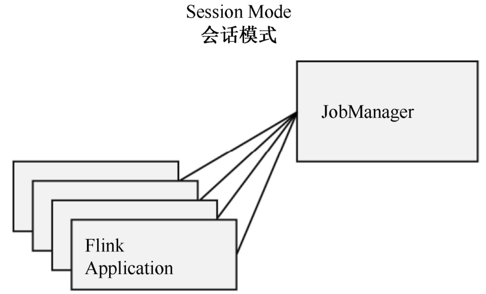
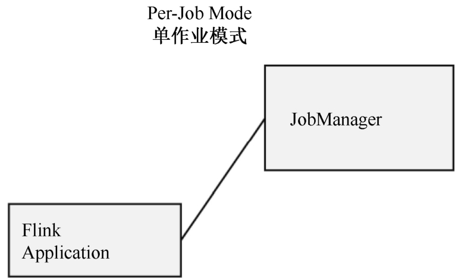
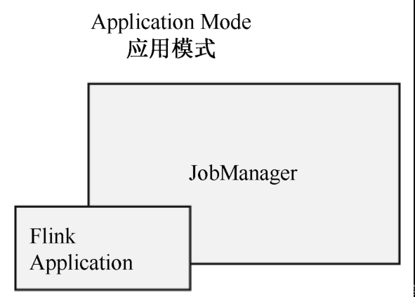

Flink -3- 一文详解安装部署以及使用和调优（standalone 模式 | yarn 模式）
https://blog.csdn.net/qq_41694906/article/details/140610459?spm=1001.2101.3001.6650.3&utm_medium=distribute.pc_relevant.none-task-blog-2~default~YuanLiJiHua~Position-3-140610459-blog-108770855.235%5Ev43%5Epc_blog_bottom_relevance_base4&depth_1-utm_source=distribute.pc_relevant.none-task-blog-2~default~YuanLiJiHua~Position-3-140610459-blog-108770855.235%5Ev43%5Epc_blog_bottom_relevance_base4&utm_relevant_index=4
## 一、常见部署模式
### 1.1 Flink 支持多种安装模式:
+ `Local`（单机模式）：一般不使用 
+ `Standalone`（独立模式）：Flink 自带集群，不依赖任何外部的资源管理平台，只需要运行所有 Flink 组件服务 
+ Yarn（`Flink on Yarn`）：计算资源统一由 Hadoop YARN 管理，生产环境使用。 
Yarn 模式是指客户端把 Flink 应用提交给 Yarn 的 ResourceManager, Yarn 的 ResourceManager 会在 Yarn 的 NodeManager 上创建容器。
在这些容器上，Flink 会部署 JobManager 和 TaskManager 的实例，从而启动集群。Flink 会根据运行在 JobManger 上的作业所需要的 Slot 数量动态分配 TaskManager 资源。

### 1.2 Flink 部署模式
一些应用场景对集群资源分配和占用的方式，可能会有特定的需求。 Flink为各种场景提供了不同的部署模式，主要有以下3种：
+ 会话模式(Session Mode)
+ 单作业模式(Per-Job Mode)
+ 应用模式(Application Mode)

它们的区别主要在于：集群的生命周期和资源的分配方式，以及应用的main方法到底在哪里执行——客户端(Client)还是JobManager。

### 1.2.1 会话模式（Session Mode）
会话模式 (Session Mode) 是指`先启动一个集群，保持一个会话并且确定所有的资源`，然后向集群提交作业，所有提交的作业会竞争集群中的资源，从而会出现资源不足作业执行失败的情况。

 

+ **优点**: `资源共享`: 多个作业可以共用同一个Flink集群，节省资源；`快速作业提交`: 集群已启动，作业提交后可立即运行，减少作业启动时间。
+ **缺点**: `资源竞争`: 不同作业之间可能争夺资源，导致性能不稳定；`管理复杂度`: 多个作业共用集群，资源管理和隔离相对复杂。
+ **应用场景**：适合需要运行多个轻量级作业（单个规模小、执行时间短）的场景。

### 1.2.2 单作业模式 Per-Job Mode
单作业模式 (Per-Job Mode) 是指`为每一个提交的作业启动一个集群`，由客户端运行应用程序，然后启动集群，作业被提交给 JobManager，进而分发给 TaskManager 执行`。
作业作业完成后，集群就会关闭，所有资源也会释放。每个作业都有它自己的JobManager管理，占用独享的资源，即使发生故障，它的TaskManager宕机也不会影响其他作业。
单作业模式在生产环境运行更加稳定，所以是实际应用的首选模式。
单作业模式一般需要借助一些资源管理框架来启动集群，比如 YARN、Kubernetes。

 

+ **优点**: `资源隔离`: 每个作业独占资源，避免了资源争夺问题；`故障隔离`: 一个作业崩溃不会影响其他作业，可靠性高。
+ **缺点**: `启动时间长`: 每次提交作业都需要启动一个新的Flink集群，导致启动时间长；`资源浪费`: 对于小作业，独立启动集群可能会浪费资源。
+ **应用场景**：适合需要运行独立的大型作业或对稳定性要求较高的关键任务。

### 1.2.3 应用模式 Application Mode
应用模式 (Application Mode) 是指为`每一个提交的应用单独启动一个 JobManager，也就是创建一个集群`。这个 JobManager 只为执行这一个应用而存在，执行结束之后 JobManager 也就关闭了。

 

应用模式与单作业模式，都是提交作业之后才创建集群；单作业模式是通过`客户端`来提交的，客户端解析出的每个作业都对应一个集群；而在应用模式下，是直接由`JobManager`执行应用程序的，并且即使应用包含了多个作业，也只创建一个集群。

+ **优点**: `专注于应用`: 以应用为中心，启动一个Flink集群专门执行一个应用的所有逻辑；`简化管理`: 不需要管理多个作业提交，Flink集群与应用逻辑紧密结合，简化部署和管理；`资源独立`：每个应用独立运行，避免了会话模式下的资源争夺和故障传播问题。
+ **缺点**: `资源利用率低`:和单作业模式一样，对于资源要求不高的应用，可能存在资源浪费问题；`启动开销`: 每个应用都需要启动一个独立的Flink集群，启动时间较长。
+ **应用场景**：适合运行完整的应用程序生命周期，尤其是在作业逻辑复杂或需要长时间运行的应用场景。

3：常见部署模式组合
Standalone + 会话模式
Standalone + 应用模式
Yarn + 会话模式
Yarn + 单作业模式
Yarn + 应用模式

### 三、参考引用
[1] [Docker下安装zookeeper（单机 & 集群）](https://www.cnblogs.com/LUA123/p/11428113.html) 