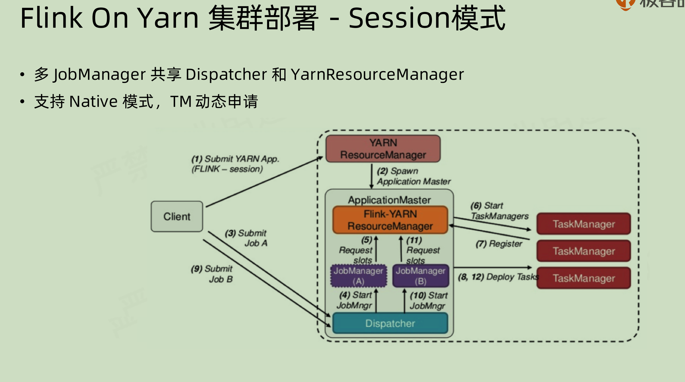

## 一、Flink 安装

### 1.1 Flink 安装方式
Flink 的安装方式有多种，具体取决于用户的环境和需求。以下是几种常见的安装方式：

+ `Local`（单机模式）：<br>
  在一个JVM进程中，通过线程模拟出各个Flink角色来得到Flink环境，直接解压安装包就可使用。

+ `Standalone`（独立模式）：<br>
  各个Flink组件都是独立运行的一个`JVM进程`，不依赖任何外部的资源管理平台。<br>
  如果资源不足，或者出现故障，没有自动扩展或重分配资源的保证，必须手动处理。

+ Yarn（`Flink on Yarn`）：<br>
  各个Flink组件，均运行在多个YARN的容器内，其整体上是一个YARN的任务。

详细部署信息参考：[基于Docker搭建大数据集群](https://github.com/530154436/bigdata-learning/blob/main/docker-deploy/README.md)

### 1.2 Flink集群安装与配置
+ 下载解压
```
wget https://archive.apache.org/dist/flink/flink-1.13.2/flink-1.13.2-bin-scala_2.12.tgz
tar -xvf flink-1.13.2-bin-scala_2.11.tgz -C /usr/local/
```
+ 配置环境变量
```
export HADOOP_CLASSPATH=`$HADOOP_HOME/bin/hadoop classpath`
export FLINK_HOME=/usr/local/flink
```
+ 配置集群文件-$FLINK_HOME/conf/flink-conf.yaml
```
# Common
jobmanager.rpc.address: flink101
jobmanager.rpc.port: 6123
jobmanager.memory.process.size: 1600m   # JobManager进程可使用到的全部内存，默认1600MB。
taskmanager.memory.process.size: 1728m  # TaskManager进程可使用到的全部内存，默认1600MB。
taskmanager.numberOfTaskSlots: 4        # 每个TaskManager能够分配的slots数量，默认为1，一般由CPU数量决定。
parallelism.default: 1                  # Flink任务执行的默认并行度

# 是否启动web提交
web.submit.enable: true

# HistoryServer
fs.default-scheme: hdfs://hadoop101:9000/
jobmanager.archive.fs.dir: hdfs://hadoop101:9000/flink/jobmanager/
historyserver.archive.fs.dir: hdfs://hadoop101:9000/flink/historyserver/
historyserver.web.address: flink101
historyserver.web.port: 8082
```
+ 配置集群文件-$FLINK_HOME/conf/masters
```
# JobManager节点
flink101:8081
```
+ 配置集群文件-$FLINK_HOME/conf/workers
```
# TaskManager节点
flink101
flink102
```
+ 启动集群
```shell
# 启动集群
$FLINK_HOME/bin/start-cluster.sh

# 启动历史服务器
$FLINK_HOME/bin/historyserver.sh start
```

## 二、Flink 部署模式

不同应用场景对集群资源分配和占用的方式有不同的需求。 Flink为各种场景提供了不同的部署模式，主要有以下3种：
+ 会话模式(Session Mode)
+ 单作业模式(Per-Job Mode)
+ 应用模式(Application Mode)

它们的区别主要在于：集群的生命周期和资源的分配方式，以及应用的main方法到底在哪里执行——客户端(Client)还是JobManager。

### 2.1 会话模式（Session Mode）
会话模式 (Session Mode) 是指`先启动一个集群，保持一个会话并且确定所有的资源`，然后向集群提交作业，所有提交的作业会竞争集群中的资源，从而会出现资源不足作业执行失败的情况。<br>

<br>

**优点**: `资源共享`: 多个作业可以共用同一个Flink集群，节省资源；`快速作业提交`: 集群已启动，作业提交后可立即运行，减少作业启动时间。<br>
**缺点**: `资源竞争`: 不同作业之间可能争夺资源，导致性能不稳定；`管理复杂度`: 多个作业共用集群，资源管理和隔离相对复杂。<br>
**应用场景**：适合需要运行多个轻量级作业（单个规模小、执行时间短）的场景。<br>

### 1.2.2 单作业模式 Per-Job Mode
单作业模式 (Per-Job Mode) 是指`为每一个提交的作业启动一个集群`，由客户端运行应用程序，然后启动集群，作业被提交给 JobManager，进而分发给 TaskManager 执行`。
作业作业完成后，集群就会关闭，所有资源也会释放。每个作业都有它自己的JobManager管理，占用独享的资源，即使发生故障，它的TaskManager宕机也不会影响其他作业。
单作业模式在生产环境运行更加稳定，所以是实际应用的首选模式。
单作业模式一般需要借助一些资源管理框架来启动集群，比如 YARN、Kubernetes。<br>

<br>

**优点**: `资源隔离`: 每个作业独占资源，避免了资源争夺问题；`故障隔离`: 一个作业崩溃不会影响其他作业，可靠性高。<br>
**缺点**: `启动时间长`: 每次提交作业都需要启动一个新的Flink集群，导致启动时间长；`资源浪费`: 对于小作业，独立启动集群可能会浪费资源。<br>
**应用场景**：适合需要运行独立的大型作业或对稳定性要求较高的关键任务。<br>

### 1.2.3 应用模式 Application Mode
应用模式 (Application Mode) 是指为`每一个提交的应用单独启动一个JobManager，也就是创建一个集群`。这个 JobManager 只为执行这一个应用而存在，执行结束之后 JobManager 也就关闭了。<br>

<br>

应用模式与单作业模式，都是提交作业之后才创建集群；单作业模式是通过`客户端`来提交的，客户端解析出的每个作业都对应一个集群；而在应用模式下，是直接由`JobManager`解析和执行应用程序的，并且即使应用包含了多个作业，也只创建一个集群。 

**优点**: `简化管理`: 不需要管理多个作业提交，Flink集群与应用逻辑紧密结合，简化部署和管理；`资源独立`：每个应用独立运行，避免了资源争夺和故障传播问题。<br>
**缺点**: `资源利用率低`:和单作业模式一样，对于资源要求不高的应用，可能存在资源浪费问题；`启动开销`: 每个应用都需要启动一个独立的Flink集群，启动时间较长。<br>
**应用场景**：适合运行完整的应用程序生命周期，尤其是在作业逻辑复杂或需要长时间运行的应用场景。

> Session 和 per-job 模式都是先将对应的 jar 在 client 进行解析，然后提交到 JobManager。
生成 JobGraph 的过程很消耗 CPU 资源，而且在多个 JAR 进行排队提交的时候，有可能会造成阻塞（排队等待解析和上传 dependency JAR）。
dependency jar 也可能很大，造成 cluster 和 client 之间的网络堵塞。
所以就有一种想法——为什么不把这些交给 JobManager？<br>

## 三、Flink 部署模式（Flink on Yarn）
Flink可以基于Yarn来运行任务，Yarn作为资源提供方，可以根据Flink任务资源需求动态的启动TaskManager来提供资源。 Flink在YARN上部署的过程如下：
1. 客户端将Flink应用提交给YARN的ResourceManager，YARN的ResourceManager会向YARN的NodeManager申请容器。<br>
2. 在这些容器上，Flink会部署JobManager和TaskManager的实例，从而启动集群。<br>
3. Flink会根据运行在JobManger上的作业所需要的slots数量动态分配TaskManager资源。<br>

> 为什么使用Flink on Yarn? <br>
> 1.Yarn的资源可以按需使用，提高集群的资源利用率<br>
> 2.Yarn的任务有优先级，根据优先级运行作业<br>
> 3.基于Yarn调度系统，能够自动化地处理各个角色的Failover(容错)<br>
（1）JobManager进程和TaskManager进程都由Yarn NodeManager 监控<br>
（2）如果JobManager进程异常退出，则Yarn ResourceManager会重新调度JobManager到其他机器<br>
（3）如果TaskManager进程异常退出，JobManager会收到消息并重新向Yarn ResourceManager 申请资源，重新启动TaskManager<br>
### 3.1 会话模式部署

<br>

YARN的会话模需要首先申请一个`YARN会话`(YARN session)来启动Flink集群。 具体步骤如下所示。<br>
(1) 启动Hadoop集群，包括HDFS和YARN。<br>
(2) 执行脚本命令向YARN集群申请资源，开启一个YARN会话，启动Flink集群。
```shell
$FLINK_HOME/bin/yarn-session.sh -nm test
# -d：分离模式，如果你不想让Flink YARN客户端一直在前台运行，可以使用这个参数，即使关掉当前对话窗口，YARN session也可以在后台运行。
# -jm(--jobManagerMemory)：配置JobManager所需内存，默认单位为MB。
# -nm(--name)：配置在YARN UI界面上显示的任务名。
# -qu(--queue)：指定YARN队列名。
# -tm(--taskManager)：配置每个TaskManager所用内存。
```


### 3.2 会话模式部署
### 3.3 会话模式部署

### 四、参考引用
[1] [剑指大数据——flink学习精要（scala版）](https://weread.qq.com/web/reader/c3f32e90813ab8449g01292dkc9f326d018c9f0f895fb5e4)<br>
[2] [Docker下安装zookeeper（单机 & 集群）](https://www.cnblogs.com/LUA123/p/11428113.html)<br>
[3] [Flink -3- 一文详解安装部署以及使用和调优（standalone 模式 | yarn 模式）](https://blog.csdn.net/qq_41694906/article/details/140610459)<br>
[4] [一文详解Flink on Yarn的三种部署方式及使用说明](https://www.bilibili.com/read/cv23629566/)<br>
[5] [林子雨编著《Flink编程基础（Scala版）》教材官网](https://dblab.xmu.edu.cn/post/flink/)<br>
[6] [Flink部署模式剖析](https://timzhouyes.github.io/2021/04/14/Flink-%E9%83%A8%E7%BD%B2%E6%A8%A1%E5%BC%8F%E5%89%96%E6%9E%90/)<br>