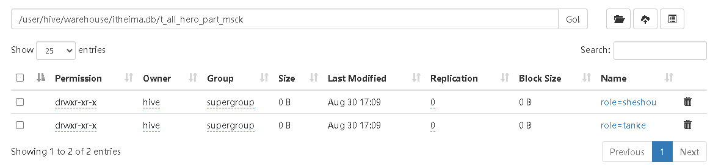

<nav>
<a href="#一数据库ddl操作databaseschema">一、数据库DDL操作（Database|schema）</a><br/>
<a href="#二表ddl操作table">二、表DDL操作（Table）</a><br/>
&nbsp;&nbsp;&nbsp;&nbsp;<a href="#21-describe-table">2.1 Describe table</a><br/>
&nbsp;&nbsp;&nbsp;&nbsp;<a href="#22-drop-table">2.2 Drop table</a><br/>
&nbsp;&nbsp;&nbsp;&nbsp;<a href="#23-truncate-table">2.3 Truncate table</a><br/>
&nbsp;&nbsp;&nbsp;&nbsp;<a href="#24-alter-table">2.4 Alter table</a><br/>
<a href="#三分区ddl操作partition">三、分区DDL操作（Partition）</a><br/>
&nbsp;&nbsp;&nbsp;&nbsp;<a href="#31-add-partition">3.1 Add partition</a><br/>
&nbsp;&nbsp;&nbsp;&nbsp;<a href="#32-rename-partition">3.2 rename partition</a><br/>
&nbsp;&nbsp;&nbsp;&nbsp;<a href="#33-delete-partition">3.3 delete partition</a><br/>
&nbsp;&nbsp;&nbsp;&nbsp;<a href="#34-alter-partition">3.4 alter partition</a><br/>
&nbsp;&nbsp;&nbsp;&nbsp;<a href="#35-msck-partition修复分区">3.5 Msck partition（修复分区）</a><br/>
&nbsp;&nbsp;&nbsp;&nbsp;&nbsp;&nbsp;&nbsp;&nbsp;<a href="#351-语法">3.5.1 语法</a><br/>
&nbsp;&nbsp;&nbsp;&nbsp;&nbsp;&nbsp;&nbsp;&nbsp;<a href="#352-案例">3.5.2 案例</a><br/>
<a href="#四hive-show显示语法">四、Hive Show显示语法</a><br/>
<a href="#参考引用">参考引用</a><br/>
</nav>

## 一、数据库DDL操作（Database|schema）
Hive中DATABASE的概念和RDBMS中类似，我们称之为`数据库`。在Hive中， DATABASE和SCHEMA是可互换的，使用DATABASE或SCHEMA都可以。
```sql
CREATE (DATABASE|SCHEMA) [IF NOT EXISTS] database_name
[COMMENT database_comment]
[LOCATION hdfs_path]
[WITH DBPROPERTIES (property_name=property_value, ...)]
```
（1）COMMENT：数据库的注释说明语句<br>
（2）指定数据库在HDFS存储位置，默认`/user/hive/warehouse`<br>
（3）用于指定一些数据库的属性配置。<br>
**注意**：使用`location`指定路径的时候，最好是一个新创建的空文件夹。

```sql
-- 创建数据库
create database if not exists itcast
comment "this is my first db"
location "/user/hive/warehouse/itcast.db"
with dbproperties ('createdBy'='Edward')
;
```
Desc/Use/ALTER/DROP相关操作
```sql
-- 显示Hive中数据库的名称、注释及其在文件系统上的位置等信息。
desc database itcast;
desc database extended itcast;

-- 切换数据库: 用于选择特定的数据库,切换当前会话使用哪一个数据库进行操作。
use itcast;

-- Hive中的ALTER DATABASE语句用于更改与Hive中的数据库关联的元数据。
--更改数据库属性
ALTER DATABASE itcast SET DBPROPERTIES ("createDate"="20240827");

--更改数据库所有者
ALTER DATABASE itcast SET OWNER USER zhengchubin;

--更改数据库位置：元数据修改生效了，但hdfs位置没改变
ALTER DATABASE itcast SET LOCATION "hdfs:///data/itcast.db";

-- Hive中的DROP DATABASE语句用于删除（删除）数据库。
-- 默认行为是RESTRICT，这意味着仅在数据库为空时才删除它。要删除带有表的数据库，我们可以使用CASCADE。
-- DROP (DATABASE|SCHEMA) [IF EXISTS] database_name [RESTRICT|CASCADE];
DROP DATABASE IF EXISTS itcast;
DROP DATABASE IF EXISTS itcast CASCADE;
```

## 二、表DDL操作（Table）
```sql
-- 创建示例表
create table if not exists table_name(id int, name string);
```
### 2.1 Describe table
Hive中的DESCRIBE table语句用于显示Hive中表的元数据信息。
```sql
-- 语法
describe formatted [db_name.]table_name;
describe extended [db_name.]table_name;

-- 示例
describe formatted table_name;
describe extended table_name;
```
如果指定了`EXTENDED`关键字，则它将以Thrift序列化形式显示表的所有元数据。如果指定了FORMATTED关键字，则它将以表格格式显示元数据。<br>


### 2.2 Drop table
DROP TABLE删除该表的元数据和数据。 如果已配置垃圾桶（且未指定PURGE），则该表对应的数据实际上将移动到`.Trash/Current目录`，而元数据完全丢失。<br>
删除EXTERNAL表时，该表中的数据不会从文件系统中删除，只删除元数据。 如果指定了`PURGE`，则表数据不会进入.Trash/Current目录，跳过垃圾桶直接被删除。因此如果DROP失败，则无法挽回该表数据。
```sql
-- 语法
DROP TABLE [IF EXISTS] table_name [PURGE];  -- (Note: PURGE available in Hive 0.14.0 and later)

-- 示例

```

### 2.3 Truncate table
从表中`删除所有行`。可以简单理解为清空表的所有数据但是保留表的元数据结构。如果HDFS启用了垃圾桶，数据将被丢进垃圾桶，否则将被删除。
```sql
-- 语法
TRUNCATE [TABLE] table_name;

-- 示例
TRUNCATE TABLE table_name;
```

### 2.4 Alter table
```sql
--1、更改表名
ALTER TABLE table_name RENAME TO new_table_name;
ALTER TABLE new_table_name RENAME TO table_name;

--2、更改表属性
-- ALTER TABLE table_name SET TBLPROPERTIES (property_name = property_value, ... );
ALTER TABLE table_name SET TBLPROPERTIES ("createdBy" = "Edward");

--更改表注释
ALTER TABLE table_name SET TBLPROPERTIES ('comment' = "new comment for student table");

--3、更改表的文件存储格式 该操作仅更改表元数据。现有数据的任何转换都必须在Hive之外进行。
-- ALTER TABLE table_name  SET FILEFORMAT file_format;
ALTER TABLE table_name  SET FILEFORMAT ORC;

--4、更改表的存储位置路径
ALTER TABLE table_name SET LOCATION "/data/table_name";

--5、添加/替换列
--使用ADD COLUMNS，您可以将新列添加到现有列的末尾但在分区列之前。
--REPLACE COLUMNS 将删除所有现有列，并添加新的列集。
-- ALTER TABLE table_name ADD|REPLACE COLUMNS (col_name data_type,...);
ALTER TABLE table_name ADD COLUMNS (age INT);
```

## 三、分区DDL操作（Partition）
### 3.1 Add partition
分区值仅在为字符串时才应加引号，位置必须是数据文件所在的目录。 `ADD PARTITION`会更改表元数据，但不会加载数据。如果分区位置中不存在数据，查询将不会返回任何结果。
```sql
drop table if exists table_name;
create table if not exists table_name(id int) PARTITIONED BY (dt string);
--一次添加一个分区
ALTER TABLE table_name ADD PARTITION (dt='20170101') location '/user/hadoop/warehouse/table_name/dt=20170101';
show partitions table_name;

drop table if exists table_name;
create table if not exists table_name(id int) PARTITIONED BY (dt string, country string);
-- 一次添加多个分区
ALTER TABLE table_name ADD PARTITION (dt='20170101', country='us') location '/user/hadoop/warehouse/table_name/dt=20170101/country=us';
show partitions table_name;
```

### 3.2 rename partition
```sql
-- 语法
ALTER TABLE table_name PARTITION partition_spec RENAME TO PARTITION partition_spec;
-- 示例
ALTER TABLE table_name PARTITION (dt='20170101', country='us') RENAME TO PARTITION (dt='20080809', country='cn');
```
### 3.3 delete partition
可以使用`ALTER TABLE DROP PARTITION`删除表的分区，这将删除该分区的数据和元数据。
```sql
ALTER TABLE table_name DROP IF EXISTS PARTITION (dt='20080809', country='cn');
ALTER TABLE table_name DROP IF EXISTS PARTITION (dt='20080809', country='cn') PURGE; --直接删除数据 不进垃圾桶
show partitions table_name;
```

### 3.4 alter partition
```sql
--更改分区文件存储格式
ALTER TABLE table_name PARTITION (dt='2008-08-09') SET FILEFORMAT file_format;
--更改分区位置
ALTER TABLE table_name PARTITION (dt='2008-08-09') SET LOCATION "new location";
```

### 3.5 Msck partition（修复分区）
#### 3.5.1 语法
Hive将每个表的分区列表信息存储在其metastore中。但是，如果将新分区直接添加到HDFS（例如通过使用hadoop fs -put命令）或从HDFS中直接删除分区文件夹，则除非用户ALTER TABLE table_name ADD/DROP PARTITION在每个新添加的分区上运行命令，否则metastore（也就是Hive）将不会意识到分区信息的这些更改。
但是，用户可以使用修复表选项运行`metastore check`命令。
```sql
-- 语法
MSCK [REPAIR] TABLE table_name [ADD/DROP/SYNC PARTITIONS];
-- 示例
MSCK REPAIR TABLE table_name;
```
MSC命令的默认选项是“添加分区”。使用此选项，它将把HDFS上存在但元存储中不存在的所有分区添加到元存储中。<br>
DROP PARTITIONS选项将从已经从HDFS中删除的metastore中删除分区信息。<br>
SYNC PARTITIONS选项等效于调用ADD和DROP PARTITIONS。<br>
如果存在大量未跟踪的分区，则可以批量运行MSCK REPAIR TABLE，以避免OOME（内存不足错误）。<br>

#### 3.5.2 案例
① 创建一张分区表，直接使用HDFS命令在表文件夹下创建分区文件夹并上传数据，此时在Hive中查询是无法显示表数据的，因为metastore中没有记录，使用`MSCK ADD PARTITIONS`进行修复。
```sql
--Step1：创建分区表
create table t_all_hero_part_msck
(
    id           int,
    name         string,
    hp_max       int,
    mp_max       int,
    attack_max   int,
    defense_max  int,
    attack_range string,
    role_main    string,
    role_assist  string
) partitioned by (role string)
row format delimited
    fields terminated by "\t";

--Step2：在linux上，使用HDFS命令创建分区文件夹
-- $HADOOP_HOME/bin/hdfs dfs -mkdir -p /user/hive/warehouse/itheima.db/t_all_hero_part_msck/role=sheshou
-- $HADOOP_HOME/bin/hdfs dfs -mkdir -p /user/hive/warehouse/itheima.db/t_all_hero_part_msck/role=tanke

--Step3：把数据文件上传到对应的分区文件夹下
-- $HADOOP_HOME/bin/hdfs dfs -put /home/hive/honor_of_kings/hero/archer.txt /user/hive/warehouse/itheima.db/t_all_hero_part_msck/role=sheshou
-- $HADOOP_HOME/bin/hdfs dfs -put /home/hive/honor_of_kings/hero/tank.txt /user/hive/warehouse/itheima.db/t_all_hero_part_msck/role=tanke

--Step4：查询表 可以发现没有数据
select * from t_all_hero_part_msck;
--Step5：使用MSCK命令进行修复
--add partitions可以不写 因为默认就是增加分区
MSCK repair table t_all_hero_part_msck add partitions;
```
<br>

② 针对分区表，直接使用HDFS命令删除分区文件夹，此时在Hive中查询显示分区还在，因为metastore中还没有被删除，使用`MSCK DROP PARTITIONS`进行修复。
```sql
--Step1：直接使用HDFS命令删除分区表的某一个分区文件夹
-- $HADOOP_HOME/bin/hdfs dfs -rm -r /user/hive/warehouse/itheima.db/t_all_hero_part_msck/role=sheshou

--Step2：查询发现还有分区信息
--因为元数据信息没有删除
show partitions t_all_hero_part_msck;

--Step3：使用MSCK命令进行修复
MSCK repair table t_all_hero_part_msck drop partitions;
show partitions t_all_hero_part_msck;
```
<br>


## 四、Hive Show显示语法
```sql
--1、显示所有数据库 SCHEMAS和DATABASES的用法 功能一样
show databases;
show schemas;

--2、显示当前数据库所有表/视图/物化视图/分区/索引
show tables;
show tables IN itheima; --指定某个数据库

--3、显示当前数据库下所有视图
Show Views;
SHOW VIEWS 'tmp_v_*'; -- show all views that start with "test_"
SHOW VIEWS FROM itheima; -- show views from database test1
SHOW VIEWS IN itheima;

--4、显示当前数据库下所有物化视图
SHOW MATERIALIZED VIEWS IN itheima;

--5、显示表分区信息，分区按字母顺序列出，不是分区表执行该语句会报错
show partitions table_name;

--6、显示表/分区的扩展信息
SHOW TABLE EXTENDED IN itheima LIKE table_name;
show table extended like student;

--7、显示表的属性信息
SHOW TBLPROPERTIES table_name;
show tblproperties student;

--8、显示表、视图的创建语句
SHOW CREATE TABLE itheima.t_usa_covid19_bucket;
show create table student;

--9、显示表中的所有列，包括分区列。
SHOW COLUMNS IN t_usa_covid19_bucket IN itheima;
show columns  in student;

--10、显示当前支持的所有自定义和内置的函数
show functions;

--11、Describe desc
--查看表信息
desc extended table_name;
--查看表信息（格式化美观）
desc formatted table_name;
--查看数据库相关信息
describe database itheima;
```

## 参考引用
[1] [黑马程序员-Apache Hive 3.0](https://book.itheima.net/course/1269935677353533441/1269937996044476418/1269942232408956930) <br>
[2] [Apache Hive -Materialized views](https://cwiki.apache.org/confluence/display/Hive/Materialized+views)


