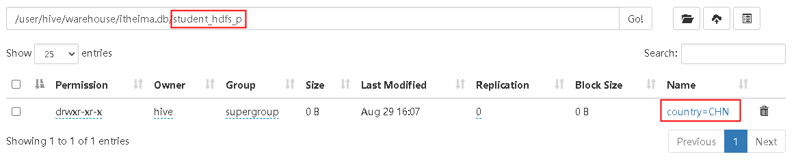

## 一、Load加载数据

### 1.1 Load语法
在将数据load加载到表中时，`Hive不会进行任何转换`。 加载操作是将数据文件移动到与Hive表对应的位置的纯复制/移动操作。语法如下：
```sql
LOAD DATA [LOCAL] INPATH 'filepath' [OVERWRITE] INTO TABLE tablename 
    [PARTITION (partcol1=val1, partcol2=val2 ...)]
    [INPUTFORMAT 'inputformat' SERDE 'serde'] (3.0 or later)
```
+ `filepath`：表示的待移动数据的路径，可以引用一个文件或目录。<br>
   相对路径：project/data1<br>
   绝对路径：/user/hive/project/data1<br>
   具有schema的完整URI：hdfs://namenode:9000/user/hive/project/data1<br>
+  `LOCAL`：load命令将在本地文件系统中查找文件路径。<br>
   如果指定了相对路径，它将相对于用户的当前工作目录进行解释。<br>
   用户也可以为本地文件指定完整的URI-例如：file:///user/hive/project/data1。<br>
   **注意**：如果对`HiveServer2服务`运行此命令，这里的本地文件系统指的是Hiveserver2服务所在机器的本地Linux文件系统。
+  `OVERWRITE`：目标表（或者分区）中的内容会被删除，然后再将 filepath 指向的文件/目录中的内容添加到表/分区中。 

### 1.2 案例：load加载数据到Hive表
建表，为后续操作做准备：
```sql
--建表student_local 用于演示从本地加载数据
drop table if exists student_local;
create table student_local(num  int, name string, sex  string, age  int, dept string) row format delimited fields terminated by ',';

--建表student_HDFS  用于演示从HDFS加载数据
create table student_hdfs(num  int, name string, sex  string, age  int, dept string) row format delimited fields terminated by ',';

--建表student_HDFS_p 用于演示从HDFS加载数据到分区表
create table student_hdfs_p(num  int, name string, sex  string, age  int, dept string) partitioned by(country string) row format delimited fields terminated by ',';
```
(1) `从本地加载数据`：数据位于HS2本地文件系统，本质是`hadoop fs -put`上传操作
```sql
-- 多次上传同名文件不会覆盖，而是添加后缀：xxx_copy_1.txt、xxx_copy_2.txt..
LOAD DATA LOCAL INPATH 'file:///home/hive/students.txt' INTO TABLE student_local;
LOAD DATA LOCAL INPATH '/home/hive/students.txt' INTO TABLE student_local;
LOAD DATA LOCAL INPATH './students.txt' INTO TABLE student_local;  -- `pwd`: /home/hive/

-- 添加Overwrite关键字则覆盖
LOAD DATA LOCAL INPATH 'file:///home/hive/students.txt' OVERWRITE INTO TABLE student_local;
```
<br>

(2) `从HDFS加载数据`：数据位于HDFS文件系统根目录下，本质是`hadoop fs -mv`移动操作（移动后文件位置发生变更）
```sql
-- $HADOOP_HOME/bin/hdfs dfs -put students.txt /data/
LOAD DATA INPATH '/data/students.txt' INTO TABLE student_hdfs;
-- $HADOOP_HOME/bin/hdfs dfs -put students.txt /data/
LOAD DATA INPATH '/data/students.txt' INTO TABLE student_HDFS_p partition(country ="CHN");
```
<br>

### 1.3 Hive3.0 Load新特性
Hive 3.0及更高版本中，除了移动复制操作之外，还支持其他加载操作，因为Hive在内部在某些场合下会将加载重写为`INSERT AS SELECT`。
比如，如果表具有分区，则load命令没有指定分区，则将load转换为INSERT AS SELECT，并假定最后一组列为分区列。如果文件不符合预期的架构，它将引发错误。
```sql
-- Hive3.0 Load新特性
drop table if exists student_hdfs_p2;
create table if not exists student_hdfs_p2(
    num  int,
    name string,
    sex  string,
    age  int
)
partitioned by(dept string)
row format delimited
    fields terminated by ',';

-- 动态分区：insert as select
-- $HADOOP_HOME/bin/hdfs dfs -put students.txt /data/
LOAD DATA INPATH '/data/students.txt' INTO TABLE student_hdfs_p2;

SHOW partitions student_hdfs_p2;
SELECT * FROM student_hdfs_p2;
```
<br>

本来加载的时候没有指定分区，语句是报错的，但是文件的格式符合表的结构，最后一个是分区字段，则此时会将load语句转换成为`insert as select`语句。
在Hive3.0中，还支持使用inputformat、SerDe`指定任何Hive输入格式`，例如文本，ORC等。

## 二、Insert插入数据

使用以下表`student`和数据进行测试：
```sql
drop table if exists student;
create table student(num int, name string, sex string, age int, dept string) row format delimited fields terminated by ',';
load data local inpath '/home/hive/students.txt' into table student;
```

### 2.1 insert + select
Hive中`insert`主要是结合select查询语句使用，将查询结果插入到表中，语法如下：
```sql
-- OVERWRITE将覆盖表或分区中的任何现有数据。
INSERT [OVERWRITE] TABLE tablename1 
    [PARTITION (partcol1=val1, partcol2=val2 ...) [IF NOT EXISTS]] 
    select_statement1 FROM from_statement;
```
需要`保证查询结果列的数目和需要插入数据表格的列数目一致`，如果不一致，Hive将会进行转换，但是不能保证转换一定成功，转换失败的数据将会为NULL。
```sql
--创建一张目标表  只有两个字段
create table student_from_insert(sno int, sname string);
--使用insert+select插入数据到新表中
insert into table student_from_insert select num, name from student;
select * from student_from_insert;
```

### 2.2 multiple inserts（多重插入）
`multiple inserts`可以翻译成为多次插入或多重插入，核心是：`一次扫描，多次插入`，目的是减少扫描的次数。
```sql
--创建两张新表
create table student_insert1(num int);
create table student_insert2(name string);
--多重插入
from student
insert overwrite table student_insert1
select num
insert overwrite table student_insert2
select name;
```

### 2.3 dynamic partition insert（动态分区插入）
任务：创建一张分区表，根据最后一个字段（选修专业）进行分区，同一个专业的同学分到同一个分区中。<br>
Hive提供了`动态分区插入`的语法，即分区的值是由后续的select查询语句的结果来动态确定的，并根据查询结果自动分区。
```sql
--1、首先设置动态分区模式为非严格模式 默认已经开启了动态分区功能
set hive.exec.dynamic.partition = true;
set hive.exec.dynamic.partition.mode = nonstrict;

--2、创建分区表 以sdept作为分区字段
--注意：分区字段名不能和表中的字段名重复。
drop table if exists student_partition;
create table student_partition(num int, name string, sex string, age int) partitioned by(dept string);

--3、执行动态分区插入操作
insert into table student_partition partition(dept)
select num,name,sex,age,dept from student;
```
<br>


### 2.4 insert + directory（导出数据）
Hive支持将select查询的结果导出成文件存放在文件系统中。语法格式如下：
```sql
-- 标准语法
INSERT OVERWRITE [LOCAL] DIRECTORY directory1
    [ROW FORMAT row_format] 
    [STORED AS file_format] 
SELECT ... FROM ...

--Hive extension (multiple inserts):
FROM from_statement
INSERT OVERWRITE [LOCAL] DIRECTORY directory1 select_statement1
[INSERT OVERWRITE [LOCAL] DIRECTORY directory2 select_statement2] ...

--row_format
:ROW FORMAT DELIMITED 
    [FIELDS TERMINATED BY char [ESCAPED BY char]] 
    [COLLECTION ITEMS TERMINATED BY char]
    [MAP KEYS TERMINATED BY char] 
    [LINES TERMINATED BY char]
```
注意：导出操作是一个`OVERWRITE覆盖操作`。<br>
如果使用LOCAL关键字，则Hive会将数据写入本地文件系统上的目录。
```sql
--1、导出查询结果到HDFS指定目录下
insert overwrite directory '/data/hive_export/e1.txt' select * from student;

--2、导出时指定分隔符和文件存储格式
insert overwrite directory '/data/hive_export/e2.txt'
   row format delimited fields terminated by ','
   stored as textfile
select * from student;

--3、导出数据到本地文件系统指定目录下
insert overwrite local directory '/root/hive_export/e1.txt' select * from student;
```
<br>


