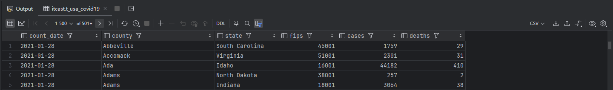
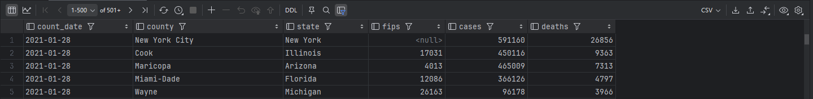
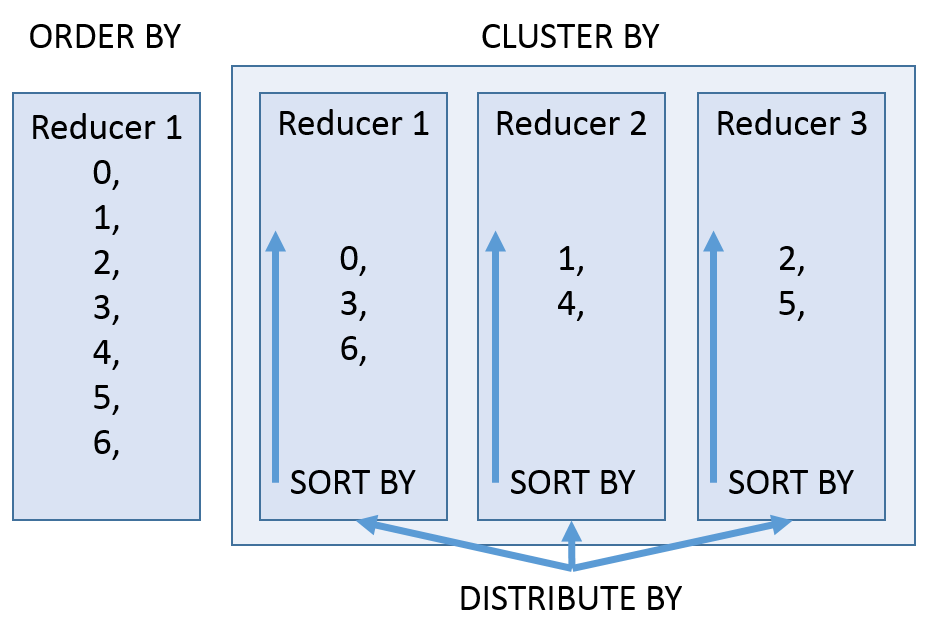

<nav>
<a href="#一select基础查询">一、Select基础查询</a><br/>
&nbsp;&nbsp;&nbsp;&nbsp;<a href="#11-概述">1.1 概述</a><br/>
&nbsp;&nbsp;&nbsp;&nbsp;&nbsp;&nbsp;&nbsp;&nbsp;<a href="#111-语法树">1.1.1 语法树</a><br/>
&nbsp;&nbsp;&nbsp;&nbsp;&nbsp;&nbsp;&nbsp;&nbsp;<a href="#112-案例美国covid-19新冠">1.1.2 案例：美国Covid-19新冠</a><br/>
&nbsp;&nbsp;&nbsp;&nbsp;<a href="#12-select_expr">1.2 select_expr</a><br/>
&nbsp;&nbsp;&nbsp;&nbsp;<a href="#13-all-distinct">1.3 ALL 、DISTINCT</a><br/>
&nbsp;&nbsp;&nbsp;&nbsp;<a href="#14-where">1.4 WHERE</a><br/>
&nbsp;&nbsp;&nbsp;&nbsp;<a href="#15-分区查询分区裁剪">1.5 分区查询、分区裁剪</a><br/>
&nbsp;&nbsp;&nbsp;&nbsp;<a href="#16-group-by">1.6 GROUP BY</a><br/>
&nbsp;&nbsp;&nbsp;&nbsp;<a href="#17-having">1.7 HAVING</a><br/>
&nbsp;&nbsp;&nbsp;&nbsp;<a href="#18-limit">1.8 LIMIT</a><br/>
<a href="#二select高阶查询">二、Select高阶查询</a><br/>
&nbsp;&nbsp;&nbsp;&nbsp;<a href="#21-order-bycluster-bydistribute-by-sort-by">2.1 ORDER BY、CLUSTER BY、DISTRIBUTE BY + SORT BY</a><br/>
&nbsp;&nbsp;&nbsp;&nbsp;&nbsp;&nbsp;&nbsp;&nbsp;<a href="#211-order-by">2.1.1 ORDER BY</a><br/>
&nbsp;&nbsp;&nbsp;&nbsp;&nbsp;&nbsp;&nbsp;&nbsp;<a href="#212-cluster-by">2.1.2 CLUSTER BY</a><br/>
&nbsp;&nbsp;&nbsp;&nbsp;&nbsp;&nbsp;&nbsp;&nbsp;<a href="#213-distribute-by-sort-by">2.1.3 DISTRIBUTE BY + SORT BY</a><br/>
&nbsp;&nbsp;&nbsp;&nbsp;&nbsp;&nbsp;&nbsp;&nbsp;<a href="#214-总结">2.1.4 总结</a><br/>
&nbsp;&nbsp;&nbsp;&nbsp;<a href="#22-union联合查询">2.2 Union联合查询</a><br/>
&nbsp;&nbsp;&nbsp;&nbsp;<a href="#23-subqueries子查询">2.3 Subqueries子查询</a><br/>
&nbsp;&nbsp;&nbsp;&nbsp;&nbsp;&nbsp;&nbsp;&nbsp;<a href="#231-from子句中子查询">2.3.1 ` from子句中子查询</a><br/>
&nbsp;&nbsp;&nbsp;&nbsp;&nbsp;&nbsp;&nbsp;&nbsp;<a href="#232-where子句中子查询">2.3.2 where子句中子查询</a><br/>
&nbsp;&nbsp;&nbsp;&nbsp;<a href="#24-ctecommon-table-expression">2.4 CTE(Common Table Expression)</a><br/>
&nbsp;&nbsp;&nbsp;&nbsp;&nbsp;&nbsp;&nbsp;&nbsp;<a href="#241-cte介绍">2.4.1 CTE介绍</a><br/>
&nbsp;&nbsp;&nbsp;&nbsp;&nbsp;&nbsp;&nbsp;&nbsp;<a href="#241-cte案例">2.4.1 CTE案例</a><br/>
<a href="#三join连接查询">三、Join连接查询</a><br/>
&nbsp;&nbsp;&nbsp;&nbsp;<a href="#31-join连接概述">3.1 Join连接概述</a><br/>
&nbsp;&nbsp;&nbsp;&nbsp;<a href="#32-案例数据准备">3.2 案例数据准备</a><br/>
&nbsp;&nbsp;&nbsp;&nbsp;<a href="#33-hive-inner-join">3.3 Hive inner join</a><br/>
&nbsp;&nbsp;&nbsp;&nbsp;<a href="#34-hive-left-join">3.4 Hive left join</a><br/>
&nbsp;&nbsp;&nbsp;&nbsp;<a href="#35-hive-right-join">3.5 Hive right join</a><br/>
&nbsp;&nbsp;&nbsp;&nbsp;<a href="#36-hive-full-outer-join">3.6 Hive full outer join</a><br/>
&nbsp;&nbsp;&nbsp;&nbsp;<a href="#37-hive-left-semi-join">3.7 Hive left semi join</a><br/>
&nbsp;&nbsp;&nbsp;&nbsp;<a href="#38-hive-cross-join">3.8 Hive cross join</a><br/>
&nbsp;&nbsp;&nbsp;&nbsp;<a href="#39-hive-join使用注意事项">3.9 Hive join使用注意事项</a><br/>
<a href="#参考引用">参考引用</a><br/>
</nav>

## 一、Select基础查询
### 1.1 概述
#### 1.1.1 语法树
```sql
[WITH CommonTableExpression (, CommonTableExpression)*] 
SELECT [ALL | DISTINCT] select_expr, select_expr, ...
  FROM table_reference
  [WHERE where_condition]
  [GROUP BY col_list]
  [ORDER BY col_list]
  [CLUSTER BY col_list
    | [DISTRIBUTE BY col_list] [SORT BY col_list]
  ]
 [LIMIT [offset,] rows]
```
（1）`table_reference`：查询的输入，可以是普通物理表、视图、join查询结果或子查询结果。<br>
（2）`表名`和`列名`不区分大小写。<br>

#### 1.1.2 案例：美国Covid-19新冠
《us-covid19-counties.dat》记录了2021-01-28美国各个县累计新冠确诊病例数和累计死亡病例数。 在Hive中创建表，并加载该文件到表中：
```sql
-- 创建普通表t_usa_covid19
drop table t_usa_covid19;
CREATE TABLE t_usa_covid19
(
    count_date string,
    county     string,
    state      string,
    fips       int,
    cases      int,
    deaths     int
)
row format delimited
    fields terminated by ",";

-- 创建一张分区表 基于count_date日期,state州进行分区
CREATE TABLE t_usa_covid19_p
(
    county string,
    fips   int,
    cases  int,
    deaths int
)
partitioned by (count_date string, state string)
row format delimited
    fields terminated by ",";

-- 将源数据load加载到t_usa_covid19表对应的路径下
load data local inpath '/home/hive/us-covid19-counties.dat' into table t_usa_covid19;

-- 使用动态分区插入将数据导入t_usa_covid19_p中
set hive.exec.dynamic.partition.mode = nonstrict;
insert into table t_usa_covid19_p partition (count_date, state)
select county,fips,cases,deaths,count_date,state from t_usa_covid19;
```

### 1.2 select_expr
每个`select_expr`表示要检索的列。必须至少有一个 select_expr。
```sql
--查询所有字段或者指定字段
select * from t_usa_covid19_p;
select county, cases, deaths from t_usa_covid19_p;

--查询匹配正则表达式的所有字段
SET hive.support.quoted.identifiers = none; --带反引号的名称被解释为正则表达式
select `^c.*` from t_usa_covid19_p;

--查询当前数据库
select current_database(); --省去from关键字

--查询使用函数 3245
select count(county) from t_usa_covid19_p;
```

### 1.3 ALL 、DISTINCT
`ALL`和`DISTINCT`选项指定是否应返回重复的行。如果没有给出这些选项，则默认值为ALL（返回所有匹配的行）。DISTINCT指定从结果集中删除重复的行。
```sql
--返回所有匹配的行
select state from t_usa_covid19_p;
--相当于
select all state from t_usa_covid19_p;

--返回所有匹配的行 去除重复的结果
select distinct state from t_usa_covid19_p;

--多个字段distinct 整体去重
select distinct county,state from t_usa_covid19_p;
```

### 1.4 WHERE
`WHERE条件`是一个布尔表达式。在WHERE表达式中，可以使用Hive支持的任何函数和运算符，但`聚合函数除外`。
从Hive 0.13开始，WHERE子句支持某些类型的子查询。
```sql
select * from t_usa_covid19_p where state ="California" and deaths > 1000;
select * from t_usa_covid19_p where 1 > 2;  -- 1 > 2 返回false
select * from t_usa_covid19_p where 1 = 1;  -- 1 = 1 返回true

--where条件中使用函数 找出州名字母超过10个
select * from t_usa_covid19_p where length(state) >10 ;

--WHERE子句支持子查询
SELECT *
FROM t_usa_covid19_p
WHERE state IN (
    -- 一般是其他的表
    SELECT state FROM t_usa_covid19_p WHERE length(state) >10
);

--where条件中不能使用聚合函数
--报错 SemanticException:Not yet supported place for UDAF 'sum'
SELECT state, sum(deaths)
FROM t_usa_covid19_p
WHERE sum(deaths) >100 GROUP BY state;
```
> `那么为什么不能在where子句中使用聚合函数呢？`<br>
因为聚合函数要使用它的前提是结果集已经确定，而where子句还处于“确定”结果集的过程中，因而不能使用聚合函数。

### 1.5 分区查询、分区裁剪
通常，SELECT查询会执行全表扫描。如果使用`PARTITIONED BY`子句创建分区表时，可以通过指定分区查询来减少全表扫描，这个过程称为分区裁剪。
`分区裁剪`是指在对分区表进行查询时，系统会检查`WHERE`子句或`JOIN`中的`ON`子句是否对分区字段进行了过滤。如果存在这些过滤条件，查询将只访问符合条件的分区，从而裁剪掉不必要访问的分区，提高查询效率。
```sql
--找出来自加州，累计死亡人数大于1000的县 state字段就是分区字段 进行分区裁剪 避免全表扫描
select * from t_usa_covid19_p where state ="California" and deaths > 1000;

--多分区裁剪
select * from t_usa_covid19_p where count_date = "2021-01-28" and state ="California" and deaths > 1000;
```

### 1.6 GROUP BY
`GROUP BY` 语句用于结合聚合函数，根据一个或多个列对结果集进行分组。<br>
注意：出现在GROUP BY中`select_expr`的字段：要么是GROUP BY分组的字段；要么是被聚合函数应用的字段。`避免出现一个字段多个值的歧义`。
```sql
--根据state州进行分组
--SemanticException:Expression not in GROUP BY key 'deaths'
--deaths不是分组字段 报错，state是分组字段 可以直接出现在select_expr中
select state,deaths
from t_usa_covid19_p where count_date = "2021-01-28" group by state;

--被聚合函数应用
select state,count(deaths)
from t_usa_covid19_p where count_date = "2021-01-28" group by state;
```

### 1.7 HAVING
在SQL中增加`HAVING`子句原因是，`WHERE关键字无法与聚合函数一起使用`。
HAVING子句可以让我们筛选分组后的各组数据,并且可以在Having中使用聚合函数，因为此时where、group by已经执行结束，结果集已经确定。
```sql
--统计死亡病例数大于10000的州
--where语句中不能使用聚合函数 语法报错
select state, sum(deaths)
from t_usa_covid19_p
where count_date = "2021-01-28" and sum(deaths) >10000 group by state;

--先where分组前过滤（此处是分区裁剪），再进行group by分组（含聚合）， 分组后每个分组结果集确定，再使用having过滤
select state, sum(deaths) AS cnts
from t_usa_covid19_p
where count_date = "2021-01-28"
group by state
having sum(deaths) > 10000;

--这样写更好 即在group by的时候聚合函数已经作用得出结果 having直接引用结果过滤 不需要再单独计算一次了
select state,sum(deaths) as cnts
from t_usa_covid19_p
where count_date = "2021-01-28"
group by state
having cnts > 10000;
```
`having与where的区别`:
+ having是在`分组后`对数据进行过滤
+ where是在`分组前`对数据进行过滤
+ having后面可以使用聚合函数
+ where后面不可以使用聚合

### 1.8 LIMIT
LIMIT子句可用于约束SELECT语句返回的行数。<br>
LIMIT接受一个或两个数字参数，这两个参数都必须是`非负整数常量`。
+ 第一个参数指定要返回的第一行的偏移量，第二个参数指定要返回的最大行数。
+ 当给出单个参数时，它代表最大行数，并且偏移量默认为0。
```sql
--返回结果集的前5条
select *
from t_usa_covid19_p
where count_date = "2021-01-28" and state ="California"
limit 5;

--返回结果集从第1行开始 共3行
select *
from t_usa_covid19_p
where count_date = "2021-01-28" and state ="California"
limit 2,3; --注意 第一个参数偏移量是从0开始的: => 返回第3-5条
```

## 二、Select高阶查询

### 2.1 ORDER BY、CLUSTER BY、DISTRIBUTE BY + SORT BY

#### 2.1.1 ORDER BY
Hive SQL中的`ORDER BY`语法类似于SQL语言中的ORDER BY语法。会对输出的结果进行`全局排序`，因此底层使用MapReduce引擎执行的时候，只会有一个ReduceTask执行。
也因此，如果输出的行数太大，会导致需要很长的时间才能完成全局排序。
`默认排序顺序为升序`（ASC），也可以指定为DESC降序。

```sql
--根据字段进行排序
--强烈建议将LIMIT与ORDER BY一起使用，避免数据集行数过大。
--当hive.mapred.mode设置为strict严格模式时，使用不带LIMIT的ORDER BY时会引发异常。
select *
from t_usa_covid19_p
where count_date = "2021-01-28" and state ="California"
order by deaths
limit 100; --默认asc null first

select *
from t_usa_covid19_p
where count_date = "2021-01-28" and state ="California"
order by deaths desc
limit 100; --指定desc null last
```

#### 2.1.2 CLUSTER BY
Hive SQL中的`CLUSTER BY`语法可以指定根据后面的字段将数据分组，每组内再根据某个字段正序排序（不允许指定排序规则），即根据同一个字段，分且排序。
```sql
--不指定reduce task个数
--日志显示：Number of reduce tasks not specified. Estimated from input data size: 1
select * from t_usa_covid19 cluster by county;

--手动设置reduce task个数
set mapreduce.job.reduces = 2;
select * from t_usa_covid19 cluster by county;
```
<br>

默认情况下，ReduceTask的个数由Hive在编译期间自己决定。<br>

#### 2.1.3 DISTRIBUTE BY + SORT BY
CLUSTER BY的功能是分且排序（同一个字段），那么`DISTRIBUTE BY` + `SORT BY`就相当于把cluster by的功能一分为二：
+ DISTRIBUTE BY负责分
+ SORT BY负责分组内排序，并且可以是不同的字段。
+ 如果DISTRIBUTE BY + SORT BY的字段一样，可以得出下列结论： CLUSTER BY = DISTRIBUTE BY + SORT BY（字段一样）
```sql
--根据区分为两个部分，每个分组内根据死亡数的倒序排序。
select * from t_usa_covid19 distribute by county sort by deaths desc;

--下面两个语句执行结果一样
select * from t_usa_covid19 distribute by county sort by county;
select * from t_usa_covid19 cluster by county;
```
<br>

#### 2.1.4 总结
1、`order by`会对输入做全局排序，因此只有一个reducer，会导致当输入规模较大时，需要较长的计算时间。<br>
2、`Cluster by`(字段) 除了具有Distribute by的功能外，还会对该字段进行排序。<br>
3、`distribute by`(字段)根据指定字段将数据分到不同的reducer，分发算法是hash散列。<br>
4、`sort by`不是全局排序，其在数据进入reducer前完成排序。<br>
+ 如果用sort by进行排序，并且设置mapred.reduce.tasks>1，则`sort by只保证每个reducer的输出有序，不保证全局有序`。
+ 如果distribute和sort的字段是同一个时，此时，`cluster by = distribute by + sort by`

<br>

### 2.2 Union联合查询
`UNION`用于将来自多个SELECT语句的结果合并为一个结果集。语法如下：
```sql
select_statement UNION [ALL | DISTINCT] select_statement UNION [ALL | DISTINCT] select_statement ...
```
（1）使用`DISTINCT`关键字与只使用`UNION`默认值效果一样，**都会删除重复行**。<br>
（2）使用`ALL`关键字，不会删除重复行，结果集包括所有SELECT语句的匹配行（包括重复行）。<br>
（3）每个select_statement返回的`列的数量和名称必须相同`。<br>
```sql
--使用DISTINCT关键字与使用UNION默认值效果一样，都会删除重复行。
select count_date, state  from t_usa_covid19_p
UNION -- DISTINCT
select count_date, state from t_usa_covid19_p;

--使用ALL关键字会保留重复行。
select count_date, state  from t_usa_covid19_p
UNION ALL
select count_date, state from t_usa_covid19_p;

--如果要将ORDER BY，SORT BY，CLUSTER BY，DISTRIBUTE BY或LIMIT子句应用于整个UNION结果
--请将ORDER BY，SORT BY，CLUSTER BY，DISTRIBUTE BY或LIMIT放在最后一个之后。
select count_date, state from t_usa_covid19_p
UNION
select count_date, state from t_usa_covid19_p
order by state desc;
```

### 2.3 Subqueries子查询
#### 2.3.1 ` from子句中子查询
在Hive0.12版本，仅在FROM子句中支持子查询，而且必须要给子查询一个名称，因为FROM子句中的每个表都必须有一个名称。<br>
+ 子查询返回结果中的列必须具有唯一的名称。
+ 子查询返回结果中的列在外部查询中可用，就像真实表的列一样。
+ 子查询也可以是带有UNION的查询表达式。
+ Hive支持任意级别的子查询，也就是所谓的嵌套子查询。 
+ Hive 0.13.0和更高版本中的子查询名称之前可以包含可选关键字“`AS`” 。
```sql
--from子句中子查询（Subqueries）
SELECT state
FROM (
    select count_date, state
    from t_usa_covid19_p
) tmp;

--包含UNION ALL的子查询的示例
SELECT t3.state
FROM (
    select state from t_usa_covid19_p
    UNION distinct
    select state from t_usa_covid19_p
) t3;
```

#### 2.3.2 where子句中子查询
从Hive 0.13开始，`WHERE`子句支持某些类型的子查询。
```sql
--不相关子查询，相当于IN、NOT IN,子查询只能选择一个列。
--（1）执行子查询，其结果不被显示，而是传递给外部查询，作为外部查询的条件使用。
--（2）执行外部查询，并显示整个结果。　　
SELECT *
FROM t_usa_covid19
WHERE t_usa_covid19.state IN (select state from t_usa_covid19_p limit 2);

--相关子查询，指EXISTS和NOT EXISTS子查询
--子查询的WHERE子句中支持对父查询的引用
SELECT *
FROM t_usa_covid19 T1
WHERE EXISTS (SELECT state FROM t_usa_covid19_p T2 WHERE T1.state = T2.state);
```

### 2.4 CTE(Common Table Expression)

#### 2.4.1 CTE介绍
公共表表达式 (CTE) 是从 `WITH` 子句中指定的简单查询派生的临时结果集，它紧跟在 SELECT 或 INSERT 关键字之前。
CTE 仅在单个语句的执行范围内定义。
在 Hive SELECT、INSERT、 CREATE TABLE AS SELECT或CREATE VIEW AS SELECT语句中可以使用一个或多个 CTE 。

+ **作用**<br>
相当于视图，定义了一个SQL片段，每次使用时候可以将该定义的SQL片段拿出来再被使用，该SQL片段可以理解为一个变量，主要用途简化SQL，让SQL更简洁，替换子查询，方便定位问题。

+ **语法**<br>
` WITH temp_name AS (select statement)`

+ **规则**<br>
1) 子查询块中不支持 WITH 子句；<br>
2) 视图、CTAS(Create Table As Select)和 INSERT 语句支持 CTE；<br>
3) 不支持递归查询。<br>


默认情况下，如果使用CTE后被多次使用，则CTE子句就会被执行多次，若需要用HIVE CTE进行优化，则需要通过参数调优，即：
```sql
SET hive.optimize.cte.materialize.threshold = 2;
```
该参数默认值为：-1，表示不开启物化，当开启（大于等于0），比如设置为2，表示如果WITH…AS语句被引用2次及以上时，
会把WITH…AS语句生成的table物化，从而做到WITH…AS语句只执行一次，来提高效率。在默认情况下，可以通过explain来查看执行计划。
```sql
SET hive.optimize.cte.materialize.threshold = 2
;
WITH t0 AS (SELECT rand() AS c0),
     t1 AS (SELECT c0, rand() AS c FROM t0),
     t2 AS (SELECT c0, rand() AS c FROM t0)
SELECT * FROM t1   -- c0=0.5134221478450147
union all
SELECT * FROM t2   -- c0=0.5134221478450147
;
```

#### 2.4.1 CTE案例
```sql
--选择语句中的CTE
with q1 as (
    select * from t_usa_covid19_p where state = 'Arizona'
)
select * from q1;

-- from风格
with q1 as (
    select * from t_usa_covid19_p where state = 'Arizona'
)
from q1
select *;

-- chaining CTEs 链式
with q1 as ( select * from t_usa_covid19_p where state = 'Arizona'),
     q2 as ( select county,state,deaths,count_date from q1)
select * from q2;

-- union案例
with q1 as (select * from t_usa_covid19_p where state = 'Arizona'),
     q2 as (select * from t_usa_covid19_p where state = 'Alabama')
select * from q1 union all select * from q2;

--视图，CTAS和插入语句中的CTE
-- insert
create table s1 like t_usa_covid19_p;
with q1 as (
    select * from t_usa_covid19_p where state = 'Arizona'
)
from q1
insert overwrite table s1 select *;
select * from s1;

-- ctas
create table s2 as
with q1 as (
    select * from t_usa_covid19_p where state = 'Arizona'
)
select * from q1;
select * from s2;

-- view
create view v1 as
with q1 as (
    select * from t_usa_covid19_p where state = 'Arizona'
)
select * from q1;
select * from v1;
```

## 三、Join连接查询
### 3.1 Join连接概述
在Hive中，`JOIN` 语法用于在查询中根据两个或多个表之间的关系连接这些表，以获取完整的数据集。与关系型数据库管理系统（RDBMS）中的 JOIN 语法相似，Hive 也支持多种 JOIN 类型，常见的有：`inner join`（内连接）、`left join`（左连接）、`right join`（右连接）、`full outer join`（全外连接）、`left semi join`（左半开连接）、`cross join`（交叉连接，也叫做笛卡尔乘积）。语法规则如下：
```sql
join_table:
table_reference [INNER] JOIN table_factor [join_condition]
| table_reference {LEFT|RIGHT|FULL} [OUTER] JOIN table_reference join_condition
| table_reference LEFT SEMI JOIN table_reference join_condition
| table_reference CROSS JOIN table_reference [join_condition] (as of Hive 0.10)

table_reference:
table_factor
| join_table

table_factor:
tbl_name [alias]
| table_subquery alias
| ( table_references )

join_condition:
ON expression
```
（1）`table_reference`：是join查询中使用的表名，也可以是子查询别名（查询结果当成表参与join）。<br>
（2）`table_factor`：与table_reference相同,是联接查询中使用的表名,也可以是子查询别名。<br>
（3）`join_condition`：join查询关联的条件， 如果在两个以上的表上需要连接，则使用AND关键字。<br>

Hive 0.13.0开始，支持隐式联接表示法（请参阅HIVE-5558）。这允许`FROM子句连接以逗号分隔的表列表，而省略JOIN关键字`。例如：
```sql
SELECT *
FROM table1 t1, table2 t2, table3 t3
WHERE t1.id = t2.id AND t2.id = t3.id AND t1.zipcode = '02535';
```
从Hive 2.2.0开始，支持ON子句中的复杂表达式，支持不相等连接（请参阅HIVE-15211和HIVE-15251）。在此之前，Hive不支持不是相等条件的联接条件。
```sql
SELECT a.* FROM a JOIN b ON (a.id = b.id)
SELECT a.* FROM a JOIN b ON (a.id = b.id AND a.department = b.department)
SELECT a.* FROM a LEFT OUTER JOIN b ON (a.id <> b.id)
```

### 3.2 案例数据准备
表1：employee 员工表；
表2：employee_address 员工住址信息表；
表3：employee_connection 员工联系方式表；
```sql
--table1: 员工表
CREATE TABLE employee(
    id     int,
    name   string,
    deg    string,
    salary int,
    dept   string
)
row format delimited
    fields terminated by ',';

--table2:员工住址信息表
CREATE TABLE employee_address(
    id     int,
    hno    string,
    street string,
    city   string
)
row format delimited
    fields terminated by ',';

--table3:员工联系方式表
CREATE TABLE employee_connection (
    id    int,
    phno  string,
    email string
)
row format delimited
    fields terminated by ',';

--加载数据到表中
load data local inpath '/home/hive/hive_join/employee.txt' into table employee;
load data local inpath '/home/hive/hive_join/employee_address.txt' into table employee_address;
load data local inpath '/home/hive/hive_join/employee_connection.txt' into table employee_connection;
```

### 3.3 Hive inner join
内连接是最常见的一种连接，它也被称为普通连接，而关系模型提出者E.FCodd（埃德加•科德）最早称之为自然连接。其中inner可以省略。`inner join <=> join` 等价于早期的连接语法。
内连接，`只有进行连接的两个表中都存在与连接条件相匹配的数据才会被留下来`。

```sql
select e.id,e.name,e_a.city,e_a.street
from employee e
inner join employee_address e_a on e.id =e_a.id;

--等价于 inner join=join
select e.id,e.name,e_a.city,e_a.street
from employee e
join employee_address e_a on e.id =e_a.id;

--等价于 隐式连接表示法
select e.id,e.name,e_a.city,e_a.street
from employee e, employee_address e_a
where e.id =e_a.id;
```

### 3.4 Hive left join

left join中文叫做是`左外连接`(Left Outer Jion)或者左连接，其中outer可以省略，left outer join是早期的写法。
左指的是join关键字左边的表，简称左表。<br>
通俗解释：`join时以左表的全部数据为准，右边与之关联；左表数据全部返回，右表关联上的显示返回，关联不上的显示null返回。`
```sql
select e.id,e.name,e_conn.phno,e_conn.email
from employee e
left join employee_connection e_conn on e.id =e_conn.id;

--等价于 left outer join
select e.id,e.name,e_conn.phno,e_conn.email
from employee e
left outer join  employee_connection e_conn on e.id =e_conn.id;
```

### 3.5 Hive right join
right join中文叫做是`右外连接`(Right Outer Jion)或者右连接，其中outer可以省略。
right join的核心在于Right右，右指的是join关键字右边的表，简称右表。<br>
通俗解释：join时以右表的全部数据为准，左边与之关联；右表数据全部返回，左表关联上的显示返回，关联不上的显示null返回。

```sql
select e.id,e.name,e_conn.phno,e_conn.email
from employee e
right join employee_connection e_conn on e.id =e_conn.id;

--等价于 right outer join
select e.id,e.name,e_conn.phno,e_conn.email
from employee e 
right outer join employee_connection e_conn on e.id =e_conn.id;
```

### 3.6 Hive full outer join
full outer join 等价 full join  ,中文叫做`全外连接`或者外连接。
包含左、右两个表的全部行，不管另外一边的表中是否存在与它们匹配的行。<br>
在功能上，它等价于对这两个数据集合分别进行左外连接和右外连接，然后再使用消去重复行的操作将上述两个结果集合并为一个结果集。

```sql
select e.id,e.name,e_a.city,e_a.street
from employee e
full outer join employee_address e_a on e.id =e_a.id;

--等价于
select e.id,e.name,e_a.city,e_a.street
from employee e
full join employee_address e_a on e.id =e_a.id;
```

### 3.7 Hive left semi join
`左半开连接`（LEFT SEMI JOIN）是一种特殊的连接操作，它与普通的 LEFT JOIN 类似，但`只返回左表中满足连接条件的行`，不返回右表的列，在实现上更接近于 `IN 子查询`，而不是传统的连接。
```sql
select *
from employee e
left semi join employee_address e_addr on e.id =e_addr.id;

-- 等价于 In 子查询
select *
from employee e
where  e.id in (select `id` from employee_address);
```

### 3.8 Hive cross join

`交叉连接`（cross join），将会返回被连接的两个表的笛卡尔积，返回结果的行数等于两个表行数的乘积。
```sql
--下列A、B、C 执行结果相同，但是效率不一样：
select a.*,b.* from employee a, employee_address b where a.id=b.id;
--B:
select * from employee a cross join employee_address b on a.id=b.id;
select * from employee a cross join employee_address b where a.id=b.id;

--C:
select * from employee a inner join employee_address b on a.id=b.id;
```
一般不建议使用方法A和B，因为如果有WHERE子句的话，往往会先进行笛卡尔积返回数据然后才根据WHERE条件从中选择。 因此，如果两个表太大，将会非常非常慢，不建议使用。


### 3.9 Hive join使用注意事项
总体来说，随着Hive的版本发展，join语法的功能也愈加丰富。有以下几点需要注意：
a) 允许使用复杂的联接表达式
```sql
SELECT a.* FROM a JOIN b ON (a.id = b.id);
SELECT a.* FROM a JOIN b ON (a.id = b.id AND a.department = b.department);
SELECT a.* FROM a LEFT OUTER JOIN b ON (a.id <> b.id);
```

b) 同一查询中可以连接2个以上的表
```sql
SELECT a.val, b.val, c.val
FROM a
JOIN b ON (a.key = b.key1)
JOIN c ON (c.key = b.key2);
```

c) 如果每个表在联接子句中使用相同的列，则Hive将多个表上的联接转换为单个MR作业
```sql
--由于联接中仅涉及b的key1列，因此被转换为1个MR作业来执行
SELECT a.val, b.val, c.val
FROM a
JOIN b ON (a.key = b.key1)
JOIN c ON (c.key = b.key1);

--会转换为两个MR作业，因为在第一个连接条件中使用了b中的key1列，而在第二个连接条件中使用了b中的key2列。
--第一个map / reduce作业将a与b联接在一起，然后将结果与c联接到第二个map / reduce作业中。
SELECT a.val, b.val, c.val
FROM a
JOIN b ON (a.key = b.key1)
JOIN c ON (c.key = b.key2);
```

d) join时的最后一个表会通过reducer流式传输，并在其中缓冲之前的其他表，因此，`将大表放置在最后有助于减少reducer阶段缓存数据所需要的内存`。
```sql
--由于联接中仅涉及b的key1列，因此被转换为1个MR作业来执行，并且表a和b的键的特定值的值被缓冲在reducer的内存中。
--对于从c中检索的每一行，将使用缓冲的行来计算联接。
SELECT a.val, b.val, c.val
FROM a
JOIN b ON (a.key = b.key1)
JOIN c ON (c.key = b.key1)

--计算涉及两个MR作业。其中的第一个将a与b连接起来，并缓冲a的值，同时在reducer中流式传输b的值。
--在第二个MR作业中，将缓冲第一个连接的结果，同时将c的值通过reducer流式传输。
SELECT a.val, b.val, c.val
FROM a
JOIN b ON (a.key = b.key1)
JOIN c ON (c.key = b.key2)
```

e) 在join的时候，可以通过语法`STREAMTABLE提示指定要流式传输的表`。如果省略STREAMTABLE提示，则Hive将流式传输最右边的表。
```sql
--a,b,c三个表都在一个MR作业中联接，并且表b和c的键的特定值的值被缓冲在reducer的内存中。
--然后，对于从a中检索到的每一行，将使用缓冲的行来计算联接。如果省略STREAMTABLE提示，则Hive将流式传输最右边的表。
SELECT /*+ STREAMTABLE(a) */ a.val, b.val, c.val
FROM a
JOIN b ON (a.key = b.key1)
JOIN c ON (c.key = b.key1)
```

f) `join在WHERE条件之前进行`。<br>
g) 如果除一个要连接的表之外的所有表都很小，则可以将其作为仅map作业执行
```sql
--不需要reducer。对于A的每个Mapper，B都会被完全读取。限制是不能执行FULL / RIGHT OUTER JOIN b。
SELECT /*+ MAPJOIN(b) */ a.key, a.value
FROM a
JOIN b ON a.key = b.key
```

## 参考引用
[1] [黑马程序员-Apache Hive 3.0](https://book.itheima.net/course/1269935677353533441/1269937996044476418/1269942232408956930) <br>
[2] [Apache Hive - LanguageManual Select](https://cwiki.apache.org/confluence/display/Hive/LanguageManual+Select) <br>
[3] [Hive SQL 语句的执行顺序](https://gairuo.com/p/hive-sql-execution-order) <br>
[4] [Apache Hive -LanguageManual+Joins](https://cwiki.apache.org/confluence/display/Hive/LanguageManual+Joins) <br>
