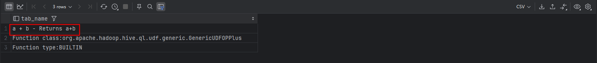

<nav>
<a href="#一hive内置运算符">一、Hive内置运算符</a><br/>
&nbsp;&nbsp;&nbsp;&nbsp;<a href="#11-关系运算符">1.1 关系运算符</a><br/>
&nbsp;&nbsp;&nbsp;&nbsp;<a href="#12-算术运算符">1.2 算术运算符</a><br/>
&nbsp;&nbsp;&nbsp;&nbsp;<a href="#13-逻辑运算符">1.3 逻辑运算符</a><br/>
&nbsp;&nbsp;&nbsp;&nbsp;<a href="#14-复杂数据类型运算符">1.4 复杂数据类型运算符</a><br/>
<a href="#二hive函数">二、Hive函数</a><br/>
&nbsp;&nbsp;&nbsp;&nbsp;<a href="#21-概述">2.1 概述</a><br/>
&nbsp;&nbsp;&nbsp;&nbsp;<a href="#22-内置函数">2.2 内置函数</a><br/>
&nbsp;&nbsp;&nbsp;&nbsp;&nbsp;&nbsp;&nbsp;&nbsp;<a href="#221-字符串类型函数string-functions">2.2.1 字符串类型函数（String Functions）</a><br/>
&nbsp;&nbsp;&nbsp;&nbsp;&nbsp;&nbsp;&nbsp;&nbsp;<a href="#222-日期函数date-functions">2.2.2 日期函数（Date Functions）</a><br/>
&nbsp;&nbsp;&nbsp;&nbsp;&nbsp;&nbsp;&nbsp;&nbsp;<a href="#223-数学函数mathematical-functions">2.2.3 数学函数（Mathematical Functions）</a><br/>
&nbsp;&nbsp;&nbsp;&nbsp;&nbsp;&nbsp;&nbsp;&nbsp;<a href="#224-集合函数collection-functions">2.2.4 集合函数（Collection Functions）</a><br/>
&nbsp;&nbsp;&nbsp;&nbsp;&nbsp;&nbsp;&nbsp;&nbsp;<a href="#225-条件函数conditional-functions">2.2.5 条件函数（Conditional Functions）</a><br/>
&nbsp;&nbsp;&nbsp;&nbsp;&nbsp;&nbsp;&nbsp;&nbsp;<a href="#226-类型转换函数type-conversion-functions">2.2.6 类型转换函数（Type Conversion Functions）</a><br/>
&nbsp;&nbsp;&nbsp;&nbsp;&nbsp;&nbsp;&nbsp;&nbsp;<a href="#227-数据脱敏函数data-masking-functions">2.2.7 数据脱敏函数（Data Masking Functions）</a><br/>
&nbsp;&nbsp;&nbsp;&nbsp;&nbsp;&nbsp;&nbsp;&nbsp;<a href="#228-其他杂项函数misc-functions">2.2.8 其他杂项函数（Misc. Functions）</a><br/>
<a href="#参考引用">参考引用</a><br/>
</nav>

## 一、Hive内置运算符
随着Hive版本的不断发展，在Hive SQL中支持的、内置的运算符也越来越多。可以使用下面的命令查看当下支持的运算符和函数，并且查看其详细的使用方式。
```sql
--显示所有的函数和运算符
show functions;
--查看运算符或者函数的使用说明
describe function +;
--使用extended 可以查看更加详细的使用说明
describe function extended +;
```
<br>

从Hive 0.13.0开始，select查询语句FROM关键字是可选的（例如SELECT 1+1）。因此可以使用这种方式来练习测试内置的运算符、函数的功能。
除此之外，还可以通过创建一张虚表dual来满足于测试需求。
```sql
--1、创建表dual
create table dual(id string);
--2、加载一个文件dual.txt到dual表中（dual.txt只有一行内容：内容为一个空格）
-- echo " " > dual.txt
-- $HADOOP_HOME/bin/hdfs dfs -put -f /home/hive/dual.txt /user/hive/warehouse/itcast.db/dual
--3、在select查询语句中使用dual表完成运算符、函数功能测试
select 1+1 from dual;
```

### 1.1 关系运算符
关系运算符是二元运算符，执行的是两个操作数的比较运算。每个关系运算符都返回`boolean类型`结果（TRUE或FALSE）。
+ 等值比较: = 、==
+ 不等值比较: <> 、!=
+ 小于比较: <
+ 小于等于比较: <=
+ 大于比较: >
+ 大于等于比较: >=
+ 空值判断: `IS NULL`
+ 非空判断: `IS NOT NULL`
+ LIKE比较: `LIKE`
+ JAVA的LIKE操作: `RLIKE`
+ REGEXP操作: REGEXP
```sql
--空值判断
select 'itcast' is null;            -- false
select 'itcast' is not null;        -- true

--like比较： _表示任意单个字符 %表示任意数量字符
--否定比较： NOT A like B
select 'itcast' like 'it_';         -- false
select 'itcast' like 'it%';         -- true
select 'itcast' like 'hadoo_';      -- false

--rlike：确定字符串是否匹配正则表达式，是REGEXP_LIKE()的同义词。
select 'itcast' rlike '^i.*t$';     -- true
select '123456' rlike '^\\d+$';     -- true
select '123456aa' rlike '^\\d+$';   -- false

--regexp：功能与rlike相同 用于判断字符串是否匹配正则表达式
select 'itcast' regexp '^i.*t$';    -- true
```

### 1.2 算术运算符
算术运算符操作数必须是`数值类型`。 分为一元运算符和二元运算符; 一元运算符,只有一个操作数; 二元运算符有两个操作数,运算符在两个操作数之间。
+ 加法操作: +
+ 减法操作: -
+ 乘法操作: *
+ 除法操作: /
+ 取整操作: `div`
+ 取余操作: `%`
+ 位与操作: `&`
+ 位或操作: `|`
+ 位异或操作: `^`
+ 位取反操作: ~
```sql
--取整操作: div  给出将A除以B所得的整数部分。例如17 div 3得出5。
select 17 div 3;    -- 5

--取余操作: %  也叫做取模  A除以B所得的余数部分
select 17 % 3;  -- 5

--位与操作: &  A和B按位进行与操作的结果。 与表示两个都为1则结果为1
select 4 & 8;  -- 4转换二进制：0100、8转换二进制：1000 => 0
select 6 & 4;  -- 4转换二进制：0100、6转换二进制：0110 => 4

--位或操作: |  A和B按位进行或操作的结果  或表示有一个为1则结果为1
select 4 | 8;  -- 4转换二进制：0100、8转换二进制：1000 => 12
select 6 | 4;  -- 4转换二进制：0100、6转换二进制：0110 => 6

--位异或操作: ^ A和B按位进行异或操作的结果 异或表示两个不同则结果为1
select 4 ^ 8;  -- 4转换二进制：0100、8转换二进制：1000 => 12
select 6 ^ 4;  -- 4转换二进制：0100、6转换二进制：0110 => 2
```

### 1.3 逻辑运算符

+ 与操作: A AND B
+ 或操作: A OR B
+ 非操作: NOT A 、!A
+ 在:A IN (val1, val2, ...)
+ 不在:A NOT IN (val1, val2, ...)
+ 逻辑是否存在: [NOT] EXISTS (subquery)

```sql
--与操作: A AND B   如果A和B均为TRUE，则为TRUE，否则为FALSE。如果A或B为NULL，则为NULL。
select 3>1 and 2>1; -- true
--或操作: A OR B   如果A或B或两者均为TRUE，则为TRUE，否则为FALSE。
select 3>1 or 2!=2; -- true
--非操作: NOT A 、!A   如果A为FALSE，则为TRUE；如果A为NULL，则为NULL。否则为FALSE。
select not 2>1; -- false
select !2=1;    -- true
--在:A IN (val1, val2, ...)  如果A等于任何值，则为TRUE。
select 1 from dual where 11 in(11,22,33);
--不在:A NOT IN (val1, val2, ...) 如果A不等于任何值，则为TRUE
select 1 from dual where 11 not in(22,33,44);
```

### 1.4 复杂数据类型运算符
以下运算符提供了访问复杂数据类型中元素的机制。

| 运算符        | 描述                             |操作数|
|------------|--------------------------------|-----|
| **A[n]**   | 返回数组 A 中第 n 个元素。第一个元素的索引为 0。   |(val1, val2, ...)|
| **M[key]** | 返回映射 M（Map<K, V>） 中与 key 对应的值。 |(key1, value1, key2, value2, ...)|
| **S.x**    | 返回结构体 S（named_struct） 中的 x 字段。 |(name1, val1, name2, val2, ...)|

```sql
-- 数组
SELECT arr[0] AS A, arr[1] AS B
FROM (
     SELECT split("A;B;C", ";") AS arr
     FROM dual
 ) t;

-- 映射
SELECT `map`['John'] AS A, `map`['Jane'] AS B
FROM (
     SELECT map('John', 'Manager', 'Jane', 'Analyst') AS `map`
     FROM dual
 ) t;

-- 结构体
SELECT ns.location, ns.founded
FROM (
     SELECT
         named_struct('location', 'New York', 'founded', 1999, 'employees', 500) AS ns
     FROM dual
 ) t;
```

## 二、Hive函数

### 2.1 概述
Hive SQL内建了不少函数，用于满足户在不同场合下的数据分析需求，提高开发SQL数据分析的效率。
可以使用`show functions`查看当下版本支持的函数，并且可以通过`describe function extended funcname`来查看函数的使用方式和方法。
```sql
--查看函数的使用说明
describe function year;
--使用extended可以查看更加详细的使用说明
describe function extended year;
```
Hive的函数很多，除了自己内置所支持的函数之外，还支持用户自己定义开发函数。<br>
+ 内置函数根据应用归类整体可以分为以下8大种类型：
  `字符串类型函数`（String Functions）<br>
  `日期类型函数`（Date Functions）<br>
  数学函数（Mathematical Functions）<br>
  集合函数（Collection Functions）<br>
  `条件函数`（Conditional Functions）<br>
  类型转换函数（Type Conversion Functions）<br>
  数值类型函数<br>
  `条件函数`
+ `用户自定义函数`（UDF，user-defined function）根据函数的输入输出行数共分为三类：<br>
  `普通函数`（UDF，User-Defined-Function），一进一出<br>
  `聚合函数`（UDAF，User-Defined Aggregation Function），多进一出<br>
  `表生成函数`（UDTF，User-Defined Table-Generating Functions），一进多出<br>

虽然UDF（用户自定义函数）的命名主要指用户编写的函数，但这种`分类标准实际上可以扩展到所有Hive函数，包括内置函数和自定义函数`。
无论函数的类型如何，只要符合输入输出的要求，就可以根据输入和输出的行数进行分类。因此，不应被“用户自定义”这个标签所限制，例如，Hive官方文档中关于聚合函数的标准就是基于内置的UDAF类型。

### 2.2 内置函数
#### 2.2.1 字符串类型函数（String Functions）
主要针对字符串数据类型进行操作，比如下面这些：
+ 字符串长度函数：length
+ 字符串反转函数：reverse
+ 字符串连接函数：concat
+ 带分隔符字符串连接函数：concat_ws
+ 字符串截取函数：substr,substring
+ 字符串转大写函数：upper,ucase
+ 字符串转小写函数：lower,lcase
+ 去空格函数：trim
+ 左边去空格函数：ltrim
+ 右边去空格函数：rtrim
+ 正则表达式替换函数：regexp_replace
+ 正则表达式解析函数：regexp_extract
+ URL解析函数：parse_url
+ json解析函数：get_json_object
+ 空格字符串函数：space
+ 重复字符串函数：repeat
+ 首字符ascii函数：ascii
+ 左补足函数：lpad
+ 右补足函数：rpad
+ 分割字符串函数: split
+ 集合查找函数: find_in_set

```sql
--字符串长度函数：length(str | binary)
select length("angelababy");

--字符串反转函数：reverse
select reverse("angelababy");

--字符串连接函数：concat(str1, str2, ... strN)
select concat("angela","baby");

--带分隔符字符串连接函数：concat_ws(separator, [string | array(string)]+)
select concat_ws('.', 'www', array('itcast', 'cn'));

--字符串截取函数：substr(str, pos[, len]) 或者  substring(str, pos[, len])
select substr("angelababy",-2);     --pos是从1开始的索引，如果为负数则倒着数：by
select substr("angelababy", 2, 2);  -- ng

--字符串转大写函数：upper,ucase
select upper("angelababy");
select ucase("angelababy");

--字符串转小写函数：lower,lcase
select lower("ANGELABABY");
select lcase("ANGELABABY");

--去空格函数：trim 去除左右两边的空格
select trim(" angelababy ");

--左边去空格函数：ltrim
select ltrim(" angelababy ");

--右边去空格函数：rtrim
select rtrim(" angelababy ");

--正则表达式替换函数：regexp_replace(str, regexp, rep)
select regexp_replace('100-200', '(\\d+)', 'num');

--正则表达式解析函数：regexp_extract(str, regexp[, idx]) 提取正则匹配到的指定组内容
select regexp_extract('100-200', '(\\d+)-(\\d+)', 2);

--URL解析函数：parse_url 注意要想一次解析出多个 可以使用parse_url_tuple这个UDTF函数
select parse_url('http://www.itcast.cn/path/p1.php?query=1', 'HOST');

--json解析函数：get_json_object
--空格字符串函数：space(n) 返回指定个数空格
select space(4);

--重复字符串函数：repeat(str, n) 重复str字符串n次
select repeat("angela",2);

--首字符ascii函数：ascii
select ascii("angela");  --a对应ASCII 97

--左补足函数：lpad
select lpad('hi', 5, '??');  --???hi
select lpad('hi', 1, '??');  --h

--右补足函数：rpad
select rpad('hi', 5, '??');  --hi???
select rpad('hi', 1, '??');  --h

--分割字符串函数: split(str, regex)
select split('apache hive', '\\s+');

--集合查找函数: find_in_set(str,str_array)
select find_in_set('b','abc,b,ab,c,def');
describe function extended find_in_set;
```

#### 2.2.2 日期函数（Date Functions）
主要针对时间、日期数据类型进行操作，比如下面这些：
+ 获取当前日期: current_date
+ 获取当前时间戳: current_timestamp
+ UNIX时间戳转日期函数: from_unixtime
+ 获取当前UNIX时间戳函数: unix_timestamp
+ 日期转UNIX时间戳函数: unix_timestamp
+ 指定格式日期转UNIX时间戳函数: unix_timestamp
+ 抽取日期函数: to_date
+ 日期转年函数: year
+ 日期转月函数: month
+ 日期转天函数: day
+ 日期转小时函数: hour
+ 日期转分钟函数: minute
+ 日期转秒函数: second
+ 日期转周函数: weekofyear
+ 日期比较函数: datediff
+ 日期增加函数: date_add
+ 日期减少函数: date_sub

```sql
--获取当前日期: current_date
select current_date();  -- 2024-09-02

--获取当前时间戳: current_timestamp
--同一查询中对current_timestamp的所有调用均返回相同的值。
select current_timestamp();  -- 2024-09-02 20:44:58.714000000

--时间戳函数
select unix_timestamp();                                        -- 获取当前UNIX时间戳：1725281120
select unix_timestamp("2024-09-02 12:45:20");                   -- 日期转UNIX时间戳：1725281120
select unix_timestamp('20240902 12:45:20','yyyyMMdd HH:mm:ss'); -- 指定格式日期转UNIX时间戳：1725281120

--UNIX时间戳转日期函数: from_unixtime
select from_unixtime(1725281120);                -- 2024-09-02 12:45:20
select from_unixtime(0, 'yyyy-MM-dd HH:mm:ss');  -- 1970-01-01 00:00:00

--抽取日期函数: to_date
select to_date('2009-07-30 04:17:52');

--日期转年、月、日、天、小时、分钟、秒、周:
select year('2009-07-30 04:17:52');
select month('2009-07-30 04:17:52');
select day('2009-07-30 04:17:52');
select hour('2009-07-30 04:17:52');
select minute('2009-07-30 04:17:52');
select second('2009-07-30 04:17:52');
select weekofyear('2009-07-30 04:17:52');

--日期比较函数: datediff  日期格式要求'yyyy-MM-dd HH:mm:ss' or 'yyyy-MM-dd'
select datediff('2012-12-08','2012-05-09');

--日期增加函数: date_add
select date_add('2012-02-28',10);

--日期减少函数: date_sub
select date_sub('2012-01-1',10);
```


#### 2.2.3 数学函数（Mathematical Functions）
主要针对数值类型的数据进行数学计算，比如下面这些：
+ 取整函数: round
+ 指定精度取整函数: round
+ 向下取整函数: floor
+ 向上取整函数: ceil
+ 取随机数函数: rand
+ 二进制函数: bin
+ 进制转换函数: conv
+ 绝对值函数: abs

```sql
--取整函数: round  返回double类型的整数值部分 （遵循四舍五入）
select round(3.1415926);    -- 3
select round(3.1415926,4);  -- 3.1416 指定精度取整函数: round(double a, int d) 返回指定精度d的double类型

--向下取整函数: floor
select floor(3.1415926);    -- 3
select floor(-3.1415926);   -- -4

--向上取整函数: ceil
select ceil(3.1415926);     -- 4
select ceil(-3.1415926);    -- -3

--取随机数函数: rand 每次执行都不一样 返回一个0到1范围内的随机数
select rand();
select rand(2); --指定种子取随机数函数: rand(int seed) 得到一个稳定的随机数序列

--二进制函数:  bin(BIGINT a)
select bin(18);

--进制转换函数: conv(BIGINT num, int from_base, int to_base)
select conv(17, 10, 16);    -- 0x11

--绝对值函数: abs
select abs(-3.9);   -- 3.9
```

#### 2.2.4 集合函数（Collection Functions）
主要针对集合这样的复杂数据类型进行操作，比如下面这些：
+ 集合元素size函数: size(Map<K.V>) size(Array<T>)
+ 取map集合keys函数: map_keys(Map<K.V>)
+ 取map集合values函数: map_values(Map<K.V>)
+ 判断数组是否包含指定元素: array_contains(Array<T>, value)
+ 数组排序函数:sort_array(Array<T>)
```sql
--集合元素size函数: size(Map<K.V>) size(Array<T>)
select size(array(11,22,33));                               -- 3
select size(map("id",10086,"name","zhangsan","age",18));    -- 3

--取map集合keys函数: map_keys(Map<K.V>)
select map_keys(map("id",10086,"name","zhangsan","age",18));    -- ["id","name","age"]

--取map集合values函数: map_values(Map<K.V>)
select map_values(map("id",10086,"name","zhangsan","age",18));  -- ["10086","zhangsan","18"]

--判断数组是否包含指定元素: array_contains(Array<T>, value)
select array_contains(array(11,22,33),11);  -- true
select array_contains(array(11,22,33),66);  -- false

--数组排序函数:sort_array(Array<T>)
select sort_array(array(12,2,32));  -- [2,12,32]
```

#### 2.2.5 条件函数（Conditional Functions）
主要用于条件判断、逻辑判断转换这样的场合，比如：
+ if条件判断: if(boolean testCondition, T valueTrue, T valueFalseOrNull)
+ 空判断函数: isnull( a )
+ 非空判断函数: isnotnull ( a )
+ 空值转换函数: nvl(T value, T default_value)
+ 非空查找函数: COALESCE(T v1, T v2, ...)
+ 条件转换函数: CASE a WHEN b THEN c [WHEN d THEN e]* [ELSE f] END
+ nullif( a, b ): 如果a = b，则返回NULL；否则返回NULL。否则返回一个
+ assert_true: 如果'condition'不为真，则引发异常，否则返回null
```sql

--if条件判断: if(boolean testCondition, T valueTrue, T valueFalseOrNull)
select if(1=2, 100, 200);   -- 200
select `name`, if(sex ='男', 'M', 'W') from itheima.student limit 3;

--空判断函数: isnull( a )
select isnull("allen"); -- false
select isnull(null);    -- true

--非空判断函数: isnotnull ( a )
select isnotnull("allen");  -- true
select isnotnull(null);     -- false

--空值转换函数: nvl(T value, T default_value)
select nvl("allen","itcast");   -- allen
select nvl(null,"itcast");      -- itcast

--非空查找函数: COALESCE(T v1, T v2, ...)
--返回参数中的第一个非空值；如果所有值都为NULL，那么返回NULL
select COALESCE(null,11,22,33);     -- 11
select COALESCE(null,null,null,33); -- 33
select COALESCE(null,null,null);    -- null

--条件转换函数:
-- CASE a WHEN b THEN c [WHEN d THEN e]* [ELSE f] END
select case 100 when 50 then 'tom' when 100 then 'mary' else 'tim' end;     -- mary
select
    `name`
    , case `sex`
        when '男' then 'man'
        when '女' then 'women'
        else 'unknow'
    end AS sex_en
from itheima.student;

--nullif( a, b ):
-- 如果a = b，则返回NULL；否则返回NULL。否则返回一个
select nullif(11, 11);  -- null
select nullif(11, 12);  -- 11

--assert_true(condition)：
-- 如果'condition'不为真，则引发异常，否则返回null
SELECT assert_true(11 >= 0);    -- NULL
SELECT assert_true(-1 >= 0);    -- HiveException: ASSERT_TRUE(): assertion failed.
```

#### 2.2.6 类型转换函数（Type Conversion Functions）
主要用于显式的数据类型转换，有下面两种函数：
+ 任意数据类型之间转换:cast
```sql
select cast(12.14 as bigint);   -- 12
select cast(12.14 as string);   -- 12.14
```

#### 2.2.7 数据脱敏函数（Data Masking Functions）
主要完成对数据脱敏转换功能，屏蔽原始数据，主要如下：
+ mask
+ mask_first_n(string str[, int n]
+ mask_last_n(string str[, int n])
+ mask_show_first_n(string str[, int n])
+ mask_show_last_n(string str[, int n])
+ mask_hash(string|char|varchar str)

```sql
--mask
--将查询回的数据，大写字母转换为X，小写字母转换为x，数字转换为n。
select mask("abc123DEF");               -- xxxnnnXXX
select mask("abc123DEF",'-','.','^');   -- ...^^^---

--mask_first_n(string str[, int n]
--对前n个进行脱敏替换
select mask_first_n("abc123DEF", 4);    -- xxxn23DEF

--mask_last_n(string str[, int n])
select mask_last_n("abc123DEF",4);      -- abc12nXXX

--mask_show_first_n(string str[, int n])
--除了前n个字符，其余进行掩码处理
select mask_show_first_n("abc123DEF", 4);   -- abc1nnXXX

--mask_show_last_n(string str[, int n])
select mask_show_last_n("abc123DEF", 4);    -- xxxnn3DEF

--mask_hash(string|char|varchar str)
--返回字符串的hash编码。
select mask_hash("abc123DEF");  -- 86fedeec79b2020...
```

#### 2.2.8 其他杂项函数（Misc. Functions）
+ hive调用java方法: java_method(class, method[, arg1[, arg2..]])
+ 反射函数: reflect(class, method[, arg1[, arg2..]])
+ 取哈希值函数:hash
+ current_user()、logged_in_user()、current_database()、version()
+ SHA-1加密: sha1(string/binary)
+ SHA-2家族算法加密：sha2(string/binary, int)  (SHA-224, SHA-256, SHA-384, SHA-512)
+ crc32加密:
+ MD5加密: md5(string/binary)

```sql
--hive调用java方法: java_method(class, method[, arg1[, arg2..]])
select java_method("java.lang.Math", "max", 11, 22);    -- 22

--反射函数: reflect(class, method[, arg1[, arg2..]])
select reflect("java.lang.Math","max", 11, 22);   -- 22

--取哈希值函数:hash
select hash("allen");   -- 92905994

--current_user()、logged_in_user()、current_database()、version()
--SHA-1加密: sha1(string/binary)
select sha1("allen");   -- a4aed34f4966dc8688b8e67046bf8b276626e284

--SHA-2家族算法加密：sha2(string/binary, int)  (SHA-224, SHA-256, SHA-384, SHA-512)
select sha2("allen",224);   -- 792eef8d0e63...
select sha2("allen",512);   -- 43ecb6c48548...

--crc32加密:
select crc32("allen");  -- 3771531426

--MD5加密: md5(string/binary)
select md5("allen");    -- a34c3d45b6...
```

## 参考引用
[1] [黑马程序员-Apache Hive 3.0](https://book.itheima.net/course/1269935677353533441/1269937996044476418/1269942232408956930) <br>
[2] [Apache Hive - LanguageManual UDF](https://cwiki.apache.org/confluence/display/Hive/LanguageManual+UDF) <br>
