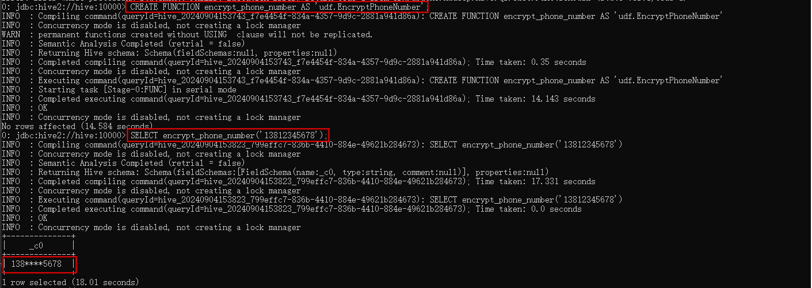

## 一、Hive数据类型
1.  **数值类型**
    + ByteType : 表示 1 字节长的有符号整型，数值范围 : -128 到 127。
    + ShortType : 表示 2 字节长的有符号整型，数值范围 : -32768 到 32767。
    + `IntegerType `: 表示 4 字节长的有符号整型，数值范围 : -2147483648 到 2147483647。
    + `LongType` : 表示 8 字节长的有符号整型，数值范围 : -/+ 9223372036854775808
    + FloatType : 表示 4 字节长的单精度浮点数。
    + DoubleType : 表示 8 字节长的双精度浮点数
    + DecimalType : 表示任意精度有符号带小数的数值。内部使用 java.math.BigDecimal，一个BigDecimal 由一个任意精度的整数非标度值和一个 32 位的整数标度 (scale) 组成。
2. **字符串类型**
    + StringType : 表示字符串值
3. **二进制类型**
    + BinaryType : 表示字节序列值
4. **布尔类型**
    + BooleanType : 表示布尔值
5. **日期类型**
    + TimestampType : 表示包含年月日、时分秒等字段的日期值，如 2014-12-12 12:34:56
    + DateType : 表示包含年月日字段的日期值
6. **复杂类型**（Complex types）
    + `ArrayType`(elementType, containsNull) : 数组类型，表示一个由类型为 elementType 的元素组成的序列，containsNull 用来表示 ArrayType 中的元素是否能为 null 值。
    + `MapType`(keyType, valueType, valueContainsNull) : 映射类型，表示一个键值对的集合。键的类型由 keyType 表示，值的类型则由 valueType 表示。对于一个 MapType 值，键是不允许为 null值。valueContainsNull 用来表示一个 MapType 的值是否能为 null 值
    + StructType(fields) : 表示由 StructField 序列描述的结构
    + StructField(name, datatype, nullable) : 表示 StructType 中的一个字段，name 表示字段名，datatype 是字段的数据类型，nullable 用来表示该字段是否可以为空值。

### 1.2 Python 与 Hive 数据类型映射
#### 1.2.1 Python → Hive
```python
_type_mappings = {
    type(None): NullType,
    bool: BooleanType,
    int: LongType,
    float: DoubleType,
    str: StringType,
    bytearray: BinaryType,
    decimal.Decimal: DecimalType,
    datetime.date: DateType,
    datetime.datetime: TimestampType,
    datetime.time: TimestampType,
}
```
#### 1.2.2 Hive → Python
```python
_acceptable_types = {
    BooleanType: (bool,),
    ByteType: (int, long),
    ShortType: (int, long),
    IntegerType: (int, long),
    LongType: (int, long),
    FloatType: (float,),
    DoubleType: (float,),
    DecimalType: (decimal.Decimal,),
    StringType: (str, unicode),
    BinaryType: (bytearray,),
    DateType: (datetime.date, datetime.datetime),
    TimestampType: (datetime.datetime,),
    ArrayType: (list, tuple, array),
    MapType: (dict,),
    StructType: (tuple, list, dict),
}
```

### 1.2.3  Hive-Java类型对应

|Hive数据类型|Java数据类型|Hadoop数据类型|
|:-----|:--------|:--------|
|string|java.lang.String|org.apache.hadoop.io.Text|
|int|java.lang.Integer|org.apache.hadoop.io.IntWritable|
|boolean|java.lang.Boolean|org.apache.hadoop.io.BooleanWritable|
|array<type>|java.util.List<Java type>||
|map<ktype, vtype>|java.util.Map<Java type for K, Java type for V>||
|struct|Don't use Simple UDF, use GenericUDF||

## 二、用户自定义函数
大数据开发中总会遇到某些特殊或复杂的数据处理场景，靠Hive自带的函数堆叠也无法实现功能，这时候就需要我们自己去实现可以在Hive中嵌入的自定义数据处理函数——UDF函数。<br>
UDF函数按照继承类可以分为2种，一个是`UDF`，一个是`GenericUDF`，GenericUDF的开发会比UDF复杂一些。`pom.xml`配置如下：
```xml
<!--
Maven重新构建，通过-X参数打开调试查看详细日志。
mvn clean compile -U -X
-->
<dependencies>
    <dependency>
        <groupId>org.apache.hive</groupId>
        <artifactId>hive-jdbc</artifactId>
        <version>${hive.version}</version>
    </dependency>
    <dependency>
        <groupId>org.apache.hadoop</groupId>
        <artifactId>hadoop-common</artifactId>
        <version>${hadoop.version}</version>
    </dependency>
    <dependency>
        <groupId>org.apache.hive</groupId>
        <artifactId>hive-exec</artifactId>
        <version>${hive.version}</version>
    </dependency>
</dependencies>
```

### 2.1 UDF
相对简单，继承UDF类（org.apache.hadoop.hive.ql.exec.UDF）并覆写evaluate()方法

### 2.2 GenericUDF
一般在以下几种场景下考虑使用GenericUDF：
1. 多种数量传参、多种数据类型传参<br>
   在UDF中支持这种场景我们需要实现N个不同的evaluate()方法分别对应N种场景的传参，在GenericUDF我们只需在一个方法内加上判断逻辑，对不同的输入路由到不同的处理逻辑上即可。<br>
   比如：同时支持List<String>、List<Integer>等

2. 需要传非Writable的或复杂数据类型作为参数。<br>
   比如嵌套数据结构，传入Map的key-value中的value为list数据类型<br>
   比如数据域数量不确定的Struct结构，都更适合使用GenericUDF在运行时捕获数据的内部构造。<br>

该UDF被大量、高频地使用，所以从收益上考虑，会尽可能地优化一切可以优化的地方，则GenericUDF相比UDF在operator中避免了多次反射转化的资源消耗，更适合被考虑。<br>
该UDF函数功能未来预期的重构、扩展场景较多，需要做得足够可扩展，则GenericUDF在这方面更优秀。

#### 2.2.1 涉及知识点
+ 泛型<br>
  1）通过解耦类或方法与所使用的类之间的约束，实现了“参数化类型”的概念，使代码可以应用于多种类型，这即是泛型。<br>
  2）在GenericUDF里体现为所有参数对象都以Object类被传递。

+ ObjectInspector<br>
  1）Java的ObjectInspector类，用于帮助Hive了解复杂对象的内部架构，也支持通过创建特定的ObjectInspector对象替代创建具体类对象，来在内存中储存某类对象的信息。<br>
  2）在UDF中，ObjectInspector用于帮助Hive引擎在将HQL转成MR Job的时候确定输入和输出的数据类型。<br>
  3）Hive语句会生成MapReduce Job执行，所以使用的是Hadoop数据格式，不是编写UDF的Java的数据类型，比如Java的int在Hadoop为IntWritable，String在Hadoop为Text格式，所以我们需要将UDF内的Java数据类型转成正确的Hadoop数据类型以支持Hive将HQL生成MapReduce Job。

+ 序列化/反序列化<br>
  1）OSI七层协议模型中,展现层（Presentation Layer）的主要功能是把应用层的数据结构或对象（Java中的Object类）转换成一段连续的二进制串（Java中可以理解为byte array），或者反过来，把（在序列化过程中所生成的）二进制串转换成应用层的对象–这两个功能就是序列化和反序列化。<br>
  2）当UDF函数处理逻辑涉及多步操作时，就涉及把数据序列化以传输，再反序列化以处理的操作。

+ Deferred Object<br>
  1）两个特征，一个是lazy-evaluation，即到需要时才会执行计算（这里指创建和给对象赋值），典型例子是Iterator类，只在需要的时候才执行计算并返回下一个元素；<br>
  2）一个是short-circuiting，即一个逻辑在执行运算前就能知道结果，所以在需要返回结果时会直接返回结果退出，避免不必要的计算，例子比如(false && xxx && xxx)该判断逻辑不会执行后面的运算，因为结果一定是false。


#### 2.2.2 执行流程
继承GenericUDF类，并覆写initialize()、evaluate()、getDisplayString()这3个方法
```java
//在evaluate()方法之前调用，该方法接收的参数是一个ObjectInspectors数组，该方法检查接收正确的参数类型和参数个数
abstract ObjectInspector initialize(ObjectInspector[] arguments);

//这个方法类似evaluate方法，处理真实的参数，返回最终结果
abstract Object evaluate(GenericUDF.DeferredObject[] arguments);

//此方法用于当实现的GenericUDF出错的时候，打印提示信息，提示信息就是该方法的返回的字符串
abstract String getDisplayString(String[] children);
```

具体步骤如下：
1. 确定参数类型和返回值类型<br>
   当Hive解析query时，会得到传入UDF参数的参数类型，并调用initialize()方法。<br>
   针对该UDF的每个参数该方法都会收到1个对应的ObjectInspector参数，且该方法必须返回1个ObjectInspector表示返回值类型。<br>
   通过调用该方法，Hive知道该UDF将返回什么数据类型，因此可以继续解析query。
2. 验证参数正确性（一般是数量、类型）<br>
   对于Hive的每行记录，我们在initialize()方法内读取ObjectInspector参数，并执行传参的数量和数据类型的检查，正确时才进行计算；
3. 处理逻辑和返回结果<br>
   在evaluate()方法中，我们使用initialize()方法里收到的ObjectInspector去读evaluate()方法接收的参数，即一串泛型Object（实际是DeferredObject）。<br>
   ObjectInspector解析Object并转成具体类型的对象执行数据处理，最后输出结果。

## 三、案例1：用户自定义UDF
在企业中处理数据的时候，对于敏感数据往往需要进行脱敏处理。比如手机号。我们常见的处理方式是将手机号中间4位进行****处理。
Hive中没有这样的函数可以直接实现功能，虽然可以通过各种函数的嵌套调用最终也能实现，但是效率不高，现要求自定义开发实现Hive函数，满足上述需求。<br>
1. 能够对输入数据进行非空判断、位数判断处理<br>
2. 能够实现校验手机号格式，把满足规则的进行****处理<br>
3. 对于不符合手机号规则的数据原封不动不处理<br>

通过业务分析，可以发现我们需要实现的函数是一个输入一行输出一行的函数，也就是所说的`UDF普通函数`。 根据Hive当中的UDF开发规范，实现步骤如下：
1. 写一个java类，继承UDF，并重载evaluate方法；
2. 程序打成jar包，上传服务器添加到hive的classpath：hive > add JAR /home/hadoop/udf.jar;
3. 注册成为临时函数（给UDF命名）： create function 函数名 as 'UDF类全路径';
4. 使用函数

### 3.1 集群部署和测试
将UDF JAR文件添加到Hive：在Hive CLI或Beeline中运行以下命令，将JAR文件添加到Hive中：
```sql
-- $HIVE_HOME/bin/beeline -u jdbc:hive2://hive:10000 -n hive
ADD JAR /home/hive/jars/bigdata-hive-1.0-shaded.jar;
```
创建一个临时函数： 使用以下命令在Hive中创建一个指向UDF的函数：
```sql
CREATE FUNCTION encrypt_phone_number AS 'udf.EncryptPhoneNumber';
```
测试UDF：直接在Hive中使用这个函数进行测试。例如：
```sql
-- 返回 138****5678，表示加密后的手机号码。
SELECT encrypt_phone_number('13812345678');
```
<br>

## 参考引用
[1] [黑马程序员-Apache Hive 3.0](https://book.itheima.net/course/1269935677353533441/1269937996044476418/1269942232408956930) <br>
[2] [Apache Hive - LanguageManual UDF](https://cwiki.apache.org/confluence/display/Hive/LanguageManual+UDF) <br>
[3] [CDP 7.16官方文档](https://docs.cloudera.com/cdp-private-cloud-base/7.1.6/) <br>
[4] [Apache Hive - Home](https://cwiki.apache.org/confluence/display/Hive//Home#Home-UserDocumentation) <br>
[5] [GenericUDF详解](https://juejin.cn/post/6984580196594614308)
