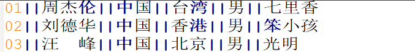

## 一、多字节分隔符
### 1.1 应用场景
Hive中默认使用单字节分隔符来加载文本数据，例如逗号、制表符、空格等等，默认的分隔符为`\001`。根据不同文件的不同分隔符，可以通过在创建表时使用
`row format delimited fields terminated by ‘单字节分隔符’ `来指定文件中的分割符，确保正确将表中的每一列与文件中的每一列实现一一对应的关系。
在实际工作中，我们遇到的数据往往不是非常规范化的数据，例如我们会遇到以下的两种情况
+ 情况一：每一行数据的分隔符是`多字节分隔符`，例如：”||”、“--”等<br>
  <br>

+ 数据的字段中包含了分隔符，如下图中每列的分隔符为空格，但是数据中包含了分隔符，时间字段中也有空格<br>
  <br>

### 1.2 问题
基于上述的两种特殊数据，如果使用正常的加载数据的方式将数据加载到表中，就会出以下两种错误。
#### 1.2.1 情况一：加载数据的分隔符为多字节分隔符
```sql
drop table if exists singer;
create table singer(
    id       string,--歌手id
    name     string,--歌手名称
    country  string,--国家
    province string,--省份
    gender   string,--性别
    works    string--作品
)
row format delimited fields terminated by '||';

-- $HADOOP_HOME/bin/hdfs dfs -put -d cases/ /data/
load data local inpath '/home/hive/data/cases/case01/test01.txt' into table singer;
select * from singer;
```
<br>

+ 问题：数据发生了错位，没有正确的加载每一列的数据
+ 原因：**Hive中默认只支持单字节分隔符，无法识别多字节分隔符**

#### 1.2.2 情况二：数据中包含了分隔符
```sql
drop table if exists apachelog;
create table apachelog(
    ip     string, --IP地址
    stime  string, --时间
    mothed string, --请求方式
    url    string, --请求地址
    policy string, --请求协议
    stat   string, --请求状态
    body   string  --字节大小
)
row format delimited fields terminated by ' ';

load data local inpath '/home/hive/data/cases/case01/apache_web_access.log' into table apachelog;
select * from apachelog;
```
<br>

+ 问题：时间字段被切分成了两个字段，后面所有的字段出现了错位
+ 原因：时间数据中包含了分隔符，导致Hive认为这是两个字段，但实际业务需求中为一个字段

### 1.3 解决方案

基于上面两种情况的测试发现，当数据中出现了多字节分隔符或者数据中的某个字段包含了分隔符，就会导致数据加载错位的问题。基于出现的问题， 需要通过特殊的方法来解决该问题，即使当数据中出现多字节分隔符等情况时，Hive也能正确的加载数据，实现列与数据的一一对应。

#### 1.3.1 解决方案一：替换分隔符
面对情况一，如果数据中的分隔符是多字节分隔符，可以使用程序提前将数据中的`多字节分隔符替换为单字节分隔符`，然后使用Hive加载，就可以实现正确加载对应的数据。
例如：原始数据中的分隔符为“||”
```
01||周杰伦||中国||台湾||男||七里香
```
可以在ETL阶段通过一个MapReduce程序，将“||”替换为单字节的分隔符“|”，示例程序：
[ChangeSplitCharMR.java](https://github.com/530154436/bigdata-learning/blob/main/bigdata-hadoop/src/main/java/org/zcb/mr/ChangeSplitCharMR.java)<br>
```sql
-- 重新创建Hive表并导入数据
drop table if exists singer;
create table if not exists singer(
  id       string,--歌手id
  name     string,--歌手名称
  country  string,--国家
  province string,--省份
  gender   string,--性别
  works    string--作品
)
row format delimited fields terminated by '|';
load data inpath '/data/output/changeSplit/part-m-00000' into table singer;
select * from singer;
```
<br>

在ETL阶段可以直接对数据进行分隔符的替换，通过替换分隔符将多字节分隔符更改为单字节分隔符，就可以解决数据加载的问题，但是这种方式有对应的优缺点，并不是所有的场景适用于该方法。
+ 优点：实现方式较为简单，基于字符串替换即可
+ 缺点：无法满足情况2的需求

#### 1.3.2 解决方案二：RegexSerDe正则加载

面对情况一和情况二的问题，Hive中提供了一种特殊的方式来解决，Hive提供了一种特殊的Serde来加载特殊数据的问题，使用`正则匹配`来加载数据，匹配每一列的数据。[官网地址](https://cwiki.apache.org/confluence/display/Hive/GettingStarted#GettingStarted-ApacheWeblogData)

> 什么是SerDe?<br>
Hive的SerDe提供了`序列化`和`反序列化`两个功能。
SerDe是英文Serialize和Deserilize的组合缩写，用于实现将Hive中的对象进行序列化和将数据进行反序列化。<br>
Serialize就是序列化，用于将Hive中使用的java object转换成能写入hdfs的字节序列，或者其他系统能识别的流文件。<br>

Hive中的insert语句用于将数据写入HDFS，所以就会调用**序列化**实现。 Hive中的调用过程如下：<br>
<br>

Deserilize就是反序列化，用于将字符串或者二进制数据流转换成Hive能识别的java object对象。所有Hive中的Select语句在查询数据时，需要将HDFS中的数据解析为Hive中对象，就需要进行**反序列化**。Hive可以方便的将数据加载到表中而不需要对数据进行转换，这样在处理海量数据时可以节省大量的时间。Hive中的调用过程如下：<br>
<br>

Hive中默认提供了多种SerDe用于解析和加载不同类型的数据文件，常用的有ORCSerde 、RegexSerde、JsonSerDe等。官网地址](https://cwiki.apache.org/confluence/display/Hive/SerDe)
+ `RegexSerde`是Hive中专门为了满足复杂数据场景所提供的正则加载和解析数据的接口，使用RegexSerde可以指定正则表达式加载数据，根据正则表达式匹配每一列数据。

上述过程中遇到的情况一和情况二的问题，都可以通过RegexSerDe使用正则表达式来加载实现，基本上可以满足大多数场景的需求，工作中推荐使用该方式来实现对于复杂数据的加载。

##### RegexSerDe解决多字节分隔符
```
--原始数据格式
01||周杰伦||中国||台湾||男||七里香

--正则表达式定义每一列：https://www.jyshare.com/front-end/854/
([0-9]*)\\|\\|(.*)\\|\\|(.*)\\|\\|(.*)\\|\\|(.*)\\|\\|(.*)
```
基于正则表达式，使用RegexSerde建表
```sql
drop table if exists singer;
create table if not exists singer(
    id       string,--歌手id
    name     string,--歌手名称
    country  string,--国家
    province string,--省份
    gender   string,--性别
    works    string--作品
)
--指定使用RegexSerde加载数据
ROW FORMAT SERDE 'org.apache.hadoop.hive.serde2.RegexSerDe'
--指定正则表达式
WITH SERDEPROPERTIES ("input.regex" = "([0-9]*)\\|\\|([^}]*)\\|\\|([^}]*)\\|\\|([^}]*)\\|\\|([^}]*)\\|\\|([^}]*)");

load data local inpath '/home/hive/data/cases/case01/test01.txt' into table singer;
select * from singer;
```
<br>


##### RegexSerDe解决数据中包含分割符
```
--原始数据格式
192.168.88.134 [08/Nov/2020:10:44:32 +0800] "GET / HTTP/1.1" 404 951
192.168.88.100 [08/Nov/2020:10:44:33 +0800] "GET /hpsk_sdk/index.html HTTP/1.1" 200 328

--正则表达式定义每一列：https://www.jyshare.com/front-end/854/
([^ ]*) ([^}]*) ([^ ]*) ([^ ]*) ([^ ]*) ([0-9]*) ([^ ]*)
```
基于正则表达式，使用RegexSerde建表
```sql
drop table if exists apachelog;
create table if not exists apachelog(
    ip     string, --IP地址
    stime  string, --时间
    mothed string, --请求方式
    url    string, --请求地址
    policy string, --请求协议
    stat   string, --请求状态
    body   string  --字节大小
)
--指定使用RegexSerde加载数据
ROW FORMAT SERDE 'org.apache.hadoop.hive.serde2.RegexSerDe'
--指定正则表达式
WITH SERDEPROPERTIES (
    "input.regex" = "([^ ]*) ([^}]*) ([^ ]*) ([^ ]*) ([^ ]*) ([0-9]*) ([^ ]*)"
);

load data local inpath '/home/hive/data/cases/case01/apache_web_access.log' into table apachelog;
select * from apachelog;
```
<br>

#### 1.3.3 解决方案三：自定义InputFormat
Hive中也允许使用`自定义InputFormat`来解决以上问题，通过在自定义InputFormat，来自定义解析逻辑实现读取每一行的数据。<br>
自定义InputFormat继承自TextInputFormat，读取数据时将每条数据中的”||”全部替换成“|”，示例程序参考：[UserInputFormat.java](https://github.com/530154436/bigdata-learning/blob/main/bigdata-hadoop/src/main/java/org/zcb/mr/UserInputFormat.java)
、[UserRecordReader.java](https://github.com/530154436/bigdata-learning/blob/main/bigdata-hadoop/src/main/java/org/zcb/mr/UserRecordReader.java)<br>

+ 将开发好的InputFormat打成jar包，放入`Hive的lib目录`中
```shell
cp /tmp/jars/bigdata-hadoop-1.0-shaded.jar /usr/local/hive-3.1.2/lib/
```
+ 在Hive中，将jar包添加到环境变量中
```sql

-- 该方法可以实现临时添加，如果希望永久生效，重启Hive即可
add jar /tmp/jars/bigdata-hadoop-1.0-shaded.jar;
```
+ 创建表，指定自定义的InputFormat读取数据
```sql
drop table if exists singer;
create table if not exists singer(
    id       string,--歌手id
    name     string,--歌手名称
    country  string,--国家
    province string,--省份
    gender   string,--性别
    works    string--作品
)
--指定使用分隔符为|
row format delimited fields terminated by '|'
stored as
--指定使用自定义的类实现解析
    inputformat 'org.zcb.mr.UserInputFormat'
    outputformat 'org.apache.hadoop.hive.ql.io.HiveIgnoreKeyTextOutputFormat';

load data local inpath '/home/hive/data/cases/case01/test01.txt' into table singer;
select * from singer;
```
<br>

### 1.4 总结
当数据文件中出现多字节分隔符或者数据中包含了分隔符时，会导致数据加载与实际表的字段不匹配的问题，基于这个问题我们提供了三种方案：`替换分隔符`、`正则加载`及`自定义InputFormat`来实现，其中替换分隔符无法解决数据中存在分隔符的问题，自定义InputFormat的开发成本较高，所以**整体推荐使用正则加载的方式来实现对于特殊数据的处理**。

