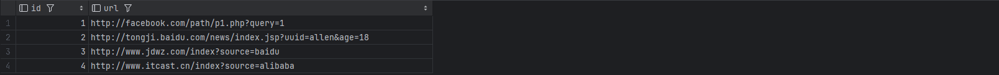
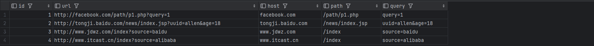
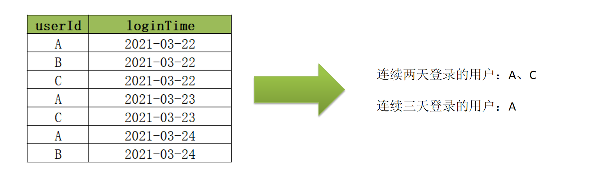

<nav>
<a href="#一多字节分隔符">一、多字节分隔符</a><br/>
&nbsp;&nbsp;&nbsp;&nbsp;<a href="#11-应用场景">1.1 应用场景</a><br/>
&nbsp;&nbsp;&nbsp;&nbsp;<a href="#12-问题和需求">1.2 问题和需求</a><br/>
&nbsp;&nbsp;&nbsp;&nbsp;&nbsp;&nbsp;&nbsp;&nbsp;<a href="#121-情况一加载数据的分隔符为多字节分隔符">1.2.1 情况一：加载数据的分隔符为多字节分隔符</a><br/>
&nbsp;&nbsp;&nbsp;&nbsp;&nbsp;&nbsp;&nbsp;&nbsp;<a href="#122-情况二数据中包含了分隔符">1.2.2 情况二：数据中包含了分隔符</a><br/>
&nbsp;&nbsp;&nbsp;&nbsp;<a href="#13-解决方案">1.3 解决方案</a><br/>
&nbsp;&nbsp;&nbsp;&nbsp;&nbsp;&nbsp;&nbsp;&nbsp;<a href="#131-解决方案一替换分隔符">1.3.1 解决方案一：替换分隔符</a><br/>
&nbsp;&nbsp;&nbsp;&nbsp;&nbsp;&nbsp;&nbsp;&nbsp;<a href="#132-解决方案二regexserde正则加载">1.3.2 解决方案二：RegexSerDe正则加载</a><br/>
&nbsp;&nbsp;&nbsp;&nbsp;&nbsp;&nbsp;&nbsp;&nbsp;&nbsp;&nbsp;&nbsp;&nbsp;<a href="#regexserde解决多字节分隔符">RegexSerDe解决多字节分隔符</a><br/>
&nbsp;&nbsp;&nbsp;&nbsp;&nbsp;&nbsp;&nbsp;&nbsp;&nbsp;&nbsp;&nbsp;&nbsp;<a href="#regexserde解决数据中包含分割符">RegexSerDe解决数据中包含分割符</a><br/>
&nbsp;&nbsp;&nbsp;&nbsp;&nbsp;&nbsp;&nbsp;&nbsp;<a href="#133-解决方案三自定义inputformat">1.3.3 解决方案三：自定义InputFormat</a><br/>
&nbsp;&nbsp;&nbsp;&nbsp;<a href="#14-总结">1.4 总结</a><br/>
<a href="#二url解析函数及侧视图">二、URL解析函数及侧视图</a><br/>
&nbsp;&nbsp;&nbsp;&nbsp;<a href="#21-应用场景">2.1 应用场景</a><br/>
&nbsp;&nbsp;&nbsp;&nbsp;<a href="#22-问题和需求">2.2 问题和需求</a><br/>
&nbsp;&nbsp;&nbsp;&nbsp;<a href="#23-解决方案">2.3 解决方案</a><br/>
&nbsp;&nbsp;&nbsp;&nbsp;&nbsp;&nbsp;&nbsp;&nbsp;<a href="#231-parse_url函数">2.3.1 parse_url函数</a><br/>
&nbsp;&nbsp;&nbsp;&nbsp;&nbsp;&nbsp;&nbsp;&nbsp;<a href="#232-parse_url_tuple函数">2.3.2 parse_url_tuple函数</a><br/>
<a href="#三行列转换应用与实现">三、行列转换应用与实现</a><br/>
&nbsp;&nbsp;&nbsp;&nbsp;<a href="#31-应用场景">3.1 应用场景</a><br/>
&nbsp;&nbsp;&nbsp;&nbsp;<a href="#32-行转列多行转多列">3.2 行转列：多行转多列</a><br/>
&nbsp;&nbsp;&nbsp;&nbsp;<a href="#33-行转列多行转单列">3.3 行转列：多行转单列</a><br/>
&nbsp;&nbsp;&nbsp;&nbsp;<a href="#34-列转行多列转多行">3.4 列转行：多列转多行</a><br/>
&nbsp;&nbsp;&nbsp;&nbsp;<a href="#35-列转行单列转多行">3.5 列转行：单列转多行</a><br/>
<a href="#四json数据处理">四、JSON数据处理</a><br/>
&nbsp;&nbsp;&nbsp;&nbsp;<a href="#41-get_json_object">4.1 get_json_object</a><br/>
&nbsp;&nbsp;&nbsp;&nbsp;<a href="#42-json_tuple">4.2 json_tuple</a><br/>
&nbsp;&nbsp;&nbsp;&nbsp;<a href="#43-jsonserde">4.3 JSONSerde</a><br/>
&nbsp;&nbsp;&nbsp;&nbsp;<a href="#44-总结">4.4 总结</a><br/>
<a href="#五窗口函数应用实例">五、窗口函数应用实例</a><br/>
&nbsp;&nbsp;&nbsp;&nbsp;<a href="#51-连续登陆用户">5.1 连续登陆用户</a><br/>
&nbsp;&nbsp;&nbsp;&nbsp;&nbsp;&nbsp;&nbsp;&nbsp;<a href="#511-需求分析">5.1.1 需求分析</a><br/>
&nbsp;&nbsp;&nbsp;&nbsp;&nbsp;&nbsp;&nbsp;&nbsp;<a href="#512-解决方案">5.1.2 解决方案</a><br/>
&nbsp;&nbsp;&nbsp;&nbsp;<a href="#52-级联累加求和">5.2 级联累加求和</a><br/>
&nbsp;&nbsp;&nbsp;&nbsp;&nbsp;&nbsp;&nbsp;&nbsp;<a href="#521-需求分析">5.2.1 需求分析</a><br/>
&nbsp;&nbsp;&nbsp;&nbsp;&nbsp;&nbsp;&nbsp;&nbsp;<a href="#522-解决方案">5.2.2 解决方案</a><br/>
&nbsp;&nbsp;&nbsp;&nbsp;<a href="#53-分组topn">5.3 分组TopN</a><br/>
&nbsp;&nbsp;&nbsp;&nbsp;&nbsp;&nbsp;&nbsp;&nbsp;<a href="#521-需求分析">5.2.1 需求分析</a><br/>
&nbsp;&nbsp;&nbsp;&nbsp;&nbsp;&nbsp;&nbsp;&nbsp;<a href="#522-解决方案">5.2.2 解决方案</a><br/>
<a href="#六拉链表的设计与实现">六、拉链表的设计与实现</a><br/>
&nbsp;&nbsp;&nbsp;&nbsp;<a href="#61-数据同步场景">6.1 数据同步场景</a><br/>
&nbsp;&nbsp;&nbsp;&nbsp;<a href="#62-解决方案">6.2 解决方案</a><br/>
&nbsp;&nbsp;&nbsp;&nbsp;<a href="#63-拉链表的设计与分析">6.3 拉链表的设计与分析</a><br/>
&nbsp;&nbsp;&nbsp;&nbsp;<a href="#64-拉链表的实现">6.4 拉链表的实现</a><br/>
&nbsp;&nbsp;&nbsp;&nbsp;<a href="#65-具体案例">6.5 具体案例</a><br/>
</nav>


## 一、多字节分隔符
### 1.1 应用场景
Hive中默认使用单字节分隔符来加载文本数据，例如逗号、制表符、空格等等，默认的分隔符为`\001`。根据不同文件的不同分隔符，可以通过在创建表时使用
`row format delimited fields terminated by ‘单字节分隔符’ `来指定文件中的分割符，确保正确将表中的每一列与文件中的每一列实现一一对应的关系。
在实际工作中，我们遇到的数据往往不是非常规范化的数据，例如我们会遇到以下的两种情况
+ 情况一：每一行数据的分隔符是`多字节分隔符`，例如：”||”、“--”等<br>
  <br>

+ 数据的字段中包含了分隔符，如下图中每列的分隔符为空格，但是数据中包含了分隔符，时间字段中也有空格<br>
  <br>

### 1.2 问题和需求
基于上述的两种特殊数据，如果使用正常的加载数据的方式将数据加载到表中，就会出以下两种错误。
#### 1.2.1 情况一：加载数据的分隔符为多字节分隔符
```sql
drop table if exists singer;
create table singer(
    id       string,--歌手id
    name     string,--歌手名称
    country  string,--国家
    province string,--省份
    gender   string,--性别
    works    string--作品
)
row format delimited fields terminated by '||';

-- $HADOOP_HOME/bin/hdfs dfs -put -d cases/ /data/
load data local inpath '/home/hive/data/cases/case01/test01.txt' into table singer;
select * from singer;
```
<br>

+ 问题：数据发生了错位，没有正确的加载每一列的数据
+ 原因：**Hive中默认只支持单字节分隔符，无法识别多字节分隔符**

#### 1.2.2 情况二：数据中包含了分隔符
```sql
drop table if exists apachelog;
create table apachelog(
    ip     string, --IP地址
    stime  string, --时间
    mothed string, --请求方式
    url    string, --请求地址
    policy string, --请求协议
    stat   string, --请求状态
    body   string  --字节大小
)
row format delimited fields terminated by ' ';

load data local inpath '/home/hive/data/cases/case01/apache_web_access.log' into table apachelog;
select * from apachelog;
```
<br>

+ 问题：时间字段被切分成了两个字段，后面所有的字段出现了错位
+ 原因：时间数据中包含了分隔符，导致Hive认为这是两个字段，但实际业务需求中为一个字段

### 1.3 解决方案

基于上面两种情况的测试发现，当数据中出现了多字节分隔符或者数据中的某个字段包含了分隔符，就会导致数据加载错位的问题。基于出现的问题， 需要通过特殊的方法来解决该问题，即使当数据中出现多字节分隔符等情况时，Hive也能正确的加载数据，实现列与数据的一一对应。

#### 1.3.1 解决方案一：替换分隔符
面对情况一，如果数据中的分隔符是多字节分隔符，可以使用程序提前将数据中的`多字节分隔符替换为单字节分隔符`，然后使用Hive加载，就可以实现正确加载对应的数据。
例如：原始数据中的分隔符为“||”
```
01||周杰伦||中国||台湾||男||七里香
```
可以在ETL阶段通过一个MapReduce程序，将“||”替换为单字节的分隔符“|”，示例程序：
[ChangeSplitCharMR.java](https://github.com/530154436/bigdata-learning/blob/main/bigdata-hadoop/src/main/java/org/zcb/mr/ChangeSplitCharMR.java)<br>
```sql
-- 重新创建Hive表并导入数据
drop table if exists singer;
create table if not exists singer(
  id       string,--歌手id
  name     string,--歌手名称
  country  string,--国家
  province string,--省份
  gender   string,--性别
  works    string--作品
)
row format delimited fields terminated by '|';
load data inpath '/data/output/changeSplit/part-m-00000' into table singer;
select * from singer;
```
<br>

在ETL阶段可以直接对数据进行分隔符的替换，通过替换分隔符将多字节分隔符更改为单字节分隔符，就可以解决数据加载的问题，但是这种方式有对应的优缺点，并不是所有的场景适用于该方法。
+ 优点：实现方式较为简单，基于字符串替换即可
+ 缺点：无法满足情况2的需求

#### 1.3.2 解决方案二：RegexSerDe正则加载

面对情况一和情况二的问题，Hive中提供了一种特殊的方式来解决，Hive提供了一种特殊的Serde来加载特殊数据的问题，使用`正则匹配`来加载数据，匹配每一列的数据。[官网地址](https://cwiki.apache.org/confluence/display/Hive/GettingStarted#GettingStarted-ApacheWeblogData)

> 什么是SerDe?<br>
Hive的SerDe提供了`序列化`和`反序列化`两个功能。
SerDe是英文Serialize和Deserilize的组合缩写，用于实现将Hive中的对象进行序列化和将数据进行反序列化。<br>
Serialize就是序列化，用于将Hive中使用的java object转换成能写入hdfs的字节序列，或者其他系统能识别的流文件。<br>

Hive中的insert语句用于将数据写入HDFS，所以就会调用**序列化**实现。 Hive中的调用过程如下：<br>
<br>

Deserilize就是反序列化，用于将字符串或者二进制数据流转换成Hive能识别的java object对象。所有Hive中的Select语句在查询数据时，需要将HDFS中的数据解析为Hive中对象，就需要进行**反序列化**。Hive可以方便的将数据加载到表中而不需要对数据进行转换，这样在处理海量数据时可以节省大量的时间。Hive中的调用过程如下：<br>
<br>

Hive中默认提供了多种SerDe用于解析和加载不同类型的数据文件，常用的有ORCSerde 、RegexSerde、JsonSerDe等。官网地址](https://cwiki.apache.org/confluence/display/Hive/SerDe)
+ `RegexSerde`是Hive中专门为了满足复杂数据场景所提供的正则加载和解析数据的接口，使用RegexSerde可以指定正则表达式加载数据，根据正则表达式匹配每一列数据。

上述过程中遇到的情况一和情况二的问题，都可以通过RegexSerDe使用正则表达式来加载实现，基本上可以满足大多数场景的需求，工作中推荐使用该方式来实现对于复杂数据的加载。

##### RegexSerDe解决多字节分隔符
```
--原始数据格式
01||周杰伦||中国||台湾||男||七里香

--正则表达式定义每一列：https://www.jyshare.com/front-end/854/
([0-9]*)\\|\\|(.*)\\|\\|(.*)\\|\\|(.*)\\|\\|(.*)\\|\\|(.*)
```
基于正则表达式，使用RegexSerde建表
```sql
drop table if exists singer;
create table if not exists singer(
    id       string,--歌手id
    name     string,--歌手名称
    country  string,--国家
    province string,--省份
    gender   string,--性别
    works    string--作品
)
--指定使用RegexSerde加载数据
ROW FORMAT SERDE 'org.apache.hadoop.hive.serde2.RegexSerDe'
--指定正则表达式
WITH SERDEPROPERTIES ("input.regex" = "([0-9]*)\\|\\|([^}]*)\\|\\|([^}]*)\\|\\|([^}]*)\\|\\|([^}]*)\\|\\|([^}]*)");

load data local inpath '/home/hive/data/cases/case01/test01.txt' into table singer;
select * from singer;
```
<br>


##### RegexSerDe解决数据中包含分割符
```
--原始数据格式
192.168.88.134 [08/Nov/2020:10:44:32 +0800] "GET / HTTP/1.1" 404 951
192.168.88.100 [08/Nov/2020:10:44:33 +0800] "GET /hpsk_sdk/index.html HTTP/1.1" 200 328

--正则表达式定义每一列：https://www.jyshare.com/front-end/854/
([^ ]*) ([^}]*) ([^ ]*) ([^ ]*) ([^ ]*) ([0-9]*) ([^ ]*)
```
基于正则表达式，使用RegexSerde建表
```sql
drop table if exists apachelog;
create table if not exists apachelog(
    ip     string, --IP地址
    stime  string, --时间
    mothed string, --请求方式
    url    string, --请求地址
    policy string, --请求协议
    stat   string, --请求状态
    body   string  --字节大小
)
--指定使用RegexSerde加载数据
ROW FORMAT SERDE 'org.apache.hadoop.hive.serde2.RegexSerDe'
--指定正则表达式
WITH SERDEPROPERTIES (
    "input.regex" = "([^ ]*) ([^}]*) ([^ ]*) ([^ ]*) ([^ ]*) ([0-9]*) ([^ ]*)"
);

load data local inpath '/home/hive/data/cases/case01/apache_web_access.log' into table apachelog;
select * from apachelog;
```
<br>

#### 1.3.3 解决方案三：自定义InputFormat
Hive中也允许使用`自定义InputFormat`来解决以上问题，通过在自定义InputFormat，来自定义解析逻辑实现读取每一行的数据。<br>
自定义InputFormat继承自TextInputFormat，读取数据时将每条数据中的”||”全部替换成“|”，示例程序参考：[UserInputFormat.java](https://github.com/530154436/bigdata-learning/blob/main/bigdata-hadoop/src/main/java/org/zcb/mr/UserInputFormat.java)
、[UserRecordReader.java](https://github.com/530154436/bigdata-learning/blob/main/bigdata-hadoop/src/main/java/org/zcb/mr/UserRecordReader.java)<br>

+ 将开发好的InputFormat打成jar包，放入`Hive的lib目录`中
```shell
cp /tmp/jars/bigdata-hadoop-1.0-shaded.jar /usr/local/hive-3.1.2/lib/
```
+ 在Hive中，将jar包添加到环境变量中
```sql

-- 该方法可以实现临时添加，如果希望永久生效，重启Hive即可
add jar /tmp/jars/bigdata-hadoop-1.0-shaded.jar;
```
+ 创建表，指定自定义的InputFormat读取数据
```sql
drop table if exists singer;
create table if not exists singer(
    id       string,--歌手id
    name     string,--歌手名称
    country  string,--国家
    province string,--省份
    gender   string,--性别
    works    string--作品
)
--指定使用分隔符为|
row format delimited fields terminated by '|'
stored as
--指定使用自定义的类实现解析
    inputformat 'org.zcb.mr.UserInputFormat'
    outputformat 'org.apache.hadoop.hive.ql.io.HiveIgnoreKeyTextOutputFormat';

load data local inpath '/home/hive/data/cases/case01/test01.txt' into table singer;
select * from singer;
```
<br>

### 1.4 总结
当数据文件中出现多字节分隔符或者数据中包含了分隔符时，会导致数据加载与实际表的字段不匹配的问题，基于这个问题我们提供了三种方案：`替换分隔符`、`正则加载`及`自定义InputFormat`来实现，其中替换分隔符无法解决数据中存在分隔符的问题，自定义InputFormat的开发成本较高，所以**整体推荐使用正则加载的方式来实现对于特殊数据的处理**。

## 二、URL解析函数及侧视图
### 2.1 应用场景
业务需求中，我们经常需要对用户的访问、用户的来源进行分析，用于支持运营和决策。例如我们经常对用户访问的页面进行统计分析，分析热门受访页面的Top10，观察大部分用户最喜欢的访问最多的页面等：
又或者我们需要分析不同搜索平台的用户来源分析，统计不同搜索平台中进入网站的用户个数，根据数据进行精准的引导和精准的广告投放等。<br>
要想实现上面的受访分析、来源分析等业务，必须在实际处理数据的过程中，对用户访问的URL和用户的来源URL进行解析处理，获取用户的访问域名、访问页面、用户数据参数、来源域名、来源路径等信息。<br>

> URL的基本组成部分：如 http://facebook.com/path/p1.php?query=1
> ① 通信协议类型，一般也叫作Schema，常见的有http、https等；<br>
> ② HOST：域名，一般为服务器的域名主机名或ip地址 <br>
> ③ PATH：访问路径，由“/”隔开的字符串，表示的是主机上的目录或文件地址 <br>
> ④ QUERY：查询参数，此项为可选项，可以给动态网页传递参数，用“&”隔开，每个参数的名和值用“=”隔开<br>

### 2.2 问题和需求
Hive中为了实现对URL的解析，专门提供了解析URL的函数`parse_url`和`parse_url_tuple`，为了更好的学习这两个函数的使用，下面在Hive中创建一张表，加载url数据来进行测试。
```sql
create table tb_url(
    id  int,
    url string
) row format delimited fields terminated by '\t';

load data local inpath '/home/hive/data/cases/case02/url.txt' into table tb_url;
select * from tb_url;
```
<br>

基于当前的数据，实现对URL进行分析，从URL中获取每个ID对应HOST、PATH以及QUERY。

### 2.3 解决方案

#### 2.3.1 parse_url函数
`parse_url函数`是Hive中提供的最基本的url解析函数，可以根据指定的参数，从URL解析出对应的参数值进行返回，函数为普通的一对一函数类型。语法如下：
```
parse_url(url, partToExtract[, key]) - extracts a part from a URL
Parts: HOST, PATH, QUERY, REF, PROTOCOL, AUTHORITY, FILE, USERINFO key

第一个参数：url：指定要解析的URL
第二个参数：key：指定要解析的内容
```
实现需求：
```sql
select id,
       url,
       parse_url(url, "HOST")  as host,
       parse_url(url, "PATH")  as path,
       parse_url(url, "QUERY") as query
from tb_url;
```
<br>

使用parse_url函数每次只能解析一个参数，导致需要经过多个函数调用才能构建多列，开发角度较为麻烦、实现过程性能也相对较差，需要对同一列做多次计算处理，我们希望能实现调用一次函数，就可以将多个参数进行解析，得到多列结果。

#### 2.3.2 parse_url_tuple函数

parse_url_tuple函数是Hive中提供的基于parse_url的url解析函数，可以通过一次指定多个参数，从URL解析出多个参数的值进行返回多列，函数为特殊的一对多函数类型，即通常所说的`UDTF`函数类型。
```
parse_url_tuple(url, partname1, partname2, ..., partnameN) - extracts N (N>=1) parts from a URL.

第一个参数：url：指定要解析的URL
第二个参数：key1：指定要解析的内容1
……
第N个参数：keyN：指定要解析的内容N
```
通过parse_url_tuple实现了通过调用一个函数，就可以从URL中解析得到多个参数的值，但是当我们将原表的字段放在一起查询时，会出现以下问题：
```sql
-- SemanticException 3:59 AS clause has an invalid number of aliases. Error encountered near token 'path'
select id,
       url,
       parse_url_tuple(url,"HOST","PATH","QUERY") as (host,path,query)
from tb_url;
```
与`lateral view`结合使用：
```sql
select a.id       as id,
       b.host     as host,
       b.path     as path,
       c.protocol as protocol,
       c.query    as query
from tb_url a
lateral view parse_url_tuple(url, "HOST", "PATH") b as host, path
lateral view parse_url_tuple(url, "PROTOCOL", "QUERY") c as protocol, query;
```
<br>

## 三、行列转换应用与实现
### 3.1 应用场景
实际工作场景中经常需要实现对于Hive中的表进行行列转换操作，例如当前ADS层的数据表统计得到每个小时不同维度下的UV、PV、IP的个数，而现在为了构建可视化报表，得到每个小时的UV、PV的线图，观察访问趋势。
在Hive中，我们可以通过函数来实现各种复杂的行列转换。

### 3.2 行转列：多行转多列
+ 原始数据表（r2c1.txt）
```
col1 col2 col3
a	  c	    1
a	  d	    2
a	  e	    3
b	  c	    4
b	  d 	5
b	  e	    6
```
+ 目标数据表
```
col1   c      d      e
a      1      2      3
b      4      5      6
```
+ 具体实现
```sql
create table row2col1(
    col1 string,
    col2 string,
    col3 int
) row format delimited fields terminated by '\t';
load data local inpath '/home/hive/data/cases/case03/r2c1.txt' into table row2col1;
select * from row2col1;

SELECT
    col1 as col1
    , max(case col2 when "c" then col3 else 0 end) AS c
    , max(case col2 when "d" then col3 else 0 end) AS c
    , max(case col2 when "e" then col3 else 0 end) AS c
FROM row2col1
GROUP BY col1
;
```

### 3.3 行转列：多行转单列
+ 原始数据表（r2c2.txt）
```
col1 col2 col3
a	  b	    1
a	  b	    2
a	  b	    3
c	  d	    4
c	  d	    5
c	  d	    6
```
+ 目标数据表
```
col1    col2    col3
a       b       1,2,3
c       d       4,5,6
```
+ 具体实现
```sql
create table row2col2(
    col1 string,
    col2 string,
    col3 int
) row format delimited fields terminated by '\t';
load data local inpath '/home/hive/data/cases/case03/r2c2.txt' into table row2col2;
select * from row2col2;

SELECT col1, col2, concat_ws(",", collect_list(cast(col3 as string)))
FROM row2col2
GROUP BY col1, col2
;
```

### 3.4 列转行：多列转多行
+ 原始数据表（c2r1.txt）
```
col1   c      d      e
a      1      2      3
b      4      5      6
```
+ 目标数据表
```
col1   col2    col3
a      c       1
a      d       2
a      e       3
b      c       4
b      d       5
b      e       6
```
+ 具体实现
```sql
drop table if exists col2row1;
create table if not exists col2row1(
    col1 string,
    c int,
    d int,
    e int
) row format delimited fields terminated by '\t';
load data local inpath '/home/hive/data/cases/case03/c2r1.txt' into table col2row1;
select * from col2row1;

SELECT col1, "c" AS col2, `c` AS col3 FROM col2row1
UNION
SELECT col1, "d" AS col2, `d` AS col3 FROM col2row1
UNION
SELECT col1, "e" AS col2, `e` AS col3 FROM col2row1
;
```

### 3.5 列转行：单列转多行
+ 原始数据表（c2r2.txt）
```
col1    col2    col3
a       b       1,2,3
c       d       4,5,6
```
+ 目标数据表
```
col1    col2    col3
a       b       1
a       b       2
a       b       3
c       d       4
c       d       5
c       d       6
```
+ 具体实现
```sql
drop table if exists col2row2;
create table if not exists col2row2(
  col1 string,
  col2 string,
  col3 string
) row format delimited fields terminated by '\t';
load data local inpath '/home/hive/data/cases/case03/c2r2.txt' into table col2row2;
select * from col2row2;

select col1, col2, lv.col31 AS col3
from col2row2
lateral view explode(split(col3, ",")) lv as col31
;
```

## 四、JSON数据处理
Hive中为了实现JSON格式的数据解析，提供了两种解析JSON数据的方式，在实际工作场景下，可以根据不同数据，不同的需求来选择合适的方式对JSON格式数据进行处理。

+ 方式一：使用JSON函数进行处理<br>
Hive中提供了两个专门用于解析JSON字符串的函数：get_json_object、json_tuple，这两个函数都可以实现将JSON数据中的每个字段独立解析出来，构建成表。

+ 方式二：使用Hive内置的`JSON Serde`加载数据<br>
Hive中除了提供JSON的解析函数以外，还提供了一种专门用于加载JSON文件的Serde来实现对JSON文件中数据的解析，在创建表时指定Serde，加载文件到表中，会自动解析为对应的表格式。<br>


案例数据（device.json）和建表语句：
```
{"device":"device_30","deviceType":"kafka","signal":98.0,"time":1616817201390}
{"device":"device_40","deviceType":"route","signal":99.0,"time":1616817201887}

create table tb_json_test1(
    json string
);
load data local inpath '/home/hive/data/cases/case04/device.json' into table tb_json_test1;
select * from tb_json_test1;
```

### 4.1 get_json_object
```sql
select
    --获取设备名称
    get_json_object(json, "$.device")     as device,
    --获取设备类型
    get_json_object(json, "$.deviceType") as deviceType,
    --获取设备信号强度
    get_json_object(json, "$.signal")     as signal,
    --获取时间
    get_json_object(json, "$.time")       as stime
from tb_json_test1;
```
<br>

### 4.2 json_tuple
```sql
-- 单独使用
select json_tuple(json, "device", "deviceType", "signal", "time") as (device, deviceType, signal, stime)
from tb_json_test1;

-- 搭配侧视图
select json,device,deviceType,signal,stime
from tb_json_test1
lateral view json_tuple(json,"device","deviceType","signal","time") b as device,deviceType,signal,stime;
```
<br>

### 4.3 JSONSerde
Hive中为了简化对于JSON文件的处理，内置了一种专门用于`解析JSON文件的Serde解析器`，在创建表时，只要指定使用JSONSerde解析表的文件，就会自动将JSON文件中的每一列进行解析。
```sql
create table tb_json_test2(
    device     string,
    deviceType string,
    signal     double,
    `time`     string
)
ROW FORMAT SERDE 'org.apache.hive.hcatalog.data.JsonSerDe'
STORED AS TEXTFILE;

load data local inpath '/home/hive/data/cases/case04/device.json' into table tb_json_test2;
select * from tb_json_test2;
```
<br>

### 4.4 总结
不论是Hive中的JSON函数还是自带的JSONSerde，都可以实现对于JSON数据的解析，工作中一般根据数据格式以及对应的需求来实现解析。如果数据中每一行只有个别字段是JSON格式字符串，就可以使用JSON函数来实现处理，但是如果数据加载的文件整体就是JSON文件，每一行数据就是一个JSON数据，那么建议直接使用JSONSerde来实现处理最为方便。

## 五、窗口函数应用实例
### 5.1 连续登陆用户
#### 5.1.1 需求分析
当前有一份用户登录数据如下所示，数据中有两个字段，分别是userId和loginTime。<br>

<br>

+ userId表示唯一的用户ID，唯一标识一个用户
+ loginTime表示用户的登录日期

现在需要对用户的登录次数进行统计，得到连续登陆N（N>=2）天的用户。<br>
例如统计连续两天的登录的用户，需要返回A和C，因为A在22/23/24都登录了，C在22和23号登录了。<br>
例如统计连续三天的登录的用户，只能返回A，因为只有A是连续三天登录的。

```sql
create table tb_login(
    userid    string,
    logintime string
) row format delimited fields terminated by '\t';

load data local inpath '/home/hive/data/cases/case05/login.log' into table tb_login;
select * from tb_login;
```

#### 5.1.2 解决方案
+ 分析<br>
  当前数据中记录了每个用户每一次登陆的日期，一个用户在一天只有1条信息，我们可以基于用户的登陆信息，找到如下规律：<br>
  连续两天登陆 ： 用户下次登陆时间 = 本次登陆以后的第二天<br>
  连续三天登陆 ： 用户下下次登陆时间 = 本次登陆以后的第三天<br>
  ...依次类推。<br>
  => 对用户ID进行分区，按照登陆时间进行排序，通过lead函数计算出用户下次登陆时间，通过日期函数计算出登陆以后第二天的日期，如果相等即为连续两天登录。
+ 具体实现<br>
```sql
-- 统计连续2天登录
with t as (
    select userid,
           logintime,
           date_add(logintime, 1) as nextday,
           -- 用于统计窗口内基于当前行数据向下偏移取第n行值
           lead(logintime, 1) over (partition by userid order by logintime) as nextlogin
    from tb_login
)
-- select * from t
select distinct userid from t where nextday=nextlogin
;
```
<br>

### 5.2 级联累加求和
#### 5.2.1 需求分析
需求：基于用户每个月的多次消费的记录进行分析，统计得到每个用户在每个月的消费总金额以及当前累计消费总金额。<br>
<br>

以用户A为例：<br>
A在2021年1月份，共四次消费，分别消费5元、15元、8元、5元，所以本月共消费33元，累计消费33元。<br>
A在2021年2月份，共两次消费，分别消费4元、6元，所以本月共消费10元，累计消费43元。<br>

```sql
create table tb_money(
    userid string,
    mth    string,
    money  int
) row format delimited fields terminated by '\t';
load data local inpath '/home/hive/data/cases/case05/money.tsv' into table tb_money;
select * from tb_money;
```

#### 5.2.2 解决方案
+ 分析<br>
  分组统计每个用户每个月的消费金额，然后使用窗口聚合函数实现累计

+ 具体实现<br>
```sql
-- 1、统计得到每个用户每个月的消费总金额
drop table if exists tb_money_mth;
create table if not exists tb_money_mth
as
select userid, mth, sum(money) as money_mth
from tb_money
group by userid, mth
;
select * from tb_money_mth;

-- 2、统计每个用户每个月累计总金额
select
    userid,
    mth,
    money_mth,
    sum(money_mth) over(partition by userid order by mth) as total_money
from tb_money_mth
;
```
<br>

### 5.3 分组TopN
#### 5.2.1 需求分析
`分组TopN`指的是基于数据进行分组，从每个组内取TopN，不再基于全局取TopN。<br>
`需求`：统计查询每个部门薪资最高的前两名员工的薪水。<br>
<br>

```sql
create table tb_emp(
    empno     string,
    ename     string,
    job       string,
    managerid string,
    hiredate  string,
    salary    double,
    bonus     double,
    deptno    string
) row format delimited fields terminated by '\t';

load data local inpath '/home/hive/data/cases/case05/emp.txt' into table tb_emp;
select empno,ename,salary,deptno from tb_emp;
```

#### 5.2.2 解决方案
+ 分析<br>
  使用窗口窗口排序函数row_number实现，按照部门分区，每个部门内部按照薪水降序排序

+ 具体实现<br>
```sql
with t as (
  select empno,
         ename,
         salary,
         deptno,
         row_number() over (partition by deptno order by salary desc) as `rank`
  from tb_emp
)
select * from t where `rank` <= 2
;
```
<br>

## 六、拉链表的设计与实现

### 6.1 数据同步场景
Hive在实际工作中主要用于构建离线数据仓库，定期的从各种数据源中同步采集数据到Hive中，经过分层转换提供数据应用。
例如：每天都会有用户注册，产生新的用户信息，我们每天都需要将MySQL中的用户数据同步到Hive数据仓库中，在做用户分析时，需要对用户的信息做统计分析，如统计新增用户的个数、总用户个数、用户性别分布、地区分布、运营商分布等指标。<br>

在实现数据仓库数据同步的过程中，我们必须保证Hive中的数据与MySQL中的数据是一致的，这样才能确保我们最终分析出来的结果是准确的，但是在实现同步的过程中，这里会面临一个问题：如果MySQL中的数据发生了修改，Hive中如何存储被修改的数据？<br>

例如以下情况：
+ 2021-01-01：MySQL中有10条用户信息<br>
  <br>
+ 2021-01-02：Hive进行数据分析，将MySQL中的数据同步
  <br>
+ 2021-01-02：MySQL中新增2条用户注册数据，并且有1条用户数据发生更新<br>
  新增两条用户数据011和012、008的addr发生了更新，从gz更新为sh<br>
  <br>

+ 2021-01-03：Hive需要对2号的数据进行同步更新处理

问题：`新增的数据会直接加载到Hive表中，但是更新的数据如何存储在Hive表`中？

### 6.2 解决方案
+ **方案一**：在Hive中用新的addr覆盖008的老的addr，直接更新<br>
  优点：实现最简单，使用起来最方便<br>
  缺点：没有历史状态，008的地址是1月2号在sh，但是1月2号之前是在gz的，如果要查询008的1月2号之前的addr就无法查询，也不能使用sh代替<br>

+ **方案二**：每次数据改变，根据日期构建一份全量的快照表，每天一张表<br>
  2021-01-02：Hive中有一张表tb_user_2021-01-02<br>
  2021-01-03：Hive中有一张表tb_user_2021-01-03<br>
  优点：记录了所有数据在不同时间的状态<br>
  缺点：冗余存储了很多没有发生变化的数据，导致存储的数据量过大 <br>

+ **方案三**：构建`拉链表`，`通过时间标记发生变化的数据的每种状态的时间周期`
  <br>

### 6.3 拉链表的设计与分析
数仓`拉链表`或渐变维表（Slowly Changing Dimension, SCD）是一种用于处理维表中数据变化的技术，特别是在数据仓库中。维表通常用于存储描述性信息，如客户、产品、时间等，这些信息可能会随时间发生变化。拉链表提供了一种机制来跟踪这些变化，以便可以进行历史数据分析和报告。<br>
拉链表解决了数据仓库中数据发生变化如何实现数据存储的问题，如果直接覆盖历史状态，会导致无法查询历史状态，如果将所有数据单独切片存储，会导致存储大量非更新数据的问题。
拉链表的设计是`将更新的数据进行状态记录，没有发生更新的数据不进行状态存储`，用于存储所有数据在不同时间上的所有状态，通过时间进行标记每个状态的生命周期。查询时，根据需求可以获取指定时间范围状态的数据。<br>

为了保证数仓拉链表能够正确地反映维度属性的历史变化情况，需要遵循以下几个设计原则：
1. 每条记录都有一个起始时间和结束时间<br>
   开始时间表示该属性值生效的起始日期。<br>
   结束时间表示该属性值生效的截止日期，默认用`9999-12-31`等最大值来表示最新状态。<br>
2. 每条记录都有一个唯一标识符<br>
   用于区分不同的记录，通常情况下，唯一标识符可以是维度表中的主键或者是自动生成的序列号。
3. **每个维度只有一个当前有效的记录**<br>
   为了保证数仓拉链表能够正确地反映维度属性的当前有效值，需要保证每个维度只有一个当前有效的记录。<br>
   通常情况下，可以通过结束时间为N`9999-12-31`来判断某个维度是否为当前有效。
4. 每次变化都需要插入新记录<br>
   当某个维度属性发生变化时，需要插入一条新的拉链记录来记录该属性值的变化情况。<br>
   同时，需要更新之前的拉链记录的结束时间为新纪录开始时间减1天。 

> 为什么旧记录的结束时间要变更为新记录开始时间减1天？<br>
    为了避免记录时间重叠，确保每一天只有一条有效的记录，从而准确地追踪属性的历史变化。<br>
如果直接把旧记录的结束时间设为新记录的开始时间，那么在新记录生效的当天，有两条记录同时生效（旧记录的结束时间和新记录的开始时间是同一天）。

### 6.4 拉链表的实现
拉链表的实现过程一般分为三步：<br>
1. 先增量采集所有新增数据【增加的数据和发生变化的数据】放入一张增量表。
2. 创建一张临时表，用于将老的拉链表与增量表进行合并。 
3. 最后将临时表的数据覆盖写入拉链表中。

+ 当前MySQL中的数据：<br>
<br>

+ 当前Hive数据仓库中拉链表的数据：<br>
<br>

+ step1：增量采集变化数据，放入增量表中<br>
  <br>

+ step2：构建临时表，将Hive中的拉链表与临时表的数据进行合并<br>
  <br>

+ step3：将临时表的数据覆盖写入拉链表中<br>
  <br>

### 6.5 具体案例

+ **创建拉链表，并加载全量数据**
```sql
create table dw_zipper(
    userid    string,
    phone     string,
    nick      string,
    gender    int,
    addr      string,
    starttime string,
    endtime   string
) row format delimited fields terminated by '\t';

load data local inpath '/home/hive/data/cases/case06/zipper.txt' into table dw_zipper;
select userid,nick,addr,starttime,endtime from dw_zipper;

-- 001	186xxxx1234	laoda	0	sh	2021-01-01	9999-12-31
-- 002	186xxxx1235	laoer	1	bj	2021-01-01	9999-12-31
-- 008	186xxxx1241	laoba	1	gz	2021-01-01	9999-12-31
```

+ **创建ods层增量表**
```sql
create table if not exists ods_zipper_update(
    userid    string,
    phone     string,
    nick      string,
    gender    int,
    addr      string,
    starttime string,
    endtime   string
) row format delimited fields terminated by '\t';
load data local inpath '/home/hive/data/cases/case06/update.txt' into table ods_zipper_update;
select userid,nick,addr,starttime,endtime from ods_zipper_update;

-- 008 186xxxx1241 laoba 1 sh  2021-01-02  9999-12-31
-- 011 186xxxx1244 laoshi  1 jx  2021-01-02  9999-12-31
-- 012 186xxxx1245 laoshi  0 zj  2021-01-02  9999-12-31
```
+ **合并拉链表与增量表**
```sql
-- 合并数据-创建临时表
create table if not exists tmp_zipper(
    userid    string,
    phone     string,
    nick      string,
    gender    int,
    addr      string,
    starttime string,
    endtime   string
) row format delimited fields terminated by '\t';

-- 合并拉链表与增量表
-- 合并拉链表与增量表
insert overwrite table tmp_zipper
-- 新数据
select
    userid,
    phone,
    nick,
    gender,
    addr,
    starttime,
    endtime
from ods_zipper_update
union all
-- 拉链表的所有存量数据，并将需要更新数据的endTime更改为更新值的startTime-1
select
    a.userid,
    a.phone,
    a.nick,
    a.gender,
    a.addr,
    a.starttime,
    -- 如果这条数据没有更新或不是最新状态的数据，就保留原来的值，否则就改为新数据的开始时间-1(保证每个时间只有一条数据有效)
    if(b.userid is null or a.endtime < '9999-12-31', a.endtime, date_sub(b.starttime, 1)) as endtime
from dw_zipper a
left join ods_zipper_update b on a.userid = b.userid
;
select * from tmp_zipper;
```
+ 生成最新拉链表（覆盖）
```sql
insert overwrite table dw_zipper select * from tmp_zipper;
select * from dw_zipper;
```

<br>
