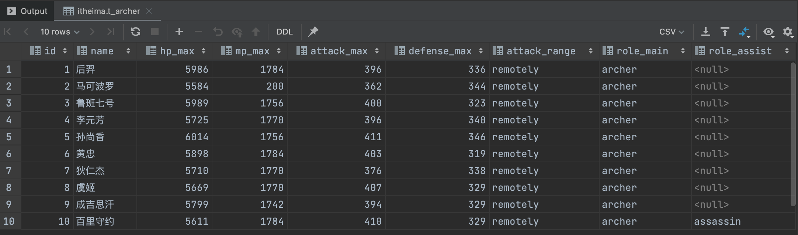
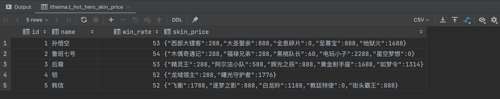

## 一、Hive DDL建库语法
```sql
-- 创建数据库
create database if not exists itheima;
show databases;

-- 切换数据库
use itheima;
```
## 二、Hive DDL建表语法
### 2.1 原生数据类型案例
文件[archer.txt](honor_of_kings/hero/archer.txt)中记录了手游《王者荣耀》射手的相关信息，其中字段之间分隔符为制表符\t,要求在Hive中建表映射成功该文件。<br>
```
1	后羿	5986	1784	396	336	remotely	archer
2	马可波罗	5584	200	362	344	remotely	archer
```
字段之间的分隔符是制表符，需要使用row format语法进行指定。
```sql
create table t_archer(
    id int comment "ID",
    name string comment "英雄名称",
    hp_max int comment "最大生命",
    mp_max int comment "最大法力",
    attack_max int comment "最高物攻",
    defense_max int comment "最大物防",
    attack_range string comment "攻击范围",
    role_main string comment "主要定位",
    role_assist string comment "次要定位"
)
row format delimited
fields terminated by "\t"
;

show tables;
```
建表成功之后，在Hive的默认存储路径下就生成了表对应的文件夹，把`archer.txt`文件上传到对应的表文件夹下。
```
$HADOOP_HOME/bin/hdfs dfs -put /home/hive/honor_of_kings/hero/archer.txt /user/hive/warehouse/itheima.db/t_archer

select * from t_archer;
```


### 2.2 复杂数据类型案例
文件[hot_hero_skin_price.txt](honor_of_kings/hot_hero_skin_price.txt)中记录了手游《王者荣耀》热门英雄的相关皮肤价格信息，内容如下,要求在Hive中建表映射成功该文件。
```
1,孙悟空,53,西部大镖客:288-大圣娶亲:888-全息碎片:0-至尊宝:888-地狱火:1688
2,鲁班七号,54,木偶奇遇记:288-福禄兄弟:288-黑桃队长:60-电玩小子:2288-星空梦想:0
```
字段：id、name（英雄名称）、win_rate（胜率）、skin_price（皮肤及价格）<br>
分析：前3个字段原生数据类型、最后一个字段复杂类型map。需要指定字段之间分隔符、集合元素之间分隔符、map kv之间分隔符。
```sql
create table t_hot_hero_skin_price(
    id int,
    name string,
    win_rate int,
    skin_price map<string,int>
)
row format delimited
fields terminated by ','
collection items terminated by '-'
map keys terminated by ':' ;
```
建表成功后，把`hot_hero_skin_price.txt`文件上传到对应的表文件夹下，并执行查询操作
```
$HADOOP_HOME/bin/hdfs dfs -put /home/hive/honor_of_kings/hot_hero_skin_price.txt /user/hive/warehouse/itheima.db/t_hot_hero_skin_price

select * from t_hot_hero_skin_price;
```



