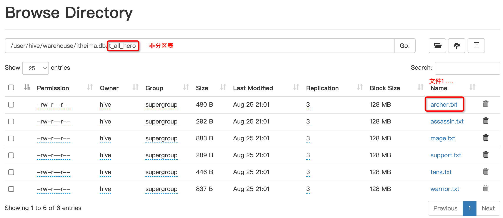
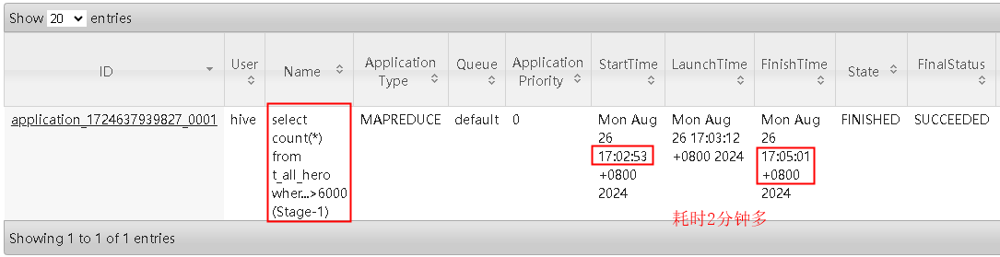
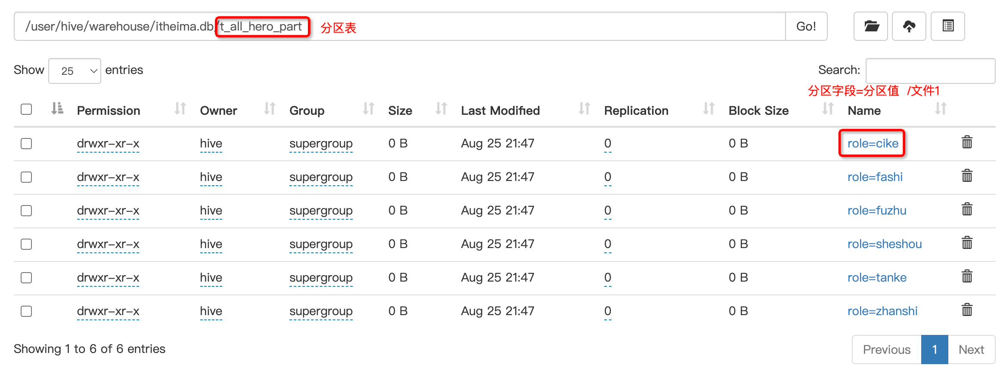
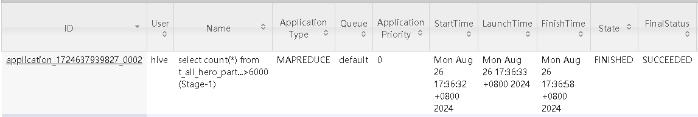
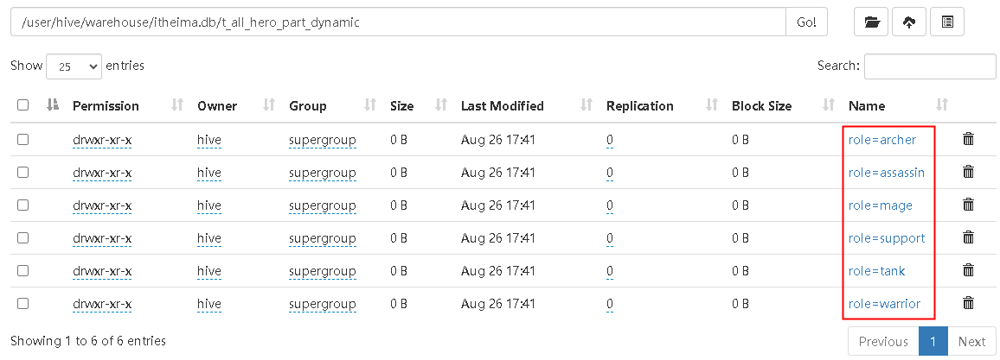

## 一、Hive DDL建库语法
```sql
-- 创建数据库
create database if not exists itheima;
show databases;

-- 切换数据库
use itheima;
```
## 二、Hive DDL-建表语法
### 2.1 原生数据类型案例
文件[archer.txt](honor_of_kings/hero/archer.txt)中记录了手游《王者荣耀》射手的相关信息，其中字段之间分隔符为制表符\t,要求在Hive中建表映射成功该文件。<br>
```
1	后羿	5986	1784	396	336	remotely	archer
2	马可波罗	5584	200	362	344	remotely	archer
```
字段之间的分隔符是制表符，需要使用row format语法进行指定。
```sql
create table t_archer(
    id int comment "ID",
    name string comment "英雄名称",
    hp_max int comment "最大生命",
    mp_max int comment "最大法力",
    attack_max int comment "最高物攻",
    defense_max int comment "最大物防",
    attack_range string comment "攻击范围",
    role_main string comment "主要定位",
    role_assist string comment "次要定位"
)
row format delimited
fields terminated by "\t"
;

show tables;
```
建表成功之后，在Hive的默认存储路径下就生成了表对应的文件夹，把`archer.txt`文件上传到对应的表文件夹下。
```
$HADOOP_HOME/bin/hdfs dfs -put /home/hive/honor_of_kings/hero/archer.txt /user/hive/warehouse/itheima.db/t_archer

select * from t_archer;
```


### 2.2 复杂数据类型案例
文件[hot_hero_skin_price.txt](honor_of_kings/hot_hero_skin_price.txt)中记录了手游《王者荣耀》热门英雄的相关皮肤价格信息，内容如下,要求在Hive中建表映射成功该文件。
```
1,孙悟空,53,西部大镖客:288-大圣娶亲:888-全息碎片:0-至尊宝:888-地狱火:1688
2,鲁班七号,54,木偶奇遇记:288-福禄兄弟:288-黑桃队长:60-电玩小子:2288-星空梦想:0
```
字段：id、name（英雄名称）、win_rate（胜率）、skin_price（皮肤及价格）<br>
分析：前3个字段原生数据类型、最后一个字段复杂类型map。需要指定字段之间分隔符、集合元素之间分隔符、map kv之间分隔符。
```sql
create table t_hot_hero_skin_price(
    id int,
    name string,
    win_rate int,
    skin_price map<string,int>
)
row format delimited
fields terminated by ','            -- 指定字段之间的分隔符
collection items terminated by '-'  -- 指定集合元素之间的分隔符
map keys terminated by ':'          -- 指定map元素kv之间的分隔符
```
建表成功后，把`hot_hero_skin_price.txt`文件上传到对应的表文件夹下，并执行查询操作
```
$HADOOP_HOME/bin/hdfs dfs -put /home/hive/honor_of_kings/hot_hero_skin_price.txt /user/hive/warehouse/itheima.db/t_hot_hero_skin_price

select * from t_hot_hero_skin_price;
```


### 2.3 默认分隔符案例
文件[team_ace_player.txt](honor_of_kings/team_ace_player.txt)中记录了手游《王者荣耀》主要战队内最受欢迎的王牌选手信息，内容如下,要求在Hive中建表映射成功该文件。
```
1成都AG超玩会一诺
2重庆QGhappyHurt
```
字段：id、team_name（战队名称）、ace_player_name（王牌选手名字）<br>
分析：数据都是原生数据类型，且字段之间分隔符是\001，因此在建表的时候可以省去row format语句，因为hive默认的分隔符就是\001。
```
create table if not exists t_team_ace_player(
    id int,
    team_name string,
    ace_player_name string
);
```
建表成功后，把`team_ace_player.txt`文件上传到对应的表文件夹下，并执行查询操作
```
$HADOOP_HOME/bin/hdfs dfs -put /home/hive/honor_of_kings/team_ace_player.txt /user/hive/warehouse/itheima.db/t_team_ace_player

select * from t_team_ace_player;
```


### 2.4 指定存储路径
在Hive建表的时候，可以通过location语法来更改数据在HDFS上的存储路径，使得建表加载数据更加灵活方便。
```sql
-- 语法：LOCATION '<hdfs_location>'。
drop table if exists t_team_ace_player;
create table if not exists t_team_ace_player(
    id int,
    team_name string,
    ace_player_name string
) location "/data"
;
select * from t_team_ace_player;
```

## 三、Hive DDL-内部表、外部表
### 3.1 内部表、外部表
`内部表`（Internal table）也称为被Hive拥有和管理的托管表（Managed table）。 默认情况下创建的表就是内部表，Hive拥有该表的结构和文件。`当删除内部表时，它会删除数据以及表的元数据`。
```sql
drop table if exists student;
create table student
(
    num  int,
    name string,
    sex  string,
    age  int,
    dept string
)
row format delimited
    fields terminated by ','
location "/data/student";

desc formatted student;

-- $HADOOP_HOME/bin/hdfs dfs -put /home/hive/honor_of_kings/students.txt /data/student
select  * from student;
drop table student;
```
<br>

`外部表`（External table）中的数据不是Hive拥有或管理的，只管理表元数据的生命周期。要创建一个外部表，需要使用`EXTERNAL`语法关键字。
删除外部表只会删除元数据，而不会删除实际数据。在Hive外部仍然可以访问实际数据。 而且外部表更为方便的是可以搭配`location`语法指定数据的路径。
```sql
drop table if exists student_ext;
create external table if not exists student_ext (
    num  int,
    name string,
    sex  string,
    age  int,
    dept string
)
row format delimited
    fields terminated by ','
location "/data/student_ext";;

desc formatted student_ext;

-- $HADOOP_HOME/bin/hdfs dfs -put /home/hive/honor_of_kings/students.txt /data/student_ext
select  * from student_ext;
drop table student_ext;
```
<br>

内部表与外部表的区别：

|          | **内部表、托管表**                                     | **外部表**             |
|----------|-------------------------------------------------|---------------------|
| 创建方式     | 默认情况下                                           | 使用外部(External)语法关键字 |
| Hive管理范围 | 元数据、表数据                                         | 元数据                 |
| 删除表结果    | 删除元数据，删除HDFS上文件数据                               | 只会删除元数据             |
| 操作       | 支持ARCHIVE, UNARCHIVE,TRUNCATE,MERGE,CONCATENATE | 不支持                 |
| 事务       | 支持ACID/事务性                                      | 不支持                 |
| 缓存       | 支持结果缓存                                          | 不支持                 |

### 3.2 分区表
现有6份数据文件，分别记录了《王者荣耀》中6种位置的英雄相关信息。现要求通过建立一张表t_all_hero，把6份文件同时映射加载。
```sql
create table t_all_hero(
    id int,
    name string,
    hp_max int,
    mp_max int,
    attack_max int,
    defense_max int,
    attack_range string,
    role_main string,
    role_assist string
)
    row format delimited
        fields terminated by "\t";

-- cd /home/hive/honor_of_kings/hero/
-- $HADOOP_HOME/bin/hdfs dfs -put archer.txt assassin.txt mage.txt support.txt tank.txt warrior.txt /user/hive/warehouse/itheima.db/t_all_hero
```
<br><br>


现要求查询role_main主要定位是射手并且hp_max最大生命大于6000的有几个，如何优化可以加快查询，减少全表扫描呢？
```sql
-- 2m31s
select count(*) from t_all_hero where role_main="archer" and hp_max >6000;
```
<br><br>

针对《王者荣耀》英雄数据，重新创建一张分区表t_all_hero_part，以role角色作为分区字段。
`注意`：分区字段不能是表中已经存在的字段，因为分区字段最终也会以虚拟字段的形式显示在表结构上。

#### 3.2.1 分区表数据加载-静态分区
```sql
create table t_all_hero_part(
       id int,
       name string,
       hp_max int,
       mp_max int,
       attack_max int,
       defense_max int,
       attack_range string,
       role_main string,
       role_assist string
) 
partitioned by (role string)
row format delimited
fields terminated by "\t";
```
`静态分区`指的是分区的字段值是由用户在加载数据的时候手动指定。 语法如下：
```sql
load data [local] inpath ' ' into table tablename partition(分区字段='分区值'...);

-- 载入数据
load data local inpath '/home/hive/honor_of_kings/hero/archer.txt' into table t_all_hero_part partition(role='archer');
load data local inpath '/home/hive/honor_of_kings/hero/assassin.txt' into table t_all_hero_part partition(role='assassin');
load data local inpath '/home/hive/honor_of_kings/hero/mage.txt' into table t_all_hero_part partition(role='mage');
load data local inpath '/home/hive/honor_of_kings/hero/support.txt' into table t_all_hero_part partition(role='support');
load data local inpath '/home/hive/honor_of_kings/hero/tank.txt' into table t_all_hero_part partition(role='tank');
load data local inpath '/home/hive/honor_of_kings/hero/warrior.txt' into table t_all_hero_part partition(role='warrior');
```

<br>

重新执行统计SQL：耗时仅`32s`
```sql
-- 32s
select count(*) from t_all_hero_part where role="archer" and hp_max >6000;
```
<br>


#### 3.2.2 分区表数据加载-动态分区
动态分区是指分区的字段值是基于查询结果自动推断。核心语法就是insert+select。启用hive动态分区，需要在hive会话中设置两个参数：
```sql
set hive.exec.dynamic.partition=true;
set hive.exec.dynamic.partition.mode=nonstrict;
```
第一个参数表示开启动态分区功能，第二个参数指定动态分区的模式。分为`nonstick非严格模式`和`strict严格模式`。strict严格模式要求至少有一个分区为静态分区。<br>
创建一张新的分区表t_all_hero_part_dynamic：
```sql
create table t_all_hero_part_dynamic(
    id int,
    name string,
    hp_max int,
    mp_max int,
    attack_max int,
    defense_max int,
    attack_range string,
    role_main string,
    role_assist string
) 
partitioned by (role string)
row format delimited
    fields terminated by "\t";
```
执行动态分区插入:
```sql
-- 46s
insert into table t_all_hero_part_dynamic partition(role)
select tmp.*,tmp.role_main from t_all_hero tmp;
```
动态分区插入时，分区值是根据查询返回字段位置自动推断的。<br>

<br>

#### 3.2.3 多重分区表

通过建表语句中关于分区的相关语法可以发现，Hive支持多个分区字段：
```sql
PARTITIONED BY (partition1 data_type, partition2 data_type,….)

```
多重分区下，分区之间是一种递进关系，可以理解为在前一个分区的基础上继续分区。从HDFS的角度来看就是文件夹下继续划分子文件夹。
```sql
--单分区表，按省份分区
create table t_user_province (id int, name string,age int) partitioned by (province string);

--双分区表，按省份和市分区
create table t_user_province_city (id int, name string,age int) partitioned by (province string, city string);

--三分区表，按省份、市、县分区
create table t_user_province_city_county (id int, name string,age int) partitioned by (province string, city string,county string);
```

#### 3.2.4 分区表使用总结

分区的概念： 
+ 提供了一种将 Hive 表数据分离为多个文件/目录的方法。
+ `不同分区对应着不同的文件夹`，同一分区的数据存储在同一个文件夹下。
+ 只需根据分区值找到对应的文件夹，扫描该分区下的文件，避免全表数据扫描。

分区表使用重点：
1. 建表时选择合适的分区字段： 根据业务场景设置合适的分区字段，比如日期、地域、类别等。
2. 查询时使用分区过滤：查询时尽量使用 `WHERE` 子句进行分区过滤，避免全表扫描，查询指定分区的数据。

分区表注意事项：
1. 可选优化手段：分区表不是建表的必要语法规则，`只是一种优化手段`。
2. **分区字段不能重复**：分区字段不能是表中已有的字段，`不能重复定义`。
3. **虚拟字段**：分区字段是虚拟字段，其数据并不存储在底层文件中。
4. **分区字段值的确定**：分区字段值可以由用户手动指定（静态分区）或根据查询结果自动推断（动态分区）。
5. 多重分区支持：Hive 支持多重分区，即在分区的基础上可以继续分区，以达到更细粒度的划分。


