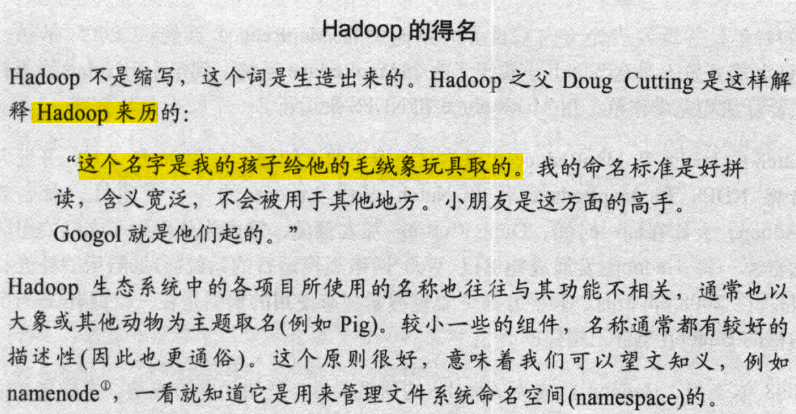

<nav>
<a href="#一hadoop发展历程">一、Hadoop发展历程</a> 
<a href="#二hadoop核心组件">二、Hadoop核心组件</a> 
<a href="#参考引用">参考引用</a> 
</nav>

### 一、Hadoop发展历程
Hadoop最早起源于Nutch。Nutch的设计目标是构建一个大型的全网搜索引擎，包括网页抓取、索引、查询等功能，但随着抓取网页数量的增加，遇到了严重的可扩展性问题——如何解决数十亿网页的存储和索引问题。
2003年开始谷歌陆续发表的三篇论文为该问题提供了可行的解决方案。

+ `分布式文件系统`（GFS），可用于处理海量网页的存储 
  数据存储单位：1ZB = $10^3$EB = $10^6$PB = $10^9$TB = $10^{21}$B
+ `分布式计算框架`（MAPREDUCE），可用于处理海量网页的索引计算问题。
+ `BigTable` 数据库：OLTP 联机事务处理 Online Transaction Processing 增删改 
  OLAP 联机分析处理 Online Analysis Processing 查询 
  真正的作用：提供了一种可以在超大数据集中进行实时CRUD操作的功能

Nutch的开发人员完成了相应的开源实现HDFS和MAPREDUCE，并从Nutch中剥离成为独立项目HADOOP。 

2006年2月，Hadoop项目正式成为Lucene项目的一个子项目。 
2008年1月，Hadoop项目已经成为Apache的顶级项目。 
2008年4月，打破世界纪录，成为最快的TB级数据排序系统。

**Hadoop**提供了一个可靠的共享存储和分析系统，`HDFS`实现存储，`MapReduce`实现分析处理。并行访问数据需解决以下几个问题：
+ 硬件故障问题。
+ 大多数分析任务需要以某种方式结合大部分数据来共同完成分析。

hadoop的概念：
狭义上： 就是apache的一个顶级项目：Apache Hadoop
广义上: 就是指以Hadoop为核心的整个大数据处理体系

### 二、Hadoop核心组件
Hadoop的官网：http://hadoop.apache.org/
Hadoop的核心组件：

| 组件                | 说明                                        | 
|:----------------------|:--------------------------------------------|
| **Hadoop Common**          | 支持其他Hadoop模块的常用实用工具包。        |
| **Hadoop HDFS™**| 一种分布式文件系统，可提供对应用程序数据的高吞吐量访问。        | 
| **Hadoop YARN**| 作业调度和集群资源管理的框架。        | 
| **Hadoop MapReduce**          | 基于YARN的系统，用于并行处理大型数据集           |
| **Hadoop Ozone**          | Hadoop的对象存储。           |

Apache的其他Hadoop相关项目包括：

| 项目名称            | 描述                                                                                                                        |
|---------------------|-----------------------------------------------------------------------------------------------------------------------------|
| **Ambari™**         | 基于Web的Hadoop管理工具，用于配置、管理和监控Apache Hadoop集群，包括对Hadoop HDFS，Hadoop MapReduce，Hive，HCatalog，HBase，ZooKeeper，Oozie，Pig和Sqoop的支持。 Ambari还提供了一个用于查看集群运行状况的仪表板，例如热图和能够直观地查看MapReduce，Pig和Hive应用程序以及以用户友好的方式诊断其性能特征的功能。 |
| **Avro™**           | 数据序列化格式与传输工具，即一种跨语言的数据序列化库。                                                                        |
| **Cassandra™**      | 可扩展的多主数据库，没有单点故障。                                                                                          |
| **Chukwa™**         | 用于管理大型分布式系统的数据收集系统。                                                                                      |
| **HBase™**          | 可扩展的分布式的面向列的实时数据库，支持大型表的结构化数据存储。                                                            |
| **Hive™**           | 一种数据仓库基础架构，用于管理HDFS中存储的数据和SQL即时查询。                                                               |
| **Mahout™**         | 可扩展的机器学习和数据挖掘库。                                                                                              |
| **Pig™**            | 大数据分析平台，用于并行计算的高级数据流语言和执行框架。                                                                    |
| **Sqoop**           | 支持在结构化数据存储(如关系型数据库)和HDFS之间高效批量传输数据。                                                           |
| **Spark™**          | 用于Hadoop数据的快速通用计算引擎。 Spark提供了一种简单而富有表现力的编程模型，支持广泛的应用程序，包括ETL，机器学习，流处理和图形计算。  |
| **Tez™**            | 基于Hadoop YARN构建的通用数据流编程框架，它提供了一个功能强大且灵活的引擎，可以执行任意DAG任务来处理批量和交互式用例的数据。 Tez正被Hadoop生态系统中的Hive™，Pig™和其他框架以及其他商业软件（例如ETL工具）采用，以取代Hadoop™MapReduce作为底层执行引擎。 |
| **ZooKeeper™**      | 用于分布式应用程序的高可用的协调服务，提供用于构建分布式应用的原语集。                                                      |

### 参考引用
1. Tom White . hadoop 权威指南 [M] . 清华大学出版社 . 2017.