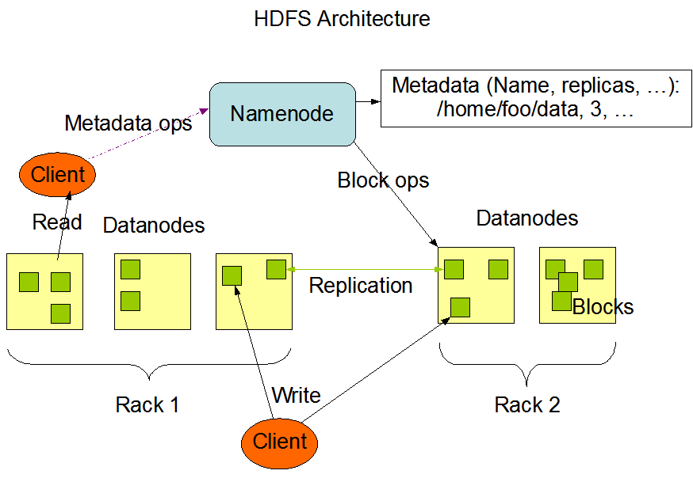
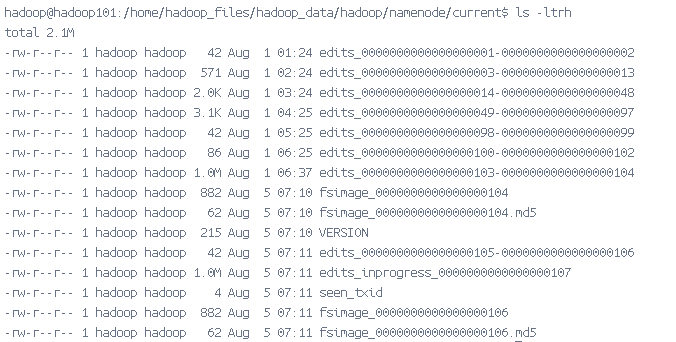

## 一、HDFS介绍
Hadoop分布式文件系统（Hadoop Distributed File System ，HDFS）是一个`高容错`、`低成本`、`高吞吐量`的分布式文件系统，适用于`大数据集`的批处理应用，可以部署在低成本的硬件上。其设计目标包括：

1. `硬件故障容忍`：硬件故障是常态，HDFS必须具备故障检测和快速自动恢复的能力。
2. `流式数据访问`：HDFS侧重高吞吐量而非低延迟的数据访问，适合批处理而非交互式使用。<br>
   流式数据访问只需要寻址一次，就可以连续读取大量数据，适用于大数据处理和分析任务。<br>
   随机数据访问适用于需要频繁、小规模数据读写操作的场景，如关系型数据库。
3. 大数据集支持：HDFS支持几GB到几TB的大文件和高聚合数据带宽，能够在单个实例中管理数千万个文件。
4. `简单一致性模型`：文件采用`一次写入多次读取`的模式，**只支持追加和截断操作、不能在任意点更新*，简化数据一致性管理。
5. `就近计算`：优化计算任务靠近数据的位置执行，减少网络拥塞，提高系统吞吐量。
6. 跨平台可移植性：设计上便于从一个平台移植到另一个平台，支持广泛采用。


HDFS适用场景：
1）构建在廉价的机器上；2）适合批量数据处理；3）适合大数据处理；4）适合流式数据访问。

HDFS的限制：
1）不适合低延迟访问；2）不适合存储小文件；3）不支持并发写入；4）不支持随机修改。

## 二、HDFS架构设计
HDFS 采用的是 `Master/Slave` (主从)架构，一个 HDFS 集群包含一个单独的 NameNode 和多个 DataNode 节点，如下图所示（ HDFS1.0架构图）：



主要分为以下几个角色。

| 节点类型                | 服务                                        | 角色                              |
|:----------------------|:--------------------------------------------|:---------------------------------|
| **NameNode**          | HDFS NameNode                               | 负责管理文件系统的元数据和维护文件系统的命名空间|
| **Secondary NameNode**| HDFS Secondary NameNode                     | 辅助 NameNode 合并元数据            |
| **DataNode**          | HDFS DataNode                               | 存储数据块并执行数据处理任务           |

### 2.1 数据块 (Block、存储模型)
HDFS 将每个文件划分成一系列的数据块，除了最后一个，所有的数据块都是同样大小的。（Hadoop 1.x默认`64MB`，Hadoop 2.x默认`128MB`）HDFS中小于一个块大小的文件不会占据整个块的空间。
> 例如：当一个1MB的文件存储在一个128MB的块中时，文件只使用1MB的磁盘空间，而不是128MB
> HDFS中的块为什么这么大？
HDFS的块比磁盘的块大，其目的是为了`最小化寻址开销`。如果块足够大，从磁盘传输数据的时间会明显大于定位这个块开始位置所需的时间。因而，传输一个由多个块组成的大文件的时间取决于`磁盘传输速率`。

数据块设计的好处：<br>
(1) 一个文件的大小可以大于网络中任意一个磁盘的容量。<br>
(2) 使用抽象块而非整个文件作为存储单元，大大简化存储子系统的设计。<br>
(3) 块非常适合用于数据备份进而提供`数据容错能力`和`提高可用性`。<br>
    将每个块复制到少数几个物理上相互独立的机器上，可以确保在块、磁盘或机器发生故障后数据不会丢失。<br>

```shell
# 显示数据块块信息的`fsck`指令
$HADOOP_HOME/bin/hdfs fsck / -files -blocks
```
为了容错，文件的所有数据块都会有副本。每个文件的`数据块大小`和`副本系数`都是可配置的。应用程序可以指定某个文件的副本数目。副本系数可以在文件创建的时候指定，也可以在之后改变。HDFS中的文件都是`一次性写入`的，并且严格要求在任何时候只能有一个写入者。（默认为3个）
```xml
<!--hdfs.xml-->
<!--  数据块大小,以字节为单位  -->
<property>
    <name>dfs.blocksize</name> 
    <value>	134217728</value>
</property>
<!--  副本系数  -->
<property>
     <name>dfs.replication</name>
     <value>3</value>
</property>
```

### 2.2 NameNode
NameNode(`管理节点`)是一个中心服务器，负责管理文件系统的元数据和维护文件系统的命名空间。它的主要职责包括：

1. `管理文件系统命名空间`：维护文件系统树（FileSystem）及整棵树内所有的文件和目录以及文件与数据块的映射关系。
2. 数据块管理：记录文件中各个数据块所在的数据节点的位置信息以及文件的物理块与实际存储位置的映射关系。
3. `元数据存储和管理`：存储文件系统的元数据，包括文件名、权限、时间戳和数据块位置等信息。
4. 处理客户端请求：处理来自客户端的文件操作请求，如创建、删除、重命名和读取文件，并更新相应的元数据。
5. 监控集群健康：监控DataNode的状态和健康情况，检测故障并进行自动恢复，确保数据的完整性和可用性。
6. 灾难恢复和故障转移： 提供元数据的备份和恢复机制，通过Secondary NameNode或高可用配置进行元数据的同步和故障转移。

#### 2.2.1 元数据管理
元数据（Metadata），又称中介数据、中继数据，为描述数据的数据（data about data），主要是描述数据属性的信息。<br>
HDFS元数据，按类型分，主要包括以下几个部分：
1. 文件和目录自身的`属性信息`，例如文件名、目录名、父目录信息、文件大小、创建时间、修改时间等。
2. 文件内容`存储信息`，例如文件块情况、副本个数、每个副本所在的DataNode 信息等。
3. HDFS中所有`DataNode信息`，用于DataNode管理。

按形式分为内存元数据和元数据文件两种，分别存在内存和磁盘上。<br>

HDFS磁盘上元数据文件分为两类，用于持久化存储：
1. **fsimage 镜像文件**<br>
   元数据的一个持久化的检查点，包含 Hadoop 文件系统中的所有目录和文件元数据信息，但不包含文件块位置的信息。<br>
   `文件块位置信息只存储在内存中`，是在 datanode 加入集群的时候，namenode 询问 datanode 得到的，并且间断的更新。
2. **edits 编辑日志**<br>
   存放的是 Hadoop 文件系统的所有`更改操作`（文件创建，删除或修改）的日志，文件系统客户端执行的更改操作首先会被记录到 edits 文件中。

元数据持久化：<br>
（1） **NameNode格式化（format）时**<br>
  在元数据镜像文件备份路径的current目录下，产生元数据文件：fsimage、fstime、VERSION等；<br>
  在日志文件备份路径的current目录下，产生日志文件：edits、fstime、VERSION等。<br>
（2） **Hadoop启动时**<br>
NameNode启动的时候，首先将映像文件(fsimage)载入内存，并执行编辑日志(edits)中的各项操作。<br>
  一旦在内存中成功建立文件系统元数据的映射，则创建一个新的fsimage文件(这个操作不需要SecondaryNameNode)和一个空的编辑日志。<br>
（3） **新增或者修改操作时**<br>
当客户端对 HDFS 中的文件进行新增或者修改操作，新的操作日志不会立即与 fsimage 进行合并，也不会更新到 NameNode 的内存中，而是会先写到 edits 中，操作成功之后更新至内存。如果所有的更新操作都往 fsimage 文件中添加，这会导致系统运行的十分缓慢。
  
HDFS 这种设计的目的：<br>
（1）内存中数据更新、查询快，极大`缩短了操作响应时间`；<br>
（2）内存中元数据丢失风险颇高（断电等），因此辅佐元数据镜像文件（fsimage）和编辑日志文件（edits）的备份机制进行`确保元数据的安全`。

#### 2.2.2 元数据目录相关文件
NameNode元数据相关的文件目录`$dfs.namenode.name.dir/current`


VERSION：存放 hdfs 集群的版本信息。
```
# HDFS集群的唯一标识符
namespaceID=2051317214
clusterID=CID-a1a44192-f6d8-4b27-9795-f7055a116d72
blockpoolID=BP-1756884500-172.18.0.4-1722475407498

# NameNode存储系统创建的时间戳
cTime=1722475407498

# 说明这个文件存储的是什么进程的数据结构信息
storageType=NAME_NODE

# HDFS永久性数据结构的版本信息，是一个负整数。
layoutVersion=-64
```
fsimage 镜像文件：元数据的一个持久化的检查点，包含 Hadoop 文件系统中的所有目录和文件元数据信息。
```
$HADOOP_HOME/bin/hdfs oiv -i fsimage_0000000000000000104 -p XML -o fsimage.xml
cat fsimage.xml
```
edits 文件：存放Hadoop文件系统的所有更新操作的路径。
```
$HADOOP_HOME/bin/hdfs oev -i edits_0000000000000000001-0000000000000000002 -o edits.xml 
cat edits.xml
```

### Secondary NameNode
NameNode存在的问题：<br>
(1) edit logs 文件会变的很大，怎么去管理这个文件是一个挑战。<br>
(2) NameNode 重启会花费很长时间，因为有很多改动要合并到 fsimage 文件上。<br>
(2) 如果 NameNode 挂掉了，那就丢失了一些改动。因为此时的 fsimage 文件非常旧。<br>

SecondaryNamenode 的作用就是分担 namenode 的合并元数据的压力。所以在配置 SecondaryNamenode 的工作节点时，一定切记，不要和 namenode 处于同一节点。但事实上， 只有在普通的伪分布式集群和分布式集群中才有会 SecondaryNamenode 这个角色，在 HA 或 者联邦集群中都不再出现该角色。在 HA 和联邦集群中，都是有 standby namenode 承担。

+ **职责**

SecondaryNameNode 不是 NameNode 的备份（但可以做备份），它的主要工作是`帮助 NameNode 合并 edits 日志到 fsimage 文件中，减少 NameNode 启动时间`。
+ **CheckPoint**

每达到触发条件，会由 SecondaryNameNode 将 NameNode 上积累的所有 edits 和一个最新的 fsimage 下载到本地，并加载到内存进行 merge（这个过程称为 `checkpoint`），如下 图所示：

<center></center>
+ **Checkpoint 触发条件** (core-site.xml)
(1) 根据配置文件设置的时间间隔 `fs.checkpoint.period`  默认3600秒
(2) 根据配置文件设置edits log大小 `fs.checkpoint.size` 规定edits文件的最大值默认是64MB 

+ **缺点**
  保存的状态总是`滞后于主节点`，难免会丢失部分数据。不能作为 NameNode 的热备。

### DataNode

### 容错机制

#### 1. 安全模式（Safe Mode）
NameNode启动并加载 fsimage和edits时，处于`安全模式`：
1. 此时 NameNode 的文件系统对于客户端来说是`只读`的。<br>
   显示目录、显示文件内容等、写、删除、重命名都会失败。
2. 在此阶段NameNode会收集各个DataNode的报告。<br>
   当数据块达到最小副本数以上时，会被认为是“安全”的， 在一定比例（可设置）的数据块被确定为“安全”后，再过若干时间，安全模式结束。<br>
   当检测到副本数不足的数据块时，该块会被复制直到达到最小副本数，系统中数据块的位置并不是由NameNode维护的，而是以`块列表形式存储在DataNode中`。

#### 2. 心跳机制和健康检查（Heartbeat and Health Check）
两者通过`心跳`来传递管理信息和数据信息 (3秒/次)，通过这种方式的信息传递NameNode 可以获知每个 DataNode 保存的 Block 信息、DataNode 的健康状况、命令 DataNode 启动停止（如果`10分钟`内没有收到DataNode的心跳，则认为该节点已经丢失，并将其负责的 block 在其他 DataNode 上进行备份）。

如果运行NameNode服务的机器毁坏，文件系统上的所有文件将会丢失，所以`容错机制`来重建文件。
1. 备份那些组成文件系统元数据持久状态的文件。(fsimage、edits)
2. 运行一个辅助 NameNode，但它不能被用作NameNode。(SNN)

#### 3. 数据副本（Replication）
HDFS采用一种称为`机架感知(rack-aware)`的副本放置/选择策略来改进数据的可靠性、可用性和网络带宽的利用率。

+ **存放策略**

(1) `第1个副本`存放在本地机架的节点上

(2) `第2个副本`放在与第1个不同器且随机另外选择的机架节点上

(3) `第3个副本`与第2个副本放在同一个机架上且随机选择另一个节点。

(4) 其他副本放在集群中随机选择的节点上，尽量避免同一机架存放大量副本。

<center></center>

+ **选择策略**

为了`降低整体的带宽消耗和读取延时`，HDFS会`尽量让读取程序读取离它最近的副本`。如果在读取程序的同一个机架上有一个副本，那么就读取该副本。如果一个HDFS集群跨越多个数据中心，那么客户端也将首先读本地数据中心的副本。

###### 4. 数据块检查和恢复（Block Scanning and Recovery）

## 参考引用
[1] [Tom White . hadoop 权威指南 [M] . 清华大学出版社 . 2017.](https://book.douban.com/subject/23066032/) <br>
[2] [Hadoop学习之路（六）HDFS基础](https://www.cnblogs.com/qingyunzong/p/8524594.html#_label1) <br>
[3] [Hadoop学习之路（十二）分布式集群中HDFS系统的各种角色](https://www.cnblogs.com/qingyunzong/p/8554869.html) <br>
[4] [Hadoop学习之路（十一）HDFS的读写详解](https://www.cnblogs.com/qingyunzong/p/8548806.html) <br>
[5] [Hadoop学习之路（九）HDFS深入理解](https://www.cnblogs.com/qingyunzong/p/8535995.html) <br>
[6] [Hadoop分布式文件系统——HDFS](https://github.com/heibaiying/BigData-Notes/blob/master/notes/Hadoop-HDFS.md#%E4%B8%80%E4%BB%8B%E7%BB%8D) <br>
[7] [Apache Hadoop 设计架构](https://hadoop.apache.org/docs/r3.1.1/hadoop-project-dist/hadoop-hdfs/HdfsDesign.html) <br>
[8] [Apache Hadoop分布式文件系统：架构和设计](https://hadoop.apache.org/docs/r1.0.4/cn/hdfs_design.html) <br>
[9] [HDFS NameNode内存全景](https://tech.meituan.com/2016/08/26/namenode.html) <br>
[10] [Hadoop NameNode详解](https://blog.csdn.net/lb812913059/article/details/78713634) <br>
[11] [一文读懂 HDFS namenode元数据管理机制！](https://blog.csdn.net/lb812913059/article/details/78713634) <br>
