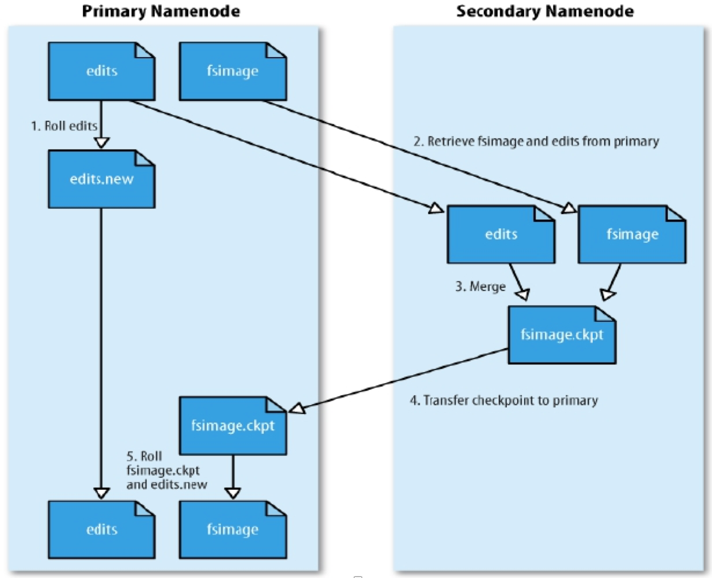
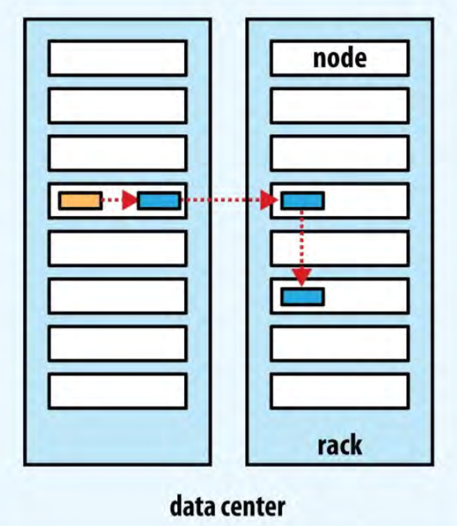
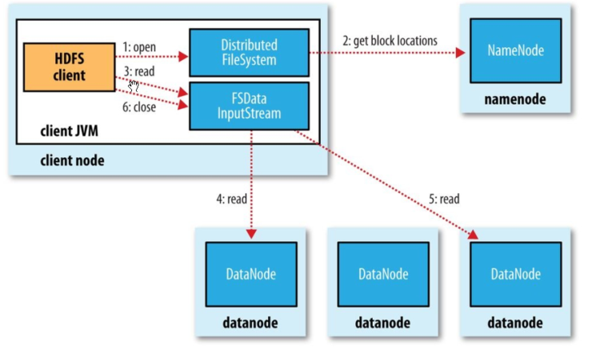
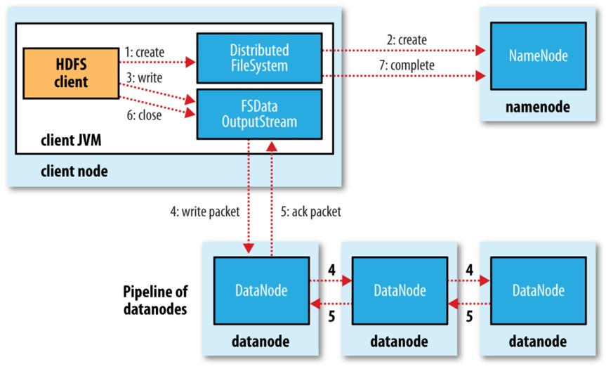

## 一、HDFS介绍
Hadoop分布式文件系统（Hadoop Distributed File System ，HDFS）是一个`高容错`、`低成本`、`高吞吐量`的分布式文件系统，适用于`大数据集`的批处理应用，可以部署在低成本的硬件上。其设计目标包括：

1. `硬件故障容忍`：硬件故障是常态，HDFS必须具备故障检测和快速自动恢复的能力。
2. `流式数据访问`：HDFS侧重高吞吐量而非低延迟的数据访问，适合批处理而非交互式使用。<br>
   流式数据访问只需要寻址一次，就可以连续读取大量数据，适用于大数据处理和分析任务。<br>
   随机数据访问适用于需要频繁、小规模数据读写操作的场景，如关系型数据库。
3. 大数据集支持：HDFS支持几GB到几TB的大文件和高聚合数据带宽，能够在单个实例中管理数千万个文件。
4. `简单一致性模型`：文件采用`一次写入多次读取`的模式，**只支持追加和截断操作、不能在任意点更新*，简化数据一致性管理。
5. `就近计算`：优化计算任务靠近数据的位置执行，减少网络拥塞，提高系统吞吐量。
6. 跨平台可移植性：设计上便于从一个平台移植到另一个平台，支持广泛采用。


HDFS适用场景：
1）构建在廉价的机器上；2）适合批量数据处理；3）适合大数据处理；4）适合流式数据访问。

HDFS的限制：
1）不适合低延迟访问；2）不适合存储小文件；3）不支持并发写入；4）不支持随机修改。

## 二、HDFS架构设计
HDFS 采用的是 `Master/Slave` (主从)架构，一个 HDFS 集群包含一个单独的 NameNode 和多个 DataNode 节点，如下图所示（ HDFS1.0架构图）：


主要分为以下几个角色。

| 节点类型                | 服务                                        | 角色                              |
|:----------------------|:--------------------------------------------|:---------------------------------|
| **NameNode**          | HDFS NameNode                               | 负责管理文件系统的元数据和维护文件系统的命名空间|
| **Secondary NameNode**| HDFS Secondary NameNode                     | 辅助 NameNode 合并元数据            |
| **DataNode**          | HDFS DataNode                               | 存储数据块并执行数据处理任务           |

### 2.1 数据块 (Block、存储模型)
HDFS 将每个文件划分成一系列的数据块，除了最后一个，所有的数据块都是同样大小的。（Hadoop 1.x默认`64MB`，Hadoop 2.x默认`128MB`）HDFS中小于一个块大小的文件不会占据整个块的空间。
> 例如：当一个1MB的文件存储在一个128MB的块中时，文件只使用1MB的磁盘空间，而不是128MB
> HDFS中的块为什么这么大？
HDFS的块比磁盘的块大，其目的是为了`最小化寻址开销`。如果块足够大，从磁盘传输数据的时间会明显大于定位这个块开始位置所需的时间。因而，传输一个由多个块组成的大文件的时间取决于`磁盘传输速率`。

数据块设计的好处：<br>
(1) 一个文件的大小可以大于网络中任意一个磁盘的容量。<br>
(2) 使用抽象块而非整个文件作为存储单元，大大简化存储子系统的设计。<br>
(3) 块非常适合用于数据备份进而提供`数据容错能力`和`提高可用性`。<br>
    将每个块复制到少数几个物理上相互独立的机器上，可以确保在块、磁盘或机器发生故障后数据不会丢失。<br>

```shell
# 显示数据块块信息的`fsck`指令
$HADOOP_HOME/bin/hdfs fsck / -files -blocks
```

#### 2.1.2 数据块副本
为了容错，文件的所有数据块都会有副本。每个文件的`数据块大小`和`副本系数`都是可配置的。应用程序可以指定某个文件的副本数目。副本系数可以在文件创建的时候指定，也可以在之后改变。HDFS中的文件都是`一次性写入`的，并且严格要求在任何时候只能有一个写入者。（默认为3个）
```
<!--hdfs.xml-->
<!--  数据块大小,以字节为单位  -->
<property>
    <name>dfs.blocksize</name> 
    <value>134217728</value>
</property>
<!--  副本系数  -->
<property>
     <name>dfs.replication</name>
     <value>3</value>
</property>
```
#### 2.1.3 块缓存机制
通常datanode从磁盘上读取块，但是对于`频繁访问`的数据块，datanode会将其缓存到dataNode节点的内存中，以`堆外块缓存`的形式（off-heap block cache ）存在。
默认情况下，`一个块只缓存到一个datanode内存中`。这样的话，计算框架，比如MR或者Spark就可以在缓存块的节点上运行计算任务，可以大大提高读操作的性能，进而提高任务的效率。
用户也可以通过在`缓存池`（cache pool） 中增加一个cache directive 来告诉namenode需要缓存哪些文件，以及文件缓存多久，缓存池是一个用于管理`缓存权限`和`资源使用`的管理分组。

### 2.2 NameNode
NameNode(`管理节点`)是一个中心服务器，负责管理文件系统的元数据和维护文件系统的命名空间。它的主要职责包括：

1. `管理文件系统命名空间`：维护文件系统树（FileSystem）及整棵树内所有的文件和目录以及文件与数据块的映射关系。
2. 数据块管理：记录文件中各个数据块所在的数据节点的位置信息以及文件的物理块与实际存储位置的映射关系。
3. `元数据存储和管理`：存储文件系统的元数据，包括文件名、权限、时间戳和数据块位置等信息。
4. 处理客户端请求：处理来自客户端的文件操作请求，如创建、删除、重命名和读取文件，并更新相应的元数据。
5. 监控集群健康：监控DataNode的状态和健康情况，检测故障并进行自动恢复，确保数据的完整性和可用性。
6. 灾难恢复和故障转移： 提供元数据的备份和恢复机制，通过Secondary NameNode或高可用配置进行元数据的同步和故障转移。

#### 2.2.1 元数据管理
元数据（Metadata），又称中介数据、中继数据，为描述数据的数据（data about data），主要是描述数据属性的信息。<br>
HDFS元数据，按类型分，主要包括以下几个部分：
1. 文件和目录自身的`属性信息`，例如文件名、目录名、父目录信息、文件大小、创建时间、修改时间等。
2. 文件内容`存储信息`，例如文件块情况、副本个数、每个副本所在的DataNode 信息等。
3. HDFS中所有`DataNode信息`，用于DataNode管理。

按形式分为内存元数据和元数据文件两种，分别存在内存和磁盘上。<br>

HDFS磁盘上元数据文件分为两类，用于持久化存储：
1. `fsimage 镜像文件`<br>
   元数据的一个持久化的检查点，包含 Hadoop 文件系统中的所有目录和文件元数据信息，但不包含文件块位置的信息。<br>
   `文件块位置信息只存储在内存中`，是在 datanode 加入集群的时候，namenode 询问 datanode 得到的，并且间断的更新。
2. `edits 编辑日志`<br>
   存放的是 Hadoop 文件系统的所有`更改操作`（文件创建，删除或修改）的日志，文件系统客户端执行的更改操作首先会被记录到 edits 文件中。

元数据持久化：<br>
（1） `NameNode格式化（format）时`<br>
  在元数据镜像文件备份路径的current目录下，产生元数据文件：fsimage、fstime、VERSION等；<br>
  在日志文件备份路径的current目录下，产生日志文件：edits、fstime、VERSION等。<br>
（2） `Hadoop启动时`<br>
NameNode启动的时候，首先将映像文件(fsimage)载入内存，并执行编辑日志(edits)中的各项操作。<br>
  一旦在内存中成功建立文件系统元数据的映射，则创建一个新的fsimage文件(这个操作不需要SecondaryNameNode)和一个空的编辑日志。<br>
（3） `新增或者修改操作时`<br>
当客户端对 HDFS 中的文件进行新增或者修改操作，新的操作日志不会立即与 fsimage 进行合并，也不会更新到 NameNode 的内存中，而是会先写到 edits 中，操作成功之后更新至内存。如果所有的更新操作都往 fsimage 文件中添加，这会导致系统运行的十分缓慢。
  
HDFS 这种设计的目的：<br>
（1）内存中数据更新、查询快，极大`缩短了操作响应时间`；<br>
（2）内存中元数据丢失风险颇高（断电等），因此辅佐元数据镜像文件（fsimage）和编辑日志文件（edits）的备份机制进行`确保元数据的安全`。

#### 2.2.2 元数据目录相关文件
NameNode元数据相关的文件目录`$dfs.namenode.name.dir/current`


VERSION：存放 hdfs 集群的版本信息。
```
# HDFS集群的唯一标识符
namespaceID=2051317214
clusterID=CID-a1a44192-f6d8-4b27-9795-f7055a116d72
blockpoolID=BP-1756884500-172.18.0.4-1722475407498

# NameNode存储系统创建的时间戳
cTime=1722475407498

# 说明这个文件存储的是什么进程的数据结构信息
storageType=NAME_NODE

# HDFS永久性数据结构的版本信息，是一个负整数。
layoutVersion=-64
```
fsimage 镜像文件：元数据的一个持久化的检查点，包含 Hadoop 文件系统中的所有目录和文件元数据信息。
```
$HADOOP_HOME/bin/hdfs oiv -i fsimage_0000000000000000104 -p XML -o fsimage.xml
cat fsimage.xml
```
edits 文件：存放Hadoop文件系统的所有更新操作的路径。
```
$HADOOP_HOME/bin/hdfs oev -i edits_0000000000000000001-0000000000000000002 -o edits.xml 
cat edits.xml
```

### 2.3 Secondary NameNode
NameNode存在的问题：<br>
(1) edit logs 文件会变的很大，怎么去管理这个文件是一个挑战。<br>
(2) NameNode 重启会花费很长时间，因为有很多改动要合并到 fsimage 文件上。<br>
(2) 如果 NameNode 挂掉了，那就丢失了一些改动。因为此时的 fsimage 文件非常旧。<br>

#### 2.3.1 工作机制
Secondary NameNode 作用是辅助NameNode进行元数据的checkpoint操作, 即合并fsimage文件。<br>
Secondary NameNode是一个`守护进程`，定时触发checkpoint操作操作。
事实上，只有在普通的伪分布式集群和分布式集群中才有会 SecondaryNameNode 这个角色，在 HA 或 者联邦集群中不再出现该角色，由 Standby NameNode 承担。

`主要职责`：帮助 NameNode 合并 edits 日志到 fsimage 文件中，减少 NameNode 启动时间。


#### 2.3.2 元数据的CheckPoint
每当达到触发条件，会由 SecondaryNameNode 将 NameNode 上积累的所有 edits 和一个最新的 fsimage 下载到本地，并加载到内存进行 merge（这个过程称为 `checkpoint`），如下 图所示：<br>


`Checkpoint 相关配置`(hdfs-site.xml)：
```
dfs.namenode.checkpoint.check.period=60  # 检查触发条件是否满足的频率，60 秒
dfs.namenode.checkpoint.dir=file://${hadoop.tmp.dir}/dfs/namesecondary

dfs.namenode.checkpoint.edits.dir=${dfs.namenode.checkpoint.dir}
dfs.namenode.checkpoint.max-retries=3  #最大重试次数
dfs.namenode.checkpoint.period=3600  # 两次 checkpoint 之间的时间间隔 3600 秒
dfs.namenode.checkpoint.txns=1000000 # 两次 checkpoint 之间最大的操作记录
```
`缺点`：保存的状态总是`滞后于主节点`，难免会丢失部分数据，不能作为 NameNode 的热备。

### 2.4 DataNode
DataNode 是文件系统的`工作节点`，主要职责如下：
1. 定期向 NameNode `发送所存储的块的列表信息` （Block Report）
2. `、存储`和`存储`用户的文件数据块（受客户端或 NameNode 调度）
3. 定期向 NameNode 汇报自身所持有的 block 信息（通过心跳信息上报）
4. DataNode 之间`通信`，复制数据块，保证数据冗余

#### 2.4.1 DataNode相关配置
DataNode 进程死亡或者网络故障造成 DataNode 无法与 NameNode 通信，NameNode 不会立即 把该节点判定为死亡，要经过一段时间，这段时间暂称作超时时长。则超时时长`timeout`的计算公式为： 
```
timeout = 2 * heartbeat.recheck.interval + 10 * dfs.heartbeat.interval
```
HDFS默认的 heartbeat.recheck-interval 大小为 5 分钟，dfs.heartbeat.interval 默认为 3 秒，则总超时时长 为 10 分钟+30 秒。

```
<!—数据节点向名称节点汇报它所存储的所有数据块的时间间隔，单位为ms，默认一个小时 -->
<property>
    <name>dfs.blockreport.intervalMsec</name>
    <value>3600000</value>
</property>
<!— NameNode 检查数据节点心跳信号的时间间隔，以毫秒为单位 -->
<property>
    <name>dfs.namenode.heartbeat.recheck-interval</name>
    <value>300000</value>
</property>
<!— 数据节点向名称节点发送心跳信号的时间间隔，以秒为单位 -->
<property>
    <name>dfs.heartbeat.interval</name>
    <value>3</value>
<property>
```

## 三、容错机制
HDFS通过以下机制保证高度的数据可靠性和容错能力，即使在面临硬件故障和其他系统问题时也能保证数据的安全和可访问性。

### 3.1 冗余备份/数据复制（Replication）

由于 Hadoop 被设计运行在廉价的机器上，这意味着硬件是不可靠的，为了保证容错性，HDFS 提供了数据复制机制。
HDFS 将每一个文件存储为一系列数据块，每个块由多个副本来保证容错，块的大小和复制因子可以自行配置。

### 3.1.2 实现原理

大型的 HDFS 实例在通常分布在多个机架的多台服务器上，不同机架上的两台服务器之间通过交换机进行通讯。
在大多数情况下，同一机架中的服务器间的网络带宽大于不同机架中的服务器之间的带宽。

因此，HDFS采用一种称为`机架感知(rack-aware)`的副本放置来改进数据的可靠性、可用性和网络带宽的利用率。<br>


对于常见情况，当复制因子为 3 时：
1. 冗余备份的`放置策略`：<br>
(1) `第1个副本`存放在本地机架的节点上<br>
(2) `第2个副本`放在与第1个不同器且随机另外选择的机架节点上<br>
(3) `第3个副本`与第2个副本放在同一个机架上且随机选择另一个节点。<br>
(4) 其他副本放在集群中随机选择的节点上，尽量避免同一机架存放大量副本。<br>

2. 冗余备份的`选择策略`：<br>
（1）为了最大限度地减少带宽消耗和读取延迟，HDFS 在执行读取请求时，优先读取距离读取器最近的副本。<br>
（2）如果在与读取器节点相同的机架上存在副本，则优先选择该副本。 <br>
（3）如果 HDFS 群集跨越多个数据中心，则优先选择本地数据中心上的副本。<br>
   注意：不允许同一个 `dataNode` 上具有同一个块的多个副本
   
### 3.2 安全模式（Safe Mode）
NameNode启动并加载 fsimage和edits时，处于`安全模式`：
1. 此时 NameNode 的文件系统对于客户端来说是`只读`的。<br>
   显示目录、显示文件内容等、写、删除、重命名都会失败。
2. 在此阶段NameNode会收集各个DataNode的报告。<br>
   当数据块达到最小副本数以上时，会被认为是“安全”的， 在一定比例（可设置）的数据块被确定为“安全”后，再过若干时间，安全模式结束。<br>
   当检测到副本数不足的数据块时，该块会被复制直到达到最小副本数，系统中数据块的位置并不是由NameNode维护的，而是以`块列表形式存储在DataNode中`。

### 3.3 心跳机制和健康检查（Heartbeat and Health Check）
NameNode和DataNode通过`心跳`来传递管理信息和数据信息 (3秒/次)。
通过这种方式的信息传递，NameNode 可以获知每个 DataNode 保存的 Block 信息、DataNode 的健康状况、命令 DataNode 启动停止（如果`10分钟`内没有收到DataNode的心跳，则认为该节点已经丢失，并将其负责的 block 在其他 DataNode 上进行备份）。

### 3.4 数据块检查和恢复（Block Scanning and Recovery）
由于存储设备故障等原因，存储在 DataNode 上的数据块也会发生损坏。为了避免读取到已经损坏的数据而导致错误，HDFS 提供了数据完整性校验机制来保证数据的完整性，具体操作如下：<br>
（1）当客户端创建 HDFS 文件时，它会计算文件的每个块的`校验和`，并将 `校验和` 存储在同一 HDFS 命名空间下的单独的隐藏文件中。<br>
（2）当客户端检索文件内容时，它会验证从每个 DataNode 接收的数据是否与存储在关联校验和文件中的 `校验和`匹配。<br>
（3）如果匹配失败，则证明数据已经损坏，此时客户端会选择从其他 DataNode 获取该块的其他可用副本。<br>

### 3.5 元数据的磁盘故障
`FsImage` 和 `EditLog` 是 HDFS 的核心数据，这些数据的意外丢失可能会导致整个 HDFS 服务不可用。为了避免这个问题，可以配置 NameNode 使其支持 `FsImage` 和 `EditLog` 多副本同步，这样 `FsImage` 或 `EditLog` 的任何改变都会引起每个副本 `FsImage` 和 `EditLog` 的同步更新。

### 3.6 支持快照
快照支持在特定时刻存储数据副本，在数据意外损坏时，可以通过回滚操作恢复到健康的数据状态。

## 四、数据流

### 4.1 HDFS 读流程



HDFS的读流程具体过程如下：<br>

1. 打开分布式文件<br>
客户端调用 FileSyste 对象 (DistributedFileSystem) 的 `open()` 方法，获得这个文件对应的输入流InputStream。
2. 寻址请求<br>
通过RPC 远程调用NameNode ，获得NameNode中此文件对应的数据块保存位置，包括这个文件的副本的保存位置（主要是各DataNode的地址），并根据与客户端的距离排序，返回一个输入流对象 FSDataInputStream；
3. 连接到 DataNode<br>
   获得输入流之后，客户端选择最近的DataNode建立连接并调用输入流的 `read()` 方法读取数据。<br>
   如果客户端和其中一个DataNode位于同一机器，那么就会直接从本地读取数据。
4. 读取另外的 DataNode 直到完成<br>
   达数据块末端，关闭与这个DataNode 的连接，然后重新查找下一个数据块的最佳 DataNode。
5. 不断执行第2 - 5 步直到数据全部读取完毕。
6. 客户端调用输入流的 `close()` 方法，关闭输入流DFSInputStream。

### 4.2 HDFS 写流程



HDFS的写流程具体过程如下：<br>
1. 发送RPC请求<br>
   使用 HDFS 提供的客户端 Client，向远程的 namenode 发起 RPC 请求
2. NameNode响应客户端请求<br>
   NameNode 会检查要创建的文件是否已经存在，创建者是否有权限进行操作，成功则会为文件创建一条记录、返回输出流 DFSOutputStream，否则会让客户端抛出异常；
3. 客户端写入数据<br>
   输出流 DFSOutputStream 将数据分成一个个的`数据包`，并写入内部队列 (`数据队列`)。<br>
   DataStreamer处理数据队列，并挑选出适合存储数据副本的一组 DataNode，据此来要求 NameNode 分配新的数据块。<br>
   这一组 DataNode 构成`管道`(管道的 DataNode 之间使用 Socket 流式通信)；<br>
4. 使用管道传输数据<br>
   DataStreamer 将数据包`流式传输`到管道第一个DataNode，该DataNode把该数据包存储之后，再将其传递给在此管道中的下一个DataNode，直到最后一个，这种写数据的方式呈流水线的形式。
5. 确认队列<br>
   DataNode 成功存储后发送确认，管道的 DataNode 所有的确认组成一个`确认队列`，并通过管道传递至客户端。<br>
   客户端成功收到 DataNode 返回的确认队列后会从数据队列中移除相应的数据包。
6. 故障处理<br>
   若过程中发生故障，则先`关闭管道`，把队列中所有数据包添加回去队列，确保数据包不漏。为另一个正常 DataNode 的当前数据块指定一个新的标识，并将该标识传送给 NameNode，一遍故障 DataNode 在恢复后删除上面的不完整数据块。从管道中删除故障 DataNode 并把余下的数据块写入余下正常的 DataNode。NameNode 发现复本不足时，会在另一个节点创建一个新的复本。


6. **关闭**
   客户端对数据量调用 `close()`方法。将剩余所有数据写入DataNode管道，联系NameNode并且发送文件写入完成信息之前等待确认；
7. **NameNode确认**


## 参考引用
[1] [Tom White . hadoop 权威指南 [M] . 清华大学出版社 . 2017.](https://book.douban.com/subject/23066032/) <br>
[2] [Hadoop学习之路（六）HDFS基础](https://www.cnblogs.com/qingyunzong/p/8524594.html#_label1) <br>
[3] [Hadoop学习之路（十二）分布式集群中HDFS系统的各种角色](https://www.cnblogs.com/qingyunzong/p/8554869.html) <br>
[4] [Hadoop学习之路（十一）HDFS的读写详解](https://www.cnblogs.com/qingyunzong/p/8548806.html) <br>
[5] [Hadoop学习之路（九）HDFS深入理解](https://www.cnblogs.com/qingyunzong/p/8535995.html) <br>
[6] [Hadoop分布式文件系统——HDFS](https://github.com/heibaiying/BigData-Notes/blob/master/notes/Hadoop-HDFS.md#%E4%B8%80%E4%BB%8B%E7%BB%8D) <br>
[7] [Apache Hadoop 设计架构](https://hadoop.apache.org/docs/r3.1.1/hadoop-project-dist/hadoop-hdfs/HdfsDesign.html) <br>
[8] [Apache Hadoop分布式文件系统：架构和设计](https://hadoop.apache.org/docs/r1.0.4/cn/hdfs_design.html) <br>
[9] [HDFS NameNode内存全景](https://tech.meituan.com/2016/08/26/namenode.html) <br>
[10] [Hadoop NameNode详解](https://blog.csdn.net/lb812913059/article/details/78713634) <br>
[11] [一文读懂 HDFS namenode元数据管理机制！](https://blog.csdn.net/lb812913059/article/details/78713634) <br>
