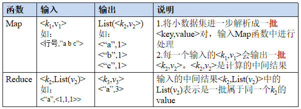
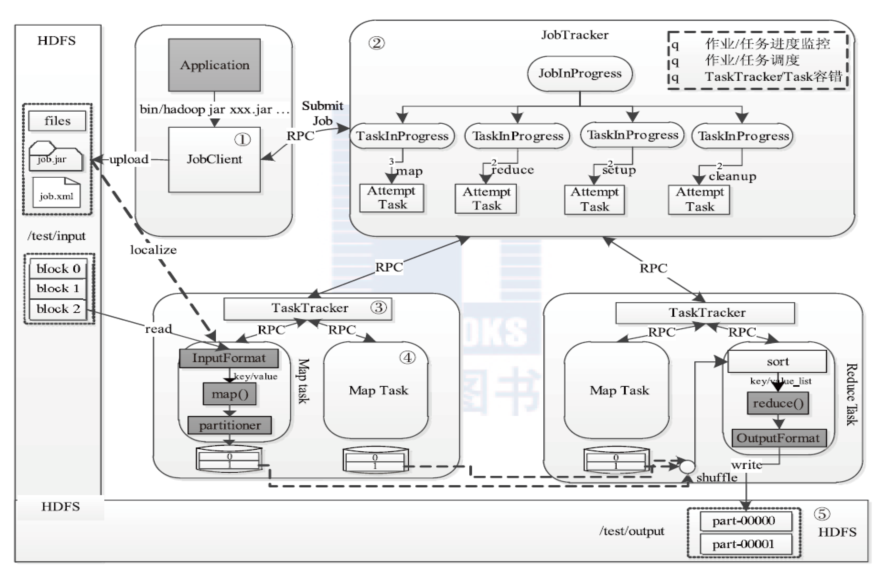
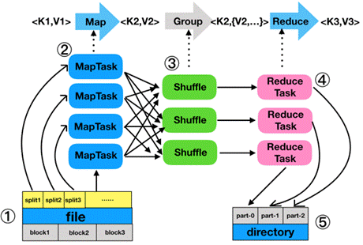

## 一、MapReduce概述
### 1.1 MapReduce核心思想

MapReduce的核心思想是“`分而治之`”，即将一个复杂的问题分解为多个小规模的部分，再逐一解决，并汇总各部分的结果形成最终答案。
MapReduce作为一种分布式计算模型，它主要用于解决海量数据的计算问题。使用MapReduce操作海量数据时，每个MapReduce程序被初始化为一个工作任务`Job`，每个工作任务可以分为`Map`和`Reduce`两个阶段：

+ Map阶段：负责将任务分解，即把复杂的任务分解成若干个“简单的任务”来并行处理，但前提是这些任务之间不存在数据依赖关系，可以单独执行任务。
+ Reduce阶段：收集整理中间结果，产生最终结果输出，即把Map阶段的结果进行整理汇总。

即使用户不懂分布式计算框架的内部运行机制，但只要能用Map和Reduce思想描述清楚要处理的问题，就能轻松地在Hadoop集群上实现分布式计算功能。

### 1.2 MapReduce编程模型

MapReduce编程模型借鉴了函数式程序设计语言的设计思想，其程序实现过程是通过map()和reduce()函数来完成的。从数据格式上来看，map()函数接收的数据格式是键值对，产生的输出结果也是键值对形式，reduce()函数会将map()函数输出的键值对作为输入，把相同key值的value进行汇总，输出新的键值对。 简易数据流模型的相关说明，具体如下：
```
(input) <k1, v1> -> map -> <k2, v2> -> group -> <K2，{V2，…}> -> reduce -> <k3, v3> (output)
```
1. 将原始数据处理成键值对<K1，V1>形式。
2. 将解析后的键值对<K1，V1>传给map()函数，map()函数会根据映射规则，将键值对<K1，V1>映射为一系列中间结果形式的键值对<K2，V2>。
3. 将中间形式的键值对<K2，V2>形成<K2，{V2，…}>形式传给reduce()函数
4. reduce()函数把具有相同key的value合并在一起，产生新的键值对<K3，V3>，此时的键值对<K3，V3>就是最终输出的结果。

输入和输出的 `key` 和 `value` 都必须实现[Writable](http://hadoop.apache.org/docs/stable/api/org/apache/hadoop/io/Writable.html) 接口。<br>



## 二、MapReduce工作原理
### 2.1 MapReduce体系架构（MR 1.x）
Hadoop MapReduce 的体系架构如下图所示：



#### 2.1.1 JobClient
+ **作业** (Job)<br>
客户端需要执行的一个工作单元，包括输入数据、MapReduce程序和配置信息。

+ **任务**（task）<br>
Hadoop将job分成若干个任务，其中包括两类任务：Map任务和Reduce任务。

+ **JobClient**<br>
用户编写的MapReduce程序通过Client提交到JobTracker端，并可以通过Client提供的一些接口查看作业运行状态

#### 2.1.2 JobTracker
JobTracker是一个后台服务进程，启动之后，会一直监听并接收来自各个TaskTracker发送的`心跳`信息，包括`资源`使用情况和`任务`运行情况等信息。主要`功能`：
1. **任务调度**<br>
在hadoop中每个应用程序被表示成一个`作业`，每个作业又被分成多个任务(Map、Reduce)，JobTracker负责所有作业的`调度`。

2. **状态监控**<br>
主要包括：TaskTracker状态监控、`作业`状态监控和`任务`状态监控。<br>
主要作用：容错和为任务调度提供决策依据。

2. **资源管理**

#### 2.1.3 TaskTracker

TaskTracker是JobTracker和Task之间的桥梁，采用了`RPC`协议进行通信。`功能`如下：
1. **汇报心跳**<br>
Tracker周期性将所有节点上各种信息通过`心跳`机制汇报给JobTracker。这些信息包括两部分：<br>
`机器级别信息`：节点健康情况、资源使用情况等。<br>
`任务级别信息`： 任务执行进度、任务运行状态等。

2. **执行命令**<br>
主要包括：`启动`任务(LaunchTaskAction)、`提交`任务(CommitTaskAction)、`杀死任务`(KillTaskAction)、`杀死作业`(KillJobAction)和`重新初始化`(TaskTrackerReinitAction)。

#### 2.1.4 执行过程

1. `JobClient`会在用户端通过JobClient类将应用已经配置参数打包成jar文件存储到`hdfs`， 并把路径提交到JobTracker,然后由JobTracker创建每一个Task（即MapTask和ReduceTask） 并将它们`分发`到各个TaskTracker服务中去执行。

2. JobTracker是一个`master服务`，软件启动之后JobTracker接收Job，负责调度Job的每一个子任务task运行于TaskTracker上， 并监控它们，如果发现有失败的task就重新运行它。一般情况应该把JobTracker部署在单独的机器上。

3. TaskTracker是运行在多个节点上的`slaver服务`。TaskTracker主动与JobTracker通信，接收作业，并负责直接执行每一个任务。 TaskTracker都需要运行在HDFS的`DataNode`上。

### 2.2 MapReduce工作过程
MapReduce编程模型开发简单且功能强大，专门为并行处理大规模数据量而设计，MapReduce的工作过程，如图所示：<br>



整个工作流程大致可以分为5步，具体如下：<br>

1、**分片、格式化数据源**<br>
输入Map阶段的数据源，必须经过分片和格式化操作。其中：<br>
+ `分片操作`：指的是将源文件划分为大小相等的小数据块（Hadoop2.x中默认128M），也就是分片(split)，Hadoop会为每一个分片构建一个Map任务，并由该任务运行自定义的map()函数，从而处理分片里的每一条记录；
+ `格式化操作`：将划分好的分片（split）格式化为键值对<key，value>形式的数据，其中，key代表偏移量，value代表每一行内容。

2、**执行MapTask**<br>
每个Map任务都有一个内存缓冲区（缓冲区大小100M），输入的分片（split）数据经过Map任务处理后的中间结果，会写入内存缓冲区中。如果写入的数据达到内存缓冲的阀值（80M），会启动一个线程将内存中的溢出数据写入磁盘，同时不影响map中间结果继续写入缓冲区。在溢写过程中，MapReduce框架会对Key进行排序，如果中间结果比较大，会形成多个溢写文件，最后的缓冲区数据也会全部溢写入磁盘形成一个溢写文件，如果是多个溢写文件，则最后合并所有的溢写文件为一个文件。

3、**执行Shuffle过程**<br>
MapReduce工作过程中，map阶段处理的数据如何传递给Reduce阶段，这是MapReduce框架中关键的一个过程，这个过程叫做`Shuffle`。Shuffle会将MapTask输出的处理结果数据，分发给ReduceTask，并在分发的过程中，对数据按key进行分区和排序。

4、**执行ReduceTask**<br>
输入ReduceTask的数据流是<key，{value list}>形式，用户可以自定义reduce()方法进行逻辑处理，最终以<key，value>的形式输出。

5．**写入文件**<br>
MapReduce框架会自动把ReduceTask生成的<key,value>传入OutputFormat的write方法，实现文件的写入操作。


### 2.2 MapReduce工作过程

```
$HADOOP_HOME/bin/hdfs dfs -cat /wordcount/output/WordCountApp/*
Flink   6
HBase   4
Hadoop  4
Hive    3
Kafka   5
Spark   5
```


## 参考引用
[1] [黑马程序员教程-MapReduce分布式计算框架](https://book.itheima.net/course/1269935677353533441/1269937996044476418/1270615533565255681) <br>
[2] [分布式计算框架——MapReduce](https://github.com/heibaiying/BigData-Notes/blob/master/notes/Hadoop-MapReduce.md) <br>
[3] [Apache Hadoop Map/Reduce教程](https://hadoop.apache.org/docs/r1.0.4/cn/mapred_tutorial.html) <br>
[4] [Hadoop MapReduce 保姆级吐血宝典，学习与工作必读此文！](https://juejin.cn/post/7022839585021362184)