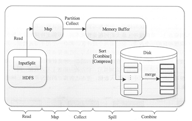
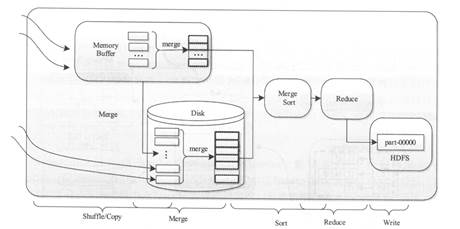
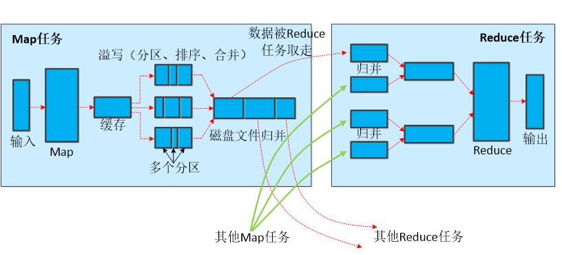
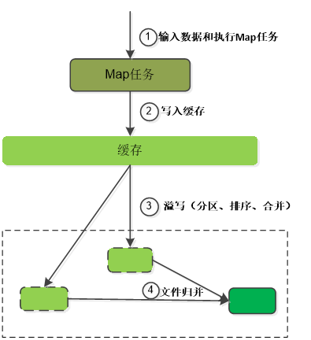
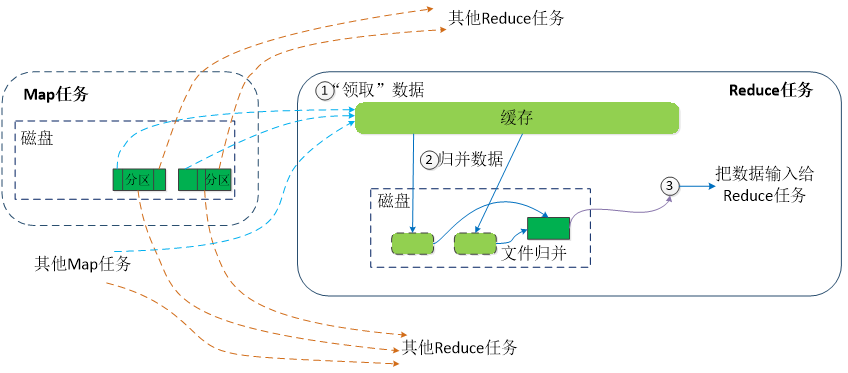
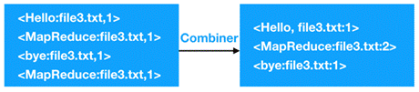

<nav>
<a href="#一mapreduce概述">一、MapReduce概述</a><br/>
&nbsp;&nbsp;&nbsp;&nbsp;<a href="#11-mapreduce核心思想">1.1 MapReduce核心思想</a><br/>
&nbsp;&nbsp;&nbsp;&nbsp;<a href="#12-mapreduce编程模型">1.2 MapReduce编程模型</a><br/>
<a href="#二mapreduce工作原理">二、MapReduce工作原理</a><br/>
&nbsp;&nbsp;&nbsp;&nbsp;<a href="#21-mapreduce体系架构mr-1x">2.1 MapReduce体系架构（MR 1.x）</a><br/>
&nbsp;&nbsp;&nbsp;&nbsp;&nbsp;&nbsp;&nbsp;&nbsp;<a href="#211-jobclient">2.1.1 JobClient</a><br/>
&nbsp;&nbsp;&nbsp;&nbsp;&nbsp;&nbsp;&nbsp;&nbsp;<a href="#212-jobtracker">2.1.2 JobTracker</a><br/>
&nbsp;&nbsp;&nbsp;&nbsp;&nbsp;&nbsp;&nbsp;&nbsp;<a href="#213-tasktracker">2.1.3 TaskTracker</a><br/>
&nbsp;&nbsp;&nbsp;&nbsp;&nbsp;&nbsp;&nbsp;&nbsp;<a href="#214-执行过程">2.1.4 执行过程</a><br/>
&nbsp;&nbsp;&nbsp;&nbsp;<a href="#22-mapreduce工作过程">2.2 MapReduce工作过程</a><br/>
&nbsp;&nbsp;&nbsp;&nbsp;&nbsp;&nbsp;&nbsp;&nbsp;<a href="#221-maptask工作原理">2.2.1 MapTask工作原理</a><br/>
&nbsp;&nbsp;&nbsp;&nbsp;&nbsp;&nbsp;&nbsp;&nbsp;<a href="#222-reducetask工作原理">2.2.2 ReduceTask工作原理</a><br/>
&nbsp;&nbsp;&nbsp;&nbsp;&nbsp;&nbsp;&nbsp;&nbsp;<a href="#223-shuffle工作原理混洗洗牌">2.2.3 Shuffle工作原理（混洗、洗牌）</a><br/>
&nbsp;&nbsp;&nbsp;&nbsp;&nbsp;&nbsp;&nbsp;&nbsp;&nbsp;&nbsp;&nbsp;&nbsp;<a href="#1map阶段的shuffle">（1）Map阶段的Shuffle</a><br/>
&nbsp;&nbsp;&nbsp;&nbsp;&nbsp;&nbsp;&nbsp;&nbsp;&nbsp;&nbsp;&nbsp;&nbsp;<a href="#2reduce阶段的shuffle">（2）Reduce阶段的Shuffle</a><br/>
&nbsp;&nbsp;&nbsp;&nbsp;<a href="#23-mapreduce主要组件">2.3 MapReduce主要组件</a><br/>
&nbsp;&nbsp;&nbsp;&nbsp;&nbsp;&nbsp;&nbsp;&nbsp;<a href="#231-inputformat">2.3.1 InputFormat</a><br/>
&nbsp;&nbsp;&nbsp;&nbsp;&nbsp;&nbsp;&nbsp;&nbsp;&nbsp;&nbsp;&nbsp;&nbsp;<a href="#1输入分片inputsplit">（1）输入分片(InputSplit)</a><br/>
&nbsp;&nbsp;&nbsp;&nbsp;&nbsp;&nbsp;&nbsp;&nbsp;&nbsp;&nbsp;&nbsp;&nbsp;<a href="#2recordreader">（2）RecordReader</a><br/>
&nbsp;&nbsp;&nbsp;&nbsp;&nbsp;&nbsp;&nbsp;&nbsp;<a href="#232-mapper">2.3.2 Mapper</a><br/>
&nbsp;&nbsp;&nbsp;&nbsp;&nbsp;&nbsp;&nbsp;&nbsp;<a href="#233-reducer">2.3.3 Reducer</a><br/>
&nbsp;&nbsp;&nbsp;&nbsp;&nbsp;&nbsp;&nbsp;&nbsp;<a href="#234-outputformat">2.3.4 OutputFormat</a><br/>
&nbsp;&nbsp;&nbsp;&nbsp;&nbsp;&nbsp;&nbsp;&nbsp;<a href="#235-combiner">2.3.5 Combiner</a><br/>
&nbsp;&nbsp;&nbsp;&nbsp;&nbsp;&nbsp;&nbsp;&nbsp;<a href="#236-partitioner-sort">2.3.6 Partitioner & Sort</a><br/>
<a href="#三-mapreduce词频统计案例">三、 MapReduce词频统计案例</a><br/>
&nbsp;&nbsp;&nbsp;&nbsp;<a href="#31-词频统计案例">3.1 词频统计案例</a><br/>
&nbsp;&nbsp;&nbsp;&nbsp;<a href="#32-词频统计案例进阶之combiner">3.2 词频统计案例进阶之Combiner</a><br/>
&nbsp;&nbsp;&nbsp;&nbsp;<a href="#33-词频统计案例进阶之partitioner">3.3 词频统计案例进阶之Partitioner</a><br/>
<a href="#参考引用">参考引用</a><br/>
</nav>

## 一、MapReduce概述
### 1.1 MapReduce核心思想

MapReduce的核心思想是“`分而治之`”，即将一个复杂的问题分解为多个小规模的部分，再逐一解决，并汇总各部分的结果形成最终答案。
MapReduce作为一种分布式计算模型，它主要用于解决海量数据的计算问题。使用MapReduce操作海量数据时，每个MapReduce程序被初始化为一个工作任务`Job`，每个工作任务可以分为`Map`和`Reduce`两个阶段：

+ Map阶段：负责将任务分解，即把复杂的任务分解成若干个“简单的任务”来并行处理，但前提是这些任务之间不存在数据依赖关系，可以单独执行任务。
+ Reduce阶段：收集整理中间结果，产生最终结果输出，即把Map阶段的结果进行整理汇总。

即使用户不懂分布式计算框架的内部运行机制，但只要能用Map和Reduce思想描述清楚要处理的问题，就能轻松地在Hadoop集群上实现分布式计算功能。

### 1.2 MapReduce编程模型

MapReduce编程模型借鉴了函数式程序设计语言的设计思想，其程序实现过程是通过map()和reduce()函数来完成的。从数据格式上来看，map()函数接收的数据格式是键值对，产生的输出结果也是键值对形式，reduce()函数会将map()函数输出的键值对作为输入，把相同key值的value进行汇总，输出新的键值对。 简易数据流模型的相关说明，具体如下：<br>

```
(input) <k1, v1> -> map -> <k2, v2> -> group -> <K2，{V2，…}> -> reduce -> <k3, v3> (output)
```


1. 将原始数据处理成键值对<K1，V1>形式。
2. 将解析后的键值对<K1，V1>传给map()函数，map()函数会根据映射规则，将键值对<K1，V1>映射为一系列中间结果形式的键值对<K2，V2>。
3. 将中间形式的键值对<K2，V2>形成<K2，{V2，…}>形式传给reduce()函数
4. reduce()函数把具有相同key的value合并在一起，产生新的键值对<K3，V3>，此时的键值对<K3，V3>就是最终输出的结果。

输入和输出的 `key` 和 `value` 都必须实现[Writable](http://hadoop.apache.org/docs/stable/api/org/apache/hadoop/io/Writable.html) 接口。<br>


## 二、MapReduce工作原理
### 2.1 MapReduce体系架构（MR 1.x）
Hadoop MapReduce 的体系架构如下图所示：


#### 2.1.1 JobClient
+ **作业** (Job)<br>
客户端需要执行的一个工作单元，包括输入数据、MapReduce程序和配置信息。

+ **任务**（task）<br>
Hadoop将job分成若干个任务，其中包括两类任务：Map任务和Reduce任务。

+ **JobClient**<br>
用户编写的MapReduce程序通过Client提交到JobTracker端，并可以通过Client提供的一些接口查看作业运行状态

#### 2.1.2 JobTracker
JobTracker是一个后台服务进程，启动之后，会一直监听并接收来自各个TaskTracker发送的`心跳`信息，包括`资源`使用情况和`任务`运行情况等信息。主要功能：
1. `任务调度`<br>
在hadoop中每个应用程序被表示成一个`作业`，每个作业又被分成多个任务(Map、Reduce)，JobTracker负责所有`作业的调度`。

2. `状态监控`<br>
主要包括：TaskTracker状态监控、`作业`状态监控和`任务`状态监控。<br>
主要作用：容错和为任务调度提供决策依据。

3. `资源管理`

#### 2.1.3 TaskTracker

TaskTracker是JobTracker和Task之间的桥梁，采用了`RPC`协议进行通信。功能如下：
1. `汇报心跳`<br>
Tracker周期性将所有节点上各种信息通过`心跳`机制汇报给JobTracker。这些信息包括两部分：<br>
`机器级别信息`：节点健康情况、资源使用情况等。<br>
`任务级别信息`： 任务执行进度、任务运行状态等。

2. `执行命令`<br>
主要包括：`启动`任务(LaunchTaskAction)、`提交`任务(CommitTaskAction)、`杀死任务`(KillTaskAction)、`杀死作业`(KillJobAction)和`重新初始化`(TaskTrackerReinitAction)。

#### 2.1.4 执行过程

1. `JobClient`会在用户端通过JobClient类将应用已经配置参数打包成jar文件存储到`hdfs`， 并把路径提交到JobTracker,然后由JobTracker创建每一个Task（即MapTask和ReduceTask） 并将它们`分发`到各个TaskTracker服务中去执行。

2. JobTracker是一个`master服务`，软件启动之后JobTracker接收Job，负责调度Job的每一个子任务task运行于TaskTracker上， 并监控它们，如果发现有失败的task就重新运行它。一般情况应该把JobTracker部署在单独的机器上。

3. TaskTracker是运行在多个节点上的`slaver服务`。TaskTracker主动与JobTracker通信，接收作业，并负责直接执行每一个任务。 TaskTracker都需要运行在HDFS的`DataNode`上。

### 2.2 MapReduce工作过程
MapReduce编程模型开发简单且功能强大，专门为并行处理大规模数据量而设计，MapReduce的工作过程，如图所示：<br>


整个工作流程大致可以分为5步，具体如下：<br>

1、**分片、格式化数据源**<br>
输入Map阶段的数据源，必须经过分片和格式化操作。其中：<br>
+ `分片操作`：指的是将源文件划分为大小相等的小数据块（Hadoop2.x中默认128M），也就是分片(split)，Hadoop会为每一个分片构建一个Map任务，并由该任务运行自定义的map()函数，从而处理分片里的每一条记录；
+ `格式化操作`：将划分好的分片（split）格式化为键值对<key，value>形式的数据，其中，key代表偏移量，value代表每一行内容。

2、**执行MapTask**<br>
每个Map任务都有一个内存缓冲区（缓冲区大小100M），输入的分片（split）数据经过Map任务处理后的中间结果，会写入内存缓冲区中。如果写入的数据达到内存缓冲的阀值（80M），会启动一个线程将内存中的溢出数据写入磁盘，同时不影响map中间结果继续写入缓冲区。在溢写过程中，MapReduce框架会对Key进行排序，如果中间结果比较大，会形成多个溢写文件，最后的缓冲区数据也会全部溢写入磁盘形成一个溢写文件，如果是多个溢写文件，则最后合并所有的溢写文件为一个文件。

3、**执行Shuffle过程**<br>
MapReduce工作过程中，map阶段处理的数据如何传递给Reduce阶段，这是MapReduce框架中关键的一个过程，这个过程叫做`Shuffle`。Shuffle会将MapTask输出的处理结果数据，分发给ReduceTask，并在分发的过程中，对数据按key进行分区和排序。

4、**执行ReduceTask**<br>
输入ReduceTask的数据流是<key，{value list}>形式，用户可以自定义reduce()方法进行逻辑处理，最终以<key，value>的形式输出。

5．**写入文件**<br>
MapReduce框架会自动把ReduceTask生成的<key,value>传入OutputFormat的write方法，实现文件的写入操作。


#### 2.2.1 MapTask工作原理
MapTask作为MapReduce工作流程的前半部分，它主要经历了5个阶段，分别是Read阶段、Map阶段、Collect阶段、Spill阶段和Combiner阶段，如下图所示。<br>



关于MapTask这5个阶段的相关介绍如下：<br>

（1）`Read阶段`：MapTask通过用户编写的RecordReader，从输入的InputSplit中解析出一个个key/value。<br>
（2）`Map阶段`：将解析出的key/value交给用户编写的map()函数处理，并产生一系列新的key/value 。<br>
（3）`Collect阶段`：在用户编写的map()函数中，数据处理完成后，一般会调用outputCollector.collect()输出结果，在该函数内部，它会将生成的key/value分片(通过调用partitioner)，并写入一个环形内存缓冲区中。<br>
（4）`Split阶段`：即“溢写”，当环形缓冲区满后，MapReduce会将数据写到本地磁盘上，生成一个临时文件。需要注意的是，将数据写入本地磁盘前，先要对数据进行一次本地排序，并在必要时对数据进行合并、压缩等操作。<br>
（5）`Combine阶段`：当所有数据处理完成以后，MapTask会对所有临时文件进行一次合并，以确保最终只会生成一个数据文件。<br>

> hadoop任务map将其输入写入本地硬盘，而非hdfs，为什么？
因为map的输出是`中间的结果`，这个中间结果是由reduce处理后才产生最终输出结果，而且一旦作业完成，map的输出结果就可以删除。

#### 2.2.2 ReduceTask工作原理
ReduceTask的工作过程主要经历了5个阶段，分别是Copy阶段、Merge阶段、Sort阶段、Reduce阶段和Write阶段，如下图所示。<br>



下面针对ReduceTask工作过程的5个阶段进行介绍：<br>

（1）`Copy阶段`：Reduce会从各个MapTask上远程拷贝一片数据，并针对某一片数据，如果其大小超过一定阈值，则写到磁盘上，否则直接放到内存中。
（2）`Merge阶段`：在远程拷贝数据的同时，ReduceTask会启动两个后台线程，分别对内存和磁盘上的文件进行合并，以防止内存使用过多或者磁盘文件过多。
（3）`Sort阶段`：用户编写reduce()方法输入数据是按key聚合的一组数据。为了将key相同的数据聚在一起，Hadoop采用了基于排序的策略。由于各个MapTask已经实现对自己的处理结果进行了局部排序，因此，ReduceTask只需对所有数据进行一次归并排序即可。
（4）`Reduce阶段`：对排序后的键值对调用reduce()方法，键相等的键值对调用一次reduce()方法，每次调用会产生零个或者多个键值对，最后把这些输出的键值对写入到HDFS系统中。
（5）`Write阶段`：reduce()函数将计算结果写到HDFS上 。

#### 2.2.3 Shuffle工作原理（混洗、洗牌）
Shuffle是MapReduce的核心，它用来确保每个reducer的输入都是按键排序的。它的性能高低直接决定了整个MapReduce程序的性能高低。接下来，通过一个图来描述shuffle过程，如下图所示。<br>



在图中，map和reduce阶段都涉及到了shuffle机制，接下来，我们分别进行分析，具体如下。

##### （1）Map阶段的Shuffle



+ ①`输入数据和执行Map任务`
+ ②`写入缓存`<br>
  MapTask处理的结果会暂且放入一个内存缓冲区中（该缓冲区默认大小是100M）<br>
  当缓冲区快要溢出时（默认设置溢写比例0.8），会在本地文件系统创建一个溢出文件，将该缓冲区的数据写入这个文件。<br>
+ ③`溢写（分区、排序、合并）`<br>
  写入磁盘之前，线程会根据reduceTask的数量，将数据分区(默认采用哈希函数)，一个Reduce任务对应一个分区的数据。<br>
  （目的是避免reduce任务分配到大量数据或分配到很少的数据甚至没有分到数据的尴尬局面）<br>
  分完数据后，会对每个分区的数据进行排序，如果此时设置了Combiner，将排序后的结果进行combiner操作。<br>
  （目的是尽可能少的执行数据写入磁盘的操作）<br>
+ ④`文件归并`<br>
  当map任务输出最后一个记录时，可能有很多溢出文件，需要将这些文件归并。<br>
  文件归并时，如果溢写文件数量大于预定值（默认是3）则可以再次进行排序和combine操作，少于3不需要。<br>
  （目的是一是尽量减少每次写入磁盘的数据量；二是尽量减少下一复制阶段网络传输的数据量。）  <br>
  最后合并成了一个已分区且已排序的文件。<br>
+ ⑤将分区中的数据拷贝给对应的reduce任务

> 合并（Combine）和归并（Merge）的区别：<br>
两个键值对<“a”,1>和<“a”,1>，如果合并，会得到<“a”,2>，如果归并，会得到<“a”,<1,1>>

##### （2）Reduce阶段的Shuffle



+ ①领取数据<br>
  Reduce任务通过RPC向JobTracker询问Map任务是否已经完成，若完成，则领取数据。<br>
+ ②归并数据<br>
  Reduce领取数据先放入缓存，来自不同Map机器，先归并，再合并，写入磁盘。<br>
  多个溢写文件归并成一个或多个大文件，文件中的键值对是排序的。<br>
  当数据很少时，不需要溢写到磁盘，直接在缓存中归并，然后输出给Reduce。<br>
+ ③把数据输入给Reduce任务<br>

### 2.3 MapReduce主要组件
#### 2.3.1 InputFormat
InputFormat主要用于描述输入数据的格式，它提供以下两个功能：
+ `数据切分`：按照某个策略将输入数据切分成若干个分片（split），以便确定MapTask个数以及对应的分片（split）。
+ `为Mapper提供输入数据`：给定某个分片（split），将其解析成一个一个的key/value键值对。

Hadoop自带了一个 InputFormat接口，该接口的定义代码如下所示：
```
public abstract class InputFormat<K, V> {
    public InputFormat() {}
    public abstract List<InputSplit> getSplits(JobContext var1) throws IOException, InterruptedException;
    public abstract RecordReader<K, V> createRecordReader(InputSplit var1, TaskAttemptContext var2) throws IOException, InterruptedException;
}
```
从上述代码可以看出，InputFormat接口定义了getSplits()和createRecordReader()两个方法，其中：
+ `getSplits()`方法负责将文件切分为多个分片(split)
+ `createRecordReader()`方法负责创建RecordReader对象，用来从分片中读取数据。

##### （1）输入分片(InputSplit)
HDFS 以固定大小的block 为基本单位存储数据，而对于MapReduce 而言，其处理单位是split。
split 是一个逻辑概念，它只包含一些元数据信息，比如数据起始位置、数据长度、数据所在节点等。它的划分方法完全由用户自己决定。
<br>
InputSplit定义了输入到单个Map任务的输入数据。其中，切片的大小splitSize由3个值确定，即minSize、maxSize和blockSize。
+ minSize：splitSize的最小值，由参数mapred.min.split.size确定，可在mapred-site.xml中进行配置，默认为1MB。
+ maxSize：splitSize的最大值，由参数mapreduce.jobtracker.split.metainfo.maxsize确定，可在mapred-site.xml中进行设置，默认值为10MB。
+ blockSize：HDFS中文件存储块的大小，由参数dfs.block,size确定，可在hdf-site.xml中进行修改，默认为128MB。

##### （2）RecordReader
InputSplit定义了一项工作的大小， 但是没有定义如何读取数据。<br>
RecordReader实际上定义了如何从数据上转化为一个(key,value)对的详细方法，并将数据输出到Mapper类中。<br>
TextInputFormat提供了LineRecordReader。

#### 2.3.2 Mapper
MapReduce程序会根据输入的文件产生多个Map任务。Hadoop提供的Mapper类是实现Map任务的一个抽象基类。 
每一个Mapper类的实例生成了 一个Java进程(在某一个InputSplit上执行)。
有两个额外的参数OutputCollector 以及Reporter，前者用来收集中间结果，后者用来获得环境参数以及设置当前执行的状态。
如果想自定义Map任务，只需要继承Mapper类并重写map()方法即可。 以词频统计为例：
```
/**
 * WordCountMapper.java
 * 将每行数据按照指定分隔符进行拆分
 *
 * Mapper<KEYIN, VALUEIN, KEYOUT, VALUEOUT>
 * Mapper<LongWritable, Text, Text, IntWritable>
 * LongWritable，表示输入数据的键是一个长整型（通常表示文件中的字节偏移量）。
 * Text，表示输入数据的值是文本类型（即每一行的内容）。
 * Text，表示输出的数据键是文本类型（即每个单词）。
 * IntWritable，表示输出的数据值是整型（即每个单词的计数，1）。
 */
public class WordCountMapper extends Mapper<LongWritable, Text, Text, IntWritable> {
    @Override
    protected void map(LongWritable key, Text value, Context context) throws IOException, InterruptedException {
        String[] words = value.toString().split("\t");
        for(String word: words){
            context.write(new Text(word), new IntWritable(1));
        }
    }
}
```
> Map任务的数量<br>
Hadoop为每个split创建一个Map任务，split 的多少决定了Map任务的数目。<br>
大多数情况下，理想的分片大小是一个HDFS块即block数 = split数 = map task数（一般情况）<br>

#### 2.3.3 Reducer
Map过程输出的键值对，将由Reducer组件进行合并处理。
如果想自定义Reduce任务，只需要继承Reducer类并重写reduce()方法。 以词频统计为例：
```
/**
 * WordCountReducer.java
 * 进行词频统计
 */
public class WordCountReducer extends Reducer<Text, IntWritable, Text, IntWritable> {
    @Override
    protected void reduce(Text key, Iterable<IntWritable> values, Context context) throws IOException, InterruptedException {
        int count = 0;
        for (IntWritable value : values) {
            count += value.get();
        }
        context.write(key, new IntWritable(count));
    }
}
```
> Reduce任务的数量<br>
最优的Reduce任务个数取决于集群中可用的reduce任务槽(slot)的数目<br>
通常设置比reduce任务槽数目稍微小一些的Reduce任务个数（这样可以预留一些系统资源处理可能发生的错误）

#### 2.3.4 OutputFormat
OutputFormat是一个用于描述MapReduce程序输出格式和规范的抽象类，该类定义了三个方法，具体代码如下：
```
public abstract class OutputFormat<K, V> {
    public OutputFormat() {}
    public abstract RecordWriter<K, V> getRecordWriter(TaskAttemptContext var1) throws IOException, InterruptedException;
    public abstract void checkOutputSpecs(JobContext var1) throws IOException, InterruptedException;
    public abstract OutputCommitter getOutputCommitter(TaskAttemptContext var1) throws IOException, InterruptedException;
}
```
每一个Reducer都写一个文件到一个共同的输出目录，文件名是part-nnnnn，其中nnnnn是与每一个reducer相关的一个号（partition id）。

#### 2.3.5 Combiner
在Map阶段输出可能会产生大量相同的数据，例如<hello，1>、<hello，1>……，势必会降低Reduce聚合阶段的执行效率。
Combiner组件的作用就是对Map阶段的输出的重复数据先做一次合并计算，然后把新的（key，value）作为Reduce阶段的输入。
下图描述的就是Combiner组件对Map的合并操作。<br>



Combiner组件是MapReduce程序中的一种重要的组件，如果想自定义Combiner，我们需要继承Reducer类，并且重写reduce()方法。以词频统计为例，直接使用“WordCountReducer.java”即可。

#### 2.3.6 Partitioner & Sort

在Map工作完成之后，每一个 Map函数会将结果传到对应的Reducer所在的节点，此时，用户可以提供一个Partitioner类，用来决定一个给定的(key,value)对传输的具体位置。
传输到每一个节点上的所有的Reduce函数接收到得Key,value对会被Hadoop自动排序（即Map生成的结果传送到某一个节点的时候，会被自动排序）。
Partitioner组件可以让Map对Key进行分区，其目的就是将key均匀分布在ReduceTask上。
```
public abstract class Partitioner<KEY, VALUE> {
    public Partitioner() {}
    public abstract int getPartition(KEY var1, VALUE var2, int var3);
}

```
Hadoop默认的分区类是HashPartitioner，它继承了Partitioner类，并提供了一个getPartition方法。
如果我们想自定义一个Partitioner组件，需要继承Partitioner类并重写getPartition()方法。

## 三、 MapReduce词频统计案例
### 3.1 词频统计案例
+ 输入文件
  生成示例文件：[org.zcb.mr.wordcount.component.WordCountDataGenerator](https://github.com/530154436/bigdata-learning/blob/dev_refactor/bigdata-hadoop/src/main/java/org/zcb/mr/wordcount/component/WordCountDataGenerator.java)
+ 代码实现
```
/**
 * 组装作业(词频统计) 并提交到集群运行
 * 输入文件: /wordcount/input.txt
 */
public class WordCountApp {
    public static void main(String[] args) throws IOException, InterruptedException, ClassNotFoundException {
        HdfsUtil hdfs = new HdfsUtil();
        hdfs.connect();
        String[] inputPaths = new String[] {"/wordcount/input.txt"};
        String outputPath = "/wordcount/output/WordCountApp";

        // 创建一个 Job
        Job job = Job.getInstance(hdfs.getConfiguration());

        // 设置运行的主类、Mapper 和 Reducer
        job.setJarByClass(WordCountApp.class);
        job.setMapperClass(WordCountMapper.class);
        job.setReducerClass(WordCountReducer.class);

        // 设置 Mapper、Reducer 输出的 key 和 value 的类型
        job.setMapOutputKeyClass(Text.class);
        job.setMapOutputValueClass(IntWritable.class);
        job.setOutputKeyClass(Text.class);
        job.setOutputValueClass(IntWritable.class);

        // 如果输出目录已经存在，则必须先删除，否则重复运行程序时会抛出异常
        hdfs.delete(outputPath, true);

        // 设置作业输入文件和输出文件的路径
        FileInputFormat.addInputPath(job, new Path(inputPaths[0]));
        FileOutputFormat.setOutputPath(job, new Path(outputPath));

        // 将作业提交到群集并等待它完成，参数设置为 true 代表打印显示对应的进度
        boolean result = job.waitForCompletion(true);

        // 关闭之前创建的 fileSystem
        hdfs.close();

        // 根据作业结果,终止当前运行的 Java 虚拟机,退出程序
        System.exit(result ? 0 : -1);
    }
}
```
+ 执行结果
```
$HADOOP_HOME/bin/hdfs dfs -cat /wordcount/output/WordCountApp/*
Flink   6
HBase   4
Hadoop  4
Hive    3
Kafka   5
Spark   5
```
### 3.2 词频统计案例进阶之Combiner
### 3.3 词频统计案例进阶之Partitioner


## 参考引用
[1] [黑马程序员教程-MapReduce分布式计算框架](https://book.itheima.net/course/1269935677353533441/1269937996044476418/1270615533565255681) <br>
[2] [分布式计算框架——MapReduce](https://github.com/heibaiying/BigData-Notes/blob/master/notes/Hadoop-MapReduce.md) <br>
[3] [Tom White . hadoop 权威指南 [M] . 清华大学出版社 . 2017.](https://book.douban.com/subject/23066032/) <br>
[4] [Apache Hadoop Map/Reduce教程](https://hadoop.apache.org/docs/r1.0.4/cn/mapred_tutorial.html) <br>
[5] [Hadoop MapReduce 保姆级吐血宝典，学习与工作必读此文！](https://juejin.cn/post/7022839585021362184) <br>
