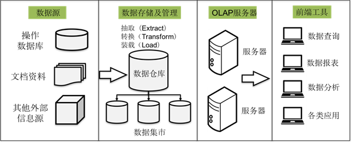
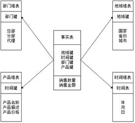
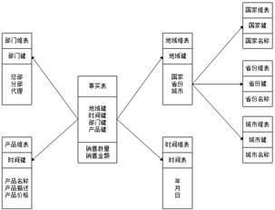
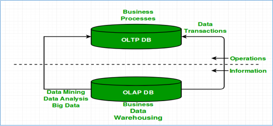
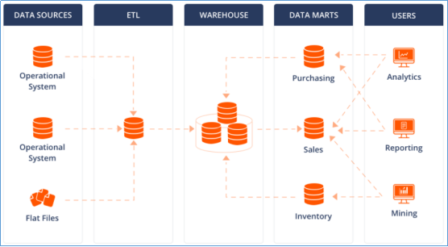
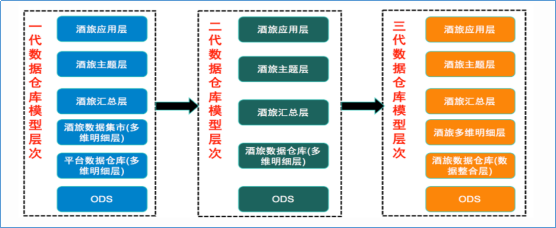
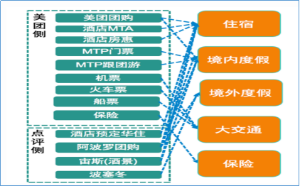
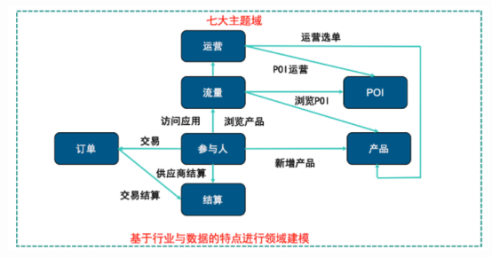

<nav>
<a href="#一数据仓库概念">一、数据仓库概念</a> 
&nbsp;&nbsp;&nbsp;&nbsp;<a href="#11-数据仓库主要特征">1.1 数据仓库主要特征</a> 
&nbsp;&nbsp;&nbsp;&nbsp;<a href="#12-数据仓库的结构">1.2 数据仓库的结构</a> 
&nbsp;&nbsp;&nbsp;&nbsp;<a href="#13-数据仓库的数据模型">1.3 数据仓库的数据模型</a> 
&nbsp;&nbsp;&nbsp;&nbsp;&nbsp;&nbsp;&nbsp;&nbsp;<a href="#131-星型模型">1.3.1 星型模型</a> 
&nbsp;&nbsp;&nbsp;&nbsp;&nbsp;&nbsp;&nbsp;&nbsp;<a href="#132-雪花模型">1.3.2 雪花模型</a> 
<a href="#二数据仓库数据库数据集市">二、数据仓库、数据库、数据集市</a> 
&nbsp;&nbsp;&nbsp;&nbsp;<a href="#21-olap与oltp">2.1 OLAP与OLTP</a> 
&nbsp;&nbsp;&nbsp;&nbsp;<a href="#22-数据仓库数据库">2.2 数据仓库、数据库</a> 
&nbsp;&nbsp;&nbsp;&nbsp;<a href="#23-数据仓库数据集市">2.3 数据仓库、数据集市</a> 
<a href="#三数据仓库分层架构">三、数据仓库分层架构</a> 
&nbsp;&nbsp;&nbsp;&nbsp;<a href="#31-数仓分层思想和标准">3.1 数仓分层思想和标准</a> 
&nbsp;&nbsp;&nbsp;&nbsp;<a href="#32-阿里巴巴数仓3层架构">3.2 阿里巴巴数仓3层架构</a> 
&nbsp;&nbsp;&nbsp;&nbsp;<a href="#33-美团点评酒旅数据仓库建设实践">3.3 美团点评酒旅数据仓库建设实践</a> 
&nbsp;&nbsp;&nbsp;&nbsp;&nbsp;&nbsp;&nbsp;&nbsp;<a href="#331-美团数仓技术架构架构变迁">3.3.1 美团数仓技术架构：架构变迁</a> 
&nbsp;&nbsp;&nbsp;&nbsp;&nbsp;&nbsp;&nbsp;&nbsp;<a href="#332-美团数仓业务架构主题建设">3.3.2 美团数仓业务架构：主题建设</a> 
<a href="#参考引用">参考引用</a> 
</nav>

## 一、数据仓库概念
数据仓库（DW，Data Warehouse），简称数仓，是一个用于存储、分析、报告的数据管理系统。数据仓库的目的是构建面向分析的集成化数据环境，为企业提供决策支持（Decision Support）。
数据仓库本身并不“生产”任何数据，其数据来源于不同外部系统；同时数据仓库自身也不需要“消费”任何的数据，其结果开放给各个外部应用使用，这也是为什么叫“仓库”，而不叫“工厂”的原因。

> 数据仓库为何而来？
结论：为了分析数据而来，分析结果给企业决策提供支撑。
信息总是用作两个目的：操作型记录的保存和分析型决策的制定。数据仓库是信息技术长期发展的产物。

### 1.1 数据仓库主要特征

据仓库之父兼计算机科学家 William Inmon 定义了数据仓库的 4 大特征，这 4 大特征为数据仓库的强大优势奠定了坚实基础。根据定义，数据仓库具有以下特点：

+ **面向主题**：数据仓库可以高效分析关于特定主题或职能领域（例如客户、承保、保险理赔）的数据。 
  主题是一个抽象的概念，是较高层次上企业信息系统中的数据综合、归类并进行分析利用的抽象，通常对应企业中某一宏观分析领域所涉及的分析对象。
+ **集成性**：数据仓库可在不同来源的不同数据类型之间建立一致性。 
  收集与主题相关的数据，这些数据通常分布在多个操作型系统中，存在分散、独立、异构的特点。 
  在数据进入数据仓库之前，对数据进行统一与综合处理，涉及数据的抽取、清理、转换和汇总。 
  如字段的同名异义、异名同义、单位不统一、字长、命名和格式上的不一致等问题。 
+ **非易失性**：数据仓库的主要功能是分析历史数据，而不是实时更新或修改数据。进入数据仓库的数据通常稳定且长期保留，用户主要进行查询和挖掘操作，很少进行修改或删除。
+ **时变性**：数据仓库包含多粒度的历史数据，具有时间属性。虽然数据无法修改，但会随着业务需求定期更新，以保持决策的有效性。数据仓库的数据时间跨度较长，反映的是不同时期的历史快照，与操作型系统存储的当前数据不同。

一个精心设计的数据仓库支持高速查询、高数据吞吐量，能够凭借出色的灵活性帮助用户细分数据或降低数据量，进而执行更加细致的数据检查，满足高层级和精细化数据管理等各种需求。同时，它还能为中间件 BI 环境（为最终用户提供报告、仪表盘和更多其他界面）提供一个坚实的功能性基础。

### 1.2 数据仓库的结构

数据仓库的结构包含了4部分，分别是数据源、数据存储及管理、服务器和前端工具。具体下图所示：

1. 数据源：是数据仓库的基础，即系统的数据来源，通常包含企业的各种内部信息和外部信息。 
   内容信息，例如存在操作数据库中的各种业务数据和自动化系统中包含的各类文档数据； 
   外部信息，例如各类法律法规，市场信息、竞争对手的信息以及外部统计数据和其他相关文档等。

2. 数据存储及管理：是整个数据仓库的核心。 
   数据仓库的组织管理方式决定了它有别于传统数据库，同时也决定了对外部数据的表现形式。 
   针对系统现有的数据，进行抽取、清理并有效集成，按照主题进行组织。 
   数据仓库按照数据的覆盖范围可以划分为企业级数据仓库和部门级数据仓库，也就是所谓的`数据集市`。 
   数据集市可以理解为是一个小型的部门或者工作组级别的数据仓库。 

3．OLAP服务器：需要分析的数据按照多维数据模型进行重组，以支持用户随时进行多角度、多层次的分析，并发现数据规律和趋势。

4．前端工具：主要包含各种数据分析工具、报表工具、查询工具、数据挖掘工具以及各种基于数据仓库或数据集市开发的应用。

### 1.3 数据仓库的数据模型
在数据仓库建设中，一般会围绕着`星型模型`和`雪花模型`来设计数据模型。每个数据仓库都包含一个或者多个事实数据表。 

1. **事实表** 
   事实表是对分析主题的度量，它包含了与各维度表相关联的外键，并通过连接（Join）方式与维度表关联。 
   事实表的度量通常是数值类型，且记录数会不断增加，表规模迅速增长。 
   例如现存在一张订单事实表，其字段Prod_id（商品id）可以关联商品维度表、TimeKey（订单时间）可以关联时间维度表等。 
   
2. **维度表** 
   维度表可以看作用户分析数据的窗口，维度表中包含事实数据表中事实记录的特性（描述性信息、指定如何汇总事实数据表数据），以便为分析者提供有用的信息。 
   维度表包含帮助汇总数据的特性的层次结构，维度是对数据进行分析时特有的一个角度，站在不同角度看待问题，会有不同的结果。 
   维度表信息较为固定，且数据量小，维度表中的列字段可以将信息分为不同层次的结构级。 
   例如当分析产品销售情况时，可以选择按照商品类别、商品区域进行分析，此时就构成一个类别、区域的维度。

#### 1.3.1 星型模型
在数据仓库建模中，星型模型是维度建模中的一种选择方式。星型模型是以一个`事实表`和`一组维度表`组合而成，并且以事实表为中心，所有的维度表直接与事实表相连。 

所有的维度表都直接连接到事实表上，维度表的主键放置在事实表中，作为事实表与维度表连接的外键，因此，维度表和事实表是有关联的，然而，维度表与维度表并没有直接相连，因此，维度表之间是并没有关联的。

#### 1.3.2 雪花模型
雪花模型也是维度建模中的另一种选择，它是对星型模型的扩展。 

从上图中可以看出，雪花模型的维度表可以拥有其他的维度表，并且维度表与维度表之间是相互关联的。因此，雪花模型相比星型模型更规范一些。但是，由于雪花模型需要关联多层的维度表，因此，性能也比星型模型要低，所以一般不是很常用。

## 二、数据仓库、数据库、数据集市
### 2.1 OLAP与OLTP

`联机事务处理`（OLTP，Online Transaction Processing），主要目标是做数据处理，它是针对具体业务在数据库联机的日常操作，通常对少数记录进行查询、修改。用户较为关心操作的响应时间、数据的安全性、完整性和并发支持的用户数等问题。传统的`关系型数据库系统`作为数据管理的主要手段，主要用于操作型处理。 

`联机分析处理`（OLAP，Online Analytical Processing）系统，也叫DSS决策支持系统，主要目标是做数据分析。一般针对某些主题的历史数据进行复杂的多维分析，支持管理决策。数据仓库是OLAP系统的一个典型示例，主要用于数据分析。 

| 条件         | OLAP                                      | OLTP                                      |
|:--------------|:-------------------------------------------|:-------------------------------------------|
| **目的**     | 面向主题，面向分析，支撑分析决策                 | 面向应用，面向业务，支撑事务                          |
| **数据来源** | 多个来源的历史和汇总数据，包括OLTP和外部来源    | 单一来源实时的日常业务数据     |
| **数据结构** | 多维（多维数据集）或关系数据库                  | 系数据库                                  |
| **数据模型** | 星型架构、雪花架构或其他分析模型                  | 标准化或非规范化模型                         |
| **数据量**   | 存储需求较高，通常为 TB 和 PB 级别               | 存储需求较低，通常为 MB和GB 级别                  |
| **响应时间** | 响应时间较长，通常以秒、分钟、小时或者天为单位，取决于数据量和查询复杂性   | 响应时间较短，通常以毫秒为单位                  |
| **示例应用** | 分析趋势、预测客户行为、确定盈利能力               | 处理付款、客户数据管理、订单处理                |
| **任务** | 大量读而很少写操作                                | 读写操作                |

### 2.2 数据仓库、数据库
数据库与数据仓库的区别实际讲的是OLTP与OLAP的区别： 
OLTP系统的典型应用是RDBMS（关系型数据库）。 
OLAP系统的典型应用是DW（数据仓库）。 

数据仓库和数据库的区别主要有以下几点：
+ 数据仓库不是大型的数据库，虽然数据仓库存储数据规模大。
+ 数据仓库的出现，并不是要取代数据库。
+ 数据库是面向事务的设计，数据仓库是面向主题设计的。
+ 数据库一般存储业务数据，数据仓库存储的一般是历史数据。
+ 数据库是为捕获数据而设计，数据仓库是为分析数据而设计。

### 2.3 数据仓库、数据集市
数据仓库是`面向整个集团组织`的数据，数据集市是`面向单个部门`使用的。可以认为数据集市是数据仓库的子集，也有人把数据集市叫做小型数据仓库。数据集市通常只涉及一个主题领域，例如市场营销或销售。因为它们较小且更具体，所以它们通常更易于管理和维护，并具有更灵活的结构。 

各种操作型系统数据和包括文件在内的等其他数据作为数据源，经过ETL(抽取转换加载)填充到数据仓库中；
数据仓库中有不同主题数据，数据集市则根据部门特点面向指定主题，比如Purchasing（采购）、Sales（销售）、Inventory（库存）；
用户可以基于主题数据开展各种应用：数据分析、数据报表、数据挖掘。

## 三、数据仓库分层架构
### 3.1 数仓分层思想和标准

数据仓库的特点是本身不生产数据，也不最终消费数据。按照`数据流入流出数仓的过程进行分层`就显得水到渠成。
数据分层每个企业根据自己的业务需求可以分成不同的层次，但是最基础的分层思想，理论上数据分为三个层，`操作型数据层`（ODS）、`数据仓库层`(DW)和`数据应用层`(ADS)。
企业在实际运用中可以基于这个基础分层之上添加新的层次，来满足不同的业务需求。

### 3.2 阿里巴巴数仓3层架构
1. `操作型数据层（ODS，Operation Data Store）` 
   也称之为源数据层、数据引入层、数据暂存层、临时缓存层、贴源层。 
   此层存放未经过处理的原始数据至数据仓库系统，结构上与源系统保持一致，是数据仓库的数据准备区。 
   主要完成基础数据引入到数仓的职责，和数据源系统进行解耦合，同时记录基础数据的历史变化。

2. `数据仓库层（DW，Data Warehouse）` 
   内部具体包括DIM维度表、DWD和DWS，由ODS层数据加工而成。 
   主要完成数据加工与整合，建立一致性的维度，构建可复用的面向分析和统计的明细事实表，以及汇总公共粒度的指标。 
   公共维度层（DIM，Dimension）：维度表，基于维度建模理念思想，建立整个企业一致性维度。 
   明细粒度事实层（DWD，Data Warehouse Detail）: 明细层，存储原始明细数据，是数据仓库中最为详细的数据层。 
   公共汇总粒度事实层（DWS，Data Warehouse Summary、DWB，Data Warehouse Base）：汇总层，以分析的主题对象作为建模驱动，基于上层的应用和产品的指标需求，构建公共粒度的汇总指标事实表，以宽表化手段物理化模型。

3. `数据应用层（DA或ADS）`
   面向最终用户，面向业务定制提供给产品和数据分析使用的数据。包括前端报表、分析图表、KPI、仪表盘、OLAP专题、数据挖掘等分析。

### 3.3 美团点评酒旅数据仓库建设实践
下面通过一线互联网企业真实的数仓建设实践案例，来从宏观层面感受
+ 数仓面向主题分析的特点
+ 在企业中数仓是一个不断维护的工程。
+ 数仓分层并不局限于经典3层，可以根据自身需求进行调整
+ 没有好的架构，只有适合自己业务需求的架构
+ 它山之石可以攻玉

#### 3.3.1 美团数仓技术架构：架构变迁
在美团点评酒旅事业群内，业务由传统的团购形式转向预订、直连等更加丰富的产品形式，业务系统也在迅速的迭代变化，这些都对数据仓库的扩展性、稳定性、易用性提出了更高要求。基于此，美团采取了分层次、分主题的方式不断优化并调整层次结构，下图展示了技术架构的变迁。 

第一代数仓模型层次中，由于当时美团整体的业务系统所支持的产品形式比较单一（团购），业务系统中包含了所有业务品类的数据，所以由平台的角色来加工数据仓库基础层是非常合适的，平台统一建设，支持各个业务线使用，所以在本阶段中酒旅只是建立了一个相对比较简单的数据集市。 
第二代数仓模型层次的建设，由建设数据集市的形式转变成了直接建设酒旅数据仓库，成为了酒旅自身业务系统数据的唯一加工者。 
随着美团和点评融合，同时酒旅自身的业务系统重构的频率也相对较高，对第二代数仓模型稳定性造成了非常大的影响，原本的维度模型非常难适配这么迅速的变化。核心问题是在用业务系统和业务线关系错综复杂，业务系统之间差异性明显且变更频繁。 

于是在ODS与多维明细层中间加入了数据整合层，参照Bill Inmon所提出的企业信息工厂建设的模式，基本按照三范式的原则来进行数据整合，由业务驱动调整成了由技术驱动的方式来建设数据仓库基础层。 
使用本基础层的最根本出发点还是在于美团的供应链、业务、数据它们本身的多样性，如果业务、数据相对比较单一、简单，本层次的架构方案很可能将不再适用。 

#### 3.3.2 美团数仓业务架构：主题建设
实际上在传统的一些如银行、制造业、电信、零售等行业里，都有一些比较成熟的模型，如耳熟能详的BDWM模型，它们都是经过一些具有相类似行业的企业在二三十年数据仓库建设中所积累的行业经验，不断的优化并通用化。
但美团所处的`O2O`行业本身就没有可借鉴的成熟的数据仓库主题以及模型，所以，在摸索建设两年的时间里，美团总结了下面比较适合现状的七大主题（后续可能还会新增）。

## 参考引用
[1] [黑马程序员-Apache Hive3.0数据仓库开发](https://m.bilibili.com/video/BV1L5411u7ae?p=1&unique_k=s8nK8P9)  
[2] [OLAP 和 OLTP 之间有何区别？](https://aws.amazon.com/cn/compare/the-difference-between-olap-and-oltp/)  
[3] [三分钟了解OLAP与OLTP!值得收藏！](https://blog.csdn.net/oOBubbleX/article/details/132028095)  
