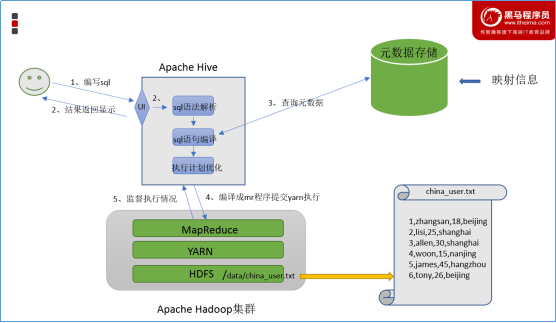
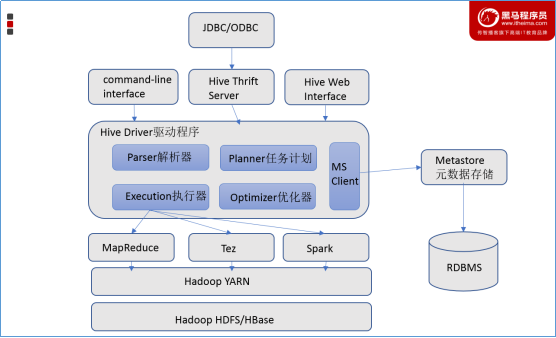
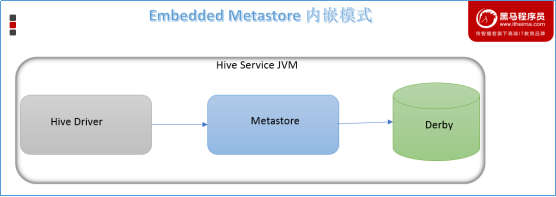
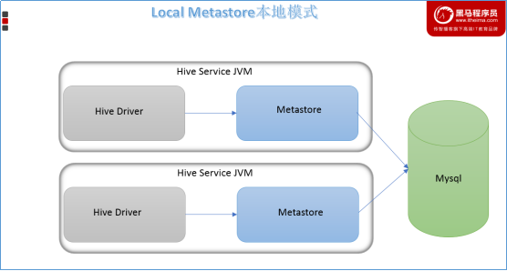
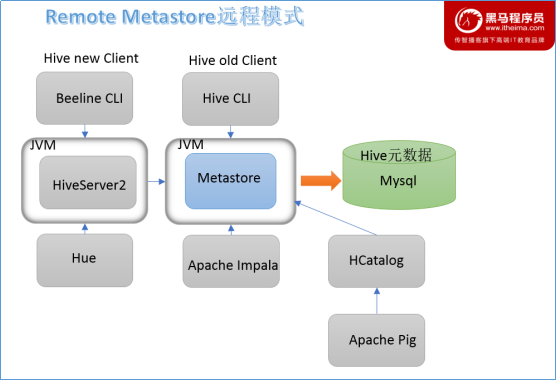

## 一、Apache Hive概述

### 1.1 Hive介绍
Apache Hive是一款建立在Hadoop之上的开源数据仓库系统，可以将存储在Hadoop文件中的结构化、半结构化数据文件映射为一张数据库表，基于表提供了一种类似SQL的查询模型，称为`Hive查询语言`（HQL），用于访问和分析存储在Hadoop文件中的大型数据集。`Hive核心是将HQL转换为MapReduce程序，然后将程序提交到Hadoop群集执行`。Hive由Facebook实现并开源。<br>

**Hive与Hadoop的关系**： Hive利用HDFS存储数据，利用MapReduce查询分析数据。

> 为什么使用Hive？<br>
① 人员学习使用Hadoop MapReduce成本太高 需要掌握java语言<br>
② MapReduce实现复杂查询逻辑开发难度太大<br>

**使用Hive处理数据的好处**：<br>
+ 操作接口采用类SQL语法，提供快速开发的能力（简单、容易上手）
+ 避免直接写MapReduce，减少开发人员的学习成本
+ 支持自定义函数，功能扩展很方便
+ 背靠Hadoop，擅长存储分析海量数据集

### 1.2 场景设计：如何模拟实现Hive的功能
+ `场景需求`：如何设计并实现Hive软件？<br>
  要求能够实现用户编写sql语句，Hive自动将sql转换为MapReduce程序，处理位于HDFS上的结构化数据。<br>
```
在HDFS文件系统上有一个文件，路径为/data/china_user.txt，其内容如下：
1,zhangsan,18,beijing
2,lisi,25,shanghai
3,allen,30,shanghai
4,wangwu,15,nanjing
5,james,45,hangzhou
6,tony,26,beijing
需求：统计来自于上海年龄大于25岁的用户有多少个？
```
+ 场景目的<br>
  Hive能将数据文件映射成为一张表，这个映射是指什么？<br>
  Hive软件本身到底承担了什么功能职责？<br>
+ 功能实现关键<br>
  1、映射信息记录了文件和表之间的对应关系，即元数据信息。主要包括：
  表对应着哪个文件（位置信息）、表的列对应着文件哪一个字段（顺序信息）、文件字段之间的分隔符是什么。<br>
  2、Sql语法解析、编译：
  用户写完sql之后，hive需要针对sql进行语法校验，并且根据记录的元数据信息解读sql背后的含义，制定执行计划。并且把执行计划转换成MapReduce程序来执行，把执行的结果封装返回给用户。
+ 最终效果<br>
基于上述分析，最终要想模拟实现的Hive的功能，需要下图所示组件参与其中：



## 二、Hive系统架构和工作原理
### 2.1 Hive系统架构
Hive是底层封装了Hadoop的数据仓库处理工具，它运行在Hadoop基础上，其系统架构组成主要包含4个部分，具体如下图所示。



1. `用户接口`：包括 CLI、JDBC/ODBC、WebGUI<br>
CLI(command line interface)为shell命令行；
Hive中的Thrift服务器允许外部客户端通过网络与Hive进行交互，类似于JDBC或ODBC协议；<br>
WebGUI是通过浏览器访问Hive。<br>

2. `元数据存储`<br>
   通常是存储在关系数据库如 mysql/derby中，包括表的名字、列和分区、属性（是否为外部表等）和数据所在目录等。
   
3. `Driver驱动程序`：包括语法解析器、计划编译器、优化器、执行器<br>
   完成 HQL 查询语句从词法分析、语法分析、编译、优化以及查询计划的生成。
   生成的查询计划存储在 HDFS 中，并在随后由执行引擎调用执行。<br>
   
4. `执行引擎`<br>
   Hive本身并不直接处理数据文件，而是通过执行引擎处理。<br>
   当下Hive支持MapReduce、Tez、Spark3种执行引擎。<br>

### 2.2 相关名词
+ `Metadata`，即元数据<br>
  包含用Hive创建的database、table、表的位置、类型、属性和字段顺序类型等元信息。<br>
  元数据存储在关系型数据库中。如hive内置的Derby、或者第三方如MySQL等。<br>
  
+ `Metastore`，即元数据服务<br>
  Metastore服务的作用是管理metadata元数据，对外暴露服务地址。<br>
  各种客户端通过连接metastore服务，由metastore连接MySQL数据库来存取元数据，保证hive元数据的安全。<br>

+ `Thrift服务器`<br>
  Thrift Network API 是Apache Thrift框架的一部分，提供了跨编程语言和网络的服务调用能力。<br>
  在Hive中，它被用来在远程模式下实现不同进程与Hive Metastore服务之间的通信。<br>
  Apache Thrift 是一个跨语言的 RPC（远程过程调用）框架，最初由Facebook开发，并后来捐赠给了Apache基金会。<br>
  支持多种编程语言，包括Java、C++、Python、Ruby、PHP、JavaScript等。

### 2.3 元数据配置方式
Metastore服务配置有3种模式：内嵌模式、本地模式、远程模式。区分3种配置方式的关键是弄清楚两个问题：

| 配置方式          | Metastore服务是否需要单独配置、单独启动？ | Metadata存储位置                          |
|-------------------|--------------------------------------------|-------------------------------------------|
| **内嵌模式**      | 不需要                                      | 内置的Derby数据库                          |
| **本地模式**      | 不需要                                      | 第三方RDBMS（如MySQL）                     |
| **远程模式**      | 需要                                        | 第三方RDBMS（如MySQL）                     |

1. `内嵌模式`（Embedded Metastore）：<br>
默认部署模式，元数据存储在内置的Derby数据库中。<br>
Derby数据库和Metastore服务嵌入在HiveServer进程中，无需单独配置和启动Metastore服务。<br>
仅支持一个活动用户，适合测试使用，不适合生产环境。<br>


   
2. `本地模式`（Local Metastore）：<br>
Metastore服务与HiveServer进程在同一进程中运行，但元数据存储在单独的外部数据库（推荐使用MySQL）中。<br>
Metastore服务通过JDBC与数据库通信。判断是否为本地模式的依据是hive.metastore.uris参数是否为空。<br>
缺点是每次启动Hive服务都会内置启动一个Metastore服务实例。<br>



   
3. `远程模式`（Remote Metastore）：<br>
Metastore服务在独立的JVM中运行，不与HiveServer进程共享，元数据存储在单独的外部数据库。<br>
通过Thrift Network API与其他进程通信，适合生产环境。<br>
提供更好的可管理性和安全性，需配置hive.metastore.uris参数并手动启动Metastore服务。<br>




### 2.4 客户端

## 三、Hive数据模型

## 五、Hive与传统数据库对比
Hive虽然与RDBMS数据库在数据模型、SQL语法等方面都十分相似，但应用场景却完全不同。Hive只适合用来做海量数据的离线分析。Hive的定位是数据仓库，面向分析的OLAP系统。具体的对比如下图所示：

| 对比项           | Hive    | MySQL                      |
| ---------------- | ------- | -------------------------- |
| 查询语言         | Hive QL | SQL                         |
| 数据存储位置     | HDFS    | 块设备、本地文件系统        |
| 数据格式         | 用户定义 | 系统决定                   |
| 数据更新         | 不支持  | 支持                        |
| 事务             | 不支持  | 支持                        |
| 执行延迟         | 高      | 低                          |
| 可扩展性         | 高      | 低                          |
| 数据规模         | 大      | 小                          |
| 多表插入         | 支持    | 不支持                      |