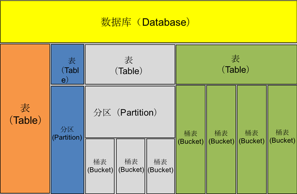
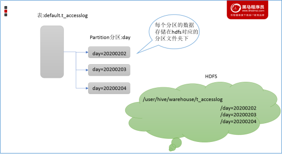
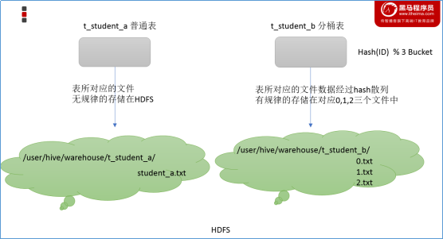

<nav>
<a href="#一apache-hive概述">一、Apache Hive概述</a><br/>
&nbsp;&nbsp;&nbsp;&nbsp;<a href="#11-hive介绍">1.1 Hive介绍</a><br/>
&nbsp;&nbsp;&nbsp;&nbsp;<a href="#12-场景设计如何模拟实现hive的功能">1.2 场景设计：如何模拟实现Hive的功能</a><br/>
<a href="#二hive系统架构和工作原理">二、Hive系统架构和工作原理</a><br/>
&nbsp;&nbsp;&nbsp;&nbsp;<a href="#21-hive系统架构">2.1 Hive系统架构</a><br/>
&nbsp;&nbsp;&nbsp;&nbsp;<a href="#22-相关名词">2.2 相关名词</a><br/>
&nbsp;&nbsp;&nbsp;&nbsp;<a href="#23-元数据配置方式">2.3 元数据配置方式</a><br/>
&nbsp;&nbsp;&nbsp;&nbsp;<a href="#24-客户端">2.4 客户端</a><br/>
&nbsp;&nbsp;&nbsp;&nbsp;&nbsp;&nbsp;&nbsp;&nbsp;<a href="#241-hive-clienthive-beeline-client">2.4.1 Hive Client、Hive Beeline Client</a><br/>
&nbsp;&nbsp;&nbsp;&nbsp;&nbsp;&nbsp;&nbsp;&nbsp;<a href="#242-hiveserverhiveserver2服务">2.4.2 HiveServer、HiveServer2服务</a><br/>
<a href="#三hive数据模型">三、Hive数据模型</a><br/>
&nbsp;&nbsp;&nbsp;&nbsp;<a href="#31-databases">3.1 Databases</a><br/>
&nbsp;&nbsp;&nbsp;&nbsp;<a href="#32-tables">3.2 Tables</a><br/>
&nbsp;&nbsp;&nbsp;&nbsp;<a href="#33-partitions">3.3 Partitions</a><br/>
&nbsp;&nbsp;&nbsp;&nbsp;<a href="#34-buckets">3.4 Buckets</a><br/>
<a href="#四hive与传统数据库对比">四、Hive与传统数据库对比</a><br/>
<a href="#参考引用">参考引用</a><br/>
</nav>

## 一、Apache Hive概述

### 1.1 Hive介绍
Apache Hive是一款建立在Hadoop之上的开源数据仓库系统，可以将存储在Hadoop文件中的结构化、半结构化数据文件映射为一张数据库表，基于表提供了一种类似SQL的查询模型，称为`Hive查询语言`（HQL），用于访问和分析存储在Hadoop文件中的大型数据集。`Hive核心是将HQL转换为MapReduce程序，然后将程序提交到Hadoop群集执行`。Hive由Facebook实现并开源。<br>

**Hive与Hadoop的关系**： Hive利用HDFS存储数据，利用MapReduce查询分析数据。

> 为什么使用Hive？<br>
① 人员学习使用Hadoop MapReduce成本太高 需要掌握java语言<br>
② MapReduce实现复杂查询逻辑开发难度太大<br>

**使用Hive处理数据的好处**：<br>
+ 操作接口采用类SQL语法，提供快速开发的能力（简单、容易上手）
+ 避免直接写MapReduce，减少开发人员的学习成本
+ 支持自定义函数，功能扩展很方便
+ 背靠Hadoop，擅长存储分析海量数据集

### 1.2 场景设计：如何模拟实现Hive的功能
+ `场景需求`：如何设计并实现Hive软件？<br>
  要求能够实现用户编写sql语句，Hive自动将sql转换为MapReduce程序，处理位于HDFS上的结构化数据。<br>
```
在HDFS文件系统上有一个文件，路径为/data/china_user.txt，其内容如下：
1,zhangsan,18,beijing
2,lisi,25,shanghai
3,allen,30,shanghai
4,wangwu,15,nanjing
5,james,45,hangzhou
6,tony,26,beijing
需求：统计来自于上海年龄大于25岁的用户有多少个？
```
+ 场景目的<br>
  Hive能将数据文件映射成为一张表，这个映射是指什么？<br>
  Hive软件本身到底承担了什么功能职责？<br>
+ 功能实现关键<br>
  1、映射信息记录了文件和表之间的对应关系，即元数据信息。主要包括：
  表对应着哪个文件（位置信息）、表的列对应着文件哪一个字段（顺序信息）、文件字段之间的分隔符是什么。<br>
  2、Sql语法解析、编译：
  用户写完sql之后，hive需要针对sql进行语法校验，并且根据记录的元数据信息解读sql背后的含义，制定执行计划。并且把执行计划转换成MapReduce程序来执行，把执行的结果封装返回给用户。
+ 最终效果<br>
基于上述分析，最终要想模拟实现的Hive的功能，需要下图所示组件参与其中：


## 二、Hive系统架构和工作原理
### 2.1 Hive系统架构
Hive是底层封装了Hadoop的数据仓库处理工具，它运行在Hadoop基础上，其系统架构组成主要包含4个部分，具体如下图所示。


1. `用户接口`：包括 CLI、JDBC/ODBC、WebGUI<br>
CLI(command line interface)为shell命令行；
Hive中的Thrift服务器允许外部客户端通过网络与Hive进行交互，类似于JDBC或ODBC协议；<br>
WebGUI是通过浏览器访问Hive。<br>

2. `元数据存储`<br>
   通常是存储在关系数据库如 mysql/derby中，包括表的名字、列和分区、属性（是否为外部表等）和数据所在目录等。
   
3. `Driver驱动程序`：包括语法解析器、计划编译器、优化器、执行器<br>
   完成 HQL 查询语句从词法分析、语法分析、编译、优化以及查询计划的生成。
   生成的查询计划存储在 HDFS 中，并在随后由执行引擎调用执行。<br>
   
4. `执行引擎`<br>
   Hive本身并不直接处理数据文件，而是通过执行引擎处理。<br>
   当下Hive支持MapReduce、Tez、Spark3种执行引擎。<br>

### 2.2 相关名词
+ `Metadata`，即元数据<br>
  包含用Hive创建的database、table、表的位置、类型、属性和字段顺序类型等元信息。<br>
  元数据存储在关系型数据库中。如hive内置的Derby、或者第三方如MySQL等。<br>
  
+ `Metastore`，即元数据服务<br>
  Metastore服务的作用是管理metadata元数据，对外暴露服务地址。<br>
  各种客户端通过连接metastore服务，由metastore连接MySQL数据库来存取元数据，保证hive元数据的安全。<br>

+ `Thrift服务器`<br>
  Thrift Network API 是Apache Thrift框架的一部分，提供了跨编程语言和网络的服务调用能力。<br>
  在Hive中，它被用来在远程模式下实现不同进程与Hive Metastore服务之间的通信。<br>
  Apache Thrift 是一个跨语言的 RPC（远程过程调用）框架，最初由Facebook开发，并后来捐赠给了Apache基金会。<br>
  支持多种编程语言，包括Java、C++、Python、Ruby、PHP、JavaScript等。

### 2.3 元数据配置方式
Metastore服务配置有3种模式：内嵌模式、本地模式、远程模式。区分3种配置方式的关键是弄清楚两个问题：

| 配置方式          | Metastore服务是否需要单独配置、单独启动？ | Metadata存储位置                          |
|-------------------|--------------------------------------------|-------------------------------------------|
| **内嵌模式**      | 不需要                                      | 内置的Derby数据库                          |
| **本地模式**      | 不需要                                      | 第三方RDBMS（如MySQL）                     |
| **远程模式**      | 需要                                        | 第三方RDBMS（如MySQL）                     |

1、`内嵌模式`（Embedded Metastore）：<br>
默认部署模式，元数据存储在内置的Derby数据库中。<br>
Derby数据库和Metastore服务嵌入在HiveServer进程中，无需单独配置和启动Metastore服务。<br>
仅支持一个活动用户，适合测试使用，不适合生产环境。<br>

   
2、`本地模式`（Local Metastore）：<br>
Metastore服务与HiveServer进程在同一进程中运行，但元数据存储在单独的外部数据库（推荐使用MySQL）中。<br>
Metastore服务通过JDBC与数据库通信。判断是否为本地模式的依据是hive.metastore.uris参数是否为空。<br>
缺点是每次启动Hive服务都会内置启动一个Metastore服务实例。<br>

   
3、`远程模式`（Remote Metastore）：<br>
Metastore服务在独立的JVM中运行，不与HiveServer进程共享，元数据存储在单独的外部数据库。<br>
其他进程可以通过Thrift Network API与Metastore服务通信，适合生产环境。<br>
提供更好的可管理性和安全性，需配置hive.metastore.uris参数并手动启动Metastore服务。<br>


### 2.4 客户端
#### 2.4.1 Hive Client、Hive Beeline Client、WebUI
Hive发展至今，总共历经了两代客户端工具。

**第一代客户端 hive shell（已废弃）**：
- 说明：通过hive shell来操作hive，但是至多只能存在一个hive shell，启动第二个会被阻塞，不支持并发操作。
- 功能：提供交互式模式的Hive查询运行环境、启动Metastore服务
- 路径：bin/hive =访问=> MetaStore Server =访问=>MySQL
```
# 启动Metastore服务(进程为RunJar)
$HIVE_HOME/bin/hive --service metastore
# 客户端
$HIVE_HOME/bin/hive
```

**第二代客户端**：
- 工具：`$HIVE_HOME/bin/beeline`
- 说明：通过jdbc协议访问hive，支持高并发。
- 功能：在嵌入式模式和远程模式下均可工作。<br>
  ①嵌入式模式：运行嵌入式Hive，类似于第一代Hive Client。
  ②远程模式：beeline通过 Thrift 连接到单独的 HiveServer2 服务上。
- 路径：bin/beeline =访问=> hiveServer2 =访问=> MetaStore Server =访问=> MySQL
```
# 启动hiveserver2服务(进程为RunJar)
$HIVE_HOME/bin/hive --service metastore
# jdbc客户端，输入连接：!connect jdbc:hive2://hive:10000
$HIVE_HOME/bin/beeline
```
```
hive@hive:~$ $HIVE_HOME/bin/beeline
Beeline version 3.1.2 by Apache Hive
beeline> !connect jdbc:hive2://hive:10000
Connecting to jdbc:hive2://hive:10000
Enter username for jdbc:hive2://hive:10000: hive
Enter password for jdbc:hive2://hive:10000: ****
Connected to: Apache Hive (version 3.1.2)
Driver: Hive JDBC (version 3.1.2)
Transaction isolation: TRANSACTION_REPEATABLE_READ
0: jdbc:hive2://hive:10000> 
```

**WebUI**
+ 通过`HUE`/`Zeppelin`来对Hive表进行操作。
  
那么问题来了，HiveServer2是什么？HiveServer1哪里去了？

#### 2.4.2 HiveServer、HiveServer2服务
HiveServer(RunJar进程)、`HiveServer2`(HS2、RunJar进程)是Hive自带的一项服务，允许客户端在不启动CLI的情况下对Hive中的数据进行操作，且两个都允许远程客户端使用多种编程语言如java，python等向hive提交请求，取回结果。

+ HiveServer不能处理多于一个客户端的并发请求。
+ 因此在Hive-0.11.0版本中重写了HiveServer代码得到了HiveServer2，进而解决了该问题，HiveServer已经被废弃。

HiveServer2支持多客户端的并发和身份认证，旨在为开放API客户端如JDBC、ODBC提供更好的支持。<br>
HS2 是作为复合服务运行的单个进程，其中包括`基于Thrift的Hive服务`(TCP 或 HTTP)和`用于Web UI的Jetty Web服务器`。<br>

> 基于Thrift的Hive服务是HS2的核心，并负责为Hive查询提供服务(例如，来自 Beeline)。 <br>
Thrift是用于构建跨平台服务的RPC框架，它的堆栈由 4 层组成： 服务器，传输，协议和处理器。<br>
HS2 将 TThreadPool Server(来自  Thrift)用于 TCP 模式，或将 Jetty  服务器用于 HTTP 模式。

## 三、Hive数据模型
数据模型：用来描述数据、组织数据和对数据进行操作，是对现实世界数据特征的描述。Hive的数据模型类似于RDBMS库表结构，包含数据库（Database）、表（Table）、分区表（Partition）和桶表（Bucket）四种数据类型，其模型如下图所示。<br>


### 3.1 Databases
Hive作为一个数据仓库，在结构上与传统数据库类似，也分数据库（Schema），每个数据库下面有各自的表组成。
相当于关系型数据库中的命名空间（namespace），它的作用是将用户和数据库的应用隔离到不同的数据库或者模式中。

+ 默认数据库`default`。 
+ Hive的数据均存储在HDFS上，默认有一个根目录<br>
  在`hive-site.xml`中，由参数hive.metastore.warehouse.dir指定（默认值为`/user/hive/warehouse`）。
  
因此，Hive中的数据库在HDFS上的存储路径为：
```
${hive.metastore.warehouse.dir}/databasename.db
```
比如，名为itcast的数据库存储路径为： /user/hive/warehouse/itcast.db

### 3.2 Tables
Hive表所对应的数据存储在Hadoop的文件系统中，而表相关的元数据是存储在元数据库（RDBMS）中。<br>
在Hadoop中，数据通常驻留在HDFS中，尽管它可以驻留在任何Hadoop文件系统中，包括本地文件系统或S3。Hive有两种类型的表：
+ Managed Table 内部表、托管表
+ External Table 外部表

创建表时，默是内部表。Hive中的表的数据在HDFS上的存储路径为：
```
${hive.metastore.warehouse.dir}/databasename.db/tablename
```
比如,itcast的数据库下t_user表存储路径为： /user/hive/warehouse/itcast.db/t_user

### 3.3 Partitions
Partition分区是hive的一种优化手段表。`分区是指根据分区列（例如“日期day”）的值将表划分为不同分区`。这样可以更快地对指定分区数据进行查询。

+ 分区在存储层面上的表现是：table表目录下以子文件夹形式存在。
+ 一个文件夹表示一个分区，子文件命名标准：分区列=分区值。

Hive还支持分区下继续创建分区，即多重分区。<br>


### 3.4 Buckets
Bucket分桶表是hive的一种优化手段表。`分桶是指根据表中字段（例如“编号ID”）的值,经过hash计算规则将数据文件划分成指定的若干个小文件`。
+ 分桶规则：hashfunc(ID) % 桶个数，余数相同的分到同一个文件。
+ 分桶的好处是可以优化join查询和方便抽样查询。
  
Bucket分桶表在hdfs中表现为同一个表目录下数据根据hash散列之后变成多个文件。<br>



## 四、Hive与传统数据库对比
Hive虽然与RDBMS数据库在数据模型、SQL语法等方面都十分相似，但应用场景却完全不同。Hive只适合用来做海量数据的离线分析。Hive的定位是数据仓库，面向分析的OLAP系统。具体的对比如下图所示：

| 对比项           | Hive    | MySQL                      |
| ---------------- | ------- | -------------------------- |
| 查询语言         | Hive QL | SQL                         |
| 数据存储位置     | HDFS    | 块设备、本地文件系统        |
| 数据格式         | 用户定义 | 系统决定                   |
| 数据更新         | 不支持  | 支持                        |
| 事务             | 不支持  | 支持                        |
| 执行延迟         | 高      | 低                          |
| 可扩展性         | 高      | 低                          |
| 数据规模         | 大      | 小                          |
| 多表插入         | 支持    | 不支持                      |

## 参考引用
[1] [黑马程序员-Apache Hive 3.0](https://book.itheima.net/course/1269935677353533441/1269937996044476418/1269942232408956930) <br>
[2] [docs4dev-HiveServer2_Overview.html](https://www.docs4dev.com/docs/zh/apache-hive/3.1.1/reference/HiveServer2_Overview.html) <br>
[3] [Apache-HiveServer2_Overview.html](https://cwiki.apache.org/confluence/display/Hive/HiveServer2+Overview) <br>
