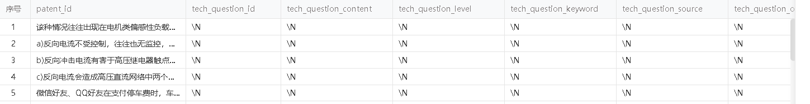
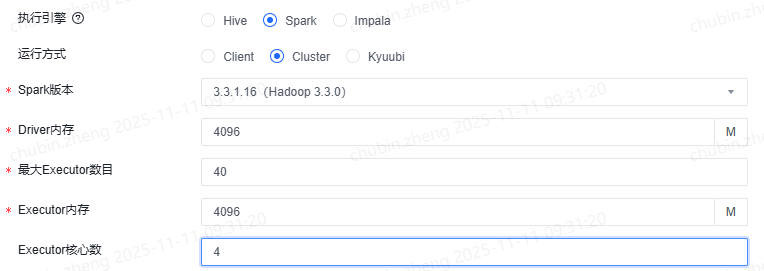

<nav>
<a href="#问题集锦">问题集锦</a><br/>
&nbsp;&nbsp;&nbsp;&nbsp;<a href="#1rddmap-内部可以使用sparksql读另一张表吗">1、rdd.map() 内部可以使用spark.sql()读另一张表吗</a><br/>
&nbsp;&nbsp;&nbsp;&nbsp;<a href="#2spark读取到的hive表为空">2、Spark读取到的Hive表为空</a><br/>
&nbsp;&nbsp;&nbsp;&nbsp;<a href="#3pyspark-rdd2dataframe类型自动推断">3、PySpark rdd2dataframe类型自动推断</a><br/>
&nbsp;&nbsp;&nbsp;&nbsp;<a href="#4error-coarsegrainedexecutorbackend-received-signal-term">4、ERROR CoarseGrainedExecutorBackend: RECEIVED SIGNAL TERM</a><br/>
&nbsp;&nbsp;&nbsp;&nbsp;<a href="#5create-table-as-select-问题">5、CREATE TABLE AS SELECT 问题</a><br/>
&nbsp;&nbsp;&nbsp;&nbsp;<a href="#6dataframe-saveastable-与-insertinto-导致的问题">6、DataFrame saveAsTable 与 insertInto 导致的问题</a><br/>
&nbsp;&nbsp;&nbsp;&nbsp;<a href="#7spark30-on-hive-left-join-时报错-bigger-than-sparkdrivermaxresultsize">7、Spark3.0 on Hive LEFT JOIN 时报错 bigger than spark.driver.maxResultSize</a><br/>
<a href="#参考引用">参考引用</a><br/>
</nav>


### 问题集锦
#### 1、rdd.map() 内部可以使用spark.sql()读另一张表吗
在 Spark 中，rdd.map 是一种分布式操作，它会在集群的每个执行节点上运行代码。因此，在 map 函数内部使用 spark.sql() 读取另一张表是不合适的。

`主要原因`：<br>
（1）SparkSession 的上下文：每个 Spark 任务在集群的执行节点上运行，这些节点可能没有访问 SparkSession 的上下文，因此无法执行 spark.sql()。<br>
（2）性能问题`：即使可以访问 SparkSession，每个任务运行时都去读取表，会导致大量的开销和性能问题，因为这会重复读取数据。

`正确的方式`：<br>
在 map 操作之前读取所有必要的数据，并将其传递给 map 函数。常见方法有<br>
  （1）使用广播变量：将较小的表广播到所有节点。 <br>
  （2）使用 DataFrame API：在 map 操作之前完成所有 SQL 操作。


#### 2、Spark读取到的Hive表为空
`具体报错`：<br>
```
Unable to infer schema for table bigdata_application_dev.ads_iur_kd_nsfc_gov_cn from file format ORC (inference mode: INFER_AND_SAVE). Using metastore schema.
```

`建表语句`：<br>
```
DROP TABLE IF EXISTS dws_algo_rs_smart_panel_ent_keywords_history;
CREATE external TABLE IF not EXISTS dws_algo_rs_smart_panel_ent_keywords_history
(
    id          STRING COMMENT 'id'
)
COMMENT ''
STORED AS ORC
TBLPROPERTIES ('external.table.purge' = 'TRUE', 'transactional'='false');

INSERT OVERWRITE TABLE dws_algo_rs_smart_panel_ent_keywords_history
SELECT ..
FROM t00
UNION ALL
SELECT ..
FROM t01
```

`原因`：<br>
<br>
如果表在 HDFS 中的路径包含子目录 `HIVE_UNION_SUBDIR_1`，这可能是由于在写入表数据时启用了 `union all` 语句导致的。这种情况下，Spark 可能无法正确读取包含子目录的数据。

`解决方法1`：<br>
通过 Hive 命令重新插入数据，将数据从子目录合并到主目录。
```
CREATE TABLE dws_algo_rs_smart_panel_ent_keywords_history_tmp AS
SELECT * FROM dws_algo_rs_smart_panel_ent_keywords_history;

INSERT OVERWRITE TABLE dws_algo_rs_smart_panel_ent_keywords_history
SELECT * FROM dws_algo_rs_smart_panel_ent_keywords_history_tmp;

DROP TABLE dws_algo_rs_smart_panel_ent_keywords_history_tmp;
```

`解决方法2`：<br>
将`union all`改为`union`.

#### 3、PySpark rdd2dataframe类型自动推断
背景：使用PySpark调用线上的服务接口，并将结果写回Hive表，关键代码如下：
```
cols = ["a", "b"]
df = spark.sql(sql)
  .repartition(10)\
  .rdd \
  .mapPartitionsWithIndex(lambda index, iterator: self.deal_partition_with_index(index, iterator))\
  .toDF(cols)
  
spark-submit \
  --master yarn \
  --deploy-mode cluster \
  --num-executors 10 \
  --executor-memory 2G \
  --executor-cores 1 \
  --driver-memory 5G \
  --py-files ${ROOT_PATH}/spark_task.py \
  ${ROOT_PATH}/run.py

```
问题描述：
执行`mapPartitionsWithIndex`时会触发一个名称为RunJob的Stage，只有1个core在运行。
运行结束后才根据分配的10个core执行，导致分区0被重复计算，DAG里看到第1次执行的时候是做了转换成PythonRDD的操作。<br>

<br>

原因：调用`toDF()`时PySpark自动采样数据并推断每列的类型，所以分区0会被重复计算。<br>
方案：
```
schema = StructType([
    StructField("a", StringType()),
    StructField("b", StringType()),
])
df = spark.sql(sql)
  .repartition(10)\
  .rdd \
  .mapPartitionsWithIndex(lambda index, iterator: self.deal_partition_with_index(index, iterator))\
  .toDF(schema=schema)
```
> 从RDD转换到DataFrame，共计有两种方式。<br>
第一种是直接把json格式的数据给Dataframe，让spark自动推断是什么类型，这也叫反射推断模式。<br>
另一种是定义StructTtpe定义schema，在CreateDataFrame的时候指定schema，这种叫编程指定模式。<br>

#### 4、ERROR CoarseGrainedExecutorBackend: RECEIVED SIGNAL TERM
任务之前正常执行未出现问题，查看Executor节点日志发现Error如下：
```l
ERROR CoarseGrainedExecutorBackend: RECEIVED SIGNAL TERM
```
估计是导致堆外内存不足的节点Container 被Kill掉，增加堆外内存解决当前问题。
```
--conf spark.executor.memoryOverhead=4g \
--conf spark.driver.memoryOverhead=4g \
```
[官方文档](https://spark.apache.org/docs/latest/configuration.html)：
```
spark.executor.memoryOverhead：executorMemory * spark.executor.memoryOverheadFactor, with minimum of 384
spark.driver.memoryOverhead：driverMemory * spark.driver.memoryOverheadFactor, with minimum of 384
```

#### 5、CREATE TABLE AS SELECT 问题
在 Hive 中，使用 `CREATE TABLE AS SELECT（CTAS）`创建表时，默认存储格式为 TextFile。<br>
当源表数据包含特殊字符（如 \n、\t）或源表存储格式为 `Parquet/ORC` 时，直接使用 CTAS 会导致 数据行数异常（如**单行拆分为多行**）。<br>
**根本原因**：TextFile 以换行符为行分隔符，而 Parquet/ORC 等格式可能将字段内换行符编码为普通字符，导致解析冲突。<br>

```hiveql
-- 显式指定存储格式: 在 CTAS 语句中强制定义存储格式（如 Parquet/ORC），避免默认 TextFile 的解析问题
CREATE TABLE target_table
STORED AS ORC  -- 或 PARQUET
AS
SELECT * FROM source_table;
```

#### 6、DataFrame saveAsTable 与 insertInto 导致的问题
在 Hive 中，使用 `saveAsTable`存表时，指定了存储格式为 "hive"，发现会改变原始的表结构，导致出现脏数据。<br>
<br>

**根本原因**：
当源表数据包含特殊字符（如 \n、\t）或源表存储格式为 `hive` 时，写表会导致数据行数异常（如**单行拆分为多行**）。TextFile 以`换行符`为行分隔符，而 Parquet/ORC 等格式可能将字段内换行符编码为普通字符，导致解析冲突。<br>

```spark
-- saveAsTable：可能修改表结构（危险！）
df.write.format("orc").mode("overwrite").saveAsTable("my_table") 
 
-- insertInto：仅覆盖数据，表结构不变（安全）
df.write.format("orc").mode("overwrite").insertInto("my_table") 
```
+ DataFrame saveAsTable 与 insertInto 行为及适用场景

| 方法            | 行为                                                                                                                                            | 适用场景                                   |
|---------------|-----------------------------------------------------------------------------------------------------------------------------------------------|----------------------------------------|
| `saveAsTable` | 若表不存在，自动创建新表，Schema 由 DataFrame 定义；<br>若表存在且 `overwrite=True`，删除整个表数据目录（如 `hdfs://.../my_table`），重建表元数据，全量写入新数据。<br>若表为分区表，所有分区被清除，仅保留新数据。    | 需要动态管理表结构的情况（例如新增字段、修改存储格式等）。          |
| `insertInto`  | 表必须预先存在，且 DataFrame 的列名、顺序、数据类型需与目标表严格一致；仅操作数据，不修改元数据。<br>当 `overwrite=True` 时：<br>- **分区表**：仅覆盖匹配分区的数据。<br>- **非分区表**：全表覆盖，但保留表属性（如注释、存储格式）。 | 表结构固定，仅需更新数据的情况（例如进行分区覆盖等操作而不改变现有表结构）。 |

#### 7、Spark3.0 on Hive LEFT JOIN 时报错 bigger than spark.driver.maxResultSize
**问题描述**：在执行`left join`语句时
+ ✅ 不加 WHERE day="20251105" 的 LEFT JOIN（即全表 join） → 能正常运行
+ ❌ 加上 WHERE day="20251105" 限制右表后 → 反而报错：spark.driver.maxResultSize 超限

这看起来违反直觉（“加了过滤条件数据更少，怎么会爆？”），但其实揭示了 `Spark 3.0 + Hive on Spark` 中一个典型的优化器陷阱。
```hiveql
INSERT OVERWRITE TABLE algo_dws_academic_journal_foreign_fusion_en2cn PARTITION(day="20251105")
SELECT doc_id, title
FROM (
    -- 1000
    SELECT *
    FROM (
        SELECT doc_id , title_cn, row_number() over (partition by doc_id order by dt desc) rn
        FROM algo_recommend.algo_dws_academic_journal_foreign_fusion_en2cn_parse
        WHERE dt >= "20251105"
    ) t0
    WHERE `rn`=1
) t
    
-- 报错：Total size of serialized results of 42 tasks (2.1 GiB) is bigger than spark.driver.maxResultSize (2.0 GiB)
LEFT JOIN (
    -- 339727452
    SELECT doc_id, title
    FROM bigdata_ip_journal.ads_academic_foreign_translation_prepared
    WHERE `day`="20251105"
) t1 ON t.doc_id=t1.doc_id

-- 正常执行
LEFT JOIN bigdata_ip_journal.ads_academic_foreign_translation_prepared t1 ON t.doc_id=t1.doc_id
```
<br>


**原因**：Spark 错误地将右表识别为“小表”，尝试广播（Broadcast Hash Join）到所有 Executor，但该分区实际很大(3亿+条数据)，Driver 在 序列化广播变量时就会内存爆炸。 虽然错误信息是 maxResultSize，但本质是 `广播过程中的序列化结果过大`，广播失败有时也会表现为 maxResultSize 超限，因为广播内容需先汇总到 Driver 再分发。

**对比**：全表 join 为何反而没事？
全表扫描时，Spark 知道右表很大，不会尝试广播，而是用 `Sort-Merge Join`（纯分布式操作，无需回传数据到 Driver），即使总数据量更大，但没有集中式操作，所以不触发 maxResultSize。
```
Explain $sql

*(4) Project [doc_id#28, title#36, title_cn#29, keyword#62, keyword_cn#30, abstract#57, abstract_cn#31, log_dt#19]
+- *(4) BroadcastHashJoin [doc_id#28], [doc_id#34], LeftOuter, BuildRight, false
   :- *(4) Project [doc_id#28, title_cn#29, keyword_cn#30, abstract_cn#31, log_dt#19]
   :  +- *(4) Filter (rn#20 = 1)
   :     +- Window [row_number() ... AS rn#20], [doc_id#28], [dt#33 DESC NULLS LAST]
   :        +- WindowGroupLimit [doc_id#28], [dt#33 DESC NULLS LAST], row_number(), 1, Final
   :           +- *(2) Sort [doc_id#28 ASC NULLS FIRST, dt#33 DESC NULLS LAST], false, 0
   :              +- Exchange hashpartitioning(doc_id#28, 200), ENSURE_REQUIREMENTS, [plan_id=82]
   :                 +- WindowGroupLimit [doc_id#28], [dt#33 DESC NULLS LAST], row_number(), 1, Partial
   :                    +- *(1) Sort [doc_id#28 ASC NULLS FIRST, dt#33 DESC NULLS LAST], false, 0
   :                       +- *(1) Project [doc_id#28, title_cn#29, keyword_cn#30, abstract_cn#31, dt#33 AS log_dt#19, dt#33]
   :                          +- *(1) Filter (((isnotnull(title_cn#29) AND (length(title_cn#29) > 0)) OR ...))
   :                             +- *(1) ColumnarToRow
   :                                +- FileScan orc algo_recommend.algo_dws_academic_journal_foreign_fusion_en2cn_parse[...]
   :                                   PartitionFilters: [isnotnull(dt#33), (dt#33 >= 20251105)]
   +- BroadcastExchange HashedRelationBroadcastMode(List(input[0, string, false]),false), [plan_id=94]
      +- *(3) Filter isnotnull(doc_id#34)
         +- Scan hive bigdata_ip_journal.ads_academic_foreign_translation_prepared [...]
            Partition Cols: [day#77], Pruned Partitions（分区裁剪）: [(day=20251105)]
```
> BroadcastExchange：Spark 将整个右表结果收集到 Driver 序列化为 HashedRelation（哈希表）然后广播到所有 Executor。

**方案**：
+ 显式禁止广播（最终采用方案）
```hiveql
SET spark.sql.autoBroadcastJoinThreshold=-1;
```
+ 增大 spark.driver.maxResultSize（临时 workaround）
```hiveql
SET spark.driver.maxResultSize=3g;
```

### 参考引用
[1] [弱鸡了吧？背各种SparkSQL调优参数？这个东西才是SparkSQL必须要懂的](https://zhuanlan.zhihu.com/p/336693158)<br>
