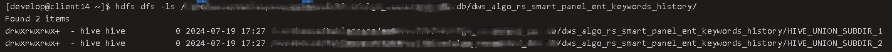
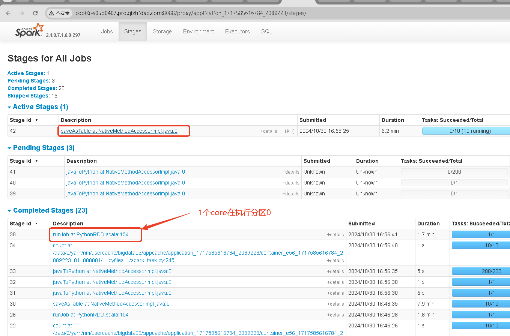

[TOC]
### 问题集锦
#### 1、rdd.map() 内部可以使用spark.sql()读另一张表吗
在 Spark 中，rdd.map 是一种分布式操作，它会在集群的每个执行节点上运行代码。因此，在 map 函数内部使用 spark.sql() 读取另一张表是不合适的。

`主要原因`：<br>
（1）SparkSession 的上下文：每个 Spark 任务在集群的执行节点上运行，这些节点可能没有访问 SparkSession 的上下文，因此无法执行 spark.sql()。<br>
（2）性能问题`：即使可以访问 SparkSession，每个任务运行时都去读取表，会导致大量的开销和性能问题，因为这会重复读取数据。

`正确的方式`：<br>
在 map 操作之前读取所有必要的数据，并将其传递给 map 函数。常见方法有<br>
  （1）使用广播变量：将较小的表广播到所有节点。 <br>
  （2）使用 DataFrame API：在 map 操作之前完成所有 SQL 操作。


#### 2、Spark读取到的Hive表为空
`具体报错`：<br>
```
Unable to infer schema for table bigdata_application_dev.ads_iur_kd_nsfc_gov_cn from file format ORC (inference mode: INFER_AND_SAVE). Using metastore schema.
```

`建表语句`：<br>
```
DROP TABLE IF EXISTS dws_algo_rs_smart_panel_ent_keywords_history;
CREATE external TABLE IF not EXISTS dws_algo_rs_smart_panel_ent_keywords_history
(
    id          STRING COMMENT 'id'
)
COMMENT ''
STORED AS ORC
TBLPROPERTIES ('external.table.purge' = 'TRUE', 'transactional'='false');

INSERT OVERWRITE TABLE dws_algo_rs_smart_panel_ent_keywords_history
SELECT ..
FROM t00
UNION ALL
SELECT ..
FROM t01
```

`原因`：<br>
<br>
如果表在 HDFS 中的路径包含子目录 `HIVE_UNION_SUBDIR_1`，这可能是由于在写入表数据时启用了 `union all` 语句导致的。这种情况下，Spark 可能无法正确读取包含子目录的数据。

`解决方法1`：<br>
通过 Hive 命令重新插入数据，将数据从子目录合并到主目录。
```
CREATE TABLE dws_algo_rs_smart_panel_ent_keywords_history_tmp AS
SELECT * FROM dws_algo_rs_smart_panel_ent_keywords_history;

INSERT OVERWRITE TABLE dws_algo_rs_smart_panel_ent_keywords_history
SELECT * FROM dws_algo_rs_smart_panel_ent_keywords_history_tmp;

DROP TABLE dws_algo_rs_smart_panel_ent_keywords_history_tmp;
```

`解决方法2`：<br>
将`union all`改为`union`.

#### 3、PySpark rdd2dataframe类型自动推断
背景：使用PySpark调用线上的服务接口，并将结果写回Hive表，关键代码如下：
```
cols = ["a", "b"]
df = spark.sql(sql)
  .repartition(10)\
  .rdd \
  .mapPartitionsWithIndex(lambda index, iterator: self.deal_partition_with_index(index, iterator))\
  .toDF(cols)
  
spark-submit \
  --master yarn \
  --deploy-mode cluster \
  --num-executors 10 \
  --executor-memory 2G \
  --executor-cores 1 \
  --driver-memory 5G \
  --py-files ${ROOT_PATH}/spark_task.py \
  ${ROOT_PATH}/run.py

```
问题描述：
执行`mapPartitionsWithIndex`时会触发一个名称为RunJob的Stage，只有1个core在运行。
运行结束后才根据分配的10个core执行，导致分区0被重复计算，DAG里看到第1次执行的时候是做了转换成PythonRDD的操作。<br>

<br>

原因：调用`toDF()`时PySpark自动采样数据并推断每列的类型，所以分区0会被重复计算。<br>
方案：
```
schema = StructType([
    StructField("a", StringType()),
    StructField("b", StringType()),
])
df = spark.sql(sql)
  .repartition(10)\
  .rdd \
  .mapPartitionsWithIndex(lambda index, iterator: self.deal_partition_with_index(index, iterator))\
  .toDF(schema=schema)
```
> 从RDD转换到DataFrame，共计有两种方式。<br>
第一种是直接把json格式的数据给Dataframe，让spark自动推断是什么类型，这也叫反射推断模式。<br>
另一种是定义StructTtpe定义schema，在CreateDataFrame的时候指定schema，这种叫编程指定模式。<br>
