[TOC]

### Spark简介
Spark最初由美国加州伯克利大学（UCBerkeley）的AMP实验室于2009年开发。
+ 基于`内存计算`的大数据并行计算框架，可用于构建大型的、低延迟的数据分析应用程序。 
+ Apache软件基金会最重要的三大分布式计算系统开源项目之一（Hadoop、Spark、Storm）。 

具有如下几个主要特点：
+ 运行速度快：使用`DAG执行引擎`以支持循环数据流与内存计算
+ 容易使用：支持使用Scala、Java、Python和R语言进行编程，可以通过Spark Shell进行交互式编程
+ 通用性：Spark提供了完整而强大的技术栈，包括SQL查询、流式计算 、机器学习和图算法组件
+ 运行模式多样：可运行于独立的集群模式中，可运行于Hadoop中，也可运行于Amazon EC2等云环境中 
可以访问HDFS、Cassandra、HBase、Hive等多种数据源

相比于Hadoop MapReduce，Spark主要具有如下优点：
+ Spark的计算模式也属于MapReduce，但不局限于Map和Reduce操作
+ 还提供了多种数据集操作类型，编程模型比Hadoop MapReduce更灵活
+ Spark提供了内存计算，可将中间结果放到内存中，对于迭代运算效率更高 
+ Spark基于DAG的任务调度执行机制，要优于Hadoop MapReduce的迭代执行机制
+ 使用Hadoop进行迭代计算非常耗资源
+ Spark将数据载入内存后，之后的迭代计算都可以直接使用内存中的中间结果作运算，`避免了从磁盘中频繁读取数据`

| MapReduce                 | Spark                              |
|:--------------------------|:-----------------------------------|
| 数据存储结构：磁盘HDFS文件系统的split   | 使用内存构建弹性分布式数据集RDD 对数据进行运算和cache |
| 编程范式：Map + Reduce         | DAG: `Transformation` + `Action`   |
| 计算中间结果落到磁盘，IO及序列化、反序列化代价大 | 计算中间结果在内存中维护 存取速度比磁盘高几个数量级      |
| Task以进程的方式维护，需要数秒时间才能启动任务 | Task以线程的方式维护 对于小数据集读取能够达到亚秒级的延迟 |

### Spark生态
在实际应用中，大数据处理主要包括以下三个类型：
+ 复杂的`批量数据处理`：通常时间跨度在数十分钟到数小时之间(MapReduce)
+ 基于`历史数据的交互式查询`：通常时间跨度在数十秒到数分钟之间(Impala)
+ 基于`实时数据流`的数据处理：通常时间跨度在数百毫秒到数秒之间(Storm)

当同时存在以上三种场景时，就需要同时部署三种不同的软件，这样做难免会带来一些问题：
+ 不同场景之间输入输出数据无法做到无缝共享，通常需要进行数据格式的转换
+ 不同的软件需要不同的开发和维护团队，带来了较高的使用成本
+ 比较难以对同一个集群中的各个系统进行统一的资源协调和分配

Spark的设计遵循“一个软件栈满足不同应用场景”的理念，逐渐形成了一套完整的生态系统。
+ 既能够提供内存计算框架，也可以支持SQL即时查询、实时流式计算、机器学习和图计算等
+ Spark可以部署在资源管理器YARN之上，提供一站式的大数据解决方案

因此，Spark所提供的生态系统足以应对上述三种场景，即同时支持批处理、交互式查询和流数据处理。
Spark生态系统已经成为伯克利数据分析软件栈BDAS（Berkeley Data Analytics Stack）的重要组成部分。
Spark的生态系统主要包含了以下组件：
+ `Spark Core`：包含Spark的基本功能；定义了RDD的API、操作以及Action。
+ `Spark SQL`：提供通过Apache Hive的SQL变体Hive查询语言（HiveQL）与Spark进行交互的API。 
每个数据库表被当做一个RDD，Spark SQL查询被转换为Spark操作。
+ `Spark Streaming`：对实时数据流进行处理和控制，允许程序能够像普通RDD一样处理实时数据。
+ `Spark MLlib`：一个常用机器学习算法库，算法被实现为对RDD的Spark操作。
+ `Spark GraphX`：控制图、并行图操作和计算的一组算法和工具的集合。

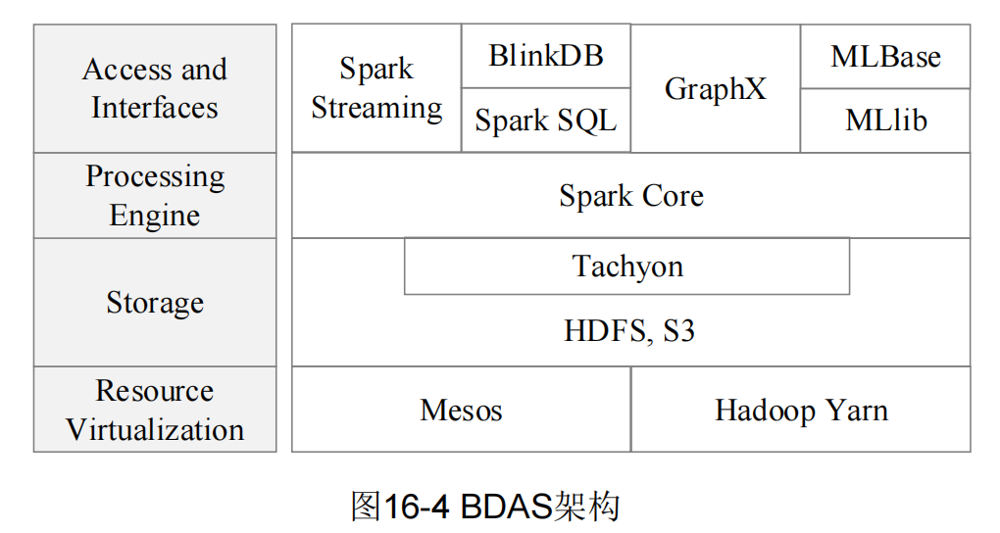

Spark生态系统组件的应用场景

| 应用场景         | 时间跨度    | 其他框架           | Spark生态系统中的组件   |
|:-------------|:--------|:---------------|:----------------|
| 批量数据处理(批处理)  | 小时级     | MapReduce、Hive | Spark           |
| 基于历史数据的交互式查询 | 分钟级 、秒级 | Impala         | Spark SQL       |
| 基于实时数据流的数据处理 | 毫秒、秒级   | Storm          | Spark Streaming |
| 基于历史数据的数据挖掘  | -       | Mahout         | MLlib           |
| 图结构数据的处理     | -       | Pregel         | GraphX          |

### Spark运行架构
#### 基本概念和架构设计
Spark运行架构包括： 
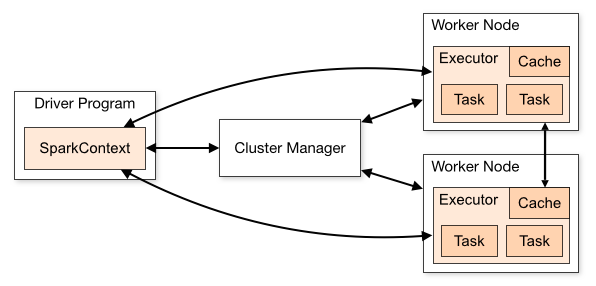

+ Cluster Manager（集群资源管理器）：用于在集群上分配资源的外部服务，如Standalone集群管理器Master、Mesos或者YARN。
+ Worker Node（工作节点）：集群中可以运行应用程序代码的任意一个节点。运行一个或多个Executor进程。
+ Driver Program（驱动器程序）：负责控制一个应用的执行，运行Application的main函数和初始化SparkContext进程。
+ SparkContext（Spark上下文）：负责和资源管理器的通信以及进行资源的申请、任务的分配和监控、计算RDD之间的依赖关系构建DAG等。
+ SparkSession（Spark会话）：实质上是SQLContext和HiveContext的组合，内部封装了sparkContext。
+ Executor（执行进程）：运行在工作节点的一个JVM`进程`，用于运行计算任务，并在内存或磁盘上保存数据。

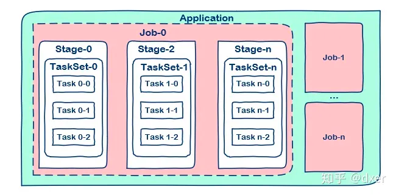

+ Application（应用程序）：用户编写的Spark应用程序，由集群上的一个驱动器（driver）和多个作业（Job）组成。
+ Job（作业）：一个Job包含多个RDD及作用于相应RDD上的各种操作，一个Job由多个Stage构成。
+ Stage（步骤）：是Job的基本调度单位，一个Job会分为多组Task，每组Task被称为Stage，也称为TaskSet。 
  代表了一组关联的、相互之间没有Shuffle依赖关系的任务组成的任务集。
+ Task（任务）：运行在 Executor 的工作单元，是运行Application的基本单位。

Spark任务调度模块主要包含两大部分：DAGScheduler和TaskScheduler： 
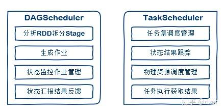 
+ RDD：Resillient Distributed Dataset（弹性分布式数据集）的简称，提供了一种`高度受限的共享内存模型`。

+ DAG：Directed Acyclic Graph（有向无环图）的简称，反映RDD之间的依赖关系
+ DAGScheduler：将DAG划分为不同的Stage，并以TaskSet的形式把Stage提交给TaskScheduler。
+ TaskScheduler：负责Application中不同job之间的调度，将TaskSet提交给Worker执行并返回结果，在Task执行失败时启动重试机制。

#### Spark运行基本流程
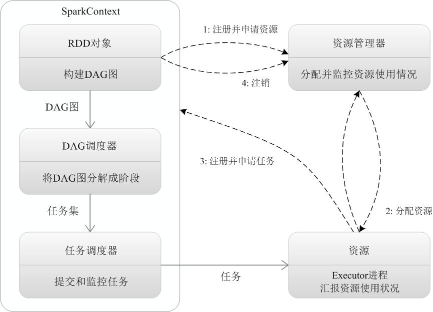 
Spark的基本运行流程如下： 
1. 首先为应用构建起基本的运行环境，即由Driver创建一个`SparkContext`，进行资源的申请、任务的分配和监控 
2. 资源管理器为Executor分配资源，并启动Executor进程 
3. SparkContext根据RDD的依赖关系构建DAG图，DAG图提交给DAGScheduler解析成Stage，然后把一个个TaskSet提交给底层调度器TaskScheduler处理 
4. Executor向SparkContext申请Task，Task Scheduler将Task发放给Executor运行，并提供应用程序代码 
5. Task在Executor上运行，把执行结果反馈给TaskScheduler，然后反馈给DAGScheduler，运行完毕后写入数据并释放所有资源 

总体而言，Spark运行架构具有以下特点： 
1. 每个Application都有自己专属的Executor进程，并且该进程在Application运行期间一直驻留。Executor进程以`多线程`的方式运行Task 
2. Spark运行过程与资源管理器无关，只要能够获取Executor进程并保持通信即可 
3. Task采用了数据本地性和推测执行等优化机制 

### RDD运行原理
#### RDD设计背景和基本概念
RDD设计背景: 
+ 许多迭代式算法（比如机器学习、图算法等）和交互式数据挖掘工具，共同之处是，不同计算阶段之间会重用中间结果 
+ 目前的MapReduce框架都是把中间结果写入到HDFS中，带来了大量的数据复制、磁盘IO和序列化开销 
+ RDD提供了一个抽象的数据架构，只需将具体的应用逻辑表达为一系列转换处理，`不同RDD之间的转换操作形成依赖关系`，可以实现管道化，`避免中间数据存储` 

RDD(Resilient Distributed Datasets)基本概念：
+ 一个RDD就是一个分布式对象集合，本质上是一个`只读的分区记录集合`。 
  每个RDD可分成多个分区，每个分区就是一个数据集片段 
  一个RDD的不同分区可以被保存到集群中不同的节点上，从而可以在集群中的不同节点上进行并行计算 
+ RDD提供了一种高度受限的共享内存模型，即RDD是只读的记录分区的集合，`不能直接修改` 
  只能基于稳定的物理存储中的数据集创建RDD，或者通过在其他RDD上执行确定的转换操作（如`map`、`join`和`group by`）而创建得到新的RDD
+ RDD不需要被物化，它通过血缘关系(lineage)来确定其是从RDD计算得来的。 
  另外，用户可以控制RDD的持久化和分区，用户可以将需要被重用的RDD进行持久化操作(比如内存、或者磁盘)以提高计算效率。 
  也可以按照记录的key将RDD的元素分布在不同的机器上，比如在对两个数据集进行JOIN操作时，可以确保以相同的方式进行hash分区。 
+ RDD提供了一组丰富的操作以支持常见的数据运算，分为 “动作”（`Action`）和“转换”（`Transformation`）两种类型
+ RDD提供的转换接口都非常简单，都是类似map、filter、 groupBy、join等粗粒度的数据转换操作
+ RDD表面上功能很受限、不够强大，实际上RDD已经被实践证明可以高效地表达许多框架的编程模型（比如MapReduce、SQL、Pregel）
+ Spark用Scala语言实现了RDD的API，程序员可以通过调用API实现对RDD的各种操作
  
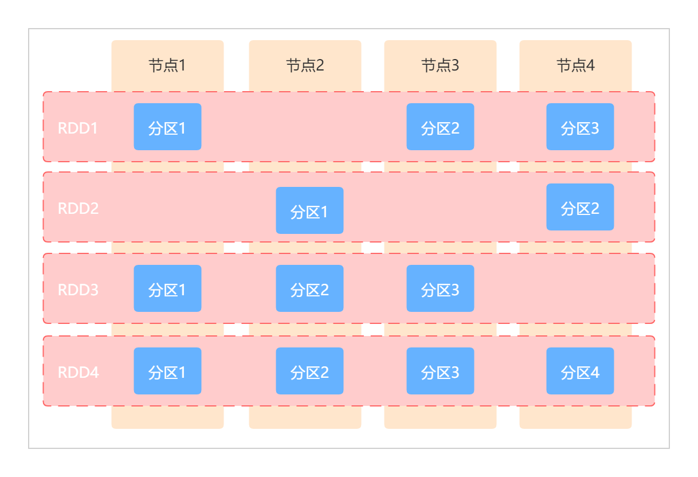 

**主要特点**
+ `基于内存`：RDD是位于内存中的对象集合。RDD可以存储在内存、磁盘或者内存加磁盘中。 
  Spark之所以速度快，是基于这样一个事实：数据存储在内存中，并且每个算子不会从磁盘上提取数据。
+ `分区`：分区是对逻辑数据集划分成不同的独立部分，可以减少网络流量传输，将相同的key的元素分布在相同的分区中可以减少shuffle带来的影响。 
  RDD被分成了多个分区，这些分区分布在集群中的不同节点。
+ `强类型`：RDD中的数据是强类型的，当创建RDD的时候，所有的元素都是相同的类型，该类型依赖于数据集的数据类型。
+ `懒加载`：Spark的转换操作是懒加载模式，这就意味着只有在执行了action(比如count、collect等)操作之后，才会去执行一些列的算子操作。
+ `不可修改`： RDD一旦被创建，就不能被修改。只能从一个RDD转换成另外一个RDD。
+ `并行化`： RDD是可以被并行操作的，由于RDD是分区的，每个分区分布在不同的机器上，所以每个分区可以被并行操作。
+ `持久化`：由于RDD是懒加载的，只有action操作才会导致RDD的转换操作被执行，进而创建出相对应的RDD。 
  对于一些被重复使用的RDD，可以对其进行持久化操作(比如将其保存在内存或磁盘中，Spark支持多种持久化策略)，从而提高计算效率。

RDD典型的执行过程如下： 
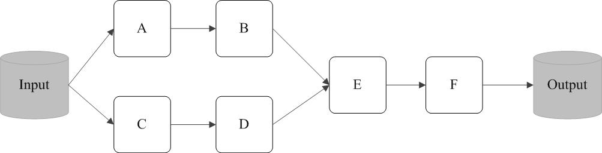 
1. RDD读入外部数据源进行创建
2. RDD经过一系列的转换（Transformation）操作，每一次都会产生不同的RDD，供给下一个转换操作使用
3. 最后一个RDD经过“动作”操作进行转换，并输出到外部数据源

这一系列处理称为一个Lineage（`血缘关系`），即DAG拓扑排序的结果。 
Spark采用RDD以后能够实现高效计算的原因主要在于：
1. **高效的容错性** 
   血缘关系、重新计算丢失分区、无需回滚系统、重算过程在不同节点之间并行、只记录粗粒度的操作
2. `中间结果持久化到内存`，数据在内存中的多个RDD操作之间进行传递，避免了不必要的读写磁盘开销
3. 存放的数据可以是Java对象，`避免了不必要的对象序列化和反序列化`

#### RDD之间的依赖关系和Stage划分
`窄依赖`：表现为一个父RDD的分区对应于一个子RDD的分区或多个父RDD的分区对应于一个子RDD的分区 
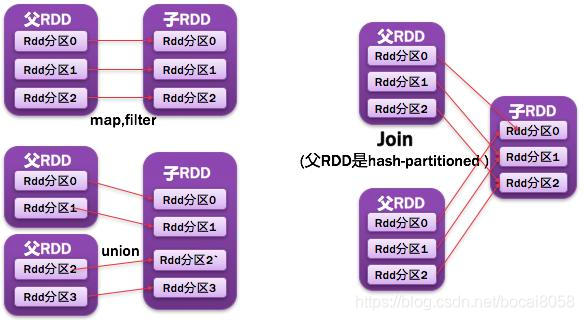 

`宽依赖`：表现为存在一个父RDD的一个分区对应一个子RDD的多个分区 
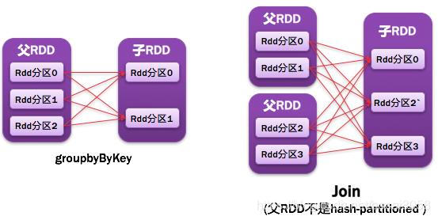 

Spark通过分析各个RDD的依赖关系生成了DAG，再通过分析各个`RDD中的分区之间的依赖关系`来决定如何划分Stage，具体划分方法是： 
+ 在DAG中进行反向解析，遇到宽依赖就断开
+ 遇到窄依赖就把当前的RDD加入到Stage中
+ 将窄依赖尽量划分在同一个Stage中，可以实现流水线计算

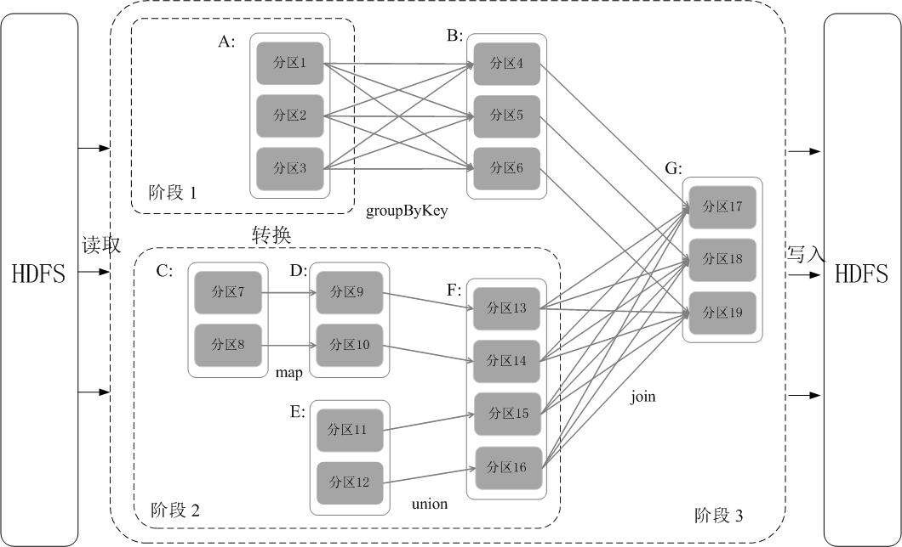 
+ 在该实例中，被分成三个Stage，在Stage2中，从map到union都是窄依赖，这两步操作可以形成一个流水线操作
+ 分区7通过map操作生成的分区9， 可以不用等待分区8到分区10这个map操作的计算结束，而是继续进行union操作，得到分区13
+ 流水线执行大大提高了计算的效率

#### RDD运行过程
通过上述对RDD概念、依赖关系和Stage划分的介绍，结合之前介绍的Spark运行基本流程，再总结一下RDD在Spark架构中的运行过程： 
1. 创建RDD对象；
2. SparkContext负责计算RDD之间的依赖关系，构建DAG； 
3. DAGScheduler负责把DAG图分解成多个Stage，每个Stage中包含了多个Task，
4. 每个Task会被TaskScheduler分发给各个WorkerNode上的Executor去执行。

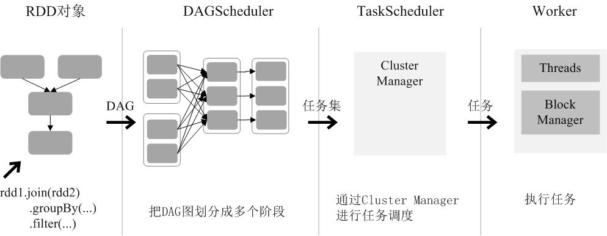 

#### Spark三种部署方式
Spark支持三种不同类型的部署方式，包括： 
+ Standalone（类似于MapReduce1.0，slot为资源分配单位）
+ Spark on Mesos（和Spark有血缘关系，更好支持Mesos） 
+ Spark on YARN

用Spark架构具有如下优点：
+ 实现一键式安装和配置、线程级别的任务监控和告警
+ 降低硬件集群、软件维护、任务监控和应用开发的难度
+ 便于做成统一的硬件、计算平台资源池
+ Spark Streaming`无法实现毫秒级的流计算`

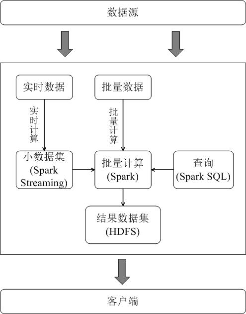 

### 参考引用
+ [子雨大数据之Spark入门：Spark运行架构(Python版)](https://dblab.xmu.edu.cn/blog/1711/)
+ [子雨大数据之Spark入门教程（Scala版）](https://dblab.xmu.edu.cn/blog/924/)
+ [Spark-core编程指南](https://jiamaoxiang.top/2020/07/18/第二篇-Spark-core编程指南)
+ [深入理解Spark任务调度](https://zhuanlan.zhihu.com/p/68393078)
+ [Spark 2.2.x 中文文档-集群模式概述](https://spark-reference-doc-cn.readthedocs.io/zh_CN/latest/deploy-guide/cluster-overview.html)
+ [Spark基本概念解析](https://andr-robot.github.io/Spark%E5%9F%BA%E6%9C%AC%E6%A6%82%E5%BF%B5%E8%A7%A3%E6%9E%90/)
+ [spark基本架构及原理](https://zhuanlan.zhihu.com/p/91143069)
+ [Spark原理框架和作业执行流程](https://blog.csdn.net/bocai8058/article/details/83051242)

