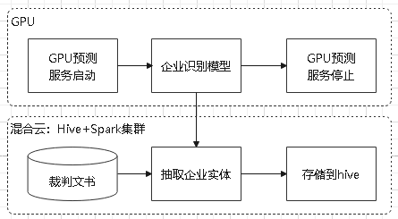
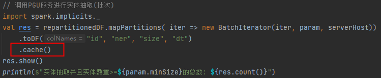

[TOC]

### RDD操作算子
Spark提供了丰富的RDD操作算子，主要包括两大类：Transformation与Action，下面会对一些常见的算子进行说明。

#### 转换操作(Transformation)
对于RDD而言，每一次转换操作都会产生`不同的RDD`，供给下一个“转换”使用。<br>
转换得到的RDD是`惰性求值`的，即整个转换过程只是记录了转换的轨迹，并不会发生真正的计算，只有遇到行动操作时，才会发生真正的计算。<br>
对于普通的RDD，支持Scala、Java、Python和R的API，对于pairRDD，仅支持Scala和JavaAPI。<br>
常见的转换操作（Transformation API）：
+ filter(func)：筛选出满足函数func的元素，并返回一个新的数据集
+ map(func)：将每个元素传递到函数func中，并将结果返回为一个新的数据集
+ flatMap(func)：与map()相似，首先对该RDD所有元素应用func函数，然后将结果打平，每个输入元素会映射到0或者多个元素，返回一个新RDD
+ mapPartitions(func)：将func作用于该RDD的每个分区，返回一个新的RDD
+ union(otherDataset)：返回一个新的RDD，包含两个RDD的元素，类似于SQL的UNION ALL
+ intersection(otherDataset)：返回一个新的RDD，包含两个RDD的交集
+ distinct([numPartitions]))：返回一个新的RDD，对原RDD元素去重
+ groupByKey()：应用于(K,V)键值对的数据集时，返回一个新的(K, Iterable)形式的数据集
+ reduceByKey(func)：应用于(K,V)键值对的数据集时，返回一个新的(K, V)形式的数据集，其中的每个值是将每个key传递到函数func中进行聚合
+ sortByKey([ascending], [numPartitions])：按照key对RDD进行排序，所以每个分区的元素都是排序的
+ coalesce(numPartitions)：该函数用于将RDD进行重分区，使用HashPartitioner。第一个参数为重分区的数目，第二个为是否进行shuffle，默认为false;
+ repartition(numPartitions)：可以增加或者减少分区，底层调用的是coalesce方法。如果要减少分区，建议使用coalesce，因为可以避免shuffle

#### 行动操作
Spark程序执行到行动操作时，才会执行真正的计算，从文件中加载数据，完成一次又一次转换操作，最终，完成行动操作得到结果。<br>
下面列出一些常见的行动操作（Action API）：
+ count() 返回数据集中的元素个数
+ collect() 以数组的形式返回数据集中的所有元素
+ first() 返回数据集中的第一个元素
+ take(n) 以数组的形式返回数据集中的前n个元素
+ reduce(func) 通过函数func（输入两个参数并返回一个值）聚合数据集中的元素
+ foreach(func) 将数据集中的每个元素传递到函数func中运行


### RDD持久化
在Spark中，RDD采用`惰性求值`的机制，`每次调用行动操作，都会触发一次从头开始的计算`。<br>
这对于迭代计算而言，代价是很大的，迭代计算经常需要多次重复使用同一组数据。<br>
+ 可以通过持久化（缓存）机制避免这种重复计算的开销
+ Spark提供了两个持久化方法<br>
  persist()方法对一个RDD标记为持久化<br>
  cache()方法默认使用的是内存级别，其底层调用的是persist(MEMORY_ONLY)方法。<br>
+ 之所以说“标记为持久化”，是因为出现persist()语句的地方，并不会马上计算生成RDD并把它持久化，而是要等到`遇到第1个行动操作触发真正计算以后，才会把计算结果进行持久化`
+ 持久化后的RDD将会被保留在计算节点的内存中被后面的行动操作重复使用
+ 可以使用unpersist()方法手动地把持久化的RDD从缓存中移除

#### 持久化存储级别
persist(newLevel: StorageLevel)的圆括号中包含的是持久化级别参数：
```scala
def cache(): this.type = persist()
def persist(): this.type = persist(StorageLevel.MEMORY_ONLY)
```
+ MEMORY_ONLY：默认，表示将RDD作为反序列化的Java对象存储于JVM中，如果内存不够用，则部分分区不会被持久化，等到使用到这些分区时，会重新计算。
+ MEMORY_AND_DISK：表示将RDD作为反序列化的对象存储在JVM中，如果内存不足，超出的分区将会被存放在硬盘上 
+ MEMORY_ONLY_SER(Java and Scala)：将RDD序列化为Java对象进行持久化，每个分区对应一个字节数组。此方式比反序列化要节省空间，但是会占用更多cpu资源
+ MEMORY_AND_DISK_SER(Java and Scala)：与 MEMORY_ONLY_SER, 如果内存放不下，则溢写到磁盘。
+ DISK_ONLY：将RDD的分区数据存储到磁盘
+ MEMORY_ONLY_2, MEMORY_AND_DISK_2, etc.：与上面的方式类似,但是会将分区数据复制到两个集群
+ OFF_HEAP (experimental)：与MEMORY_ONLY_SER类似,将数据存储到堆外内存 off-heap，需要将off-heap 开启

#### 如何使用cache?
为了达到RDD复用的目的，就需要对想要复用的RDD进行cache，RDD的缓存与释放都是需要我们显示操作的。<br>
cache操作需要等到`遇到第1个行动操作触发真正计算以后，才会把计算结果进行持久化`，而不是cache后马上可用，不正确的使用unpersist操作，也可能会导致cache失效。<br>
如下例子所示，在action操作之前就把缓存释放掉：
```scala
val data = sc.textFile(“data.csv”).flatMap(.split(“,”)).cache()
val data1 = data.map(word => (word, 1)).reduceByKey( + )
val data2 = data.map(word => (word, word.length)).reduceByKey( + _)
data.unpersist()
val wordCount1 = data1.count()
val wordCount2 = data2.count()
```
persist是lazy级别的（没有计算），unpersist是eager级别的。<br>
RDD cache的生命周期是application级别的。
也就是如果不显示unpersist释放缓存，RDD会一直存在（虽然当内存不够时按LRU算法进行清除），如果不正确地进行unpersist，让无用的RDD占用executor内存，会导致资源的浪费，影响任务的效率。

#### 工作中碰到的
背景：目前已将PyTorch训练的深度模型成功部署在GPU服务器上，希望通过Spark调用GPU预测服务对存储在hive的千万级数据进行预测、并且输出一些中间结果，方便定问题。<br>
<br>

问题：Spark对同一批数据重复计算（调用GPU预测服务）。<br>
原因：mapPartitions属于转换操作，一开始没有调用cache()方法进行持久化，导致遇到后续的count()、show()、write()等方法，`都触发了一次从头开始的计算`。<br>
<br>

### 参考引用
+ [Spark-core编程指南](https://jiamaoxiang.top/2020/07/18/第二篇-Spark-core编程指南)
+ [Spark Cache的几点思考](https://blog.csdn.net/weixin_39970438/article/details/103801364)
