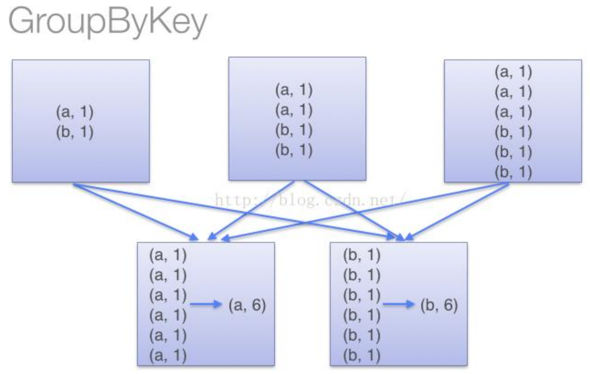
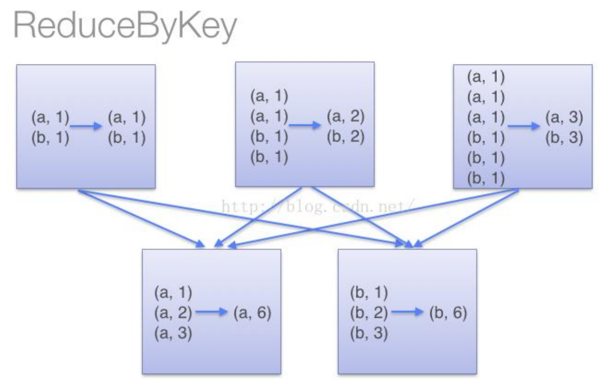

[TOC]
### PairRDD转换操作
常用的键值对转换操作包括：
+ reduceByKey(func)：使用func函数合并具有相同键的值。
+ groupByKey()：对具有相同键的值进行分组。
+ keys()：只会把Pair RDD中的key返回形成一个新的RDD。
+ values()：values只会把Pair RDD中的value返回形成一个新的RDD。
+ sortByKey()：返回一个根据键排序的RDD
+ sortBy(func)：返回一个根据传入函数排序的RDD
+ mapValues(func)：对键值对RDD中的每个value都应用一个函数，但是，key不会发生变化
+ join（内连接）：对于给定的两个输入数据集(K,V1)和(K,V2)，只有在两个数据集中都存在的key才会被输出，最终得到一个(K,(V1,V2))类型的数据集。

#### reduceByKey和groupByKey的区别
reduceByKey用于对每个key对应的多个value进行merge操作
+ 在本地对分区内相同key的数据集进行预聚合，减少落盘的数据量，并且merge操作可以通过函数自定义
+ Spark可以在每个分区移动数据(shuffle)之前将待输出数据与一个共用的key结合

groupByKey也是对每个key进行操作，但只生成一个sequence，groupByKey本身不能自定义函数
+ 需要先用groupByKey生成RDD，然后才能对此RDD通过map进行自定义函数操作
+ 由于它不接收函数，Spark只能先将所有的键值对(key-value pair)都移动，这样的后果是集群节点之间的开销很大，导致传输延时

<div class="half">


</div>
<br>

#### combineByKey
combineByKey是Spark中一个比较核心的高级函数，其他一些高阶键值对函数底层都是用它实现的。诸如 groupByKey,reduceByKey等等。
```scala
def combineByKey[C](
    createCombiner: V => C,
    mergeValue: (C, V) => C,
    mergeCombiners: (C, C) => C,
    partitioner: Partitioner,
    mapSideCombine: Boolean = true,
    serializer: Serializer = null)
```
+ `createCombiner`：在第一次遇到Key时创建组合器函数，将RDD数据集中的V类型值转换C类型值（V => C）
+ `mergeValue`：合并值函数，再次遇到相同的Key时，将createCombiner的C类型值与这次传入的V类型值合并成一个C类型值（C,V）=>C<br>
  （在每个分区内部进行）
+ `mergeCombiners`：合并组合器函数，将C类型值两两合并成一个C类型值
  （在不同分区间进行）
+ `partitioner`：使用已有的或自定义的分区函数，默认是HashPartitioner
+ `mapSideCombine`：是否在map端进行Combine操作,默认为true

例：编程实现自定义Spark合并方案。<br>
给定一些销售数据，数据采用键值对的形式<公司，收入>，求出每个公司的总收入和平均收入，保存在本地文件。<br>
提示：可直接用sc.parallelize在内存中生成数据，在求每个公司总收入时，先分三个分区进行求和，然后再把三个分区进行合并。<br>
（只需要编写RDD combineByKey函数的前三个参数的实现）
```scala
import conf.{Global, SparkGlobal}
import org.apache.spark.rdd.RDD
import org.apache.spark.sql.SparkSession
import java.nio.file.{Path, Paths}
import org.apache.commons.io.FileUtils

def combineByKey(sparkSession: SparkSession): Unit ={
  val data = sparkSession.sparkContext.parallelize(
    Array(("company-1",92.0), ("company-1",85.0), ("company-1",82.0), ("company-2",78.0),
      ("company-2",96.0), ("company-2",85.0), ("company-3",88.0), ("company-3",94.0),
      ("company-3",80.0)),3
  )
  type C = (Int, Double) // Multiple value, 定义一个元组类型(公司数,总收入)
  val res = data.combineByKey(
    income => (1, income),                                    // 第一次遇到Key时，V => (C, V)
    (i2: C, otherIncome) => (i2._1 + 1, i2._2 + otherIncome), // 同一分区内，再次遇到Key, (C, V) => C
    (i1: C, i2: C) => (i1._1 + i2._1, i2._2 + i2._2)          // 不同分区间合并，(C1, C2) => C
  ).map{
    case (k, v) =>  (k, v._1, v._2/v._1)
  }

  // 判断文件是否存在
  val file: Path = Paths.get(Global.BASE_DIR, "data", "output", "combineByKey.txt").toAbsolutePath
  if(file.toFile.exists()){
    FileUtils.deleteDirectory(file.toFile)
  }
  res.repartition(1).saveAsTextFile(file.toString)
}
```
以"company-1"为例，对上述代码进行解释：
1. `income => (1, income)`，即 V=>C<br>
第1次遇到"company-1"，其收入为92.0，则转换 92.0 =>(1, 92.0)， 1表示当前公司的计数器，此时只有1个公司

2. `(i2: C, otherIncome) => (i2._1 + 1, i2._2 + otherIncome)`，即（C,V）=> C<br>
在同一分区内，再次遇到"company-1"的一个新的收入85.0，则进行值的合并，即i2._2+otherIncome，然后公司计算器+1，即i2._1 + 1

3. `(i1: C, i2: C) => (i1._1 + i2._1, i2._2 + i2._2)`，即（C1,C2）=> C<br>
不同分区间，合并所有分区"company-1"的公司数、收入

### 参考引用
+ [子雨大数据之Spark入门：键值对RDD](https://dblab.xmu.edu.cn/blog/990/)
+ [Spark中的reduceByKey()和groupByKey()的区别](https://blog.51cto.com/u_14251143/5378079)
+ [Spark核心RDD：combineByKey函数详解](https://blog.csdn.net/jiangpeng59/article/details/52538254)


