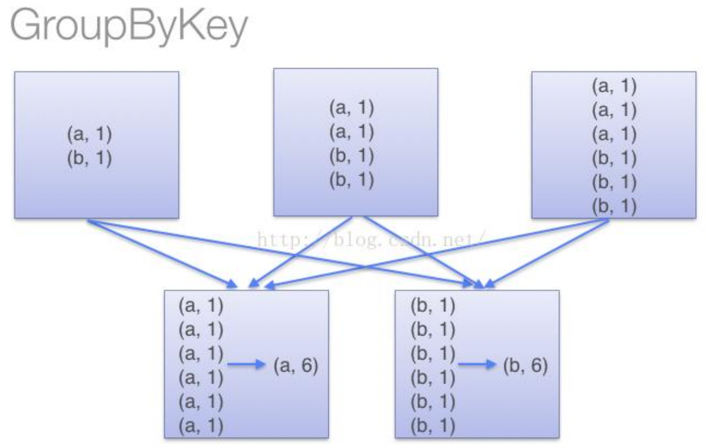
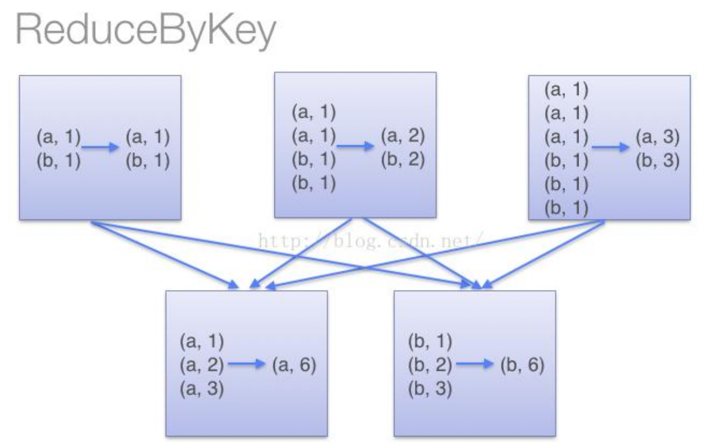

[TOC]
### PairRDD转换操作
常用的键值对转换操作包括：
+ reduceByKey(func)：使用func函数合并具有相同键的值。
+ groupByKey()：对具有相同键的值进行分组。
+ groupByKey()：对具有相同键的值进行分组。

#### reduceByKey和groupByKey的区别
reduceByKey用于对每个key对应的多个value进行merge操作
+ 在本地对分区内相同key的数据集进行预聚合，减少落盘的数据量，并且merge操作可以通过函数自定义
+ Spark可以在每个分区移动数据(shuffle)之前将待输出数据与一个共用的key结合

groupByKey也是对每个key进行操作，但只生成一个sequence，groupByKey本身不能自定义函数
+ 需要先用groupByKey生成RDD，然后才能对此RDD通过map进行自定义函数操作
+ 由于它不接收函数，Spark只能先将所有的键值对(key-value pair)都移动，这样的后果是集群节点之间的开销很大，导致传输延时

 

### 参考引用
+ [子雨大数据之Spark入门：键值对RDD](https://dblab.xmu.edu.cn/blog/990/)
+ [Spark中的reduceByKey()和groupByKey()的区别](https://blog.51cto.com/u_14251143/5378079)

