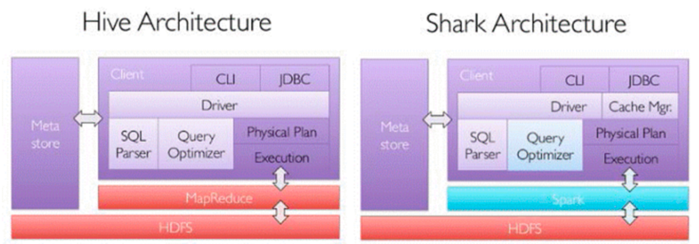
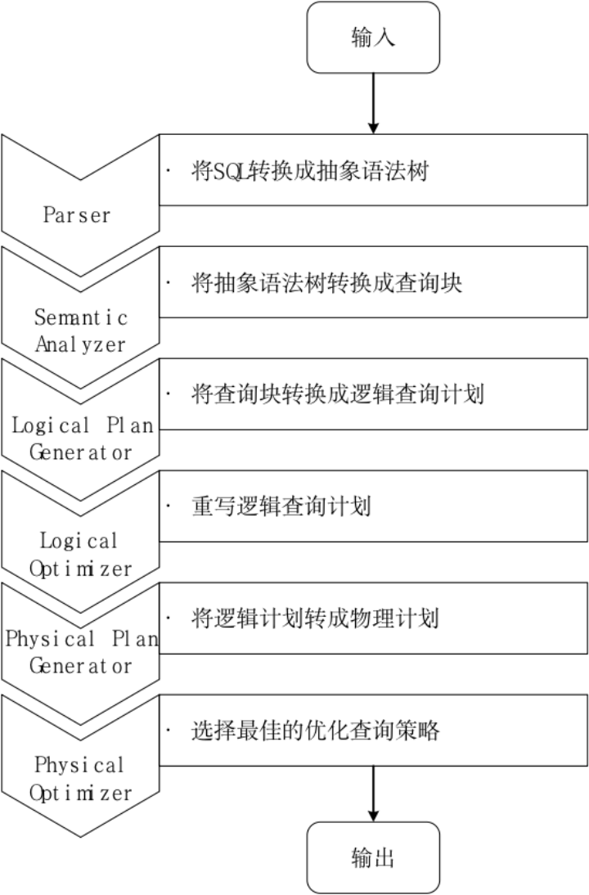
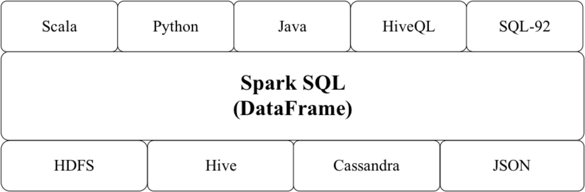
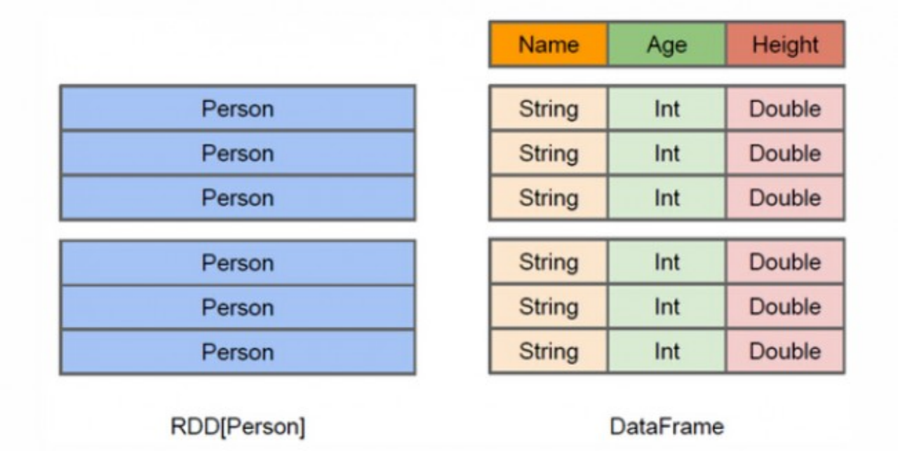

[TOC]
### Spark SQL简介
#### Spark SQL发展历程
`Shark`即Hive on Spark，Shark在HiveQL方面重用了Hive中HiveQL的解析、逻辑执行计划翻译、执行计划优化等逻辑。<br>
可以近似认为仅将物理执行计划从MapReduce作业替换成了Spark作业，通过Hive的HiveQL解析，把HiveQL翻译成Spark上的RDD操作。



Hive中SQL查询的MapReduce作业转化过程：<br>


Shark的出现，使得SQL-on-Hadoop的性能比Hive有了10-100倍的提高。<br>
Shark的设计导致了两个问题：
1. 是执行计划优化`完全依赖于Hive`，不方便添加新的优化策略
2. 因为Spark是`线程级并行`，而MapReduce是进程级并行，因此，Spark在兼容Hive的实现上存在线程安全问题，导致Shark不得不使用另外一套独立维护的打了补丁的Hive源码分支

2014年6月1日Shark项目和Spark SQL项目的主持人Reynold Xin宣布：停止对Shark的开发，团队将所有资源放在Spark SQL项目上。<br>
至此，Shark的发展画上了句话，但也因此发展出两个直线：Spark SQL和Hive on Spark。
+ `Spark SQL`作为Spark生态的一员继续发展，而不再受限于Hive，只是兼容Hive
+ `Hive on Spark`是一个Hive的发展计划，该计划将Spark作为Hive的底层引擎之一，即Hive将不再受限于一个引擎，可以采用Map-Reduce、Tez、Spark等引擎

#### Spark SQL架构
Spark SQL增加了DataFrame（即带有Schema信息的RDD），使用户可以在Spark SQL中执行SQL语句。<br>
数据既可以来自RDD，也可以是Hive、HDFS、Cassandra等外部数据源，还可以是JSON格式的数据。<br>
Spark SQL目前支持Scala、Java、Python三种语言，支持SQL-2003规范。<br>


`为什么推出Spark SQL？`
+ 关系数据库已经很流行
+ 关系数据库在大数据时代已经不能满足要求：<br>
  1）用户需要从不同数据源执行各种操作，包括结构化、半结构化和非结构化数据<br>
  2）用户需要执行高级分析，比如机器学习和图像处理
+ 在实际大数据应用中，经常需要融合关系查询和复杂分析算法（比如机器学习或图像处理），但是，缺少这样的系统

Spark SQL填补了这个鸿沟：
+ 首先，可以提供DataFrame API，可以对内部和外部各种数据源执行各种关系型操作
+ 其次，可以支持大数据中的大量数据源和数据分析算法

Spark SQL可以融合：传统关系数据库的结构化数据管理能力和机器学习算法的数据处理能力

Spark SQL的特点如下：
1. 容易整合（集成）。Spark SQL可以将SQL查询和Spark程序无缝集成，允许我们使用SQL或熟悉的DataFrame API在Spark程序中查询结构化数据。
2. 统一的数据访问方式。Spark SQL可以以相同方式连接到任何数据源，DataFrame和SQL提供了访问各种数据源的方法，包括Hive、JSON和JDBC。
3. 兼容Hive。Spark SQL支持HiveQL语法以及Hive SerDes和UDF（用户自定义函数），允许我们访问现有的Hive仓库。
4. 标准的数据库连接。Spark SQL支持JDBC或ODBC连接。

### 结构化数据DataFrame
DataFrame的推出，让Spark具备了处理大规模结构化数据的能力，不仅比原有的RDD转化方式更加简单易用，而且获得了更高的计算性能。<br>
Spark能够轻松实现从MySQL到DataFrame的转化，并且支持SQL查询。<br>
+ RDD是分布式的 `Java对象的集合`，但是，对象内部结构对于RDD而言却是不可知的
+ DataFrame是一种`以RDD为基础的分布式数据集`，提供了详细的结构信息



DataFrame的优点：
+ 可以在Spark组件间获得更好的性能和更优的空间效率。
+ DataFrame的突出优点是表达能力强、简洁、易组合、风格一致。

#### DataFrame的创建和保存
##### Parquet
Parquet是Spark的默认数据源，很多大数据处理框架和平台都支持Parquet格式，它是一种开源的列式存储文件格式，提供多种I/O优化措施。<br>
比如压缩，以节省存储空间，支持快速访问数据列；存储Parquet文件的目录中包含了`_SUCCESS文件`和很多像`part-XXXXX`这样的压缩文件。<br>
```scala
// 将DataFrame保存为Parquet文件
df.write.format("parquet").mode("overwrite").option("compression","snappy").save(s"file://${path}")
// 读取Parquet文件
val df_read = sparkSession.read.parquet(s"file://${path}")
```

##### JSON
JSON（JavaScript Object Notation）是一种常见的数据格式，与XML相比，JSON的可读性更强，更容易解析。<br>
JSON有两种表示格式，即`单行模式`和`多行模式`，这两种模式Spark都支持。<br>
```scala
// 从JSON文件创建DataFrame
val df = sparkSession.read.format("json").load(path.toString)
// 将DataFrame保存为JSON文件
df.write.format("json").mode("overwrite").save(s"file://${otherPath}")
```

##### CSV
CSV是一种将所有的数据字段用逗号隔开的文本文件格式，在这些用逗号隔开的字段中，每行表示一条记录。<br>
CSV文件已经和普通的文本文件一样被广泛使用。<br>
```scala
// 从CSV文件创建DataFrame
val df = sparkSession.read.format("csv")
  .schema(schema)               // 用于设置每行数据的模式，也就是每行记录包含哪些字段，每个字段是什么数据类型
  .option("header","true")      // 用于表明这个CSV文件是否包含表头
  .option("sep", ",")           // 用于表明这个CSV文件中字段之间使用的分割符是分号，默认使用逗号作为分隔符
  .load(path.toString)
// 将DataFrame保存为JSON文件
df.write.format("json").mode("overwrite").save(s"file://${otherPath}")
```

##### 文本文件
```scala
// 从文本文件创建DataFrame
val df = sparkSession.read.format("text").load(path.toString)
// 把DataFrame保存成文本文件
df.write.format("text").saveAsTable(s"file://${otherPath}")
```

### DataFrame的基本操作
#### DSL语法风格
`DSL`（Domain Specific Language）意为“领域专用语言”。<br>
DSL语法类似于RDD中的操作，允许开发者通过调用方法对DataFrame内部的数据进行分析。<br>
DataFrame创建好以后，可以执行一些常用的DataFrame操作，包括：<br>
printSchema()、show()、select()、filter()、groupBy()、sort()、withColumn()和drop()等。
```scala
// 从JSON文件创建DataFrame
val df = sparkSession.read.format("json").load(path.toString)

df.printSchema()
//root
//  |-- age: long (nullable = true)
//  |-- name: string (nullable = true)

df.show()
// +----+-------+
// | age|   name|
// +----+-------+
// |null|Michael|
// |  30|   Andy|
// |  19| Justin|
// +----+-------+

df.select(df("name"), df("age")+1).show()
df.filter(df("age")>20).show()
df.groupBy("age").count().show()
df.sort(df("age").desc).show()
df.sort(df("age").desc, df("name").asc).show()

// withColumn
val df2 = df.withColumn("IfWithAge", F.expr("if(age is null, 'No', 'Yes')"))
df2.show()
// +----+-------+---------+
// | age|   name|IfWithAge|
// +----+-------+---------+
// |null|Michael|       No|
// |  30|   Andy|      Yes|
// |  19| Justin|      Yes|
// +----+-------+---------+

val df3 = df2.drop("IfWithAge")
df3.show()

// 其他常用操作
df.select(F.sum("age"), F.avg("age"), F.min("age"), F.max("age")).show()
// +--------+--------+--------+--------+
// |sum(age)|avg(age)|min(age)|max(age)|
// +--------+--------+--------+--------+
// |      49|    24.5|      19|      30|
// +--------+--------+--------+--------+
```

#### SQL语法风格
熟练使用SQL语法的开发者，可以直接使用SQL语句进行数据操作。<br>
相比于DSL语法风格，在执行SQL语句之前，需要通过DataFrame实例创建临时视图。<br>
创建临时视图的方法是调用DataFrame实例的createTempView或createOrReplaceTempView方法，二者的区别是，后者会进行判断。<br>
+ createOrReplaceTempView方法<br>
  如果在当前会话中存在相同名称的临时视图，则用新视图替换原来的临时视图
  如果在当前会话中不存在相同名称的临时视图，则创建临时视图。
+ createTempView方法，如果在当前会话中存在相同名称的临时视图，则会直接报错。

Spark SQL提供了丰富的函数供用户选择，一共200多个，基本涵盖了大部分的日常应用场景，包括：<br>
转换函数、数学函数、字符串函数、二进制函数、日期时间函数、正则表达式函数、JSON函数、URL函数、聚合函数、窗口函数和集合函数等。<br>
当Spark自带的这些系统函数无法满足用户需求时，用户还可以创建“`用户自定义函数`”。
```scala
df.createOrReplaceTempView("tmp_v_people")
sparkSession.sql("SELECT * FROM tmp_v_people").show()
sparkSession.sql("SELECT name FROM tmp_v_people WHERE age > 20").show()
// +----+
// |name|
// +----+
// |Andy|
// +----+
```

假设在一张用户信息表中有name、age、create_time三列数据，要求：<br>
+ 使用Spark的系统函数from_unixtime， 将时间戳类型的create_time格式化成时间字符串
+ 使用用户自定义函数将用户名转化为大写英文字母
```scala
val schema = StructType(List(
    StructField("name", StringType, nullable = true),
    StructField("age", IntegerType, nullable = true),
    StructField("create_time", LongType, nullable = true)
))
val javaList = new java.util.ArrayList[Row]()
javaList.add(Row("Xiaomei",21,System.currentTimeMillis()/1000))
javaList.add(Row("Xiaoming",22,System.currentTimeMillis()/1000))
javaList.add(Row("Xiaoxue",23,System.currentTimeMillis()/1000))
val df = sparkSession.createDataFrame(javaList, schema)

df.createOrReplaceTempView("user_info")
sparkSession.udf.register("toUpperCaseUDF", (column:String) => column.toUpperCase)
sparkSession.sql(s"""
   |SELECT
   |    name
   |    , toUpperCaseUDF(name) AS upperName
   |    , age
   |    , from_unixtime(create_time,'yyyy-MM-dd HH:mm:ss') AS time
   |FROM user_info
   |""".stripMargin).show()
// +--------+---------+---+-------------------+
// |    name|upperName|age|               time|
// +--------+---------+---+-------------------+
// | Xiaomei|  XIAOMEI| 21|2023-07-19 08:09:47|
// |Xiaoming| XIAOMING| 22|2023-07-19 08:09:47|
// | Xiaoxue|  XIAOXUE| 23|2023-07-19 08:09:47|
// +--------+---------+---+-------------------+
```

### 参考引用
+ [子雨大数据之Spark入门教程（Scala版）](https://dblab.xmu.edu.cn/blog/924/)


