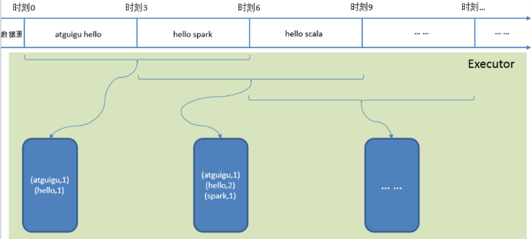
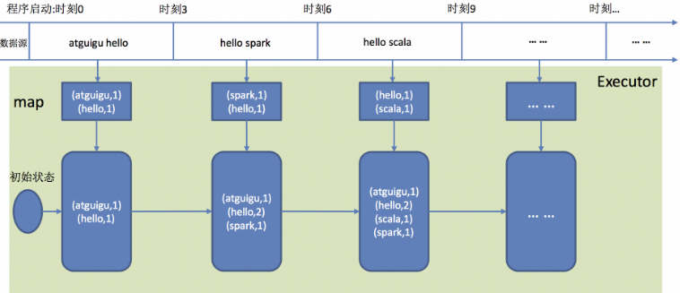

[TOC]
### 流计算概述
#### 流数据
`流数据`，即数据以**大量**、**快速**、**时变**的流形式持续到达。<br>
+ 实例：PM2.5检测、电子商务网站用户点击流

流数据具有如下特征：
1. 数据快速持续到达，潜在大小也许是无穷无尽的
2. 数据来源众多，格式复杂
3. 数据量大，但是不关注存储，一旦经过处理，要么被丢弃，要么被归档存储
4. 注重数据的整体价值，不过分关注个别数据
5. 数据顺序颠倒，或者不完整，**系统无法控制将要处理的新到达的数据元素的顺序**

#### 批量计算和实时计算
<br>
批量计算：充裕时间处理静态数据，如Hadoop。

1. 流数据不适合采用批量计算，因为流数据不适合用传统的关系模型建模。
2. 流数据必须采用`实时计算`，响应时间为`秒级`
3. 数据量少时，不是问题，但是，在大数据时代，数据格式复杂、来源众多、数据量巨大，对实时计算提出了很大的挑战。

流计算：实时获取来自不同数据源的海量数据，经过实时分析处理，获得有价值的信息
+ 基本理念：即`数据的价值随着时间的流逝而降低`，如用户点击流。 因此，当事件出现时就应该立即进行处理，而不是缓存起来进行批量处理。
+ 对于一个流计算系统来说，它应达到如下需求：<br>
（1）高性能：处理大数据的基本要求，如每秒处理几十万条数据<br>
（2）海量式：支持TB级甚至是PB级的数据规模<br>
（3）实时性：保证较低的延迟时间，达到秒级别，甚至是毫秒级别<br>
（4）分布式：支持大数据的基本架构，必须能够平滑扩展<br>
（5）易用性：能够快速进行开发和部署<br>
（6）可靠性：能可靠地处理流数据<br>
+ 较为常见的是开源流计算框架，代表如下：<br>
（1）Twitter Storm：免费、开源的分布式实时计算系统，可简单、高效、可靠地处理大量的流数据 <br>
（2）Yahoo! S4（Simple Scalable Streaming System）：开源流计算平台，是通用的、分布式的、可扩展的、分区容错的、可插拔的流式系统

#### 流计算处理流程
流计算的处理流程一般包含三个阶段：数据实时采集、数据实时计算、实时查询服务。<br>
`数据实时采集`阶段通常采集多个数据源的海量数据，需要保证实时性、低延迟与稳定可靠。<br>
+ 以日志数据为例，由于分布式集群的广泛应用，数据分散存储在不同的机器上，因此需要实时汇总来自不同机器上的日志数据
+ 目前有许多互联网公司发布的开源分布式日志采集系统均可满足每秒数百MB的数据采集和传输需求，如：<br>
（1）Facebook的Scribe<br>
（2）LinkedIn的`Kafka`<br>
（3）淘宝的Time Tunnel<br>
（4）基于Hadoop的Chukwa和Flume<br>
  
`数据实时计算`阶段对采集的数据进行实时的分析和计算，并反馈实时结果。<br>
+ 经流处理系统处理后的数据，可视情况进行存储，以便之后再进行分析计算。
+ 在时效性要求较高的场景中，处理之后的数据也可以直接丢弃。

`实时查询服务`：经由流计算框架得出的结果可供用户进行实时查询、展示或储存。
+ 传统的数据处理流程，用户需要主动发出查询才能获得想要的结果。而在流处理流程中，实时查询服务可以不断更新结果，并将用户所需的结果实时推送给用户。
+ 虽然通过对传统的数据处理系统进行定时查询，也可以实现不断地更新结果和结果推送，但通过这样的方式获取的结果，仍然是根据过去某一时刻的数据得到的结果，与实时结果有着本质的区别。

可见，流处理系统与传统的数据处理系统有如下`不同`：<br>
1. 流处理系统处理的是实时的数据，而传统的数据处理系统处理的是预先存储好的静态数据
2. 用户通过流处理系统获取的是实时结果，而通过传统的数据处理系统，获取的是过去某一时刻的结果
3. 流处理系统无需用户主动发出查询，实时查询服务可以主动将实时结果推送给用户

### SparkStreaming
Spark Streaming可整合多种输入数据源，如Kafka、Flume、HDFS，甚至是普通的TCP套接字。经处理后的数据可存储至文件系统、数据库，或显示在仪表盘里。<br>
基本原理：将实时输入数据流以`时间片`（秒级）为单位进行拆分，然后经Spark引擎以`类似批处理的方式处理每个时间片数据`。<br>
<br>

#### DStream概述
Spark Streaming最主要的抽象是`DStream`（Discretized Stream，离散化数据流），表示连续不断的数据流。
- 在内部实现上，Spark Streaming的输入数据按照时间片（如1秒）分成一段一段
- 每一段数据转换为Spark中的RDD，这些分段就是Dstream，并且对DStream的操作都最终转变为对相应的RDD的操作

<br>

完整WordCount示例<br>
<br>

#### 工作机制
在Spark Streaming中，会有一个组件`Receiver`，作为一个长期运行的task跑在一个Executor上。
每个Receiver都会负责一个`input DStream`（比如从文件中读取数据的文件流，比如套接字流，或者从Kafka中读取的一个输入流等等）。<br>
Spark Streaming通过input DStream与外部数据源进行连接，读取相关数据。<br>

编写Spark Streaming程序的`基本步骤`：
1. 通过创建输入DStream来定义输入源
2. 通过对DStream应用转换操作和输出操作来定义流计算
3. 用streamingContext.start()来开始接收数据和处理流程
4. 通过streamingContext.awaitTermination()方法来等待处理结束（手动结束或因为错误而结束）
5. 可以通过streamingContext.stop()来手动结束流计算进程

<br>

- 为了更好的协调数据接收速率与资源处理能力，1.5版本开始 Spark Streaming 可以动态控制数据接收速率来适配集群数据处理能力。
- 背压机制（即Spark Streaming Backpressure）: 根据 JobScheduler 反馈作业的执行信息来`动态调整 Receiver 数据接收率`。
- 通过属性spark.streaming.backpressure.enabled来控制是否启用backpressure机制，默认值false，即不启用。

#### Spark Streaming与Storm的对比
Spark Streaming和Storm最大的区别在于，Spark Streaming`无法实现毫秒级的流计算`，而Storm可以实现毫秒级响应。<br>
Spark Streaming构建在Spark上，一方面是因为Spark的低延迟执行引擎（100ms+）可以用于实时计算，另一方面，相比于Storm，RDD数据集更容易做高效的容错处理。<br>
Spark Streaming采用的小批量处理的方式使得它可以同时兼容批量和实时数据处理的逻辑和算法，因此，方便了一些需要历史数据和实时数据联合分析的特定应用场合。<br>
采用Spark架构具有如下优点：
- 实现一键式安装和配置、线程级别的任务监控和告警；
- 降低硬件集群、软件维护、任务监控和应用开发的难度；
- 便于做成统一的硬件、计算平台资源池。

### DStream转换操作
DStream转换操作包括无状态转换和有状态转换。
- `无状态转换`：每个批次的处理不依赖于之前批次的数据。
- `有状态转换`：当前批次的处理需要使用之前批次的数据或者中间结果。

#### 输入源
创建StreamingContext对象
```markdown
import org.apache.spark._
import org.apache.spark.streaming._
val conf = new SparkConf().setAppName("TestDStream").setMaster("local[2]")
val ssc = new StreamingContext(conf, Seconds(1))
```

示例程序:
- [文件流(DStream)](https://github.com/530154436/bigdata-learning/blob/main/src/main/scala/spark/streaming/ch01_1_%E6%96%87%E4%BB%B6%E6%B5%81.scala)
- [套接字流(DStream)](https://github.com/530154436/bigdata-learning/blob/main/src/main/scala/spark/streaming/ch01_2_%E5%A5%97%E6%8E%A5%E5%AD%97%E6%B5%81.scala)
- [RDD队列流(DStream)](https://github.com/530154436/bigdata-learning/blob/main/src/main/scala/spark/streaming/ch01_3_RDD%E9%98%9F%E5%88%97%E6%B5%81.scala)

遇到的问题:
```markdown
1. only one SparkContext may be running in this JVM (see SPARK-2243)
  => 创建StreamingContext时，已经存在一个SparkContext实例，从而导致错误。
2. windows下nc命令无效
   下载netcat(https://eternallybored.org/misc/netcat/netcat-win32-1.12.zip)
   解压，将nc.exe拷贝到C:\Windows下。
   nc -l -p 9999
```

#### DStream无状态转换操作
- map(func) ：对源DStream的每个元素，采用func函数进行转换，得到一个新的DStream
- flatMap(func)： 与map相似，但是每个输入项可用被映射为0个或者多个输出项
- filter(func)： 返回一个新的DStream，仅包含源DStream中满足函数func的项
- repartition(numPartitions)： 通过创建更多或者更少的分区改变DStream的并行程度
- reduce(func)：利用函数func聚集源DStream中每个RDD的元素，返回一个包含单元素RDDs的新DStream
- count()：统计源DStream中每个RDD的元素数量
- union(otherStream)： 返回一个新的DStream，包含源DStream和其他DStream的元素
- countByValue()：<br>
  应用于元素类型为K的DStream上，返回一个（K，V）键值对类型的新DStream，每个键的值是在原DStream的每个RDD中的出现次数
- reduceByKey(func, [numTasks])：<br>
  当在一个由(K,V)键值对组成的DStream上执行该操作时，返回一个新的由(K,V)键值对组成的DStream，每一个key的值均由给定的recuce函数（func）聚集起来
- join(otherStream, [numTasks])：<br>
  当应用于两个DStream（一个包含（K,V）键值对,一个包含(K,W)键值对），返回一个包含(K, (V, W))键值对的新Dstream
- cogroup(otherStream, [numTasks])：
  <br>当应用于两个DStream（一个包含（K,V）键值对,一个包含(K,W)键值对），返回一个包含(K, Seq[V], Seq[W])的元组
- `transform`(func)：<br>
  通过对源DStream的每个RDD应用RDD-to-RDD函数，创建一个新的DStream。支持在新的DStream中做任何RDD操作

示例程序:
- [套接字流(DStream transform)](https://github.com/530154436/bigdata-learning/blob/main/src/main/scala/spark/streaming/ch02_transform.scala)

##### DStream有状态转换操作
对于DStream有状态转换操作而言，当前批次的处理`需要使用之前批次的数据`或者中间结果。<br>
有状态转换包括`基于滑动窗口的转换`(window)和`追踪状态变化`(updateStateByKey)的转换。<br>

##### window 操作
**滑动窗口转换操作**
1. 事先设定一个`滑动窗口的长度`（也就是窗口的持续时间）
2. 设定滑动窗口的时间间隔（每隔多长时间执行一次计算），让窗口按照`指定时间间隔`在源DStream上滑动
3. 每次窗口停放的位置上，都会有一部分Dstream（或者一部分RDD）被框入窗口内，形成一个小段的Dstream，可以启动对这个小段DStream的计算。<br>
   即一个窗口可以包含多个时间段，通过整合多个批次的结果，计算出整个窗口的结果。

<br>


观察上图, 窗口在DStream上每滑动一次, 落在窗口内的那些RDD会结合在一起, 然后在上面操作产生新的RDD,组成了 window DStream。
在上面图的情况下, 操作会至少应用在3个数据单元上, 每次滑动2个时间单位. 所以, 窗口操作需要2个参数:
- 窗口长度：窗口的持久时间(执行一次持续多少个时间单位)(图中是 3)
- 滑动步长：窗口操作被执行的间隔(每多少个时间单位执行一次).(图中是 2 )
  
`注意`: 这两个参数必须是源 DStream 的 interval 的倍数.

一些窗口转换操作的含义：
- window(windowLength, slideInterval)：基于源DStream产生的窗口化的批数据，计算得到一个新的Dstream
- countByWindow(windowLength, slideInterval)：返回流中元素的一个滑动窗口数
- reduceByWindow(func, windowLength, slideInterval)：返回一个单元素流。<br>
  利用函数func聚集滑动时间间隔的流的元素创建这个单元素流。函数func必须满足结合律，从而可以支持并行计算
- `reduceByKeyAndWindow`(func, windowLength, slideInterval)<br>
   示例程序： [套接字流(DStream reduceByKeyAndWindow)](https://github.com/530154436/bigdata-learning/blob/main/src/main/scala/spark/streaming/ch02_window.scala)
```markdown
reduceByKeyAndWindow(reduceFunc, windowLength, slideInterval)
reduceByKeyAndWindow(reduceFunc, invReduceFunc, windowLength, slideInterval)
  参数1: reduce 计算规则
  [参数: invReduceFunc 计算规则]
  参数2: 窗口长度
  参数3: 窗口滑动步长. 每隔这么长时间计算一次.

  比没有invReduceFunc高效. 会利用旧值来进行计算.
  invReduceFunc: (V, V) => V 窗口移动了, 上一个窗口和新的窗口会有重叠部分, 重叠部分的值可以不用重复计算了.
                             第一个参数就是新的值, 第二个参数是旧的值.
```
<br>

##### updateStateByKey
updateStateByKey操作允许在使用新信息不断更新状态的同时能够保留他的状态。需要做两件事情:
1. 定义状态. 状态可以是任意数据类型
2. 定义状态更新函数. 指定一个函数, 这个函数负责使用以前的状态和新值来更新状态.

在每个阶段, Spark 都会在所有已经存在的 key 上使用状态更新函数, 而不管是否有新的数据在.<br>
需要在跨批次之间维护状态时，就必须使用updateStateByKey操作。<br>

```markdown
def updateStateByKey[S: ClassTag](updateFunc: (Seq[V], Option[S]) => Option[S]): DStream[(K, S)]

其中，V和S表示数据类型，如Int。
第1个输入参数属于Seq[V]类型，表示当前key对应的所有value，
第2个输入参数属于Option[S]类型，表示当前key的历史状态，函数返回值类型Option[S]，表示当前key的新状态。
```
词频统计实例：
- 对于有状态转换操作而言，本批次的词频统计，会在之前批次的词频统计结果的基础上进行不断累加，所以，最终统计得到的词频，是所有批次的单词的总的词频统计结果。
- 示例程序： [套接字流(DStream updateStateByKey)](https://github.com/530154436/bigdata-learning/blob/main/src/main/scala/spark/streaming/ch02_updateStateByKey.scala)

<br>

#### 输出操作
在Spark应用中，外部系统经常需要使用到Spark DStream处理后的数据，因此，需要采用输出操作把DStream的数据输出到数据库或者文件系统中
- 示例程序： [套接字流(DStream输出到文本文件)](https://github.com/530154436/bigdata-learning/blob/main/src/main/scala/spark/streaming/ch03_DStream输出到文本文件.scala)
- 示例程序： [套接字流(DStream输出到MySQL)](https://github.com/530154436/bigdata-learning/blob/main/src/main/scala/spark/streaming/ch03_DStream输出到MySQL.scala)

注意：
1. MySQL连接不能写在driver层面（序列化）；
2. 如果写在foreach则每个RDD中的每一条数据都创建，得不偿失；
3. 增加foreachPartition，在分区创建（获取）。

### 参考引用
+ [子雨大数据之Spark入门教程（Scala版）](https://dblab.xmu.edu.cn/blog/924/)
+ [大数据Spark-尚硅谷](https://zhenchao125.github.io/bigdata_spark_atguigu/)


