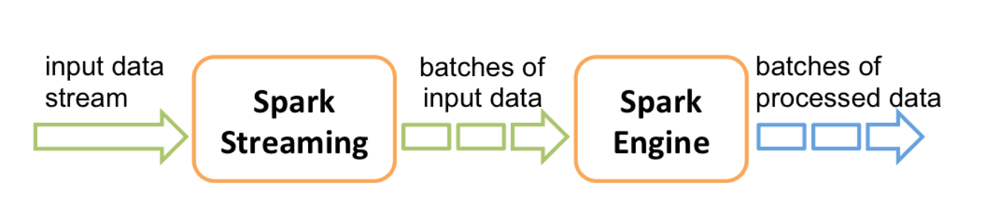

[TOC]
### 流计算概述
#### 流数据
`流数据`，即数据以**大量**、**快速**、**时变**的流形式持续到达。<br>
+ 实例：PM2.5检测、电子商务网站用户点击流

流数据具有如下特征：
1. 数据快速持续到达，潜在大小也许是无穷无尽的
2. 数据来源众多，格式复杂
3. 数据量大，但是不关注存储，一旦经过处理，要么被丢弃，要么被归档存储
4. 注重数据的整体价值，不过分关注个别数据
5. 数据顺序颠倒，或者不完整，**系统无法控制将要处理的新到达的数据元素的顺序**

#### 批量计算和实时计算
<br>
批量计算：充裕时间处理静态数据，如Hadoop。

1. 流数据不适合采用批量计算，因为流数据不适合用传统的关系模型建模。
2. 流数据必须采用`实时计算`，响应时间为`秒级`
3. 数据量少时，不是问题，但是，在大数据时代，数据格式复杂、来源众多、数据量巨大，对实时计算提出了很大的挑战。

流计算：实时获取来自不同数据源的海量数据，经过实时分析处理，获得有价值的信息
+ 基本理念：即`数据的价值随着时间的流逝而降低`，如用户点击流。 因此，当事件出现时就应该立即进行处理，而不是缓存起来进行批量处理。
+ 对于一个流计算系统来说，它应达到如下需求：<br>
（1）高性能：处理大数据的基本要求，如每秒处理几十万条数据<br>
（2）海量式：支持TB级甚至是PB级的数据规模<br>
（3）实时性：保证较低的延迟时间，达到秒级别，甚至是毫秒级别<br>
（4）分布式：支持大数据的基本架构，必须能够平滑扩展<br>
（5）易用性：能够快速进行开发和部署<br>
（6）可靠性：能可靠地处理流数据<br>
+ 较为常见的是开源流计算框架，代表如下：<br>
（1）Twitter Storm：免费、开源的分布式实时计算系统，可简单、高效、可靠地处理大量的流数据 <br>
（2）Yahoo! S4（Simple Scalable Streaming System）：开源流计算平台，是通用的、分布式的、可扩展的、分区容错的、可插拔的流式系统

#### 流计算处理流程
流计算的处理流程一般包含三个阶段：数据实时采集、数据实时计算、实时查询服务。<br>
<br>

`数据实时采集`阶段通常采集多个数据源的海量数据，需要保证实时性、低延迟与稳定可靠。<br>
+ 以日志数据为例，由于分布式集群的广泛应用，数据分散存储在不同的机器上，因此需要实时汇总来自不同机器上的日志数据
+ 目前有许多互联网公司发布的开源分布式日志采集系统均可满足每秒数百MB的数据采集和传输需求，如：<br>
（1）Facebook的Scribe<br>
（2）LinkedIn的`Kafka`<br>
（3）淘宝的Time Tunnel<br>
（4）基于Hadoop的Chukwa和Flume<br>
  
`数据实时计算`阶段对采集的数据进行实时的分析和计算，并反馈实时结果。<br>
+ 经流处理系统处理后的数据，可视情况进行存储，以便之后再进行分析计算。
+ 在时效性要求较高的场景中，处理之后的数据也可以直接丢弃。

<br>

`实时查询服务`：经由流计算框架得出的结果可供用户进行实时查询、展示或储存。
+ 传统的数据处理流程，用户需要主动发出查询才能获得想要的结果。而在流处理流程中，实时查询服务可以不断更新结果，并将用户所需的结果实时推送给用户。
+ 虽然通过对传统的数据处理系统进行定时查询，也可以实现不断地更新结果和结果推送，但通过这样的方式获取的结果，仍然是根据过去某一时刻的数据得到的结果，与实时结果有着本质的区别。

可见，流处理系统与传统的数据处理系统有如下`不同`：<br>
1. 流处理系统处理的是实时的数据，而传统的数据处理系统处理的是预先存储好的静态数据
2. 用户通过流处理系统获取的是实时结果，而通过传统的数据处理系统，获取的是过去某一时刻的结果
3. 流处理系统无需用户主动发出查询，实时查询服务可以主动将实时结果推送给用户

### SparkStreaming
Spark Streaming可整合多种输入数据源，如Kafka、Flume、HDFS，甚至是普通的TCP套接字。经处理后的数据可存储至文件系统、数据库，或显示在仪表盘里。<br>
基本原理：将实时输入数据流以`时间片`（秒级）为单位进行拆分，然后经Spark引擎以`类似批处理的方式处理每个时间片数据`。<br>
<br>

#### DStream概述
Spark Streaming最主要的抽象是`DStream`（Discretized Stream，离散化数据流），表示连续不断的数据流。
- 在内部实现上，Spark Streaming的输入数据按照时间片（如1秒）分成一段一段
- 每一段数据转换为Spark中的RDD，这些分段就是Dstream，并且对DStream的操作都最终转变为对相应的RDD的操作

<br>

完整WordCount示例<br>
<br>
#### 工作机制


### DStream操作
#### 输入源
创建StreamingContext对象
```markdown
import org.apache.spark._
import org.apache.spark.streaming._
val conf = new SparkConf().setAppName("TestDStream").setMaster("local[2]")
val ssc = new StreamingContext(conf, Seconds(1))
```

示例程序:
- [文件流(DStream)](https://github.com/530154436/bigdata-learning/blob/main/src/main/scala/spark/streaming/ch01_1_%E6%96%87%E4%BB%B6%E6%B5%81.scala)
- [文件流(DStream)](https://github.com/530154436/bigdata-learning/blob/main/src/main/scala/spark/streaming/ch01_2_%E5%A5%97%E6%8E%A5%E5%AD%97%E6%B5%81.scala)
- [RDD队列流(DStream)](https://github.com/530154436/bigdata-learning/blob/main/src/main/scala/spark/streaming/ch01_3_RDD%E9%98%9F%E5%88%97%E6%B5%81.scala)

遇到的问题:
```markdown
1. only one SparkContext may be running in this JVM (see SPARK-2243)
  => 创建StreamingContext时，已经存在一个SparkContext实例，从而导致错误。
2. windows下nc命令无效
   下载netcat(https://eternallybored.org/misc/netcat/netcat-win32-1.12.zip)
   解压，将nc.exe拷贝到C:\Windows下。
   nc -l -p 9999
```
#### 转换操作
#### 输出操作


### 参考引用
+ [子雨大数据之Spark入门教程（Scala版）](https://dblab.xmu.edu.cn/blog/924/)


