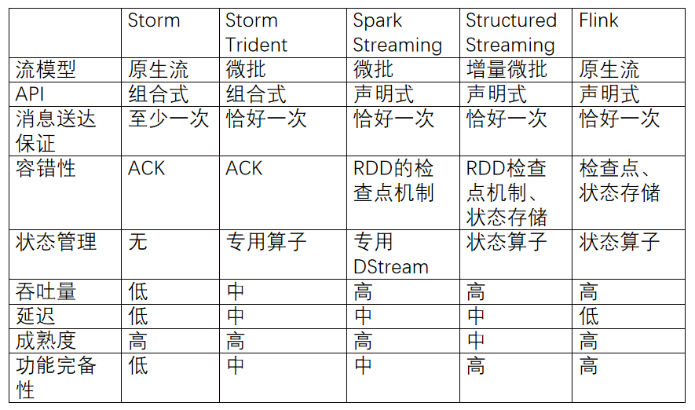
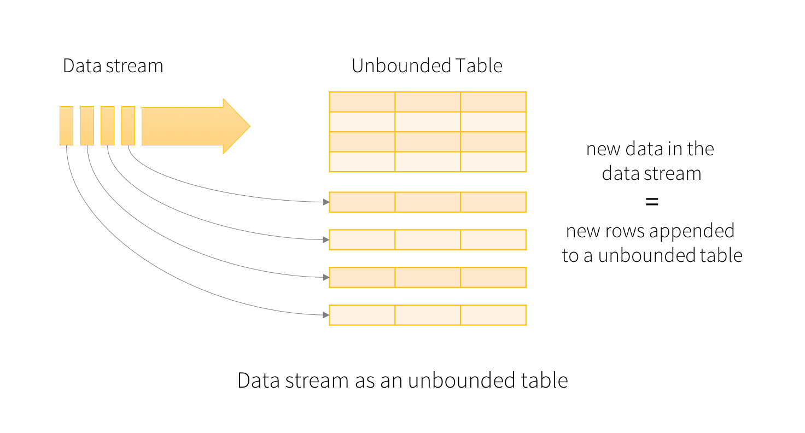
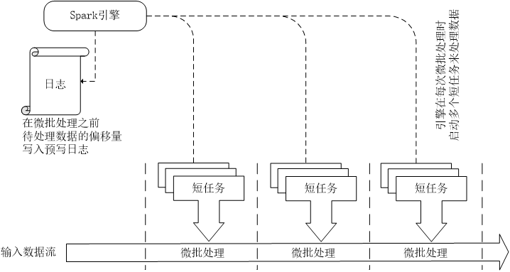
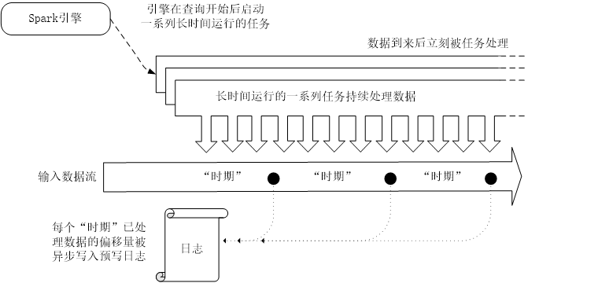
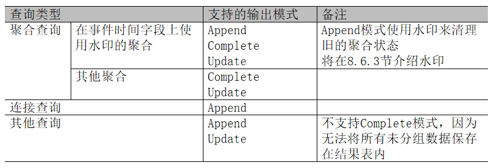
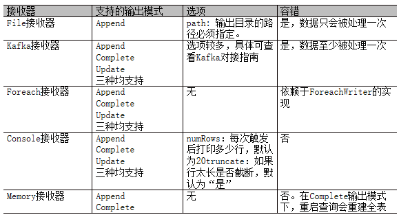

[TOC]
### 概述
#### 背景
Spark Streaming采用了`DStream API`，它是基于Spark批处理的RDD API构建的，有着和RDD一样的基础语义和容错模型。 
虽然Spark Streaming可以满足大多数流处理场景的应用需求，但是，它并非无懈可击，以下是Spark Streaming的`不足之处`：
1. **无法实现毫秒级延迟**。 
   Spark Streaming的微批处理模型无法实现毫秒级的延迟，实际的延迟通常在`秒级`。
2. **缺少流批一体的API**。 
   尽管DStream和RDD有一致的API，但在将批处理作业改为流处理作业时，开发人员还是需要显式修改代码以使用不同的类。
3. 缺少逻辑计划和物理计划的隔离。 
   Spark流处理执行DStream操作的顺序就是开发人员指定的顺序。 
   物理计划被人为明确指定以后，就没有了自动优化的空间，因此，开发人员需要手动优化代码来获得更好的性能。
4. 缺少对事件时间窗口的原生支持。 
   DStream只能基于Spark流处理收到每条记录的时间（也就是处理时间）来定义窗口操作。 
   但是，很多使用场景需要根据记录生成的时间（也就是事件时间）来计算窗口聚合结果，而不是实际收到或处理事件的时间。

Spark Streaming的上述缺陷，导致了Structured Streaming的诞生，并且，前者深刻地影响了后者的设计理念。

#### 特性
从 spark2.0 开始, spark 引入了一套新的流式计算模型: Structured Streaming。 
该组件进一步降低了处理数据的延迟时间, 它实现了"`有且仅有一次(Exectly Once)`" 语义, 可以保证数据被精准消费。 
Structured Streaming 基于 Spark SQl 引擎, 是一个具有弹性和容错的流式处理引擎。 
使用 Structure Streaming 处理流式计算的方式和使用批处理计算静态数据(表中的数据)的方式是一样的。 
随着流数据的持续到达, Spark SQL 引擎持续不断的运行并得到最终的结果。我们可以使用 
- Dataset/DataFrame API 来表达流的聚合
- 事件-时间窗口(event-time windows)
- 流-批处理连接(stream-to-batch joins)等等。

这些计算都是运行在被优化过的 Spark SQL 引擎上. 最终, 通过 `checkpoint` 和 `WALs(Write-Ahead Logs)`, 系统保证end-to-end exactly-once。 
总之, Structured Streaming 提供了快速、弹性、容错, end-to-end exactly-once 的流处理, 而用户不需要对流进行推理(比如 spark streaming 中的流的各种转换)。 
默认情况下, Structured Streaming 查询使用`微批处理引擎`(micro-batch processing engine)处理,微批处理引擎把流数据当做一系列的小批job(small batch jobs)来处理。 
所以, 延迟低至 100 毫秒, 从 Spark2.3, 引入了一个新的低延迟处理模型: `Continuous Processing`, 延迟低至 1 毫秒.

#### Structured Streaming和Spark SQL、Spark Streaming关系
| | Structured Streaming | Spark SQL | Spark Streaming |
|:---:|:---|:---|:---|
|数据抽象| Dataset/DataFrame | Dataset/DataFrame | DStream(一系列RDD)|
|数据流|结构化数据流| 静态数据 | 数据流 |
|实时响应|采用微批处理模型时可以实现100毫秒级别的实时响应 采用持续处理模型时可以支持毫秒级的实时响应| - | 秒级实时响应|

#### Structured Streaming与其他流处理技术的对比
 

### 工作原理
Structured Streaming 的**核心思想**是:`把持续不断的实时数据流当做一个不断追加的表`。 
可以把流计算等同于在一个静态表上的批处理查询，Spark会在不断添加数据的无界输入表上运行计算，并进行`增量查询`。

#### 编程模型
把输入数据流当做输入表(Input Table). 到达流中的每个数据项(data item)类似于被追加到输入表中的一行. 
 

在无界表上对输入的查询将生成`结果表`(Result Table)，系统每隔一定的周期(触发间隔, trigger interval,例如1s)，新行被追加到输入表，然后触发对无界表的计算并更新结果表.
无论何时更新结果表, 我们都希望将更改的结果行写入到`外部接收器`(external sink). 
 

#### 处理模型
##### 微批处理
Structured Streaming默认使用`微批处理`执行模型，定期检查流数据源，并对自上一批次结束后到达的新数据执行批量查询. 
数据到达和得到处理并输出结果之间的`延时超过100毫秒`. 

 

##### 持续处理
Spark从2.3.0版本开始引入了`持续处理`的试验性功能，可以实现流计算的毫秒级延迟. 
在持续处理模式下，Spark不再根据触发器来周期性启动任务，而是启动一系列的连续读取、处理和写入结果的长时间运行的任务. 

 

### 操作Streaming DataFrame/DataSet
#### 输入源
`Rate源`可每秒生成特定个数的数据行，每个数据行包括**时间戳**和**值**字段。时间戳是消息发送的时间，值是从开始到当前消息发送的总个数，从0开始。Rate源一般用来作为调试或性能基准测试。
Rate源的选项（option）包括：
- rowsPerSecond: 每秒产生多少行数据，默认为1。
- rampUpTime: 生成速度达到rowsPerSecond需要多少启动时间，使用比秒更精细的粒度将会被截断为整数秒，默认0秒。
- numPartitions: 使用的分区数，默认是Spark的默认分区数。

示例程序:
- [文件源](https://github.com/530154436/bigdata-learning/blob/main/src/main/scala/spark/structured_streaming/ch01_1_File源.scala)
- [Socket源](https://github.com/530154436/bigdata-learning/blob/main/src/main/scala/spark/structured_streaming/ch01_3_Socket源.scala)
- [Rate源](https://github.com/530154436/bigdata-learning/blob/main/src/main/scala/spark/structured_streaming/ch01_4_Rate源.scala)

#### 输出操作
输出(Output)定义为写到外部存储. `输出模式`(outputMode)有 3 种:
- `Complete Mode` 整个更新的结果表会被写入到外部存储.
- `Append Mode` 从上次触发结束开始算起, 仅仅把那些新追加到结果表中的行写到外部存储(类似于无状态的转换).
- `Update Mode` 从上次触发结束开始算起, 仅仅在结果表中更新的行会写入到外部存储，当查询不包括聚合时，这个模式等同于Append模式。

 

 

示例程序:
- [文件接收器(file sink)](https://github.com/530154436/bigdata-learning/blob/main/src/main/scala/spark/structured_streaming/ch02_File接收器.scala)
- Foreach Sink：会遍历表中的每一行, 允许将流查询结果按开发者指定的逻辑输出. 
[foreach接收器(foreach sink)](https://github.com/530154436/bigdata-learning/blob/main/src/main/scala/spark/structured_streaming/ch02_foreach接收器.scala)
- ForeachBatch Sink：该功能只能用于输出批处理的数据. 
[foreachBatch接收器(foreachBatch sink)](https://github.com/530154436/bigdata-learning/blob/main/src/main/scala/spark/structured_streaming/ch02_foreachBatch接收器.scala)

#### 容错处理

#### 迟到数据处理
#### 查询的管理和监控

### 参考引用
+ [子雨大数据之Spark入门教程（Scala版）](https://dblab.xmu.edu.cn/blog/924/)
+ [Structured Streaming 尚硅谷](https://zhenchao125.github.io/bigdata_spark-project_atguigu/di-7-bu-fen-structured-streaming/di-1-zhang-structured-streaming-gai-shu.html)

